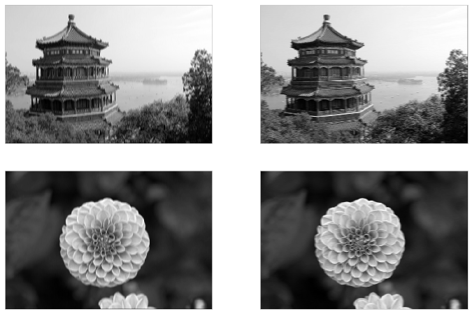

# Deep Computer Vision Using Convolutional Neural Networks


```python
import numpy as np
import pandas as pd
import matplotlib as mpl
import matplotlib.pyplot as plt
import seaborn as sns
import tensorflow as tf
import tensorflow.keras as keras

np.random.seed(0)
sns.set_style('whitegrid')
%matplotlib inline
```

## Convolutional layers
Convolutional layers are not fully connected to the layers before nor after them.
Instead, each neuron connects to a specific "field" in the previous layer.
This architecture allows the network to conventratoin on small, low-level features in lower layers, and then construct more complex features in the higher layers.

Convolutional layers are arranged as 2D arrays of neurons, not 1D like we have used for NN, thus far.

A neuron located in row $i$, column $j$ of a layer is connected to the neurons in the previous layer in rows $i$ to $i + f_h - 1$, columns $j$ to $j + f_w - 1$, where $f_h$ and $f_w$ are the height and width of the receptive field of the neuron.
If two layers have the same dimensions, it is common to pad the edges with zeros so that each neuron has the same receptive field area.

### Filters

During training, a neuron may create a *filter* (or *convolutional kernel*).
This is where the neuron ignores (sets the weights to zero) parts of the receptive field.
They are usually created in lower levels and provide building blocks to the neurons downstream.
A layer of neurons all using the same filter outputs a *feature map*.

### Stacking multiple feature maps

One convolutional layer has multiple filters that each one output a feature map.
The layer has one neuron per pixel of the feature map and all of the neurons have the same parameters (weights and bias).
Each feature map uses a different sets of parameters.
A layer's neurons takes as input all of the feature maps of the previous layer in its receptive field.

> "The fact that all neurons in a feature map share the same parameters dramatically reduces the number of parameters in the model.
Once the CNN has learned to recognize a pattern in one location, it can recognize it in any other location.
In contrast, one a regular DNN has learned to recognize a pattern in one location, it can recognize it only in that particular location."

The output of a neuron is a weighted sum of its bias term and the values across all feature maps of the previous layer in its receptive field.

### TensorFlow implementation

Below are some dimensions to be aware of:

1. each image is a 3D tensor of shape $[height, width, channels]$
2. a mini-batch is represented as a 4D tensor of shape $[mini\text{-}batch size, height, width, channels]$
3. the weights of a convolutional layer are 4D tensors of shape $[f_h, f_w, f_{n'}, f_n]$, where $f_n$ is the number of feature maps of the layer and $f_{n'}$ is the $f_n$ of the previous layer.
4. the bias term is a 1D tensor of length $f_n$  (one per feature map)

Below is a simple example of loading two color images, applying a filter to each, and displaying one of the feature maps.


```python
from sklearn.datasets import load_sample_image

def plot_image(img, ax=None, cmap=None):
    if ax is None:
        ax = plt.gca()
    
    ax.imshow(img, cmap=cmap)
    ax.grid(False)
    ax.set_xticks([])
    ax.set_yticks([])
    return None


china = load_sample_image("china.jpg") / 255
flower = load_sample_image("flower.jpg") / 255

fig, axes = plt.subplots(1, 2, figsize=(10, 6))
plot_image(china, axes[0])
plot_image(flower, axes[1])
plt.show()
```


```python
images = np.array([china, flower])
batch_size, height, width, channels = images.shape

filters = np.zeros(shape=(7, 7, channels, 2), dtype=np.float32)
filters[:, 3, :, 0] = 1  # filter 1: vertical line
filters[3, :, :, 1] = 1  # filter 2: horizontal line

outputs = tf.nn.conv2d(images, filters, strides=1, padding='SAME')

fig, axes = plt.subplots(2, 2, figsize=(12, 8))
# axes = axes.flatten()
ax_idx=1
for i in range(2):
    for j in range(2):
        plot_image(outputs[i, :, :, j], ax=axes[i, j], cmap='gray')
        ax_idx = ax_idx + 1
    
plt.show()
```





To-Do: explain and comment the above code.


```python

```
