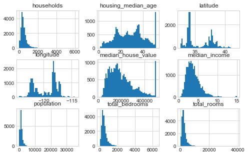
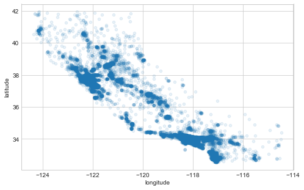
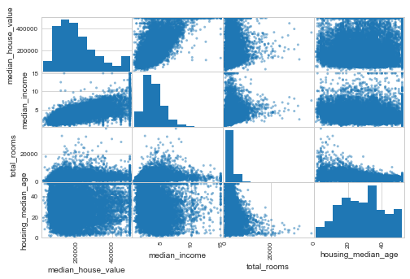
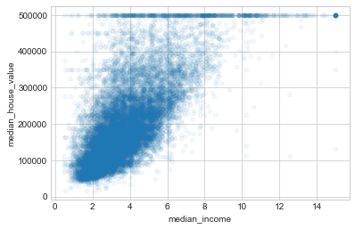

# Chapter 2. End-to-End Machine Learning Project

Here are the steps we will follow:

1. Look at the big picture.
2. Get the data.
3. Discover and visualize the data to gain insights.
4. Prepare the data for ML algorithms.
5. Select a model and train.
6. Present the solution.
7. Launch, monitor, and maintain the system.

## Working with real data

Some popular open data repositories include:

- [UC Irvine ML Repository](http://archive.ics.uci.edu/ml/index.php)
- [Kaggle datasets](https://www.kaggle.com/datasets)
- [Amazon's AWS datasets](https://registry.opendata.aws)
- [Wikipedias list of machine learning datasets](https://en.wikipedia.org/wiki/List_of_datasets_for_machine-learning_research
- [this](https://www.quora.com/Where-can-I-find-large-datasets-open-to-the-public) Quora.com questoins
- the [Datasets subreddit](https://www.reddit.com/r/datasets)

There are a few "meta-portals":

- http://dataportals.org/
- http://opendatamonitor.eu/
- http://quandl.com/

This example analysis will use the California Housing Prices dataset from the StatLib repository based on data from the 1990 CA census.
The goal is the create a model to predict the median housing price in any district.

### Download the data


```python
import os, tarfile
from six.moves import urllib
import pandas as pd
import numpy as np

DOWNLOAD_ROOT = 'https://raw.githubusercontent.com/ageron/handson-ml/master/'
HOUSING_PATH = 'assets/homl/housing'
HOUSING_URL = DOWNLOAD_ROOT + 'datasets/housing/housing.tgz'

def fetch_housing_data(housing_url=HOUSING_URL, housing_path=HOUSING_PATH):
    ''' Download and extract housing data.'''
    if not os.path.isdir(housing_path):
        os.makedirs(housing_path)
    
    tgz_path = os.path.join(housing_path, 'housing.tgz')
    urllib.request.urlretrieve(housing_url, tgz_path)
    housing_tgz = tarfile.open(tgz_path)
    housing_tgz.extractall(path=housing_path)
    housing_tgz.close()

def load_housing_data(housing_path=HOUSING_PATH):
    '''Load in housing data as a pandas DataFrame.'''
    csv_path = os.path.join(housing_path, 'housing.csv')
    return pd.read_csv(csv_path)

# Download the data.
# fetch_housing_data()

# Loading the data as a pandas DataFrame.
housing = load_housing_data()
housing.head()
```


<div>
<style scoped>
    .dataframe tbody tr th:only-of-type {
        vertical-align: middle;
    }

    .dataframe tbody tr th {
        vertical-align: top;
    }

    .dataframe thead th {
        text-align: right;
    }
</style>
<table border="1" class="dataframe">
  <thead>
    <tr style="text-align: right;">
      <th></th>
      <th>longitude</th>
      <th>latitude</th>
      <th>housing_median_age</th>
      <th>total_rooms</th>
      <th>total_bedrooms</th>
      <th>population</th>
      <th>households</th>
      <th>median_income</th>
      <th>median_house_value</th>
      <th>ocean_proximity</th>
    </tr>
  </thead>
  <tbody>
    <tr>
      <th>0</th>
      <td>-122.23</td>
      <td>37.88</td>
      <td>41.0</td>
      <td>880.0</td>
      <td>129.0</td>
      <td>322.0</td>
      <td>126.0</td>
      <td>8.3252</td>
      <td>452600.0</td>
      <td>NEAR BAY</td>
    </tr>
    <tr>
      <th>1</th>
      <td>-122.22</td>
      <td>37.86</td>
      <td>21.0</td>
      <td>7099.0</td>
      <td>1106.0</td>
      <td>2401.0</td>
      <td>1138.0</td>
      <td>8.3014</td>
      <td>358500.0</td>
      <td>NEAR BAY</td>
    </tr>
    <tr>
      <th>2</th>
      <td>-122.24</td>
      <td>37.85</td>
      <td>52.0</td>
      <td>1467.0</td>
      <td>190.0</td>
      <td>496.0</td>
      <td>177.0</td>
      <td>7.2574</td>
      <td>352100.0</td>
      <td>NEAR BAY</td>
    </tr>
    <tr>
      <th>3</th>
      <td>-122.25</td>
      <td>37.85</td>
      <td>52.0</td>
      <td>1274.0</td>
      <td>235.0</td>
      <td>558.0</td>
      <td>219.0</td>
      <td>5.6431</td>
      <td>341300.0</td>
      <td>NEAR BAY</td>
    </tr>
    <tr>
      <th>4</th>
      <td>-122.25</td>
      <td>37.85</td>
      <td>52.0</td>
      <td>1627.0</td>
      <td>280.0</td>
      <td>565.0</td>
      <td>259.0</td>
      <td>3.8462</td>
      <td>342200.0</td>
      <td>NEAR BAY</td>
    </tr>
  </tbody>
</table>
</div>


```python
housing.info()
```

    <class 'pandas.core.frame.DataFrame'>
    RangeIndex: 20640 entries, 0 to 20639
    Data columns (total 10 columns):
    longitude             20640 non-null float64
    latitude              20640 non-null float64
    housing_median_age    20640 non-null float64
    total_rooms           20640 non-null float64
    total_bedrooms        20433 non-null float64
    population            20640 non-null float64
    households            20640 non-null float64
    median_income         20640 non-null float64
    median_house_value    20640 non-null float64
    ocean_proximity       20640 non-null object
    dtypes: float64(9), object(1)
    memory usage: 1.6+ MB


```python
# Number of missing data points per column.
housing.isnull().sum()
```


    longitude               0
    latitude                0
    housing_median_age      0
    total_rooms             0
    total_bedrooms        207
    population              0
    households              0
    median_income           0
    median_house_value      0
    ocean_proximity         0
    dtype: int64


```python
# The values of 'ocean_proximity' are categorical.
housing.ocean_proximity.value_counts()
```


    <1H OCEAN     9136
    INLAND        6551
    NEAR OCEAN    2658
    NEAR BAY      2290
    ISLAND           5
    Name: ocean_proximity, dtype: int64


```python
housing.describe()
```


<div>
<style scoped>
    .dataframe tbody tr th:only-of-type {
        vertical-align: middle;
    }

    .dataframe tbody tr th {
        vertical-align: top;
    }

    .dataframe thead th {
        text-align: right;
    }
</style>
<table border="1" class="dataframe">
  <thead>
    <tr style="text-align: right;">
      <th></th>
      <th>longitude</th>
      <th>latitude</th>
      <th>housing_median_age</th>
      <th>total_rooms</th>
      <th>total_bedrooms</th>
      <th>population</th>
      <th>households</th>
      <th>median_income</th>
      <th>median_house_value</th>
    </tr>
  </thead>
  <tbody>
    <tr>
      <th>count</th>
      <td>20640.000000</td>
      <td>20640.000000</td>
      <td>20640.000000</td>
      <td>20640.000000</td>
      <td>20433.000000</td>
      <td>20640.000000</td>
      <td>20640.000000</td>
      <td>20640.000000</td>
      <td>20640.000000</td>
    </tr>
    <tr>
      <th>mean</th>
      <td>-119.569704</td>
      <td>35.631861</td>
      <td>28.639486</td>
      <td>2635.763081</td>
      <td>537.870553</td>
      <td>1425.476744</td>
      <td>499.539680</td>
      <td>3.870671</td>
      <td>206855.816909</td>
    </tr>
    <tr>
      <th>std</th>
      <td>2.003532</td>
      <td>2.135952</td>
      <td>12.585558</td>
      <td>2181.615252</td>
      <td>421.385070</td>
      <td>1132.462122</td>
      <td>382.329753</td>
      <td>1.899822</td>
      <td>115395.615874</td>
    </tr>
    <tr>
      <th>min</th>
      <td>-124.350000</td>
      <td>32.540000</td>
      <td>1.000000</td>
      <td>2.000000</td>
      <td>1.000000</td>
      <td>3.000000</td>
      <td>1.000000</td>
      <td>0.499900</td>
      <td>14999.000000</td>
    </tr>
    <tr>
      <th>25%</th>
      <td>-121.800000</td>
      <td>33.930000</td>
      <td>18.000000</td>
      <td>1447.750000</td>
      <td>296.000000</td>
      <td>787.000000</td>
      <td>280.000000</td>
      <td>2.563400</td>
      <td>119600.000000</td>
    </tr>
    <tr>
      <th>50%</th>
      <td>-118.490000</td>
      <td>34.260000</td>
      <td>29.000000</td>
      <td>2127.000000</td>
      <td>435.000000</td>
      <td>1166.000000</td>
      <td>409.000000</td>
      <td>3.534800</td>
      <td>179700.000000</td>
    </tr>
    <tr>
      <th>75%</th>
      <td>-118.010000</td>
      <td>37.710000</td>
      <td>37.000000</td>
      <td>3148.000000</td>
      <td>647.000000</td>
      <td>1725.000000</td>
      <td>605.000000</td>
      <td>4.743250</td>
      <td>264725.000000</td>
    </tr>
    <tr>
      <th>max</th>
      <td>-114.310000</td>
      <td>41.950000</td>
      <td>52.000000</td>
      <td>39320.000000</td>
      <td>6445.000000</td>
      <td>35682.000000</td>
      <td>6082.000000</td>
      <td>15.000100</td>
      <td>500001.000000</td>
    </tr>
  </tbody>
</table>
</div>


```python
import matplotlib.pyplot as plt
%matplotlib inline

# Some good default values to use for my Jupyter notebook.
plt.style.use('seaborn-whitegrid')
plt.rc('figure', figsize=(8, 5), facecolor='white')

housing.hist(bins=50)
```


    array([[<matplotlib.axes._subplots.AxesSubplot object at 0x103850890>,
            <matplotlib.axes._subplots.AxesSubplot object at 0x116aa7510>,
            <matplotlib.axes._subplots.AxesSubplot object at 0x116adccd0>],
           [<matplotlib.axes._subplots.AxesSubplot object at 0x116b1d510>,
            <matplotlib.axes._subplots.AxesSubplot object at 0x116b53d10>,
            <matplotlib.axes._subplots.AxesSubplot object at 0x116b91550>],
           [<matplotlib.axes._subplots.AxesSubplot object at 0x116bc6d50>,
            <matplotlib.axes._subplots.AxesSubplot object at 0x116c07590>,
            <matplotlib.axes._subplots.AxesSubplot object at 0x116c12110>]],
          dtype=object)





A few things to note about the data:

1. The 'median_income' has been scaled and capped to a range of 0.5 and 15.
2. The 'housing_median_age' and 'median_house_value' have been capped, the latter potentially being a problem because that data is the predicted value.
3. The attributes have different scales (discussed later).
4. Many of the histograms have a long tail - a good sign to transform the data, depending on the model.

### Create a test set


```python
from sklearn.model_selection import train_test_split

# Split the data into training and testing data.
train_set, test_set = train_test_split(housing, test_size=0.2, random_state=0)
```

The author wasnted to ensure that the median income was properly sampled in the training and testing data.
Therefore, he created a categorical variable and used `sklearn.model_selection.StratifiedShuffleSplit()` to split the data into training and testing sets while maintaining equal distributions of this category.


```python
housing['income_cat'] = np.ceil(housing.median_income / 1.5)
housing['income_cat'].where(housing.income_cat < 5.0, 5.0, inplace=True)
housing.head()
```


<div>
<style scoped>
    .dataframe tbody tr th:only-of-type {
        vertical-align: middle;
    }

    .dataframe tbody tr th {
        vertical-align: top;
    }

    .dataframe thead th {
        text-align: right;
    }
</style>
<table border="1" class="dataframe">
  <thead>
    <tr style="text-align: right;">
      <th></th>
      <th>longitude</th>
      <th>latitude</th>
      <th>housing_median_age</th>
      <th>total_rooms</th>
      <th>total_bedrooms</th>
      <th>population</th>
      <th>households</th>
      <th>median_income</th>
      <th>median_house_value</th>
      <th>ocean_proximity</th>
      <th>income_cat</th>
    </tr>
  </thead>
  <tbody>
    <tr>
      <th>0</th>
      <td>-122.23</td>
      <td>37.88</td>
      <td>41.0</td>
      <td>880.0</td>
      <td>129.0</td>
      <td>322.0</td>
      <td>126.0</td>
      <td>8.3252</td>
      <td>452600.0</td>
      <td>NEAR BAY</td>
      <td>5.0</td>
    </tr>
    <tr>
      <th>1</th>
      <td>-122.22</td>
      <td>37.86</td>
      <td>21.0</td>
      <td>7099.0</td>
      <td>1106.0</td>
      <td>2401.0</td>
      <td>1138.0</td>
      <td>8.3014</td>
      <td>358500.0</td>
      <td>NEAR BAY</td>
      <td>5.0</td>
    </tr>
    <tr>
      <th>2</th>
      <td>-122.24</td>
      <td>37.85</td>
      <td>52.0</td>
      <td>1467.0</td>
      <td>190.0</td>
      <td>496.0</td>
      <td>177.0</td>
      <td>7.2574</td>
      <td>352100.0</td>
      <td>NEAR BAY</td>
      <td>5.0</td>
    </tr>
    <tr>
      <th>3</th>
      <td>-122.25</td>
      <td>37.85</td>
      <td>52.0</td>
      <td>1274.0</td>
      <td>235.0</td>
      <td>558.0</td>
      <td>219.0</td>
      <td>5.6431</td>
      <td>341300.0</td>
      <td>NEAR BAY</td>
      <td>4.0</td>
    </tr>
    <tr>
      <th>4</th>
      <td>-122.25</td>
      <td>37.85</td>
      <td>52.0</td>
      <td>1627.0</td>
      <td>280.0</td>
      <td>565.0</td>
      <td>259.0</td>
      <td>3.8462</td>
      <td>342200.0</td>
      <td>NEAR BAY</td>
      <td>3.0</td>
    </tr>
  </tbody>
</table>
</div>


```python
from sklearn.model_selection import StratifiedShuffleSplit

split = StratifiedShuffleSplit(n_splits=1, test_size=0.2, random_state=0)
for train_index, test_index in split.split(housing, housing['income_cat']):
    strat_train_set = housing.loc[train_index]
    strat_test_set = housing.loc[test_index]
```


```python
# Compare splits
housing['income_cat'].value_counts() / len(housing)
```


    3.0    0.350581
    2.0    0.318847
    4.0    0.176308
    5.0    0.114438
    1.0    0.039826
    Name: income_cat, dtype: float64


```python
strat_train_set['income_cat'].value_counts() / len(strat_train_set)
```


    3.0    0.350594
    2.0    0.318859
    4.0    0.176296
    5.0    0.114402
    1.0    0.039850
    Name: income_cat, dtype: float64


```python
strat_test_set['income_cat'].value_counts() / len(strat_test_set)
```


    3.0    0.350533
    2.0    0.318798
    4.0    0.176357
    5.0    0.114583
    1.0    0.039729
    Name: income_cat, dtype: float64


```python
# Remove unneeded columns.
strat_test_set.drop(['income_cat'], axis=1, inplace=True)
strat_train_set.drop(['income_cat'], axis=1, inplace=True)
```

## Discover and visualize the data to gain insights


```python
# A copy of the training data to play around with.
housing = strat_train_set.copy()
```


```python
housing.plot(kind='scatter', x='longitude', y='latitude', alpha=0.1)

```


    <matplotlib.axes._subplots.AxesSubplot at 0x1a19af5c50>





```python
housing.plot(kind='scatter',
             x = 'longitude',
             y = 'latitude',
             alpha = 0.4,
             s=housing.population/100,
             label='population',
             c='median_house_value',
             cmap=plt.get_cmap('jet'), colorbar=True)
plt.legend()
```


    <matplotlib.legend.Legend at 0x1a1a00d290>


```python
corr_matrix = housing.corr()
corr_matrix
```


<div>
<style scoped>
    .dataframe tbody tr th:only-of-type {
        vertical-align: middle;
    }

    .dataframe tbody tr th {
        vertical-align: top;
    }

    .dataframe thead th {
        text-align: right;
    }
</style>
<table border="1" class="dataframe">
  <thead>
    <tr style="text-align: right;">
      <th></th>
      <th>longitude</th>
      <th>latitude</th>
      <th>housing_median_age</th>
      <th>total_rooms</th>
      <th>total_bedrooms</th>
      <th>population</th>
      <th>households</th>
      <th>median_income</th>
      <th>median_house_value</th>
    </tr>
  </thead>
  <tbody>
    <tr>
      <th>longitude</th>
      <td>1.000000</td>
      <td>-0.924903</td>
      <td>-0.108097</td>
      <td>0.041547</td>
      <td>0.065183</td>
      <td>0.096933</td>
      <td>0.051827</td>
      <td>-0.013645</td>
      <td>-0.043236</td>
    </tr>
    <tr>
      <th>latitude</th>
      <td>-0.924903</td>
      <td>1.000000</td>
      <td>0.010784</td>
      <td>-0.034359</td>
      <td>-0.064436</td>
      <td>-0.106834</td>
      <td>-0.069613</td>
      <td>-0.081262</td>
      <td>-0.145570</td>
    </tr>
    <tr>
      <th>housing_median_age</th>
      <td>-0.108097</td>
      <td>0.010784</td>
      <td>1.000000</td>
      <td>-0.359036</td>
      <td>-0.317509</td>
      <td>-0.293215</td>
      <td>-0.300756</td>
      <td>-0.113458</td>
      <td>0.107144</td>
    </tr>
    <tr>
      <th>total_rooms</th>
      <td>0.041547</td>
      <td>-0.034359</td>
      <td>-0.359036</td>
      <td>1.000000</td>
      <td>0.929552</td>
      <td>0.853612</td>
      <td>0.918026</td>
      <td>0.196382</td>
      <td>0.137469</td>
    </tr>
    <tr>
      <th>total_bedrooms</th>
      <td>0.065183</td>
      <td>-0.064436</td>
      <td>-0.317509</td>
      <td>0.929552</td>
      <td>1.000000</td>
      <td>0.874315</td>
      <td>0.980162</td>
      <td>-0.009282</td>
      <td>0.053544</td>
    </tr>
    <tr>
      <th>population</th>
      <td>0.096933</td>
      <td>-0.106834</td>
      <td>-0.293215</td>
      <td>0.853612</td>
      <td>0.874315</td>
      <td>1.000000</td>
      <td>0.903795</td>
      <td>0.003431</td>
      <td>-0.023797</td>
    </tr>
    <tr>
      <th>households</th>
      <td>0.051827</td>
      <td>-0.069613</td>
      <td>-0.300756</td>
      <td>0.918026</td>
      <td>0.980162</td>
      <td>0.903795</td>
      <td>1.000000</td>
      <td>0.011840</td>
      <td>0.069177</td>
    </tr>
    <tr>
      <th>median_income</th>
      <td>-0.013645</td>
      <td>-0.081262</td>
      <td>-0.113458</td>
      <td>0.196382</td>
      <td>-0.009282</td>
      <td>0.003431</td>
      <td>0.011840</td>
      <td>1.000000</td>
      <td>0.688883</td>
    </tr>
    <tr>
      <th>median_house_value</th>
      <td>-0.043236</td>
      <td>-0.145570</td>
      <td>0.107144</td>
      <td>0.137469</td>
      <td>0.053544</td>
      <td>-0.023797</td>
      <td>0.069177</td>
      <td>0.688883</td>
      <td>1.000000</td>
    </tr>
  </tbody>
</table>
</div>


```python
corr_matrix.median_house_value.sort_values(ascending=False)
```


    median_house_value    1.000000
    median_income         0.688883
    total_rooms           0.137469
    housing_median_age    0.107144
    households            0.069177
    total_bedrooms        0.053544
    population           -0.023797
    longitude            -0.043236
    latitude             -0.145570
    Name: median_house_value, dtype: float64


```python
from pandas.plotting import scatter_matrix
attributes = ["median_house_value", "median_income", "total_rooms", "housing_median_age"]
scatter_matrix(housing[attributes])
```


    array([[<matplotlib.axes._subplots.AxesSubplot object at 0x1a1a702890>,
            <matplotlib.axes._subplots.AxesSubplot object at 0x1a1a839a50>,
            <matplotlib.axes._subplots.AxesSubplot object at 0x1a1a867f90>,
            <matplotlib.axes._subplots.AxesSubplot object at 0x1a1a8ab850>],
           [<matplotlib.axes._subplots.AxesSubplot object at 0x1a1a8e7bd0>,
            <matplotlib.axes._subplots.AxesSubplot object at 0x1a1a91f890>,
            <matplotlib.axes._subplots.AxesSubplot object at 0x1a1a81cd10>,
            <matplotlib.axes._subplots.AxesSubplot object at 0x1a1a7d18d0>],
           [<matplotlib.axes._subplots.AxesSubplot object at 0x1a1a7dc450>,
            <matplotlib.axes._subplots.AxesSubplot object at 0x1a1a951dd0>,
            <matplotlib.axes._subplots.AxesSubplot object at 0x1a19b51c90>,
            <matplotlib.axes._subplots.AxesSubplot object at 0x1a1a27d950>],
           [<matplotlib.axes._subplots.AxesSubplot object at 0x1a1a2bbcd0>,
            <matplotlib.axes._subplots.AxesSubplot object at 0x1a1a36e990>,
            <matplotlib.axes._subplots.AxesSubplot object at 0x1a1a3acd10>,
            <matplotlib.axes._subplots.AxesSubplot object at 0x1a1a3e49d0>]],
          dtype=object)





From the above scatter matrix, the most promizing attribute seems to be median income.
The following plot is a closer look.


```python
housing.plot(kind='scatter',
             x='median_income',
             y='median_house_value',
             alpha=0.05)
```


    <matplotlib.axes._subplots.AxesSubplot at 0x1a1a7023d0>





The actual numbers of rooms and bedrooms are not very useful.
Instead, we want the average number of rooms and bedrooms per house.


```python
housing['rooms_per_household'] = housing.total_rooms / housing.households
housing['bedrooms_per_room'] = housing.total_bedrooms / housing.households
housing['population_per_household'] = housing.population / housing.households

# Check the correlations again.
corr_matrix = housing.corr()
corr_matrix.median_house_value.sort_values(ascending=False)
```


    median_house_value          1.000000
    median_income               0.688883
    rooms_per_household         0.157620
    total_rooms                 0.137469
    housing_median_age          0.107144
    households                  0.069177
    total_bedrooms              0.053544
    population                 -0.023797
    population_per_household   -0.026888
    longitude                  -0.043236
    bedrooms_per_room          -0.048998
    latitude                   -0.145570
    Name: median_house_value, dtype: float64


## Prepare the data for machine learning algorithms

It is important to have a functional flow for this preparation such the transofrmations are easily reproducible and extendible.
Also, the same transformations will need to be done on the input data when the model is in use.
Finally, it allows for faster prototyping.

To begin, we reset the training data and separated the labels.


```python
housing = strat_train_set.drop('median_house_value', axis=1)
housing_labels = strat_train_set['median_house_value'].copy()
```

### Data cleaning

We need to address the missing data in the `'total_bedrooms'` column; the following are the three options:

1. Remove the data points.
2. Do not use the feature, atl all.
3. Set the missing points to some other value (0, the average)

If option 3 is taken, make sure to save the value for filling in the test data, too.

Scikit-learn inlcudes the [`SimpleImputer`](https://scikit-learn.org/stable/modules/generated/sklearn.impute.SimpleImputer.html) class to impute missing values.
Here, it is used to fill in missing values with the median value.


```python
from sklearn.impute import SimpleImputer

imputer = SimpleImputer(strategy='median')
imputer.fit(housing.drop('ocean_proximity', axis=1))
imputer
```


    SimpleImputer(add_indicator=False, copy=True, fill_value=None,
                  missing_values=nan, strategy='median', verbose=0)


```python
imputer.statistics_ == housing.drop('ocean_proximity', axis=1).median().values
```


    array([ True,  True,  True,  True,  True,  True,  True,  True])


```python
X = imputer.transform(housing.drop('ocean_proximity', axis=1))
X
```


    array([[-1.1787e+02,  3.3860e+01,  2.8000e+01, ...,  2.1970e+03,
             5.0900e+02,  3.4856e+00],
           [-1.2157e+02,  3.9130e+01,  3.0000e+01, ...,  4.1300e+02,
             8.8000e+01,  1.5694e+00],
           [-1.1905e+02,  3.4400e+01,  5.0000e+01, ...,  1.0790e+03,
             2.5700e+02,  2.6991e+00],
           ...,
           [-1.1830e+02,  3.4250e+01,  4.4000e+01, ...,  8.5900e+02,
             2.9200e+02,  4.5833e+00],
           [-1.2191e+02,  3.7310e+01,  4.6000e+01, ...,  1.3730e+03,
             5.9000e+02,  4.7287e+00],
           [-1.1830e+02,  3.4090e+01,  2.9000e+01, ...,  3.9060e+03,
             1.1020e+03,  2.1927e+00]])


### Handling text and categorical attributes

The ocean proximity feature must be turned into a numerical "dummy" variable.
This can be accomplished using the [LabelEncoder]() (**NEED TO INSERT LINK**) transformer from Scikit-Learn.


```python
from sklearn.preprocessing import LabelEncoder

encoder = LabelEncoder()
housing_cat = housing.ocean_proximity
housing_cat_encoded = encoder.fit_transform(housing_cat)
housing_cat_encoded
```


    array([0, 1, 0, ..., 0, 0, 0])


```python
encoder.classes_
```


    array(['<1H OCEAN', 'INLAND', 'ISLAND', 'NEAR BAY', 'NEAR OCEAN'],
          dtype=object)


The problem with this implementation of dummy variables is that there is no intrinsic order in ocean proximity to maintain.
Therefore, we should use the [OneHotEncoder]() transformer (or the pandas `pd.get_dummies(s)` function), instead.


```python
from sklearn.preprocessing import OneHotEncoder

encoder = OneHotEncoder(categories='auto')
housing_cat_1hot = encoder.fit_transform(housing_cat_encoded.reshape(-1, 1))
housing_cat_1hot
```


    <16512x5 sparse matrix of type '<class 'numpy.float64'>'
    	with 16512 stored elements in Compressed Sparse Row format>


```python
housing_cat_1hot.toarray()
```


    array([[1., 0., 0., 0., 0.],
           [0., 1., 0., 0., 0.],
           [1., 0., 0., 0., 0.],
           ...,
           [1., 0., 0., 0., 0.],
           [1., 0., 0., 0., 0.],
           [1., 0., 0., 0., 0.]])


```python
# Using the pandas method.
pd.get_dummies(housing.ocean_proximity)
```


<div>
<style scoped>
    .dataframe tbody tr th:only-of-type {
        vertical-align: middle;
    }

    .dataframe tbody tr th {
        vertical-align: top;
    }

    .dataframe thead th {
        text-align: right;
    }
</style>
<table border="1" class="dataframe">
  <thead>
    <tr style="text-align: right;">
      <th></th>
      <th>&lt;1H OCEAN</th>
      <th>INLAND</th>
      <th>ISLAND</th>
      <th>NEAR BAY</th>
      <th>NEAR OCEAN</th>
    </tr>
  </thead>
  <tbody>
    <tr>
      <th>10275</th>
      <td>1</td>
      <td>0</td>
      <td>0</td>
      <td>0</td>
      <td>0</td>
    </tr>
    <tr>
      <th>20601</th>
      <td>0</td>
      <td>1</td>
      <td>0</td>
      <td>0</td>
      <td>0</td>
    </tr>
    <tr>
      <th>20138</th>
      <td>1</td>
      <td>0</td>
      <td>0</td>
      <td>0</td>
      <td>0</td>
    </tr>
    <tr>
      <th>18028</th>
      <td>1</td>
      <td>0</td>
      <td>0</td>
      <td>0</td>
      <td>0</td>
    </tr>
    <tr>
      <th>16289</th>
      <td>0</td>
      <td>1</td>
      <td>0</td>
      <td>0</td>
      <td>0</td>
    </tr>
    <tr>
      <th>...</th>
      <td>...</td>
      <td>...</td>
      <td>...</td>
      <td>...</td>
      <td>...</td>
    </tr>
    <tr>
      <th>6358</th>
      <td>0</td>
      <td>1</td>
      <td>0</td>
      <td>0</td>
      <td>0</td>
    </tr>
    <tr>
      <th>618</th>
      <td>0</td>
      <td>0</td>
      <td>0</td>
      <td>1</td>
      <td>0</td>
    </tr>
    <tr>
      <th>3407</th>
      <td>1</td>
      <td>0</td>
      <td>0</td>
      <td>0</td>
      <td>0</td>
    </tr>
    <tr>
      <th>17590</th>
      <td>1</td>
      <td>0</td>
      <td>0</td>
      <td>0</td>
      <td>0</td>
    </tr>
    <tr>
      <th>4303</th>
      <td>1</td>
      <td>0</td>
      <td>0</td>
      <td>0</td>
      <td>0</td>
    </tr>
  </tbody>
</table>
<p>16512 rows × 5 columns</p>
</div>


Finally, we can encode a categorical feature into a dummy matrix directly using the [LabelBinarizer]() **NEED LINK** transformer.


```python
from sklearn.preprocessing import LabelBinarizer

encoder = LabelBinarizer()
housing_cat_1hot = encoder.fit_transform(housing.ocean_proximity)
housing_cat_1hot
```


    array([[1, 0, 0, 0, 0],
           [0, 1, 0, 0, 0],
           [1, 0, 0, 0, 0],
           ...,
           [1, 0, 0, 0, 0],
           [1, 0, 0, 0, 0],
           [1, 0, 0, 0, 0]])


### Custom transformers

Custom tranformers can be made for Scikit-Learn in order to seamlessly fit in standard functionalities and pipelines.
All that a class needs are three methods: `fit()`, `transform()` and `fit_transform()`.
(Subclassing from TransformerMixin will bring in the last method in for free.)
Here is an example transformer that adds some features we did earlier.


```python
from sklearn.base import BaseEstimator, TransformerMixin

# Indices of columns for `CombinedAttributesAdder`.
rooms_ix, bedrooms_ix, population_ix, household_ix = 3, 4, 5, 6


class CombinedAttributesAdder(BaseEstimator, TransformerMixin):
    '''Add some useful features to housing data.'''

    def __init__(self, add_bedrooms_per_room=True):
        self.add_bedrooms_per_room = add_bedrooms_per_room

    def fit(self, X, y=None):
        return self

    def transform(self, X, y=None):
        rooms_per_household = X[:, rooms_ix] / X[:, household_ix]
        population_per_household = X[:, population_ix] / X[:, household_ix]
        if self.add_bedrooms_per_room:
            bedrooms_per_room = X[:, bedrooms_ix] / X[:, rooms_ix]
            return np.c_[X, rooms_per_household, population_per_household, bedrooms_per_room]
        else:
            return np.c_[X, rooms_per_household, population_per_household]
```


```python
attr_adder = CombinedAttributesAdder(add_bedrooms_per_room=False)
housing_extra_attributes = attr_adder.transform(housing.values)
housing_extra_attributes
```


    array([[-117.87, 33.86, 28.0, ..., '<1H OCEAN', 4.50294695481336,
            4.31630648330059],
           [-121.57, 39.13, 30.0, ..., 'INLAND', 5.0227272727272725,
            4.693181818181818],
           [-119.05, 34.4, 50.0, ..., '<1H OCEAN', 4.809338521400778,
            4.198443579766537],
           ...,
           [-118.3, 34.25, 44.0, ..., '<1H OCEAN', 4.938356164383562,
            2.941780821917808],
           [-121.91, 37.31, 46.0, ..., '<1H OCEAN', 5.172881355932203,
            2.3271186440677964],
           [-118.3, 34.09, 29.0, ..., '<1H OCEAN', 2.9446460980036298,
            3.544464609800363]], dtype=object)


### Feature scaling

The two most common scaling tactics are *minmax scaling* (or *normalization*) and *standardization*.
The first is linearly scaling the data to exist within the range of 0 to 1 and the Scikit-Learn transformer for this is [MinMaxScaler]() **NEED LINK**.
The latter is transforming the data to have mean 0 and standard deviation 1 and the appropriate Scikit-Learn transformer is [StandardScaler]() **NEED LINK**.

### Tansformation pipelines

The [Pipeline]() **NEED LINK** class can perform a sequence of transformations.
Below is a small example.


```python
from sklearn.pipeline import Pipeline
from sklearn.preprocessing import StandardScaler

num_pipline = Pipeline([
    ('imputer', SimpleImputer(strategy='median')),
    ('attribs_adder', CombinedAttributesAdder()),
    ('std_scalar', StandardScaler())
])

housing_num_tr = num_pipline.fit_transform(
    housing.drop('ocean_proximity', axis=1))
```

We also have the ocean proximity unordered categorical data that needs a separate pipeline.
Scikit-Learn has a [FeatureUnion]() **LINK NEEDED** class that can take multiple pipelines, run them in parallel, and re-combine the output into a single data structure.
First, we need to make a wrapper for selecting pandas DataFrame columns as a transformer class for Scikit-Learn.


```python
class DataFrameSelector(BaseEstimator, TransformerMixin):
    '''
    A Scikit-Learn transformer for selecting columns of
    a pandas DataFrame.
    '''
    
    def __init__(self, attribute_names):
        self.attribute_names = attribute_names
    
    def fit(self, X, y=None):
        return self
    
    def transform(self, X):
        return X[self.attribute_names].values
```


```python
# This implementation was taken from this PR on sklearn.
# https://github.com/scikit-learn/scikit-learn/pull/7375/files#diff-1e175ddb0d84aad0a578d34553f6f9c6
class MyLabelBinarizer(LabelBinarizer):
    '''
    An alternative to Scikit-Learn's LabelBinarizer because it is not 
    working in my pipe line.
    '''
    
    def fit(self, X, y=None):
         super(MyLabelBinarizer, self).fit(X)
    
    def transform(self, X, y=None):
         return super(MyLabelBinarizer, self).transform(X)
    
    def fit_transform(self, X, y=None):
         return super(MyLabelBinarizer, self).fit(X).transform(X)
```


```python
# Column names for numerical and categorical features of housing data.
numerical_attr = list(housing.drop('ocean_proximity', axis=1))
categorical_attr = ['ocean_proximity']

# A pipline for the numerical features of housing data.
num_pipeline = Pipeline([
    ('selector', DataFrameSelector(numerical_attr)),
    ('imputer', SimpleImputer(strategy='median')),
    ('attribs_adder', CombinedAttributesAdder()),
    ('std_scaler', StandardScaler()),
])

# A pipeline for the categorical 'ocean_proximity'.
cat_pipeline = Pipeline([
    ('selector', DataFrameSelector(categorical_attr)),
    ('label_binarizer', MyLabelBinarizer()),
])

# A full pipeline for preparing the housing data.
from sklearn.pipeline import FeatureUnion

full_pipeline = FeatureUnion(transformer_list=[
    ('num_pipeline', num_pipeline),
    ('cat_pipeline', cat_pipeline),
])
```


```python
# Run the pipeline.
housing_prepared = full_pipeline.fit_transform(housing)
housing_prepared
```


    array([[ 0.84450121, -0.82473693, -0.04853356, ...,  0.        ,
             0.        ,  0.        ],
           [-1.00168564,  1.64070891,  0.11081943, ...,  0.        ,
             0.        ,  0.        ],
           [ 0.25571729, -0.5721106 ,  1.70434932, ...,  0.        ,
             0.        ,  0.        ],
           ...,
           [ 0.62994436, -0.64228458,  1.22629035, ...,  0.        ,
             0.        ,  0.        ],
           [-1.17133524,  0.78926462,  1.38564334, ...,  0.        ,
             0.        ,  0.        ],
           [ 0.62994436, -0.71713683,  0.03114293, ...,  0.        ,
             0.        ,  0.        ]])


```python
housing_prepared.shape
```


    (16512, 16)


## Select and train a model

### Training and evaluating on the training set

The first model tried was a linear regression.


```python
from sklearn.linear_model import LinearRegression

lin_reg = LinearRegression()
lin_reg.fit(housing_prepared, housing_labels)
```


    LinearRegression(copy_X=True, fit_intercept=True, n_jobs=None, normalize=False)


That is all that is required to get a linear regression model.
Below, it is manually tested on a few data points.


```python
# Get the first 5 values to play with.
some_data = housing.iloc[:5]
some_labels = housing_labels.iloc[:5]

# Transform the selected data for input into the model.
some_data_prepared = full_pipeline.transform(some_data)

# What would be predicted by the linear regression model.
lin_reg.predict(some_data_prepared)
```


    array([172713.58885788,  43130.16935351, 195014.22158132, 268919.62476372,
            44875.4698183 ])


```python
# Actual values.
some_labels.values
```


    array([142800.,  57900., 181300., 245300.,  73900.])


```python
# Difference between actual and predicted divided by the actual value.
(some_labels.values - lin_reg.predict(some_data_prepared)) / some_labels.values
```


    array([-0.20947891,  0.25509207, -0.0756438 , -0.09628873,  0.39275413])


We can compare the predicted values to the real values of the training data by calculating the root mean squared error (RMSE).


```python
from sklearn.metrics import mean_squared_error

def root_mean_squared_error(actual_val, predicted_val):
    """Calculate the RMSE of actual and predicted values."""
    return np.sqrt(mean_squared_error(actual_val, predicted_val))

housing_predictions = lin_reg.predict(housing_prepared)
lin_rmse = root_mean_squared_error(housing_labels, housing_predictions)
lin_rmse
```


    68284.24083518104


To attain a better prediction, we will use a more complicated model, a decision tree regression model.


```python
from sklearn.tree import DecisionTreeRegressor

tree_reg = DecisionTreeRegressor()
tree_reg.fit(housing_prepared, housing_labels)
```


    DecisionTreeRegressor(criterion='mse', max_depth=None, max_features=None,
                          max_leaf_nodes=None, min_impurity_decrease=0.0,
                          min_impurity_split=None, min_samples_leaf=1,
                          min_samples_split=2, min_weight_fraction_leaf=0.0,
                          presort=False, random_state=None, splitter='best')


```python
housing_predictions = tree_reg.predict(housing_prepared)
tree_rmse = root_mean_squared_error(housing_labels, housing_predictions)
tree_rmse
```


    0.0


With a RMSE of 0, it is likely that the decision tree is overfitting.
We can fix this by using cross-validation.

### Betting evaluation using CV

It is a fairly straightforward process for running CV in Scikit-Learn.


```python
from sklearn.model_selection import cross_val_score

scores = cross_val_score(tree_reg,
                         housing_prepared,
                         housing_labels,
                         scoring="neg_mean_squared_error",
                         cv=10)
scores
```


    array([-5.15937092e+09, -5.18073235e+09, -5.32058793e+09, -4.95028448e+09,
           -4.89613998e+09, -4.81118781e+09, -5.17159820e+09, -5.43590409e+09,
           -4.52700620e+09, -4.93849034e+09])


```python
rmse_scores = np.sqrt(-scores)
rmse_scores
```


    array([71828.76109375, 71977.30444219, 72942.36035746, 70358.25806928,
           69972.42302975, 69362.72636481, 71913.82478571, 73728.58391874,
           67283.03054852, 70274.39320752])


```python
rmse_scores.mean()
```


    70964.1665817734


```python
rmse_scores.std()
```


    1793.6810612782483


The decision tree did not perform very well.
We could see improvements by using an ensemble of them: a random forest regression model.


```python
from sklearn.ensemble import RandomForestRegressor

forest_reg = RandomForestRegressor(n_estimators=10)
forest_reg.fit(housing_prepared, housing_labels)
```


    RandomForestRegressor(bootstrap=True, criterion='mse', max_depth=None,
                          max_features='auto', max_leaf_nodes=None,
                          min_impurity_decrease=0.0, min_impurity_split=None,
                          min_samples_leaf=1, min_samples_split=2,
                          min_weight_fraction_leaf=0.0, n_estimators=10,
                          n_jobs=None, oob_score=False, random_state=None,
                          verbose=0, warm_start=False)


```python
forest_scores = cross_val_score(forest_reg,
                               housing_prepared,
                               housing_labels,
                               scoring='neg_mean_squared_error',
                               cv=10)
forest_scores
```


    array([-2.61417874e+09, -3.18995571e+09, -2.61593660e+09, -2.77357932e+09,
           -3.01912691e+09, -2.48698284e+09, -2.60322322e+09, -2.97681114e+09,
           -2.83410599e+09, -2.91489360e+09])


```python
forest_rmse = np.sqrt(-forest_scores)
forest_rmse
```


    array([51129.04011066, 56479.69289041, 51146.22759761, 52664.78253091,
           54946.58232333, 49869.65851849, 51021.79160182, 54560.16075797,
           53236.3220899 , 53989.75459665])


```python
forest_rmse.mean()
```


    52904.401301774815


```python
forest_rmse.std()
```


    2000.9322367576474


The random forest seems to be a better option than the linear regression or the decision tree.

The author suggests trying out a few other models to generate a short-list (2-5) types of models to dive deeper into.

## Fine-tune your model

Once a shot-list of models has been collected, the hyperparameters of the model can be adjusted to improve performance.
Some of the common techniques are discussed below.

### Grid search

The Scikit-Learn GridSearchCV object can be given the values to try for each hyperparameter and it will use CV to try out every combination.
Here is an example using the random forest regressor.


```python
from sklearn.model_selection import GridSearchCV

# Parameters to search through.
# Each dictionary in the list will be used for a grid search.
param_grid = [
    {
        'n_estimators': [3, 10, 30],
        'max_features': [2, 4, 6, 8]
    },
    {
        'bootstrap': [False],
        'n_estimators': [3, 10],
        'max_features': [2, 3, 4]
    }
]

# Random forest regression model.
forest_reg = RandomForestRegressor()

# Grid search object.
grid_search = GridSearchCV(forest_reg,
                           param_grid,
                           cv=5,
                           scoring='neg_mean_squared_error')

grid_search.fit(housing_prepared, housing_labels)
```


    GridSearchCV(cv=5, error_score='raise-deprecating',
                 estimator=RandomForestRegressor(bootstrap=True, criterion='mse',
                                                 max_depth=None,
                                                 max_features='auto',
                                                 max_leaf_nodes=None,
                                                 min_impurity_decrease=0.0,
                                                 min_impurity_split=None,
                                                 min_samples_leaf=1,
                                                 min_samples_split=2,
                                                 min_weight_fraction_leaf=0.0,
                                                 n_estimators='warn', n_jobs=None,
                                                 oob_score=False, random_state=None,
                                                 verbose=0, warm_start=False),
                 iid='warn', n_jobs=None,
                 param_grid=[{'max_features': [2, 4, 6, 8],
                              'n_estimators': [3, 10, 30]},
                             {'bootstrap': [False], 'max_features': [2, 3, 4],
                              'n_estimators': [3, 10]}],
                 pre_dispatch='2*n_jobs', refit=True, return_train_score=False,
                 scoring='neg_mean_squared_error', verbose=0)


```python
np.sqrt(-grid_search.best_score_)
```


    50108.238534885306


```python
grid_search.best_params_
```


    {'max_features': 6, 'n_estimators': 30}


```python
grid_search.best_estimator_
```


    RandomForestRegressor(bootstrap=True, criterion='mse', max_depth=None,
                          max_features=6, max_leaf_nodes=None,
                          min_impurity_decrease=0.0, min_impurity_split=None,
                          min_samples_leaf=1, min_samples_split=2,
                          min_weight_fraction_leaf=0.0, n_estimators=30,
                          n_jobs=None, oob_score=False, random_state=None,
                          verbose=0, warm_start=False)


```python
cv_res = grid_search.cv_results_
for mean_score, params in zip(cv_res['mean_test_score'], cv_res['params']):
    print(np.sqrt(-mean_score), params)
```

    62045.30806270319 {'max_features': 2, 'n_estimators': 3}
    55850.92960637452 {'max_features': 2, 'n_estimators': 10}
    52605.81798214284 {'max_features': 2, 'n_estimators': 30}
    60701.71517249607 {'max_features': 4, 'n_estimators': 3}
    52986.20555736508 {'max_features': 4, 'n_estimators': 10}
    50531.534512995444 {'max_features': 4, 'n_estimators': 30}
    59622.611239064994 {'max_features': 6, 'n_estimators': 3}
    52489.50230674013 {'max_features': 6, 'n_estimators': 10}
    50108.238534885306 {'max_features': 6, 'n_estimators': 30}
    58501.64726723975 {'max_features': 8, 'n_estimators': 3}
    52145.037645822325 {'max_features': 8, 'n_estimators': 10}
    50172.81147175804 {'max_features': 8, 'n_estimators': 30}
    62505.616743221246 {'bootstrap': False, 'max_features': 2, 'n_estimators': 3}
    53775.884701655676 {'bootstrap': False, 'max_features': 2, 'n_estimators': 10}
    59854.671653414734 {'bootstrap': False, 'max_features': 3, 'n_estimators': 3}
    52522.55104011973 {'bootstrap': False, 'max_features': 3, 'n_estimators': 10}
    59633.96778952786 {'bootstrap': False, 'max_features': 4, 'n_estimators': 3}
    51639.703026640236 {'bootstrap': False, 'max_features': 4, 'n_estimators': 10}


### Randomized search

This method is preferred over grid search when the search space is very large.
It evaluates a given number of random combinations by selecting a random value for each hyperparamter at every iteration.
The Scikit-Learn class is RandomizedSearchCV.
It is best to let the search go very several thousands of iterations.


```python
from sklearn.model_selection import RandomizedSearchCV
from scipy.stats import randint as sp_randint

# Search space for the random searcher.
param_dist = {
    'bootstrap': [True, False],
    'n_estimators': sp_randint(3, 30),
    'max_features': sp_randint(2, 8)
}

# Random forest regression model.
forest_reg = RandomForestRegressor()

# Grid search object.
random_search = RandomizedSearchCV(forest_reg,
                                   param_distributions=param_dist,
                                   cv=5,
                                   n_iter=100,
                                   scoring='neg_mean_squared_error')

random_search.fit(housing_prepared, housing_labels)
```


    RandomizedSearchCV(cv=5, error_score='raise-deprecating',
                       estimator=RandomForestRegressor(bootstrap=True,
                                                       criterion='mse',
                                                       max_depth=None,
                                                       max_features='auto',
                                                       max_leaf_nodes=None,
                                                       min_impurity_decrease=0.0,
                                                       min_impurity_split=None,
                                                       min_samples_leaf=1,
                                                       min_samples_split=2,
                                                       min_weight_fraction_leaf=0.0,
                                                       n_estimators='warn',
                                                       n_jobs=None, oob_score=False,
                                                       random_sta...
                       iid='warn', n_iter=100, n_jobs=None,
                       param_distributions={'bootstrap': [True, False],
                                            'max_features': <scipy.stats._distn_infrastructure.rv_frozen object at 0x1a1d0de350>,
                                            'n_estimators': <scipy.stats._distn_infrastructure.rv_frozen object at 0x1a1d0de550>},
                       pre_dispatch='2*n_jobs', random_state=None, refit=True,
                       return_train_score=False, scoring='neg_mean_squared_error',
                       verbose=0)


```python
random_search.best_estimator_
```


    RandomForestRegressor(bootstrap=False, criterion='mse', max_depth=None,
                          max_features=5, max_leaf_nodes=None,
                          min_impurity_decrease=0.0, min_impurity_split=None,
                          min_samples_leaf=1, min_samples_split=2,
                          min_weight_fraction_leaf=0.0, n_estimators=29,
                          n_jobs=None, oob_score=False, random_state=None,
                          verbose=0, warm_start=False)


```python
random_search.best_params_
```


    {'bootstrap': False, 'max_features': 5, 'n_estimators': 29}


### Ensemble methods

If good performance is found with an individual model, the ensemble form will likely perform better.
We saw this above with the improvement from switching from a decision tree to a random forest.

### Analyze the best models and their errors

Many of the models can report the importance of each input feature.
Here is an example of the most important features from the bet random forest regressor from the randomized search.


```python
feature_importances = random_search.best_estimator_.feature_importances_

# Names of extra attributes added during input prepration.
extra_attribs = ['rooms_per_hhold', 'pop_per_hhold', 'bedrooms_per_room']
cat_one_hot_attribs = list(encoder.classes_)
attribs = numerical_attr + extra_attribs + cat_one_hot_attribs
sorted(zip(feature_importances, attribs), reverse=True)
```


    [(0.3021968413681202, 'median_income'),
     (0.17172121501383844, 'INLAND'),
     (0.10535643725446837, 'pop_per_hhold'),
     (0.08252898351917255, 'bedrooms_per_room'),
     (0.07600088314616228, 'longitude'),
     (0.07164239936294078, 'latitude'),
     (0.061136870763047135, 'rooms_per_hhold'),
     (0.03979073180795825, 'housing_median_age'),
     (0.02073645853704187, 'total_rooms'),
     (0.019475112626333217, 'population'),
     (0.017225888404773914, 'total_bedrooms'),
     (0.01651339474021543, 'households'),
     (0.008266057803458848, '<1H OCEAN'),
     (0.004173937351643412, 'NEAR OCEAN'),
     (0.002949952272525918, 'NEAR BAY'),
     (0.0002848360282993544, 'ISLAND')]


### Evaluate your system on the test set

Once you have a well-built model, you can evaluate how well it performs on new data by passing it the test data set aside earlier.


```python
final_model = random_search.best_estimator_
final_model
```


    RandomForestRegressor(bootstrap=False, criterion='mse', max_depth=None,
                          max_features=5, max_leaf_nodes=None,
                          min_impurity_decrease=0.0, min_impurity_split=None,
                          min_samples_leaf=1, min_samples_split=2,
                          min_weight_fraction_leaf=0.0, n_estimators=29,
                          n_jobs=None, oob_score=False, random_state=None,
                          verbose=0, warm_start=False)


Note that the test input data (`X_test` below) is passed to through the pipeline using `transform()`, not `fit_transform()`.


```python
# Prepare the testing input and real values.
X_test = strat_test_set.drop('median_house_value', axis=1)
X_test_prepared = full_pipeline.transform(X_test)

y_test = strat_test_set['median_house_value'].copy()
```


```python
# Run the test data through the final model.
final_predictions = final_model.predict(X_test_prepared)

# Calculate the RMSE of the model on the test data.
final_rmse = root_mean_squared_error(y_test, final_predictions)
final_rmse
```


    47873.75645993217


