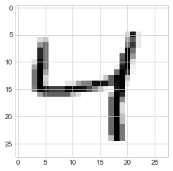
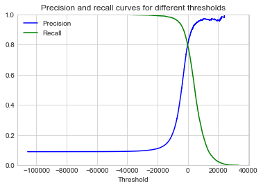
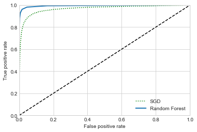

# Chapter 3. Classification


```python
import numpy as np
import pandas as pd
import matplotlib.pyplot as plt

np.random.seed(0)

plt.style.use('seaborn-whitegrid')
plt.rc('figure', figsize=(8, 5), facecolor='white')
```

## MNIST

Often considered the "Hello World" of ML, Scikit-Learn offers helper functions for downloading the MNIST 


```python
from sklearn.datasets import fetch_openml
mnist = fetch_openml('mnist_784', data_home='assets/scikit_learn_data/')
```


```python
mnist.data
```


    array([[0., 0., 0., ..., 0., 0., 0.],
           [0., 0., 0., ..., 0., 0., 0.],
           [0., 0., 0., ..., 0., 0., 0.],
           ...,
           [0., 0., 0., ..., 0., 0., 0.],
           [0., 0., 0., ..., 0., 0., 0.],
           [0., 0., 0., ..., 0., 0., 0.]])


```python
mnist.DESCR
```


    "**Author**: Yann LeCun, Corinna Cortes, Christopher J.C. Burges  \n**Source**: [MNIST Website](http://yann.lecun.com/exdb/mnist/) - Date unknown  \n**Please cite**:  \n\nThe MNIST database of handwritten digits with 784 features, raw data available at: http://yann.lecun.com/exdb/mnist/. It can be split in a training set of the first 60,000 examples, and a test set of 10,000 examples  \n\nIt is a subset of a larger set available from NIST. The digits have been size-normalized and centered in a fixed-size image. It is a good database for people who want to try learning techniques and pattern recognition methods on real-world data while spending minimal efforts on preprocessing and formatting. The original black and white (bilevel) images from NIST were size normalized to fit in a 20x20 pixel box while preserving their aspect ratio. The resulting images contain grey levels as a result of the anti-aliasing technique used by the normalization algorithm. the images were centered in a 28x28 image by computing the center of mass of the pixels, and translating the image so as to position this point at the center of the 28x28 field.  \n\nWith some classification methods (particularly template-based methods, such as SVM and K-nearest neighbors), the error rate improves when the digits are centered by bounding box rather than center of mass. If you do this kind of pre-processing, you should report it in your publications. The MNIST database was constructed from NIST's NIST originally designated SD-3 as their training set and SD-1 as their test set. However, SD-3 is much cleaner and easier to recognize than SD-1. The reason for this can be found on the fact that SD-3 was collected among Census Bureau employees, while SD-1 was collected among high-school students. Drawing sensible conclusions from learning experiments requires that the result be independent of the choice of training set and test among the complete set of samples. Therefore it was necessary to build a new database by mixing NIST's datasets.  \n\nThe MNIST training set is composed of 30,000 patterns from SD-3 and 30,000 patterns from SD-1. Our test set was composed of 5,000 patterns from SD-3 and 5,000 patterns from SD-1. The 60,000 pattern training set contained examples from approximately 250 writers. We made sure that the sets of writers of the training set and test set were disjoint. SD-1 contains 58,527 digit images written by 500 different writers. In contrast to SD-3, where blocks of data from each writer appeared in sequence, the data in SD-1 is scrambled. Writer identities for SD-1 is available and we used this information to unscramble the writers. We then split SD-1 in two: characters written by the first 250 writers went into our new training set. The remaining 250 writers were placed in our test set. Thus we had two sets with nearly 30,000 examples each. The new training set was completed with enough examples from SD-3, starting at pattern # 0, to make a full set of 60,000 training patterns. Similarly, the new test set was completed with SD-3 examples starting at pattern # 35,000 to make a full set with 60,000 test patterns. Only a subset of 10,000 test images (5,000 from SD-1 and 5,000 from SD-3) is available on this site. The full 60,000 sample training set is available.\n\nDownloaded from openml.org."


```python
mnist.target
```


    array(['5', '0', '4', ..., '4', '5', '6'], dtype=object)


```python
X, y = mnist.data, mnist.target
```

Below is one of the data points shown as an image of its pixel intensities.


```python
for i in range(5):
    first_digit = X[i]
    first_digit_image = first_digit.reshape(28, 28)
    plt.imshow(first_digit_image, interpolation=r'nearest')
    plt.show()
```





The MNIST data set is already split into training and testing sets at the 60,000 data point.


```python
a = 60000
X_train, X_test, y_train, y_test = X[:a], X[a:], y[:a], y[a:]
```

We also want to shuffle the training data set to ensure there is no order to it.


```python
idx = np.random.permutation(a)
X_train, y_train = X_train[idx], y_train[idx]
```

## Training a binary classifier

For a simpler example, we will try to create a binary classifier that can recognize 5's.


```python
y_train_5 = y_train == '5'
y_test_5 = y_test == '5'
```

A simple type of classifier is the Stochastic Gradient Descent (SGD) classifer, the `SGDClassifier` class in Scikit-Learn.


```python
from sklearn.linear_model import SGDClassifier

sgd_clf = SGDClassifier(random_state=0)
sgd_clf.fit(X_train, y_train_5)
```


    SGDClassifier(alpha=0.0001, average=False, class_weight=None,
                  early_stopping=False, epsilon=0.1, eta0=0.0, fit_intercept=True,
                  l1_ratio=0.15, learning_rate='optimal', loss='hinge',
                  max_iter=1000, n_iter_no_change=5, n_jobs=None, penalty='l2',
                  power_t=0.5, random_state=0, shuffle=True, tol=0.001,
                  validation_fraction=0.1, verbose=0, warm_start=False)


```python
# Try it on the first few training data points.
sgd_clf.predict(X[:5])
```


    array([ True, False, False, False, False])


```python
# Actual values.
y[:5]
```


    array(['5', '0', '4', '1', '9'], dtype=object)


## Performance measures

First, we can see how well the model performs using cross-validation.


```python
from sklearn.model_selection import cross_val_score

cross_val_score(sgd_clf, X_train, y_train_5, cv=3, scoring='accuracy')
```


    array([0.9668 , 0.96315, 0.962  ])


While the accuracies seem high, all are above 90%, this might just happen because most values are not 5's.


```python
1 - sum(y_train_5) / len(y_train_5)
```


    0.90965


This shows that just guessing that the value is *not* 5 would result in an accuracy of 91%.
This is an example of why accuracy is often not the best descriptor of a classifier, especially on such a skewed data set.

### Confusion matrix

The confusion matrix shows the true and false positives and negatives.
The rows are the actual cases and the columns are predicted values.


```python
from sklearn.model_selection import cross_val_predict
from sklearn.metrics import confusion_matrix

# Get the predictions for each cross validation.
y_train_predict = cross_val_predict(sgd_clf, X_train, y_train_5, cv=3)

# Build the confusion matrix.
confusion_matrix(y_train_5, y_train_predict)
```


    array([[53561,  1018],
           [ 1143,  4278]])


### Precision and recall

The **precision** is the ratio of true positives to all predicted positives.

$$
\frac{TP}{TP + FP}
$$

The **recall** is the ratio of true positives to the total number of real positives (the sum of true positives and false negatives).

$$
\frac{TP}{TP + FN}
$$


```python
from sklearn.metrics import  precision_score, recall_score

# Measure the model's precision.
precision_score(y_train_5, y_train_predict)
```


    0.8077794561933535


```python
# Measure the model's accuracy.
recall_score(y_train_5, y_train_predict)
```


    0.789153292750415


The precision and recall can be combined into the $\text{F}_{1}$ score.

$$
\text{F}_1 = \frac{2}{\frac{1}{\text{precision}} + \frac{1}{\text{recall}}}
= 2 \times \frac{\text{precision} \times \text{recall}}{\text{precision} \times \text{recall}}
= \frac{TP}{TP + \frac{FN + FP}{2}}
$$


```python
from sklearn.metrics import f1_score

f1_score(y_train_5, y_train_predict)
```


    0.7983577493701595


### Precision/recall tradeoff


Increasing precision reduces recall and vice versa.

The SGD classifier computes a *decision function* and then uses a threshold to decide to report positive or negative.
We can get these values directly by using the `decision_function()` method on the classifier object.


```python
sgd_clf.decision_function([X_train[1]])
```


    array([-11758.50171933])


We can get the values for all values by running the CV but asking for these decision function values.


```python
y_scores = cross_val_predict(sgd_clf,
                             X_train,
                             y_train_5, 
                             cv=3, 
                             method='decision_function')
len(y_scores)
```


    60000


We can create the precision-recall curve over various thresholds.


```python
from sklearn.metrics import precision_recall_curve

precisions, recalls, thresholds = precision_recall_curve(y_train_5, y_scores)

def plot_precision_recall_vs_threshold(precisions, recalls, thresholds):
    plt.plot(thresholds, precisions[:-1], 'b-', label='Precision')
    plt.plot(thresholds, recalls[:-1], 'g-', label='Recall')
    plt.xlabel('Threshold')
    plt.title('Precision and recall curves for different thresholds')
    plt.legend(loc='best'),
    plt.ylim([0, 1])
    
plot_precision_recall_vs_threshold(precisions, recalls, thresholds)
plt.show()
```





```python
def plot_precision_vs_recall(precisions, recalls):
    plt.plot(recalls, precisions, 'r-')
    plt.title('Precision vs. Recall')
    plt.xlabel('Recall')
    plt.ylabel('Precision')
    plt.ylim([0, 1])
    plt.xlim([0, 1])

plot_precision_vs_recall(precisions, recalls)
```


### The ROC curve

The ROC curve plots the *true positive* rate over the *false positive* rate.
Ideally, the curve stays as far from the $y = x$ line as possible.
A measure of this is the *area under the curve*, AUC, of the ROC.
1 is a perfect score, where 0.5 means the model was no better than a random guess.


```python
from sklearn.metrics import roc_curve


def plot_roc_curve(fpr, tpr, label=None):
    """Plot the ROC curve given the FPR and TPR for a model."""
    plt.plot(fpr, tpr, linewidth=2, label=label)
    plt.plot([0, 1], [0, 1], 'k--')  # black dotted line along y = x
    plt.axis([0, 1, 0, 1])
    plt.xlabel('False positive rate')
    plt.ylabel('True positive rate')

    
# Calculate and plot the FPR and TPC values.
fpr, tpr, thresholds = roc_curve(y_train_5, y_scores)
plot_roc_curve(fpr, tpr)
plt.show()
```


```python
from sklearn.metrics import  roc_auc_score

# Measure the AUC of the ROC.
roc_auc_score(y_train_5, y_scores)
```


    0.9667389622712784


We now will train a random forest classifier to compare against the SGD.
There is no `decision_function()` method available for this model, instead, it provides the probabilities that each data point is part of each possible class.
This is found in the `predict_proba()` method.


```python
from sklearn.ensemble import RandomForestClassifier

forest_clf = RandomForestClassifier(random_state=0, n_estimators=10)
y_probas_forest = cross_val_predict(forest_clf, 
                                    X_train, 
                                    y_train_5, 
                                    cv=3, 
                                    method='predict_proba')
```

The positive class's probability will be the score.


```python
y_scores_forest  = y_probas_forest[:, 1]
fpr_forest, tpr_forest, thresholds_forest = roc_curve(y_train_5, y_scores_forest)

plt.plot(fpr, tpr, 'g:', label='SGD')
plot_roc_curve(fpr_forest, tpr_forest, label='Random Forest')
plt.legend(loc='best')
plt.show()
```





```python
roc_auc_score(y_train_5, y_scores_forest)
```


    0.993244900251192


## Multiclass classification

There are ways of using multiple binary classifiers for a multiclass classification.
*One-versus-all* (OvA) is where each classifier is trained to recognize just one class. When classifying a new input, the classifier with the highest score wins.
*One-versus-one* (OvO) is where each classifier is trained to discern between a pair of classes.
When classifying a new input, the class that wins the most duels wins overall.

Scikit-Learn automatically detects when a binary classifier is used with multiple classes and uses OvA for all except for SVM which uses OvO (for performance reasons).


```python
sgd_clf.fit(X_train, y_train)
```


    SGDClassifier(alpha=0.0001, average=False, class_weight=None,
                  early_stopping=False, epsilon=0.1, eta0=0.0, fit_intercept=True,
                  l1_ratio=0.15, learning_rate='optimal', loss='hinge',
                  max_iter=1000, n_iter_no_change=5, n_jobs=None, penalty='l2',
                  power_t=0.5, random_state=0, shuffle=True, tol=0.001,
                  validation_fraction=0.1, verbose=0, warm_start=False)


```python
some_digit = X_train[1]
sgd_clf.predict([some_digit])
```


    array(['6'], dtype='<U1')


```python
y_train[1]
```


    '6'


Under the hood, Scikit-Learn trained 10 SGD classifiers, one for each digit, then compared their scores for the predictions.
We can see this directly by retrieving the decision function.


```python
some_digit_scores = sgd_clf.decision_function([some_digit])
some_digit_scores
```


    array([[-88731.40207822, -44288.57440539, -12195.31620434,
            -16414.83657055, -19614.87502217, -14826.23091153,
              2252.00046975, -52652.21976662, -15271.55559963,
            -18216.68320121]])


```python
sgd_clf.classes_[np.argmax(some_digit_scores)]
```


    '6'


Here is an example of using a random forest for multiclass classification.


```python
forest_clf.fit(X_train, y_train)
forest_clf.predict([some_digit])
```


    array(['6'], dtype=object)


```python
# Manually extract the class with the highest prediction.
forest_clf.classes_[np.argmax(forest_clf.predict_proba([some_digit]))]
```


    '6'


These classifiers can be evaluated using CV, too.


```python
cross_val_score(sgd_clf, X_train, y_train, cv=3, scoring='accuracy')
```


    array([0.88342332, 0.83469173, 0.87783167])


```python
cross_val_score(forest_clf, X_train, y_train, cv=3, scoring='accuracy')
```


    array([0.94026195, 0.94159708, 0.94244137])


### Error analysis


```python

```
