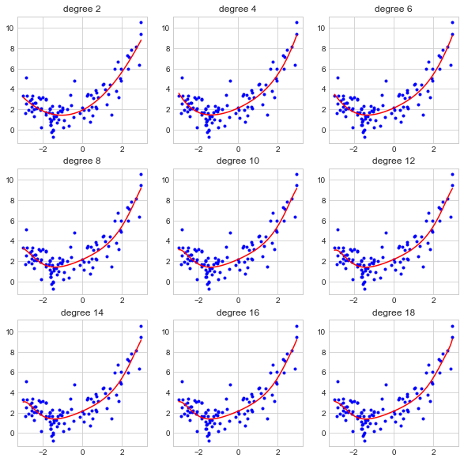
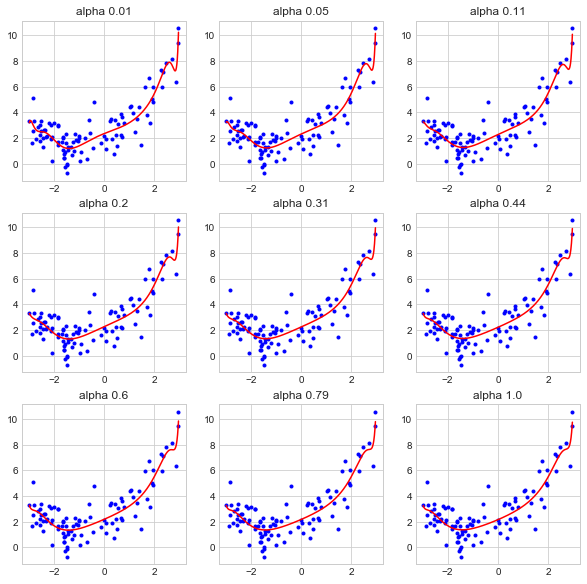
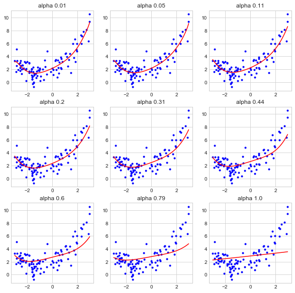
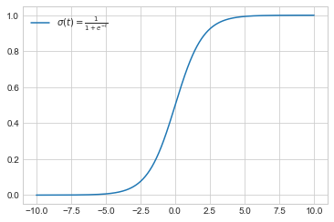
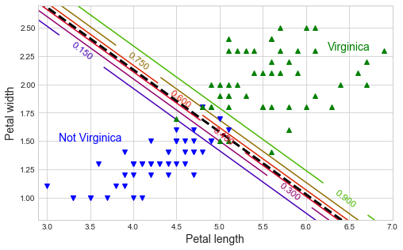

# Chapter 4. Training Models

In this chapter, we will work with a linear model and train it using the closed-form solution and several types of gradient descent.
Then, we will graduate to a polynomial and look for overfitting.


```python
import numpy as np
import pandas as pd
import matplotlib.pyplot as plt

np.random.seed(0)

plt.style.use('seaborn-whitegrid')
plt.rc('figure', figsize=(8, 5), facecolor='white')
```


```python
%matplotlib inline
```

## Linear regression

### The normal equation

There is a closed form solution for finding the line that minimizes the RMSE of data to a single response variable.


```python
X = 2 * np.random.rand(100, 1)
X[1:5]
```


    array([[1.43037873],
           [1.20552675],
           [1.08976637],
           [0.8473096 ]])


```python
y = 4 + 3 * X + np.random.randn(100, 1)
y[1:5]
```


    array([[9.19196269],
           [8.0822427 ],
           [5.73305541],
           [8.03018099]])


```python
plt.scatter(X, y, color='black')
plt.xlabel('X')
plt.ylabel('y')
plt.show()
```


We will first compute the exact minimization of RMSE (really, MSE) by solving the *Normal Equation*, below.

$$
\hat{\theta} = (\boldsymbol{\text{X}}^T \cdot \text{X})^{-1} \cdot \text{X}^T \cdot \text{y}
$$


```python
X_b = np.c_[np.ones((100, 1)), X]
theta_best = np.linalg.inv(X_b.T.dot(X_b)).dot(X_b.T).dot(y)
theta_best
```


    array([[4.22215108],
           [2.96846751]])


These values can be used for making predictions given new data points.


```python
X_new = np.array([[0], [2]])
X_new_b = np.c_[np.ones((2, 1)), X_new]
y_predict = X_new_b.dot(theta_best)
y_predict
```


    array([[ 4.22215108],
           [10.1590861 ]])


```python
plt.plot(X_new, y_predict, 'r-')
plt.plot(X, y, 'b.', alpha=0.7)
plt.show()
```


This, of course, can be more easily (and safely) done with Scikit-Learn.


```python
from sklearn.linear_model import LinearRegression

# Fit an Scikit-Learn linear regression model.
lin_reg = LinearRegression()
lin_reg.fit(X, y)

# The intercept of the fit model.
lin_reg.intercept_
```


    array([4.22215108])


```python
lin_reg.coef_
```


    array([[2.96846751]])


```python
# Make predictions for new data.
lin_reg.predict(X_new)
```


    array([[ 4.22215108],
           [10.1590861 ]])


### Gradient Descent

There are other ways to fit a linear model that are better suited for many features.

The main idea behind *gradient descent* is to tweak parameters towards minimizing some objective function.
An important parameter is the *learning rate* which determines the step size of the optimization.
Also, there may be local minima that trap the optimization.

It is generally good advice to have scaled features for gradient descent such that all dimensions are related in scale.

### Batch gradient descent

The find the best direction to move, the partial derivative must be found for each dimension.
This is done manually below, but of course it can be done quickly using the appropriate Scikit-Learn solver.
The equation for the partial derivative is below:

$$
\nabla_{\theta}\text{MSE}(\theta) =
\begin{pmatrix}
    {\frac{\partial}{\partial \theta_0}\text{MSE}(\theta)} \\
    {\frac{\partial}{\partial \theta_1}\text{MSE}(\theta)} \\
    {...} \\
    {\frac{\partial}{\partial \theta_n}\text{MSE}(\theta)} \\
    \end{pmatrix} =
\frac{2}{m}\text{X}^T \cdot (\text{X} \cdot \theta -\text{y})
$$


```python
eta = 0.1  # learning rate
n_iterations = 1000  # number of iterations of gradient descent
m = X.shape[0]  # number of data points

theta = np.random.randn(2, 1) # randomly initialize theta

for iteration in range(n_iterations):
    gradients = 2/m * X_b.T.dot(X_b.dot(theta) - y)
    theta = theta - eta * gradients
    
theta
```


    array([[4.22215108],
           [2.96846751]])


The see the effect of the learning rate, I built a function that plots the line generated at each step.


```python
def get_styling_details(current_iteration, max_iterations):
    """Get the styling details for the line plot depending on the iteration."""
    if current_iteration == 0:
        return ('r--', 1)
    elif current_iteration == max_iterations:
        return ('b-', 1.0)
    elif current_iteration < 10:
        return ('b--', 0.3)
    else:
        return ('k-', 0.0)


def plot_current_line(theta, current_iteration, max_iterations):
    """Plot the current line."""
    style, alpha = get_styling_details(current_iteration, max_iterations)
    y_predict = X_new_b.dot(theta)
    plt.plot(X_new, y_predict, style, alpha=alpha)


def plot_gradient_descent(theta, eta):
    """Perform gradient descent and plot the intermediates."""
    
    m = len(X_b)
    plt.plot(X, y, "b.")
    n_iterations = 1000
    
    for iteration in range(n_iterations):
        if iteration < 10 or iteration == n_iterations-1 :
            plot_current_line(theta, iteration, n_iterations-1)
        
        gradients = 2/m * X_b.T.dot(X_b.dot(theta) - y)
        theta = theta - eta * gradients
    
    plt.xlabel('$X$', fontsize=18)
    plt.axis([0, 2, 0, 15])
    plt.title(f'$\eta = {eta}$', fontsize=16)
```


```python
random_initial_theta = np.array([[0.1], [0.1]])
fig = plt.figure(figsize=(10, 4))
plt.subplot(1, 3, 1)
plot_gradient_descent(random_initial_theta, 0.01)
plt.subplot(1, 3, 2)
plot_gradient_descent(random_initial_theta, 0.1)
plt.subplot(1, 3, 3)
plot_gradient_descent(random_initial_theta, 0.5)
```


In practice, a good learning reate can be found with a grid search.
A limit on the number of iterations will ensure that the optimization converges at an acceptable rate.
The actual number of iterations for the model can be a relatively large number, but stop the optimization when a sufficiently good answer has been found.
That is, interrupt the algorithm when the gradient vector is smaller than a provided tolerance $\epsilon$.

### Stochastic gradient descent

Batch gradient descent uses every piece of the training data to optimize the model parameters.
On the other extreme, SGD uses a single, random data point in the training data at each step.
Therefore, it bounces around, and only moves towards the solution on average.
Due to this bouncing nature, it is unlikely that SGD will be as accurate as batch gradient descent.
It will me much faster, though, especially with a large data set.
This property of SGD also helps it bounce out of local minima.

Gradually reducing the learning rate can help with the bouncing problem.
This is called *simulated annealing*.
The function that controls the learning rate is called the *learning schedule*.

The code below implements a simple SGD algorithm.


```python
n_epochs = 50

# Hyperparamters for the learning schedule.
t0 = 5
t1 = 50

m = X.shape[0]  # number of data points

theta = np.array([[0.1], [0.1]])  # Iinital values for theta.

def learning_schedule(t):
    """A learncing schedule for SGD."""
    return t0 / (t + t1)

plt.plot(X, y, "b.")

plot_current_line(theta, 0, n_epochs)

for epoch  in range(1, n_epochs):
    for i in range(m):
        random_index = np.random.randint(m)
        xi = X_b[random_index:random_index+1]
        yi = y[random_index:random_index+1]
        gradients = 2 * xi.T.dot(xi.dot(theta) - yi)
        eta =  learning_schedule(epoch * m + 1)
        theta = theta - eta * gradients
    plot_current_line(theta, epoch, n_epochs)

plt.xlabel('$X$', fontsize=18)
plt.axis([0, 2, 0, 15])

# The final optimized solution.
theta
```


    array([[4.21493839],
           [2.957017  ]])


The equivalent can be done using the Scikit-Learn `SGDRegressor` class.


```python
from sklearn.linear_model import SGDRegressor

sgd_reg = SGDRegressor(max_iter=50, penalty=None, eta0=0.1)
sgd_reg.fit(X, y.ravel())

# Solutions.
sgd_reg.intercept_, sgd_reg.coef_
```


    (array([4.21182999]), array([2.9989967]))


### Mini-batch gradient descent

At each step, a random subsample of the data is used to compute the gradient.
It is therefore more erratic than batch gradient descent and less so than SGD.

Below, I plot the three gradient descent algorithms paths through parameter space to solve the sample linear regression in the chapter.


```python
def learning_schedule(t, t0=10, t1=50):
    """A learncing schedule for SGD."""
    return t0 / (t + t1)

def my_batch_gd(theta_0, epoch_number, eta = 0.1):
    """Calculate the next theta using batch gradient descent."""
    gradients = 2/m * X_b.T.dot(X_b.dot(theta_0) - y)
    theta = theta_0 - eta * gradients
    return theta


def my_stochastic_gd(theta_0, epoch_number):
    """Calculate the next theta using stochastic gradient descent."""
    theta = theta_0
    for i in range(X.shape[0]):
        random_index = np.random.randint(m)
        xi = X_b[random_index:random_index+1]
        yi = y[random_index:random_index+1]
        gradients = 2 * xi.T.dot(xi.dot(theta) - yi)
        eta = learning_schedule(epoch_number * m + 1)
        theta = theta - eta * gradients
    return theta


def my_minibatch_gd(theta_0, epoch_number, batch_size=5):
    """Calculate the next theta using minibatch gradient descent."""
    theta = theta_0
    m = X.shape[0]
    n_iters = round(m / batch_size)
    for i in range(n_iters):
        random_index = np.random.randint(m, size=batch_size)
        xi = X_b[random_index]
        yi = y[random_index]
        gradients = 2/m * X_b.T.dot(X_b.dot(theta) - y)
        eta = learning_schedule(epoch_number * m + 1)
        theta = theta - eta * gradients
    return theta
```


```python
# Initial values for theta.
initial_theta = np.array([[2.0], [2.0]])


def run_my_gradient_descent(descent_func, theta_i, n_iterations=100):
    """
    Return all of the intermediate theta values while running the
    specified gradient descent algorithm
    """
    thetas = initial_theta.copy()
    next_theta = initial_theta.copy()
    for iteration in range(n_iterations):
        next_theta = descent_func(next_theta, iteration)
        thetas = np.hstack([thetas, next_theta])

    thetas = thetas.T
    return thetas


# Batch GD
batch_thetas = run_my_gradient_descent(my_batch_gd, initial_theta)

# SGD
sgd_thetas = run_my_gradient_descent(my_stochastic_gd, initial_theta)

# Minibatch GD
minibatch_thetas = run_my_gradient_descent(my_minibatch_gd, initial_theta)

# Plot the results on the sample plot.
fig = plt.figure(figsize = (10, 7))
plt.plot(batch_thetas[:, 0], batch_thetas[:, 1],
         label='batch',
         linestyle='-', marker='o', color='blue', 
         alpha=0.5)
plt.plot(sgd_thetas[:, 0], sgd_thetas[:, 1],
         label='SGD',
         linestyle='-', marker='o', color='red', 
         alpha=0.5)
plt.plot(minibatch_thetas[:, 0], minibatch_thetas[:, 1],
         label='minibatch',
         linestyle='-', marker='o', color='green', 
         alpha=0.5)
plt.title('The paths of multiple gradient descent paths')
plt.legend(loc='best')
plt.xlabel(r'$\theta_0$')
plt.ylabel(r'$\theta_1$')
plt.show()
```


```python
fig = plt.figure(figsize = (8, 5))
plt.plot(batch_thetas[:, 0], batch_thetas[:, 1],
         label='batch',
         linestyle='-', marker='o', color='blue', 
         alpha=0.5)
plt.plot(sgd_thetas[:, 0], sgd_thetas[:, 1],
         label='SGD',
         linestyle='-', marker='o', color='red', 
         alpha=0.5)
plt.plot(minibatch_thetas[:, 0], minibatch_thetas[:, 1],
         label='minibatch',
         linestyle='-', marker='o', color='green', 
         alpha=0.5)
plt.axis([2.5, 4.5, 2, 4])
plt.title('Zoomed in on the gradient descent paths')
plt.xlabel(r'$\theta_0$')
plt.ylabel(r'$\theta_1$')
plt.legend(loc='best')
plt.show()
```


```python
colors = ['b', 'g', 'r', 'c', 'm']

    
fig = plt.figure(figsize=(8, 5))
for i in range(5):
    thetas = run_my_gradient_descent(my_stochastic_gd, initial_theta)
    plt.plot(thetas[:, 0], thetas[:, 1], color=colors[i], alpha = 0.5)

plt.title('The paths of multiple SGDs')
plt.xlabel(r'$\theta_0$')
plt.ylabel(r'$\theta_1$')
plt.axis([2.5, 5.5, 2, 4])
plt.show()
```


## Polynomial regression

It is possible to fit nonlinear data with a linear model by adding powers of each feature as new features.
This is polynomial regression.
An example is below.


```python
m = 100
X = 6 * np.random.rand(m, 1) - 3
y = 0.5 * X**2 + X + 2 + np.random.randn(m, 1)
```


```python
plt.figure(figsize=(8, 5))
plt.plot(X, y, 'b.')
plt.xlabel(r'$X$')
plt.ylabel(r'$y$')
plt.show()
```


Here is the result of trying to fit a linear model to this nonlinear data.


```python
# Fit a linear model.
lin_reg = LinearRegression()
lin_reg.fit(X, y)

# Results.
lin_reg.coef_, lin_reg.intercept_
```


    (array([[0.81860005]]), array([3.25226041]))


```python
X_range = np.array([np.min(X), np.max(X)]).reshape((2, 1))
y_predict_range = lin_reg.predict(X_range)

plt.figure(figsize=(8, 5))
plt.plot(X, y, 'b.')
plt.plot(X_range, y_predict_range, 'r-')
plt.xlabel(r'$X$')
plt.ylabel(r'$y$')
plt.show()
```


Instead, a polynomial regression fits much better.
The `PolynomialFeatures` class can add in the new squared features for each existing feature.


```python
from sklearn.preprocessing import PolynomialFeatures
poly_features = PolynomialFeatures(degree=2, include_bias=False)
X_poly = poly_features.fit_transform(X)

X[0]
```


    array([-2.85578399])


```python
X_poly[0]
```


    array([-2.85578399,  8.1555022 ])


```python
# Fit a linear model.
lin_reg = LinearRegression()
lin_reg.fit(X_poly, y)

# Results.
lin_reg.intercept_, lin_reg.coef_
```


    (array([1.88737162]), array([[0.96860865, 0.47143241]]))


```python
n_points = 1000
X_new = np.linspace(np.min(X), np.max(X), n_points).reshape((n_points, 1))
X_new = poly_features.transform(X_new)
y_predict = lin_reg.predict(X_new)

plt.figure(figsize=(8, 5))
plt.plot(X, y, 'b.')
plt.plot(X_new[:, 0], y_predict, 'r-')
plt.xlabel(r'$X$')
plt.ylabel(r'$y$')
plt.show()
```


### Learning curves

It is easy to overfit a polynomial regression.
Below are the results of continuously increasing the degree of the model.


```python
from sklearn.pipeline import Pipeline

def plot_linear_model_line(lm):
    j = 1000
    x_input = np.linspace(np.min(X), np.max(X), j).reshape((j, 1))
    predicted_y = lm.predict(x_input)
    
    plt.plot(X, y, 'b.')
    plt.plot(x_input, predicted_y, 'r-')

    
def fit_polynomial_regression_to_X(deg=1):
    pipeline = Pipeline((
        ('polynomial_features', PolynomialFeatures(degree=deg, include_bias=False)),
        ('linear_model', LinearRegression())
    ))
    
    pipeline.fit(X, y)
    
    plot_linear_model_line(pipeline)
    plt.title(f'degree {deg}')

    

fig = plt.figure(figsize=(10, 10))
for i in range(1, 10):
    plt.subplot(3, 3, i)
    fit_polynomial_regression_to_X(i * 3)

plt.show()
```


One way of telling if the model is under- or overfitting is to use CV.
Another way is to look at the *learning curves*, the plot of the models performance on the training set and validation set as a function of the training set size.
The plots are generated by repeatedly training the model on differently-sized subsets of the training data.


```python
from sklearn.metrics import mean_squared_error
from sklearn.model_selection import train_test_split    

def plot_learning_curve(model, X, y, subsample_iters=1):
    """Plot the learning curve of a model on training data X and labels y."""
    
    # Split the data into testing and validation.
    X_train, X_val, y_train, y_val = train_test_split(X, y, test_size=0.2)
    
    # Empty lists to track progress.
    train_errors, val_errors = [], []
    
    # For each subsample from 1 to all of the training data, run
    # `subsample_iters` iterations and take the average for the subsample size.
    for m in range(1, len(X_train)):
        train_errors_iter, val_errors_iter = [], []
        for j in range(subsample_iters):
            # Random subsample of size `m`.
            idx = np.random.randint(1, len(X_train), m)
            
            # Fit and predict with model.
            model.fit(X_train[idx], y_train[idx])
            y_train_predict = model.predict(X_train[idx])
            y_val_predict = model.predict(X_val)

            # Get error values.
            train_errors_iter.append(mean_squared_error(y_train_predict, y_train[idx]))
            val_errors_iter.append(mean_squared_error(y_val_predict, y_val))
        
        # Append the averaged values.
        train_errors.append(np.mean(train_errors_iter))
        val_errors.append(np.mean(val_errors_iter))
        
    # Plot the curves.
    plt.plot(np.sqrt(train_errors), 'r-', linewidth=2, label='train')
    plt.plot(np.sqrt(val_errors), 'b-', linewidth=2, label='val')
    plt.legend(loc='best')
    plt.xlim(0, len(X_train))
```

This first plot is for a standard linear model.


```python
lin_reg = LinearRegression()
plot_learning_curve(lin_reg, X, y, subsample_iters=25)
plt.ylim(0, 10)
plt.show()
```


The next plot is when a polynomial model with a degree of 2 is used.


```python
polynomial_reg_pipeline = Pipeline((
    ('poly_features', PolynomialFeatures(degree=2, include_bias=False)),
    ('sgd_reg', LinearRegression())
))
plot_learning_curve(polynomial_reg_pipeline, X, y, subsample_iters=25)
plt.ylim(0, 5)
plt.show()
```


An explanation of what the plot shows:

- For the red training line, it begins at 0 because with a few data points, the model can fit them perfectly. However, when trained with more data, the model makes more and more mistakes until it plateaus.
- The blue validation line shows that the model makes a lot of errors early on, but it eventually gets better at predicting the value for new data with increased training.

The following is an example of a learning curve of a model that is overfit.
The blue line, the learning rate on the validation data, shows that the model makes a lot of errors.


```python
polynomial_reg_pipeline = Pipeline((
    ('poly_features', PolynomialFeatures(degree=10, include_bias=False)),
    ('sgd_reg', LinearRegression())
))
plot_learning_curve(polynomial_reg_pipeline, X, y, subsample_iters=25)
plt.ylim(0, 50)
plt.show()
```


## Regularized linear models

Models can be regularized (i.e. constrained) to fight over-fitting.
For a linear model, the common regularization techniques are Ridge, LASSO, and Elastic Net Regression.

### Ridge regression

Ridge regression introduces a regularization term to the cost function:

$$
\alpha \sum^{n}_{i=1} \theta_i^2
$$

This keeps the weights as small as possible during training.
The hyperparameter $\alpha$ controls how strongly the model is regularized.
The cost function in full is below.

$$
J(\theta) = MSE(\theta) + \alpha \sum^{n}_{i=1} \theta_i^2
$$

Note that the bias term $\theta_0$ is not regularized.

The plots below show the results of regularizing increasingly higher-dimensional models.


```python
from sklearn.linear_model import Ridge
from sklearn.preprocessing import StandardScaler

fig = plt.figure(figsize=(10, 10))

for i in range(1, 10):

    ridge_pipeline = Pipeline((
        ('poly_features', PolynomialFeatures(degree=i*2, include_bias=False)),
        ('scale_features', StandardScaler()),
        ('ridge_regression', Ridge(alpha=1))
    ))

    ridge_pipeline.fit(X, y)
    plt.subplot(3, 3, i)
    plot_linear_model_line(ridge_pipeline)
    plt.title(f'degree {i*2}')
```





The plots below shows the effects of increasing the $\alpha$ parameter of the Ridge Regression.


```python
fig = plt.figure(figsize=(10, 10))

for i in range(1, 10):

    alpha = (i / 9) ** 2
    
    ridge_pipeline = Pipeline((
        ('poly_features', PolynomialFeatures(degree=30, include_bias=False)),
        ('scale_features', StandardScaler()),
        ('ridge_regression', Ridge(alpha=alpha))
    ))

    ridge_pipeline.fit(X, y)
    plt.subplot(3, 3, i)
    plot_linear_model_line(ridge_pipeline)
    plt.title(f'alpha {round(alpha, 2)}')
```





### LASSO regression

*Least Absolute Shrinkage and Selection Operator* (LASSO) regression is similar to Ridge regression just with a slightly different cost function.

$$
\alpha \sum^{n}_{i=1} |\theta_i|
$$

This tends to push all but the most important features to 0.


```python
from sklearn.linear_model import Lasso

fig = plt.figure(figsize=(10, 10))

for i in range(1, 10):

    alpha = (i / 9) ** 2
    
    lasso_pipeline = Pipeline((
        ('poly_features', PolynomialFeatures(degree=30, include_bias=False)),
        ('scale_features', StandardScaler()),
        ('ridge_regression', Lasso(alpha=alpha))
    ))

    lasso_pipeline.fit(X, y)
    plt.subplot(3, 3, i)
    plot_linear_model_line(lasso_pipeline)
    plt.title(f'alpha {round(alpha, 2)}')
```





Even with a small $\alpha=0.05$, most of the parameters are 0 when using LASSO.


```python
lasso_pipeline = Pipeline((
        ('poly_features', PolynomialFeatures(degree=30, include_bias=False)),
        ('scale_features', StandardScaler()),
        ('lasso_regression', Lasso(alpha=0.05))
    ))
lasso_pipeline.fit(X, y)
lasso_pipeline.named_steps['lasso_regression'].coef_
```


    array([1.4957944 , 0.60755075, 0.        , 0.54169388, 0.        ,
           0.        , 0.        , 0.        , 0.        , 0.        ,
           0.        , 0.        , 0.        , 0.        , 0.        ,
           0.        , 0.        , 0.        , 0.        , 0.        ,
           0.        , 0.        , 0.        , 0.        , 0.        ,
           0.        , 0.        , 0.        , 0.03807433, 0.        ])


### Elastic net regression

Elastic net acts as a middle ground between Ridge and LASSO regression techniques - the cost function is just a mixture of the two.
The contribution of each cost to the mixture is controlled by $r$.

$$
r \alpha \sum^{n}_{i=1} \theta_i^2 + \frac{1-r}{2} \alpha \sum^{n}_{i=1} |\theta_i|
$$

Below are some heuristics to use when choosing a regression technique:

- Ridge regression is a good default or first try.
- LASSO and Elastic Net regression should be used when only a few features are expected to be important.
- Elastic Net is often preferred over LASSO because LASSO can behave erratically when there are more features than training data points or when features are highly correlated.


```python
from sklearn.linear_model import ElasticNet

elastic_pipeline = Pipeline((
        ('poly_features', PolynomialFeatures(degree=30, include_bias=False)),
        ('scale_features', StandardScaler()),
        ('elastic_net_regression', ElasticNet(alpha=0.05))
    ))
elastic_pipeline.fit(X, y)
elastic_pipeline.named_steps['elastic_net_regression'].coef_
```


    array([ 1.38698336,  0.58539803,  0.11115826,  0.58128286,  0.        ,
            0.        ,  0.        ,  0.        ,  0.        ,  0.        ,
            0.        , -0.        ,  0.        , -0.        ,  0.        ,
           -0.        ,  0.        , -0.        ,  0.        , -0.        ,
            0.        , -0.        ,  0.        , -0.        ,  0.        ,
            0.        ,  0.        ,  0.        ,  0.03825657,  0.        ])


## Early stopping

Early stopping is another way to avoid overfitting. 
The goal is to stop the gradient descent algorithm at the minimum of the RMSE on the validation set.

Below is an example of RMSE curves for the training and validation set using batch gradient descent to fit a high-dimensional model.


```python
from sklearn.base import clone
import warnings
from sklearn.exceptions import ConvergenceWarning

warnings.filterwarnings(action='ignore', category=ConvergenceWarning)

poly_features = PolynomialFeatures(degree=4, include_bias=False)
standard_scalar = StandardScaler()
X_poly = poly_features.fit_transform(X)
X_poly = standard_scalar.fit_transform(X_poly)

X_train, X_val, y_train, y_val = train_test_split(X_poly, y, test_size = 0.25)

y_train = np.ravel(y_train)
y_val = np.ravel(y_val)

sgd_reg = SGDRegressor(max_iter=1, 
                       warm_start=True, 
                       penalty='elasticnet', 
                       learning_rate='constant', 
                       eta0=0.00005,
                       random_state=0)

minimum_val_error = float('inf')
best_epoch, best_model = None, None

train_rmse, val_rmse = [], []

for epoch in range(1000):
    sgd_reg.fit(X_train, y_train)
    
    y_val_predict = sgd_reg.predict(X_val)
    
    val_error = mean_squared_error(y_val_predict, y_val)
    train_error = mean_squared_error(sgd_reg.predict(X_train), y_train)
    
    if val_error < minimum_val_error:
        minimum_val_error = val_error
        best_epoch = epoch
        best_model = clone(sgd_reg)
        
    train_rmse.append(np.sqrt(train_error))
    val_rmse.append(np.sqrt(val_error))

    
plt.plot(val_rmse, 'b-', label='validation set')
plt.plot(train_rmse, 'r-', label='training set')
plt.legend(loc='best')
```


    <matplotlib.legend.Legend at 0x1a27d96650>


**Note:** The `SGDRegressor` object has specific parameters to be used for early stopping including `early_stopping : bool, default=False`, `validation_fraction : float, default=0.1`, `n_iter_no_change : int, default=5`.
An example is shown below of the difference in results.


```python
sgd_reg = SGDRegressor(penalty='elasticnet',
                       random_state=0)
sgd_reg.fit(X_train, y_train)
sgd_reg.coef_
```


    array([1.01748795, 0.56388556, 0.51345671, 0.64477603])


```python
np.sqrt(mean_squared_error(sgd_reg.predict(X_val), y_val))
```


    1.0768388057416511


```python
sgd_reg_earlystop = SGDRegressor(penalty='elasticnet',
                                 random_state=0,
                                 early_stopping=True)
sgd_reg_earlystop.fit(X_train, y_train)
sgd_reg_earlystop.coef_
```


    array([1.05205577, 0.71688349, 0.59886601, 0.63099206])


```python
np.sqrt(mean_squared_error(sgd_reg_earlystop.predict(X_val), y_val))
```


    1.0531010189447443


## Logistic regression

Logistic regression is often used to estimate the probability that an instance belongs to a particular class.
Often, 0.50 is used as the cut-off, making it a binary classifier.

### Estimating probabilities

Logistic regression computes a weighted sum of the input features, but returns the logistic (a.k.a *logit*, $\sigma(\cdot)$) of the result.
This is a sigmoid function that returns a value between 0 and 1 (inclusive).
It is defined as:

$$
\sigma(t) = \frac{1}{1 + e^{-t}}
$$


```python
from math import exp

a = np.linspace(-10, 10, 1000)
logit_fxn = lambda t: 1/ (1 + exp(-t))
b = [logit_fxn(i) for i in a]
plt.plot(a, b, label=r'$\sigma(t) = \frac{1}{1 + e^{-t}}$')
plt.plot()
plt.legend(loc='best')
plt.show()
```





The model for the logistic regression is below:

$$
\hat{p} = h_{\theta}(x) = \sigma(\theta^T \cdot x)
$$

Note that the parameter vector $\theta$ is negative if the logistic model predicts 0 and positive if it predicts 1.

### Training and cost function

The objective of training is to set the parameter vector $\theta$ to estimate high probabilities for positive instances (1) and low probabilities for negative instances (0).
Below is the cost function for a single training instance.

$$
c(\theta) = \begin{cases}
    -log(\hat{p}) & \text{if } y = 1 \\
    -log(1-\hat{p}) & \text{if } y = 0
  \end{cases}
$$

The cost function over the whole training set is the average cost over all of the training instances.
It can be expressed as an equation (not shown here) called the *log loss*.
There is no known closed-form solution to compute $\theta$ to minimize the log loss.
However, it is convex, thus gradient descent can find the minimum given sufficient time and learning rate.

### Decision boundaries

The following example builds a classifier to detect the *Virginica* species in the classic Iris dataset from just the petal width feature.


```python
from sklearn import datasets

iris = datasets.load_iris()
list(iris.keys())
```


    ['data', 'target', 'target_names', 'DESCR', 'feature_names', 'filename']


```python
iris.feature_names
```


    ['sepal length (cm)',
     'sepal width (cm)',
     'petal length (cm)',
     'petal width (cm)']


```python
X = iris.data[:, 3:]  # just the petal width
y = (iris.target == 2).astype(np.int)  # 1 for Virginica
```


```python
from sklearn.linear_model import LogisticRegression

log_reg = LogisticRegression(solver='lbfgs')
log_reg.fit(X, y)
```


    LogisticRegression(C=1.0, class_weight=None, dual=False, fit_intercept=True,
                       intercept_scaling=1, l1_ratio=None, max_iter=100,
                       multi_class='warn', n_jobs=None, penalty='l2',
                       random_state=None, solver='lbfgs', tol=0.0001, verbose=0,
                       warm_start=False)


The following plot shows the estimated probabilities for flowers with widths between 0 and 3 cm.


```python
res = 1000

fig = plt.figure(figsize=(8, 5))

X_space = np.linspace(0, 3, res).reshape(-1, 1)
y_space_prob = log_reg.predict_proba(X_space)

plt.plot(X_space, y_space_prob[:, 1], 'g-', label='Virginica')
plt.plot(X_space, y_space_prob[:, 0], 'b-', label='not Virginica')

decision_boundary_idx = np.argmin(np.abs(y_space_prob[:, 1] - 0.5))
decision_boundary_val = X_space[decision_boundary_idx]
decision_boundary_x = np.ones(res) * decision_boundary_val
decision_boundary_y = np.linspace(0, 1, res)
plt.plot(decision_boundary_x, 
         decision_boundary_y, 
         'k--',
         label='decision boundary')


def get_y_with_noise(x, avg_y):
    return np.ones(len(x)) * avg_y # + np.random.randn(len(x))/20

virginica_pts_x = X[y == 1]
virginica_pts_y = get_y_with_noise(virginica_pts_x, 0.95)
not_virginica_pts_x = X[y != 1]
not_virginica_pts_y = get_y_with_noise(not_virginica_pts_x, 0.05)
plt.plot(virginica_pts_x, virginica_pts_y, 
         'g', linestyle='None', marker='^', alpha=0.15,
         label='Virginica values')
plt.plot(not_virginica_pts_x, not_virginica_pts_y,
         'b', linestyle='None', marker='v', alpha=0.15,
         label='not Virginica values')


plt.legend(loc='best')
plt.xlabel('Petal width (cm)')
plt.ylabel('Estimated probability')
plt.axis([0, 3, 0, 1])
plt.show()
```


The `predict_proba()` method of the logistic regression object returns the estimated probability that the input is  not *Virginica* and that it is *Virginica*.
The `predict()` method returns 0 or 1 if the probability is below or above 0.5.
The point at which the probability switches from below 0.5 to above 0.5 is the decision boundary.
In this case, the decision boundary is around 1.6 cm.


```python
log_reg.predict_proba([[1.5], [1.7]])
```


    array([[0.66709636, 0.33290364],
           [0.45722097, 0.54277903]])


```python
log_reg.predict([[1.5], [1.7]])
```


    array([0, 1])


Of course, logistic regression can take multiple feature inputs.
Below is an example using the petal width and length.


```python
X = iris.data[:, [2, 3]]

log_reg = LogisticRegression(penalty='none', solver='lbfgs')
log_reg.fit(X, y)
```


    LogisticRegression(C=1.0, class_weight=None, dual=False, fit_intercept=True,
                       intercept_scaling=1, l1_ratio=None, max_iter=100,
                       multi_class='warn', n_jobs=None, penalty='none',
                       random_state=None, solver='lbfgs', tol=0.0001, verbose=0,
                       warm_start=False)


```python
x0, x1 = np.meshgrid(
    np.linspace(2.9, 7, 500).reshape(-1, 1),
    np.linspace(0.8, 2.7, 200).reshape(-1, 1),
)
X_new = np.c_[x0.ravel(), x1.ravel()]

y_proba = log_reg.predict_proba(X_new)

plt.figure(figsize=(8, 5))
plt.plot(X[y == 0, 0], X[y == 0, 1], "bv")
plt.plot(X[y == 1, 0], X[y == 1, 1], "g^")

zz = y_proba[:, 1].reshape(x0.shape)
contour = plt.contour(x0, x1, zz, cmap=plt.cm.brg)


left_right = np.array([2.9, 7])
boundary = -(log_reg.coef_[0][0] * left_right + log_reg.intercept_[0]) / log_reg.coef_[0][1]

plt.clabel(contour, inline=1, fontsize=12)
plt.plot(left_right, boundary, "k--", linewidth=3)
plt.text(3.5, 1.5, "Not Virginica", fontsize=14, color="b", ha="center")
plt.text(6.5, 2.3, "Virginica", fontsize=14, color="g", ha="center")
plt.xlabel("Petal length", fontsize=14)
plt.ylabel("Petal width", fontsize=14)
plt.axis([2.9, 7, 0.8, 2.7])
plt.show()
```





## Softmax regression

The logistic regression model can be generalized to support multiple classes without having to train and combine multiple binary classifiers.
This is call *Softmax Regression* or *Multinomial Logistic Regression*.
Given an instance $\mathbf{x}$, the model computes a score $s_k(\mathbf{x})$ for each class $k$.

$$
s_k(x) = \theta_k^T \cdot \mathbf{x}
$$

The the model estimates the probability of each class by applying the *softmax function* (a.k.a the normalized exponential) to the scores.
The probability $\hat{p}_k$ that the instance belongs to class $k$ (of $K$ classes total) is calculated using the following equation.

$$
\hat{p}_k = \sigma(\mathbf{s}(\mathbf{x}))_k = \frac{e^{s_k(\mathbf{x})}}{\sum_{j=1}^{K}{e^{s_j(\mathbf{x})}}}
$$

This model can be trained by minimizing the *cross entropy* cost function (below) which penalizes the  model when it estimates a low probability for a target class.

$$
J(\Theta) = -\frac{1}{m} \sum_{i=1}^{m} \sum_{k=1}^{K} y_k^{(i)} \; \text{log}(\hat{p}_k^{(i)})
$$

For the equation above, $y_k^{(i)}$ is equal to 1 if the target class for the $i^{\text{th}}$ instance is $k$ and 0 otherwise.
Note that when there are only two classes, $K=2$, this cost function is equivalent to the logistic regression's cost function.

The gradient for the cost function is below.

$$
\nabla_{\theta_k} J(\Theta) = \frac{1}{m} \sum_{i=1}^{m} (\hat{p}_k^{(i)} - y_k^{(i)}) \mathbf{x}^{(i)}
$$

With this equation, the gradient vector for each class can be computed and Gradient Descent can be used to find the paramter matrix $\Theta$ that minimizes the cost function.

The following code uses Softmax Regression to classify the iris flowers into all three classes.
The `LogisticRegression` class using one-versus-all (OvA) by default, though the `multi_class` parameter can be assigned `'multinomial'` to use softmax.


```python
X = iris.data[:, [2, 3]]
y = iris.target

softmax_reg = LogisticRegression(multi_class='multinomial',
                                 solver='lbfgs',
                                random_state=0)
softmax_reg.fit(X, y)
```


    LogisticRegression(C=1.0, class_weight=None, dual=False, fit_intercept=True,
                       intercept_scaling=1, l1_ratio=None, max_iter=100,
                       multi_class='multinomial', n_jobs=None, penalty='l2',
                       random_state=0, solver='lbfgs', tol=0.0001, verbose=0,
                       warm_start=False)


```python
softmax_reg.predict([[5, 2]])
```


    array([2])


```python
softmax_reg.predict_proba([[5, 2]])
```


    array([[2.43559894e-04, 2.14859516e-01, 7.84896924e-01]])


The following plot shows each data point plotted on the feature space and colored by its known label.
The contour plot indicates the division of the feature space by the Softmax Logistic Regression model.


```python
fig = plt.figure(figsize=(8, 5))

axes = [0.8, 7, 0, 3.5]

def get_iris_X(feat_int, x=0):
    idx = (y == feat_int)
    return X[:, x][idx]

iris_pal = ['y', 'b', 'g']
iris_markers = ['o', 's', '^']

for i in range(3):
    plt.plot(get_iris_X(i, 0), 
             get_iris_X(i, 1),
             color=iris_pal[i],
             linestyle='none',
             marker=iris_markers[i],
             label=iris.target_names[i])

x0, x1 = np.meshgrid(np.linspace(axes[0], axes[1], 500).reshape(-1, 1),
                     np.linspace(axes[2], axes[3], 500).reshape(-1, 1))
X_new = np.c_[x0.ravel(), x1.ravel()]

zz = softmax_reg.predict(X_new).reshape(x0.shape)

from matplotlib.colors import ListedColormap
custom_cmap = ListedColormap(['#fafab0','#9898ff','#a0faa0'])

plt.contourf(x0, x1, zz, cmap=custom_cmap)

plt.xlabel('Petal length')
plt.ylabel('Petal width')
plt.legend(loc='upper left')
plt.axis(axes)
plt.show()
```


