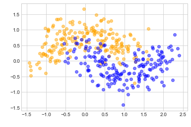
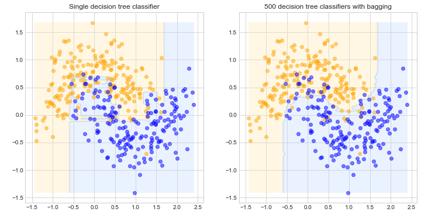
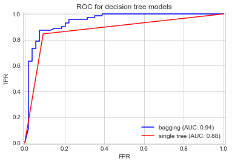
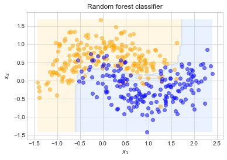
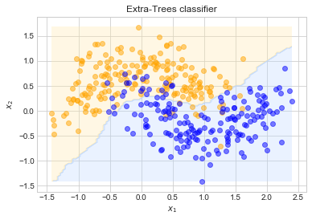
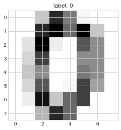
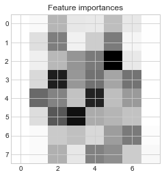

# Chapter 7. Ensemble Learning and Random Forests

Aggregating the predictions from multiple predictors is often better than an individual predictor ("wisdom of the crowd").
These are called *ensemble methods*.
It is common to use an ensemble method towards the end of a project after a few good individual classifiers have been found.

This chapter discusses **bagging**, **boosting**, **stacking**, and **Random Forests**.


```python
import numpy as np
import pandas as pd 
import matplotlib.pyplot as plt

np.random.seed(0)

plt.style.use('seaborn-whitegrid')
```


```python
%matplotlib inline
```


```python
%load_ext ipycache
```

    The ipycache extension is already loaded. To reload it, use:
      %reload_ext ipycache


## Voting classifiers

The idea behind the power of ensemble method can be explained by thinking about a slightly biased coin. 
If the coin has a 51% chance of being heads, this won't be noticeable with a few coin flips, though, after thousands, the ratio of heads to tails will be distinct.
This applies similarly to an ensemble of weak classifiers.
However, one caveat is that the ensemble of weak classifiers are unlikely to be perfectly independent from each other as they are trained on the same data.
Therefore, the strongest ensemble methods use multiple model types that use various training methodologies to create a diverse and more independent group of models.

The following example shows the use of logisitic regression, a random forest classifier, and a SVM in a simple ensemble.


```python
from sklearn.linear_model import LogisticRegression
from sklearn.svm import SVC
from sklearn.ensemble import RandomForestClassifier
from sklearn.ensemble import VotingClassifier
from sklearn.datasets import make_moons
from sklearn.model_selection import train_test_split
from sklearn.metrics import accuracy_score

# Individual classifiers.
log_clf = LogisticRegression()
rnd_clf = RandomForestClassifier(max_depth=3)
svm_clf = SVC(probability=True)

# Hard voting classifier ensemble.
voting_clf_hard = VotingClassifier(
    estimators=[('lr', log_clf), ('rf', rnd_clf), ('svc', svm_clf)],
    voting='hard'
)

# Soft voting classifier ensemble.
voting_clf_soft = VotingClassifier(
    estimators=[('lr', log_clf), ('rf', rnd_clf), ('svc', svm_clf)],
    voting='soft'
)

# Make moon data.
X, y = make_moons(n_samples=10000, noise=0.4, random_state=0)
X_train, X_test, y_train, y_test = train_test_split(X, y, random_state=0)

# Train and test each model.
for clf in (log_clf, rnd_clf, svm_clf, voting_clf_hard ,voting_clf_soft):
    clf.fit(X_train, y_train)
    y_pred = clf.predict(X_test)
    print(f'{clf.__class__.__name__}: {accuracy_score(y_test, y_pred)}')
```

    LogisticRegression: 0.8332
    RandomForestClassifier: 0.8628
    SVC: 0.8692
    VotingClassifier: 0.8632
    VotingClassifier: 0.8632


If all of the models have a `predict_proba()` method, then the `VotingVlassifier` can use "soft" voting to weight each prediction by the certainty of the model (by just predicting the class with the highest average probability).
This often produces better results than "hard" voting which predicts the most frequently predicted class over all of the models.

## Bagging and pasting

Another way to get a diverse group of models is to train the same algorithm with different random samples of the data.
*Bagging* (short for "bootstrap aggregating") and *pasting* are two such methods, where sampling is conducted with and without replacement.
The aggregation process is usually the statistical mode (the most frequent prediction) for classification and the mean for regression.

### Bagging and pasting in scikit-Learn

Scikit-Learn offers the [`BaggingClassifier`](https://scikit-learn.org/stable/modules/generated/sklearn.ensemble.BaggingClassifier.html) and [`BaggingRegressor`](https://scikit-learn.org/stable/modules/generated/sklearn.ensemble.BaggingRegressor.html) classes.
The following example trains 500 decision tree classifiers on 100 boostrapped instances of the training data.
Pasting can be accomplished by setting `bootstrap=False`.


```python
from sklearn.ensemble import BaggingClassifier
from sklearn.tree import DecisionTreeClassifier
from sklearn.datasets import make_moons
from sklearn.model_selection import train_test_split

X, y = make_moons(500, noise=0.3, random_state=0)
X_train, X_test, y_train, y_test = train_test_split(X, y, random_state=0)

plt.scatter(X_train[:, 0][y_train==0], 
            X_train[:, 1][y_train==0], 
            color='orange', 
            alpha=0.5)
plt.scatter(X_train[:, 0][y_train==1], 
            X_train[:, 1][y_train==1], 
            color='blue', 
            alpha=0.5)
plt.xlabel('$x_1$')
plt.ylabel('$x_2$')
plt.show()
```





```python
bag_clf = BaggingClassifier(
    DecisionTreeClassifier(),
    n_estimators=500,
    max_samples=100,
    bootstrap=True,
    n_jobs=-100
)
bag_clf.fit(X_train, y_train)
```


    BaggingClassifier(base_estimator=DecisionTreeClassifier(ccp_alpha=0.0,
                                                            class_weight=None,
                                                            criterion='gini',
                                                            max_depth=None,
                                                            max_features=None,
                                                            max_leaf_nodes=None,
                                                            min_impurity_decrease=0.0,
                                                            min_impurity_split=None,
                                                            min_samples_leaf=1,
                                                            min_samples_split=2,
                                                            min_weight_fraction_leaf=0.0,
                                                            presort='deprecated',
                                                            random_state=None,
                                                            splitter='best'),
                      bootstrap=True, bootstrap_features=False, max_features=1.0,
                      max_samples=100, n_estimators=500, n_jobs=-100,
                      oob_score=False, random_state=None, verbose=0,
                      warm_start=False)


```python
from matplotlib.colors import ListedColormap

def plot_tree_classifier(clf, X, y):
    """Plot a colormap of the decisions for a classifier."""
    
    axes = [
        min(X[:, 0]), max(X[:, 0]),
        min(X[:, 1]), max(X[:, 1]),
    ]
    
    # Create a mesh to predict over.
    x1s = np.linspace(axes[0], axes[1], 100)
    x2s = np.linspace(axes[2], axes[3], 100)
    x1, x2 = np.meshgrid(x1s, x2s)
    X_new = np.c_[x1.ravel(), x2.ravel()]
    y_pred = clf.predict(X_new).reshape(x1.shape)
    
    # Plot the contour of the predictions.
    custom_cmap = ListedColormap(['#ffe7a6', '#bad6ff'])
    plt.contourf(x1, x2, y_pred, alpha=0.3, cmap=custom_cmap)
    
    
    plt.scatter(X[:, 0][y==0], X[:, 1][y==0], color='orange', alpha=0.5)
    plt.scatter(X[:, 0][y==1], X[:, 1][y==1], color='blue', alpha=0.5)
    
    plt.xlabel('$x_1$')
    plt.ylabel('$x_2$')  
```


```python

single_tree = DecisionTreeClassifier()
single_tree.fit(X_train, y_train)

fig = plt.figure(figsize=(12, 6))
plt.subplot(1, 2, 1)
plot_tree_classifier(single_tree, X_train, y_train)
plt.title("Single decision tree classifier")

plt.subplot(1, 2, 2)
plot_tree_classifier(bag_clf, X_train, y_train)
plt.title("500 decision tree classifiers with bagging")

plt.show()
```





```python
# Accuracy of single tree on test data.
accuracy_score(y_test, single_tree.predict(X_test))
```


    0.872


```python
# Accuracy of bagging classifier on test data.
accuracy_score(y_test, bag_clf.predict(X_test))
```


    0.88


```python
from sklearn.metrics import roc_curve, auc

def get_auc_data(clf, x_test, y_test):
    y_score = clf.predict_proba(x_test)[:, 1]
    fpr, tpr, _ = roc_curve(y_test, y_score)
    roc_auc = auc(fpr, tpr)
    return fpr, tpr, roc_auc


fpr, tpr, auc_bag = get_auc_data(bag_clf, X_test, y_test)
plt.plot(fpr, tpr, 'b-', 
         label=f'bagging (AUC: {np.round(auc_bag, 2)})')

fpr, tpr, auc_single = get_auc_data(single_tree, X_test, y_test)
plt.plot(fpr, tpr, 'r-', 
         label=f'single tree (AUC: {np.round(auc_single, 2)})')

plt.xlabel('FPR')
plt.ylabel('TPR')
plt.title('ROC for decision tree models')
plt.legend(loc='lower right')
plt.axis([-0.01, 1.01, -0.01, 1.01])
plt.show()
```





### Out-of-bag evaluation

During the sampling procedure for each model in a bagging classifier/regressor, it is likely that a large fraction of the training instances will not be used.
These are called *out-of-bag* (oob) instances and can be used to validate each model in the ensemble.
The ensemble itself can be evaluated by averaging out each oob prediction.
This oob score should be close to the accuracy of the model on the test set.

This can be automatically accomplished in Scikit-Learn by setting `oob_score=True`.
The value is stored in `clf.oob_score_`.


```python
bag_clf = BaggingClassifier(
    DecisionTreeClassifier(),
    n_estimators=500,
    max_samples=100,
    bootstrap=True,
    n_jobs=-100,
    oob_score=True
)
bag_clf.fit(X_train, y_train)

bag_accuracy = accuracy_score(y_test, bag_clf.predict(X_test))
print(
f'''
bagging oob score: {np.round(bag_clf.oob_score_, 4)}
accuracy on test data: {np.round(bag_accuracy, 4)}
''')
```

    
    bagging oob score: 0.8907
    accuracy on test data: 0.888
    


Further, all of the oob scores for each model of the ensemble is available in the `clf.oob_decision_function_` attribute.


```python
bag_clf.oob_decision_function_[1:5, ]
```


    array([[0.        , 1.        ],
           [0.2556962 , 0.7443038 ],
           [0.88541667, 0.11458333],
           [0.00253807, 0.99746193]])


## Random patches and random subspaces

The *random subspaces* method is when an ensemble of models is created, each one only using a random subset of the features (but all of the training instances).
The *random patches* method is when an both the features and data are randomly sampled for each model of the ensemble.
They are particularly useful when dealing with high-dimensional data.

## Random forests

A *random forest* is just an ensemble of decision trees.
Generally, they are trained using the bagging method.

Scikit-Learn created optimized classes for random forests, [`RandomForestClassifier`](https://scikit-learn.org/stable/modules/generated/sklearn.ensemble.RandomForestClassifier.html) and [`RandomForestRegressor`](https://scikit-learn.org/stable/modules/generated/sklearn.ensemble.RandomForestRegressor.html).
For the most part, these classes are simillar to passing a single decision tree to a `BaggingClassifier/Regressor`, with a few changes to the hyperparameters.
However, one difference is that the splitting algorithm for each tree in the `RandomForestClassifier/Regressor` uses only a subset of the features.
This leads to greater diversity in the forest.


```python
from sklearn.ensemble import RandomForestClassifier

# A random forest of 500 decision tree classifiers.
rnd_clf = RandomForestClassifier(n_estimators=500,
                                 max_leaf_nodes=16,
                                 oob_score=True,
                                 n_jobs=-1,
                                 random_state=0)

# Train on the mood data.
rnd_clf.fit(X_train, y_train)

# Accuracy of the random forest classifier.
train_acc = accuracy_score(y_train, rnd_clf.predict(X_train))
test_acc = accuracy_score(y_test, rnd_clf.predict(X_test))

print(
    f'''
Random Forest Classifier evaluation
        oob score: {np.round(rnd_clf.oob_score_, 3)}
training accuracy: {np.round(train_acc, 3)}
 testing accuracy: {np.round(test_acc, 3)}
'''
)
```

    
    Random Forest Classifier evaluation
            oob score: 0.883
    training accuracy: 0.941
     testing accuracy: 0.888
    


```python
plot_tree_classifier(rnd_clf, X_train, y_train)
plt.title("Random forest classifier")
plt.show()
```





### Extremely Randomized Trees (Extra-Trees)

A random forest can have even more diversity if the trees in the forest are made with a splitting algorithm that randomly assigns feature thresholds, rather than finding the most optimal threshold.
These are called *extremely randomized trees*.
It is difficult to know if an extra-trees classifier will perform better than a random forest, so tuning a model of each and comparing them with CV is often the only way to find out.


```python
from sklearn.ensemble import ExtraTreesClassifier

# An extra-tree classifier with 500 trees.
extra_clf = ExtraTreesClassifier(n_estimators=500,
                                 max_leaf_nodes=16,
                                 oob_score=True,
                                 bootstrap=True,
                                 n_jobs=-1,
                                 random_state=0)

# Train on the moon data.
extra_clf.fit(X_train, y_train)

# Accuracy of the extra-tree classifier.
train_acc = accuracy_score(y_train, extra_clf.predict(X_train))
test_acc = accuracy_score(y_test, extra_clf.predict(X_test))

print(
    f'''
Random Forest Classifier evaluation
        oob score: {np.round(extra_clf.oob_score_, 3)}
training accuracy: {np.round(train_acc, 3)}
 testing accuracy: {np.round(test_acc, 3)}
'''
)
```

    
    Random Forest Classifier evaluation
            oob score: 0.893
    training accuracy: 0.909
     testing accuracy: 0.872
    


```python
plot_tree_classifier(extra_clf, X_train, y_train)
plt.title("Extra-Trees classifier")
plt.show()
```





### Feature importance

It is easy to find the feature importance for a decision tree because the consequence of each split is known.
Therefore, the feature importance is measured from the reduction in impurity from each split (node of the tree).

In Scikit-Learn, these values are computed automatically and made available in the `tree_mdl.feature_importances_` attribute.


```python
from sklearn.datasets import load_iris

# Load  iris data.
iris = load_iris()

# Train a random forest to classify the 3 types of iris.
rnd_clf = RandomForestClassifier(n_estimators=500, n_jobs=-1, random_state=0)
rnd_clf.fit(iris['data'], iris['target'])

# Print the importance of each feature.
for name, score in zip(iris['feature_names'], rnd_clf.feature_importances_):
    print(f'{name}: {np.round(score, 4)}')
```

    sepal length (cm): 0.0944
    sepal width (cm): 0.0246
    petal length (cm): 0.4358
    petal width (cm): 0.4452


```python
from sklearn.datasets import load_digits

digits = load_digits()

X_train, X_test, y_train, y_test = train_test_split(digits['data'],
                                                    digits['target'],
                                                    test_size=0.25,
                                                    shuffle=True,
                                                    random_state=0)
```


```python
def plot_digit(data, val):
    plt.imshow(data.reshape(8, 8))
    plt.title(f'label: {val}')

plot_digit(digits['data'][0], digits['target'][0])
plt.show()
```





```python
%%cache -d caches ch07_coarse_digit_girdsearch.pkl grid_clf

from sklearn.model_selection import GridSearchCV

# Parameters for a coarse grid search.
grid_params = {
    'max_depth': np.arange(5, 30, 2, dtype=int),
    'max_leaf_nodes': np.arange(5, 100, 5, dtype=int),
}

# Random forest classifer with 1000 trees.
rnd_clf = RandomForestClassifier(n_estimators=500)

# Grid search
grid_clf = GridSearchCV(rnd_clf, grid_params, cv=5)
grid_clf.fit(X_train, y_train)
```

    [Skipped the cell's code and loaded variables grid_clf from file '/Users/admin/Developer/Python/100DaysOfPython/HandsOnMachineLearningWithScikitLearnAndTensorFlow/caches/ch07_coarse_digit_girdsearch.pkl'.]


```python
plt.imshow(grid_clf.best_estimator_.feature_importances_.reshape(8, 8))
plt.title("Feature importances")
plt.show()
```





```python

```
