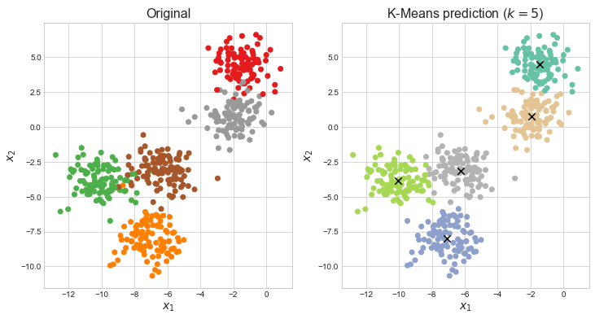
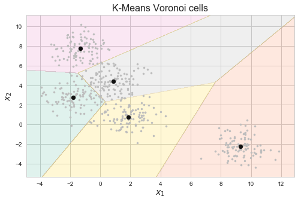
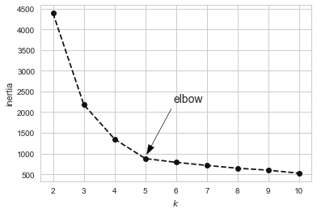
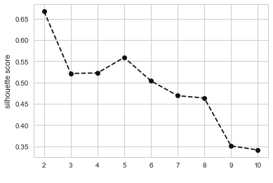
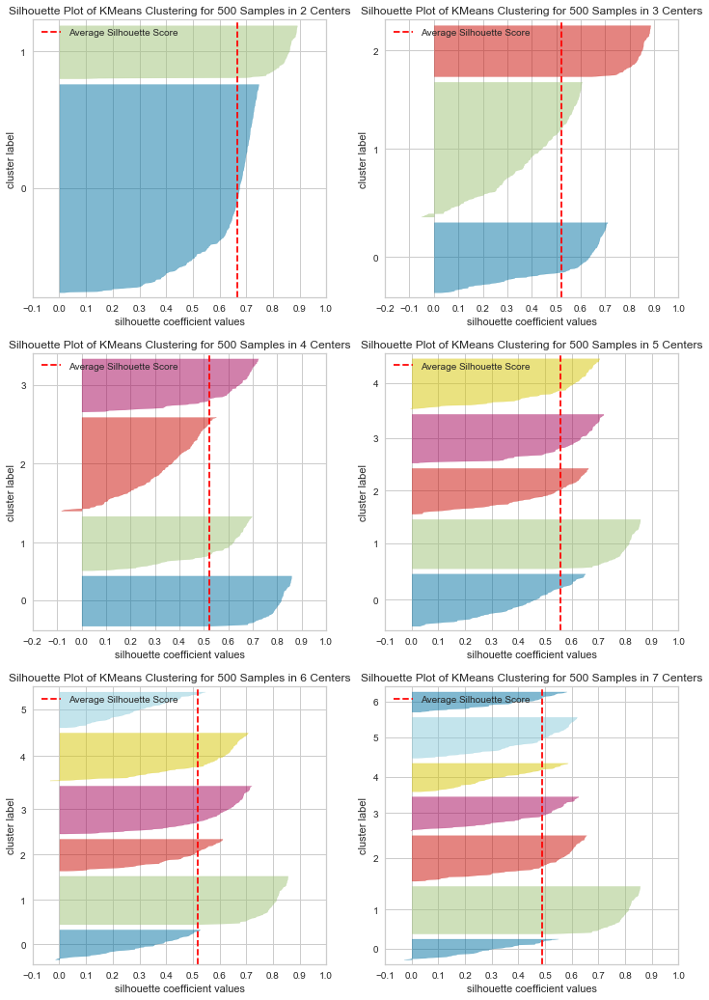
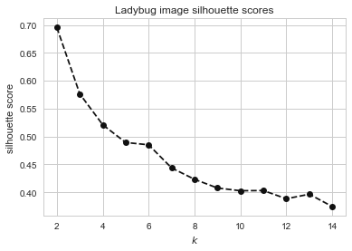
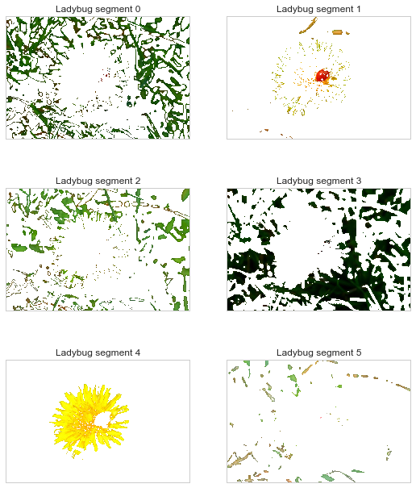
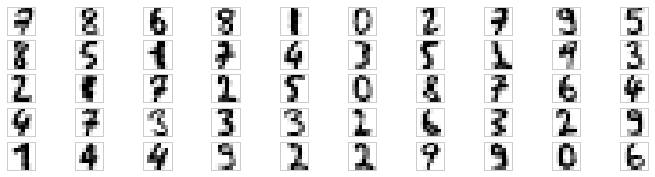

# Chapter 9. Unsupervised Learning Techniques


```python
import numpy as np
import pandas as pd 
import matplotlib.pyplot as plt

np.random.seed(0)

plt.style.use('seaborn-whitegrid')
```


```python
%matplotlib inline
```


```python
%load_ext ipycache
```

    The ipycache extension is already loaded. To reload it, use:
      %reload_ext ipycache


This chapter covers the following unsupervised learning techniques: clustering, anomaly detection, and density estimation.

## Clustering

*Clustering* is the task of identifying similar instances and assigning them to groups.

The author discusses some useful tasks for clustering:

1. At the beginning of a data analysis, the data can be clustered and then each cluster can be analyzed separately.
2. Once clusters have been assigned, the affinity values for each cluster can be used for dimensionality reduction.
3. Anomalies can be detected as those that don't fit into a cluster.
4. Label propagation from labeled data to new unlabeled data for semi-supervised learning.

### K-means

Below is an example of K-means clustering on artificial data made of blobs.


```python
from sklearn.cluster import KMeans
from sklearn.datasets import make_blobs

# Artifical data.
X, y = make_blobs(n_samples=500, centers=5, random_state=0)

# K-means clustering.
k = 5  # The number of clusters to find.
kmeans = KMeans(n_clusters=k)
kmeans.fit(X)

# Make classifications from K-means model.
y_pred = kmeans.predict(X)


# Plotting.
fig = plt.figure(figsize=(12, 6))

# Plot the original clusters.
plt.subplot(1, 2, 1)
plt.scatter(X[:, 0], X[:, 1], c=y, cmap='Set1')
plt.xlabel('$x_1$', fontsize=14)
plt.ylabel('$x_2$', fontsize=14)
plt.title('Original', fontsize=16)

# Plot the K-means classifications.
plt.subplot(1, 2, 2)
plt.scatter(X[:, 0], X[:, 1], c=y_pred, cmap='Set2')
centroids = kmeans.cluster_centers_
plt.scatter(centroids[:, 0], centroids[:, 1], c='k', s=70, marker='x')

plt.xlabel('$x_1$', fontsize=14)
plt.ylabel('$x_2$', fontsize=14)
plt.title(f'K-Means prediction ($k={k}$)', fontsize=16)
plt.show()
```





```python
# Show the centers of the clusters.
kmeans.cluster_centers_
```


    array([[-1.78783991,  2.76785611],
           [ 9.30286933, -2.23802673],
           [-1.33625465,  7.73822965],
           [ 1.87544954,  0.76337636],
           [ 0.87407478,  4.4332834 ]])


```python
# Create Voronoi cells by predicting over a mesh.
h = .02  # step size of the mesh grid.
x_min, x_max = X[:, 0].min() - 1, X[:, 0].max() + 1
y_min, y_max = X[:, 1].min() - 1, X[:, 1].max() + 1
x0, x1 = np.meshgrid(np.arange(x_min, x_max, h), np.arange(y_min, y_max, h))
X_mesh = np.c_[x0.ravel(), x1.ravel()]
y_pred = kmeans.predict(X_mesh).reshape(x0.shape)

# Plot Voronoi cells.
fig = plt.figure(figsize=(8, 5))

plt.contourf(x0, x1, y_pred, cmap='Set2', alpha=0.2)

plt.scatter(X[:, 0], X[:, 1], c='#bdbdbd', s=10)

plt.scatter(centroids[:, 0], centroids[:, 1], c='k', s=200, marker='.')

plt.xlabel('$x_1$', fontsize=14)
plt.ylabel('$x_2$', fontsize=14)
plt.title(f'K-Means Voronoi cells', fontsize=16)
plt.show()
```





The performance of K-means clustering degrades when the distributions of the clusters are different.
*Hard-voting* is when each instance is assigned to a single cluster.
Alternatively, *soft-voting* is when a score is assigned to each instance per centroid.
The score can be the distance to the centroid, or a similarity score (affinity) from the Gaussian radial basis function (RBF).
These data can be obtained by using the `transform()` method of a `KMeans` object.
This can act as a dimensionality reduction technique for higher-dimensional data.


```python
kmeans.transform(X[0:5, :])
```


    array([[ 5.65395395,  6.78719721,  9.32888063,  1.65547831,  5.42241143],
           [ 2.29711611, 11.50756245,  3.59157417,  4.11349809,  1.00516713],
           [ 5.24356985, 10.50404117,  4.31832326,  5.04967736,  2.11385281],
           [ 0.72872131, 12.22263029,  4.29719996,  4.32525956,  2.58848823],
           [ 1.71946847, 10.68298997,  5.01631429,  2.87918881,  1.81565044]])


Centroid initialization plays a role in determining the final outcome.
The original method for initialization was to randomly distribute the centroids.
Now, Scikit-Learn's `KMeans` class uses an improved method called *K-Means++* that finds initial locations that are well-distributed in relation to the density of the data.

In addition, the class has an `n_init` property that determines how many times the algorithm is run (the default is 10).
After a number of rounds, the best version is kept.
The quality of the iteration is the *inertia* of the model, that is the MSE of each instance and the nearest centroid.

Scikit-Learn also offers the `MiniBatchKMeans` class that uses a variation of the K-means algorithm to fit the model in batches.
This makes training with a large data set faster.

### Finding the optimal number of clusters

We cannot use the inertia as the metric for the number of clusters because it will always decrease as $k$ increases.
This is shown below.


```python
ks = np.arange(2, 11)
intertias = []

for k in ks:
    km = KMeans(n_clusters=k)
    km.fit(X)
    intertias.append(km.inertia_)

plt.plot(ks, intertias, 'k--o')

plt.annotate('elbow', xy=(5, intertias[5]+200),
             xycoords='data', xytext=(0.6, 0.5), 
             textcoords='axes fraction', 
             arrowprops=dict(width=0.1, headwidth=8, facecolor='black', shrink=0.05),
             horizontalalignment='right', verticalalignment='top',
             fontsize=14)

plt.xlabel('$k$')
plt.ylabel('inertia')
plt.show()
```





The elbow point can be a good indication for the number of clusters, though it is coarse, manual, and imprecise.

Alternatively, the *silhouette score*, the mean of the *silhouette coefficients* for each point, can be a good measure.
An instance's silhouette coefficient is shown below where $a$ is the means distance to the other instances in the same cluster and $b$ is the mean distance to the instances of the next nearest cluster (using the minimum value of all the clusters for $b$).
The value can range from -1 to 1 where the greater the number the more likely the point was assigned correctly.

$$
\frac{b-a}{max(a, b)}
$$

Thankfully, Scikit-Learn offers the `silhouette_score()` function to compute this.


```python
from sklearn.metrics import silhouette_score

ks = np.arange(2, 11)
sil_scores = []

for k in ks:
    km = KMeans(n_clusters=k)
    km.fit(X)
    sil_scores.append(silhouette_score(X, km.labels_))

plt.plot(ks, sil_scores, 'k--o')
plt.xlabel('$k$')
plt.ylabel('silhouette score')
plt.show()
```





Below are *silhouette diagrams* for multiple K-means models with various $k$ values.
The plot is effectively a horizontal bar plot of each instance's silhouette coefficient, ordered by cluster and rank.
The plot segments into a shape per cluster where the height indicates the number of instances in the cluster and the width reflects on well the instances fit in the clusters.
The red-dotted line indicates the silhouette score for the model.


```python
from sklearn.metrics import silhouette_samples
from yellowbrick.cluster import SilhouetteVisualizer

fig = plt.figure(figsize=(12, 18))

for i, k in enumerate(np.arange(2, 8)):
    plt.subplot(3, 2, i+1)
    km = KMeans(n_clusters=k)
    viz = SilhouetteVisualizer(km, colors='yellowbrick')
    viz.fit(X)
    viz.finalize()

plt.show()
```





Below are some of the limits of K-means:

* can reach suboptimal solutions
* the number of clusters must be declared
* K-means is not great at clustering non-spherical clusters of unequal densities

### Using clustering for image segmentation

Below is an example of using K-means to segment an image by color.


```python
from matplotlib.image import imread
import os

ladybug = imread(os.path.join('assets', 'homl', 'images', 'ladybug.png'))
# ladybug = ladybug[100:300, 300:500, :]
ladybug.shape
```


    (533, 800, 3)


```python
def plot_img(img): 
    plt.imshow(img)
    plt.grid(None)
    plt.gca().axes.get_xaxis().set_visible(False)
    plt.gca().axes.get_yaxis().set_visible(False)

plot_img(ladybug)
```


```python
X = ladybug.reshape(-1, 3)
X[:5, :]
```


    array([[0.09803922, 0.11372549, 0.00784314],
           [0.09411765, 0.10980392, 0.00392157],
           [0.09411765, 0.11372549, 0.        ],
           [0.10196079, 0.11372549, 0.        ],
           [0.09803922, 0.11372549, 0.00784314]], dtype=float32)


```python
kmeans = KMeans(n_clusters=8).fit(X)

segmented_img = kmeans.cluster_centers_[kmeans.labels_]
segmented_img = segmented_img.reshape(ladybug.shape)

plot_img(segmented_img)
```


```python
%%cache -d caches ch09_ladybug_silhouetteplot.pkl

ks = np.arange(2, 15)
sil_scores = []

for k in ks:
    km = KMeans(n_clusters=k).fit(X)
    # Sample the data for silhouette score (too slow, otherwise).
    sample_idx = np.random.randint(0, len(X), 5000)
    X_sample = X[sample_idx, :]
    label_sample = km.labels_[sample_idx]
    sil_scores.append(silhouette_score(X_sample, label_sample))

plt.plot(ks, sil_scores, 'k--o')
plt.xlabel('$k$')
plt.ylabel('silhouette score')
plt.title('Ladybug image silhouette scores')
plt.show()
```

    [Skipped the cell's code and loaded variables  from file '/Users/admin/Developer/Python/100DaysOfPython/HandsOnMachineLearningWithScikitLearnAndTensorFlow/caches/ch09_ladybug_silhouetteplot.pkl'.]





```python
%%cache -d caches ch09_ladybug_decomposed.pkl

# Subjective judgement from silhouette scores
best_k = 6

kmeans = KMeans(n_clusters=best_k).fit(X)

fig = plt.figure(figsize=(9, 15))
o3 = np.ones(3)

for i in range(best_k):
    plt.subplot(4, 2, i+1)
    partial_img = [x if l == i else o3 for x, l in zip(X, kmeans.labels_)]
    partial_img = np.concatenate(partial_img).reshape(X.shape)
    plot_img(partial_img.reshape(ladybug.shape))
    plt.title(f'Ladybug segment {i}')

plt.show()
```

    [Skipped the cell's code and loaded variables  from file '/Users/admin/Developer/Python/100DaysOfPython/HandsOnMachineLearningWithScikitLearnAndTensorFlow/caches/ch09_ladybug_decomposed.pkl'.]





### Using clustering for preprocessing

K-means clustering can be used for dimensionality reduction as a preprocessing step for a supervised learning algorithm.
Below is an example using the digits data.


```python
from sklearn.datasets import load_digits
from sklearn.model_selection import train_test_split

X_digits, y_digits = load_digits(return_X_y=True)
X_train, X_test, y_train, y_test = train_test_split(X_digits, y_digits)
```

First, just a logistic regression with the raw data.


```python
from sklearn.linear_model import LogisticRegression

log_reg = LogisticRegression(solver='lbfgs',
                             max_iter=5000,
                             multi_class='auto')
log_reg.fit(X_train, y_train)

# Logistic regression accuracy on test data.
log_reg.score(X_test, y_test)
```


    0.9666666666666667


This can be compared to using a pipeline with K-means as a preprocessing step.

There is a large drop in performance using the default number of clusters, 8.


```python
from sklearn.pipeline import Pipeline

log_reg_pipeline = Pipeline([
    ('kmeans', KMeans()),
    ('log_reg', LogisticRegression(solver='lbfgs',
                                   max_iter=5000,
                                   multi_class='auto'))
])

log_reg_pipeline.fit(X_train, y_train)

log_reg_pipeline.score(X_test, y_test)
```

    /opt/anaconda3/envs/daysOfCode-env/lib/python3.7/site-packages/sklearn/linear_model/logistic.py:947: ConvergenceWarning: lbfgs failed to converge. Increase the number of iterations.
      "of iterations.", ConvergenceWarning)


    0.9177777777777778


Grid search can be used to find the best value for $k$.


```python
%%cache -d caches ch09_digitslogreg_coarsegridsearch.pkl grid_log_reg, param_grid

from sklearn.model_selection import GridSearchCV

param_grid = {'kmeans__n_clusters': np.arange(10, 220, 20)}
grid_log_reg = GridSearchCV(log_reg_pipeline,
                            param_grid,
                            cv=3,
                            n_jobs=-1)
grid_log_reg.fit(X_train, y_train)
```

    [Skipped the cell's code and loaded variables grid_log_reg, param_grid from file '/Users/admin/Developer/Python/100DaysOfPython/HandsOnMachineLearningWithScikitLearnAndTensorFlow/caches/ch09_digitslogreg_coarsegridsearch.pkl'.]


    /opt/anaconda3/envs/daysOfCode-env/lib/python3.7/site-packages/sklearn/linear_model/logistic.py:947: ConvergenceWarning: lbfgs failed to converge. Increase the number of iterations.
      "of iterations.", ConvergenceWarning)


```python
grid_log_reg.best_params_
```


    {'kmeans__n_clusters': 170}


```python
%%cache -d caches ch09_digitslogreg_finegridsearch.pkl grid_log_reg, param_grid

param_grid = {'kmeans__n_clusters': np.arange(180, 220, 1)}

grid_log_reg = GridSearchCV(log_reg_pipeline,
                            param_grid,
                            cv=3)
grid_log_reg.fit(X_train, y_train)
```

    [Skipped the cell's code and loaded variables grid_log_reg, param_grid from file '/Users/admin/Developer/Python/100DaysOfPython/HandsOnMachineLearningWithScikitLearnAndTensorFlow/caches/ch09_digitslogreg_finegridsearch.pkl'.]


    /opt/anaconda3/envs/daysOfCode-env/lib/python3.7/site-packages/sklearn/linear_model/logistic.py:947: ConvergenceWarning: lbfgs failed to converge. Increase the number of iterations.
      "of iterations.", ConvergenceWarning)
    /opt/anaconda3/envs/daysOfCode-env/lib/python3.7/site-packages/sklearn/linear_model/logistic.py:947: ConvergenceWarning: lbfgs failed to converge. Increase the number of iterations.
      "of iterations.", ConvergenceWarning)
    /opt/anaconda3/envs/daysOfCode-env/lib/python3.7/site-packages/sklearn/linear_model/logistic.py:947: ConvergenceWarning: lbfgs failed to converge. Increase the number of iterations.
      "of iterations.", ConvergenceWarning)
    /opt/anaconda3/envs/daysOfCode-env/lib/python3.7/site-packages/sklearn/linear_model/logistic.py:947: ConvergenceWarning: lbfgs failed to converge. Increase the number of iterations.
      "of iterations.", ConvergenceWarning)
    /opt/anaconda3/envs/daysOfCode-env/lib/python3.7/site-packages/sklearn/linear_model/logistic.py:947: ConvergenceWarning: lbfgs failed to converge. Increase the number of iterations.
      "of iterations.", ConvergenceWarning)
    /opt/anaconda3/envs/daysOfCode-env/lib/python3.7/site-packages/sklearn/linear_model/logistic.py:947: ConvergenceWarning: lbfgs failed to converge. Increase the number of iterations.
      "of iterations.", ConvergenceWarning)
    /opt/anaconda3/envs/daysOfCode-env/lib/python3.7/site-packages/sklearn/linear_model/logistic.py:947: ConvergenceWarning: lbfgs failed to converge. Increase the number of iterations.
      "of iterations.", ConvergenceWarning)
    /opt/anaconda3/envs/daysOfCode-env/lib/python3.7/site-packages/sklearn/linear_model/logistic.py:947: ConvergenceWarning: lbfgs failed to converge. Increase the number of iterations.
      "of iterations.", ConvergenceWarning)
    /opt/anaconda3/envs/daysOfCode-env/lib/python3.7/site-packages/sklearn/linear_model/logistic.py:947: ConvergenceWarning: lbfgs failed to converge. Increase the number of iterations.
      "of iterations.", ConvergenceWarning)
    /opt/anaconda3/envs/daysOfCode-env/lib/python3.7/site-packages/sklearn/linear_model/logistic.py:947: ConvergenceWarning: lbfgs failed to converge. Increase the number of iterations.
      "of iterations.", ConvergenceWarning)
    /opt/anaconda3/envs/daysOfCode-env/lib/python3.7/site-packages/sklearn/linear_model/logistic.py:947: ConvergenceWarning: lbfgs failed to converge. Increase the number of iterations.
      "of iterations.", ConvergenceWarning)
    /opt/anaconda3/envs/daysOfCode-env/lib/python3.7/site-packages/sklearn/linear_model/logistic.py:947: ConvergenceWarning: lbfgs failed to converge. Increase the number of iterations.
      "of iterations.", ConvergenceWarning)
    /opt/anaconda3/envs/daysOfCode-env/lib/python3.7/site-packages/sklearn/linear_model/logistic.py:947: ConvergenceWarning: lbfgs failed to converge. Increase the number of iterations.
      "of iterations.", ConvergenceWarning)
    /opt/anaconda3/envs/daysOfCode-env/lib/python3.7/site-packages/sklearn/linear_model/logistic.py:947: ConvergenceWarning: lbfgs failed to converge. Increase the number of iterations.
      "of iterations.", ConvergenceWarning)
    /opt/anaconda3/envs/daysOfCode-env/lib/python3.7/site-packages/sklearn/linear_model/logistic.py:947: ConvergenceWarning: lbfgs failed to converge. Increase the number of iterations.
      "of iterations.", ConvergenceWarning)
    /opt/anaconda3/envs/daysOfCode-env/lib/python3.7/site-packages/sklearn/linear_model/logistic.py:947: ConvergenceWarning: lbfgs failed to converge. Increase the number of iterations.
      "of iterations.", ConvergenceWarning)
    /opt/anaconda3/envs/daysOfCode-env/lib/python3.7/site-packages/sklearn/linear_model/logistic.py:947: ConvergenceWarning: lbfgs failed to converge. Increase the number of iterations.
      "of iterations.", ConvergenceWarning)
    /opt/anaconda3/envs/daysOfCode-env/lib/python3.7/site-packages/sklearn/linear_model/logistic.py:947: ConvergenceWarning: lbfgs failed to converge. Increase the number of iterations.
      "of iterations.", ConvergenceWarning)
    /opt/anaconda3/envs/daysOfCode-env/lib/python3.7/site-packages/sklearn/linear_model/logistic.py:947: ConvergenceWarning: lbfgs failed to converge. Increase the number of iterations.
      "of iterations.", ConvergenceWarning)
    /opt/anaconda3/envs/daysOfCode-env/lib/python3.7/site-packages/sklearn/linear_model/logistic.py:947: ConvergenceWarning: lbfgs failed to converge. Increase the number of iterations.
      "of iterations.", ConvergenceWarning)
    /opt/anaconda3/envs/daysOfCode-env/lib/python3.7/site-packages/sklearn/linear_model/logistic.py:947: ConvergenceWarning: lbfgs failed to converge. Increase the number of iterations.
      "of iterations.", ConvergenceWarning)
    /opt/anaconda3/envs/daysOfCode-env/lib/python3.7/site-packages/sklearn/linear_model/logistic.py:947: ConvergenceWarning: lbfgs failed to converge. Increase the number of iterations.
      "of iterations.", ConvergenceWarning)
    /opt/anaconda3/envs/daysOfCode-env/lib/python3.7/site-packages/sklearn/linear_model/logistic.py:947: ConvergenceWarning: lbfgs failed to converge. Increase the number of iterations.
      "of iterations.", ConvergenceWarning)
    /opt/anaconda3/envs/daysOfCode-env/lib/python3.7/site-packages/sklearn/linear_model/logistic.py:947: ConvergenceWarning: lbfgs failed to converge. Increase the number of iterations.
      "of iterations.", ConvergenceWarning)
    /opt/anaconda3/envs/daysOfCode-env/lib/python3.7/site-packages/sklearn/linear_model/logistic.py:947: ConvergenceWarning: lbfgs failed to converge. Increase the number of iterations.
      "of iterations.", ConvergenceWarning)
    /opt/anaconda3/envs/daysOfCode-env/lib/python3.7/site-packages/sklearn/linear_model/logistic.py:947: ConvergenceWarning: lbfgs failed to converge. Increase the number of iterations.
      "of iterations.", ConvergenceWarning)
    /opt/anaconda3/envs/daysOfCode-env/lib/python3.7/site-packages/sklearn/linear_model/logistic.py:947: ConvergenceWarning: lbfgs failed to converge. Increase the number of iterations.
      "of iterations.", ConvergenceWarning)
    /opt/anaconda3/envs/daysOfCode-env/lib/python3.7/site-packages/sklearn/linear_model/logistic.py:947: ConvergenceWarning: lbfgs failed to converge. Increase the number of iterations.
      "of iterations.", ConvergenceWarning)
    /opt/anaconda3/envs/daysOfCode-env/lib/python3.7/site-packages/sklearn/linear_model/logistic.py:947: ConvergenceWarning: lbfgs failed to converge. Increase the number of iterations.
      "of iterations.", ConvergenceWarning)
    /opt/anaconda3/envs/daysOfCode-env/lib/python3.7/site-packages/sklearn/linear_model/logistic.py:947: ConvergenceWarning: lbfgs failed to converge. Increase the number of iterations.
      "of iterations.", ConvergenceWarning)
    /opt/anaconda3/envs/daysOfCode-env/lib/python3.7/site-packages/sklearn/linear_model/logistic.py:947: ConvergenceWarning: lbfgs failed to converge. Increase the number of iterations.
      "of iterations.", ConvergenceWarning)
    /opt/anaconda3/envs/daysOfCode-env/lib/python3.7/site-packages/sklearn/linear_model/logistic.py:947: ConvergenceWarning: lbfgs failed to converge. Increase the number of iterations.
      "of iterations.", ConvergenceWarning)
    /opt/anaconda3/envs/daysOfCode-env/lib/python3.7/site-packages/sklearn/linear_model/logistic.py:947: ConvergenceWarning: lbfgs failed to converge. Increase the number of iterations.
      "of iterations.", ConvergenceWarning)
    /opt/anaconda3/envs/daysOfCode-env/lib/python3.7/site-packages/sklearn/linear_model/logistic.py:947: ConvergenceWarning: lbfgs failed to converge. Increase the number of iterations.
      "of iterations.", ConvergenceWarning)
    /opt/anaconda3/envs/daysOfCode-env/lib/python3.7/site-packages/sklearn/linear_model/logistic.py:947: ConvergenceWarning: lbfgs failed to converge. Increase the number of iterations.
      "of iterations.", ConvergenceWarning)
    /opt/anaconda3/envs/daysOfCode-env/lib/python3.7/site-packages/sklearn/linear_model/logistic.py:947: ConvergenceWarning: lbfgs failed to converge. Increase the number of iterations.
      "of iterations.", ConvergenceWarning)


```python
grid_log_reg.best_params_
```


    {'kmeans__n_clusters': 181}


```python
grid_log_reg.best_score_
```


    0.9673348181143281


```python
grid_log_reg.score(X_test, y_test)
```


    0.9911111111111112


The best value for $k$ was 181 and the accuracy achieved with the best model was 99.1 %.

### Using clustering for semi-supervised learning

Often, the training data will only be partial labeled.
We can use clustering to propagate labels to instances without them.

This is mocked below in several steps.
The main goal is to extract "representative images" from the clusters, label them manually, and then propagate the label to the rest of the cluster.

The first example below shows how using clustering to find the 50 representative images is better than some random sample (here, using the first 50 instances).


```python
n_labeled = 50
log_reg = LogisticRegression(solver='lbfgs',
                             max_iter=5000,
                             multi_class='auto')
log_reg.fit(X_train[:n_labeled], y_train[:n_labeled])
log_reg.score(X_test, y_test)
```


    0.8288888888888889


```python
k = n_labeled
kmeans = KMeans(n_clusters=k)
X_digits_dist = kmeans.fit_transform(X_train)

# Get the representative images.
representative_idx = np.argmin(X_digits_dist, axis=0)
X_representative = X_train[representative_idx]

# Plot the representative images for manual labeling.
fig = plt.figure(figsize=(12, 3))
for i, x in enumerate(X_representative):
    plt.subplot(5, 10, i+1)
    plot_img(x.reshape((8, 8)))
```





```python
# Normally, we wouldn't know this and have to manually assign values using
# the grid of images below.
y_representative = y_train[representative_idx]
```

Using the same number of instances for training , just this time from the clusters, greatly improved the success of the logistic regression on the test data.


```python
log_reg = LogisticRegression(solver='lbfgs',
                             max_iter=5000,
                             multi_class='auto')
log_reg.fit(X_representative, y_representative)
log_reg.score(X_test, y_test)
```


    0.9155555555555556


We can also propagate the manual labels to all of the data instances in the respective clusters.
This gives an appreciable boost to the testing accuracy.


```python
y_train_propagated = np.empty(len(X_train), dtype=np.int32)
for i in range(k):
    y_train_propagated[kmeans.labels_ == i] = y_representative[i]


log_reg = LogisticRegression(solver='lbfgs',
                             max_iter=5000,
                             multi_class='auto')
log_reg.fit(X_train, y_train_propagated)
log_reg.score(X_test, y_test)
```


    0.9311111111111111


One last improvement can come from limiting the label propagation to only those nearest the centroid.


```python
percentile_closest = 20

X_cluster_dist = X_digits_dist[np.arange(len(X_train)), kmeans.labels_]

for i in range(k):
    in_cluster = (kmeans.labels_ == i)
    
    cluster_dist = X_cluster_dist[in_cluster]
    cutoff_dist = np.percentile(cluster_dist, percentile_closest)
    above_cutoff = (X_cluster_dist > cutoff_dist)
    
    X_cluster_dist[in_cluster & above_cutoff] = -1


partially_prop_idx = (X_cluster_dist != -1)
X_train_partially_prop = X_train[partially_prop_idx]
y_train_partially_prop = y_train_propagated[partially_prop_idx]

log_reg = LogisticRegression(solver='lbfgs',
                             max_iter=5000,
                             multi_class='auto')
log_reg.fit(X_train_partially_prop, y_train_partially_prop)
log_reg.score(X_test, y_test)
```


    0.9377777777777778


It doesn't seem to have helped too much in this instance, but it can often lead to improved testing accuracy in other circumstances.


```python

```
