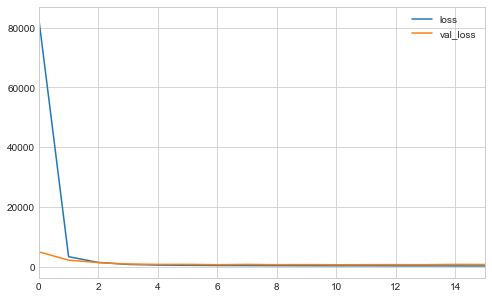

# Chapter 10. Introduction to Artificial Neural Networks with Keras


```python
import numpy as np
import pandas as pd
import matplotlib.pyplot as plt
from IPython.core.interactiveshell import InteractiveShell

np.random.seed(0)

plt.style.use('seaborn-whitegrid')
```


```python
%matplotlib inline
```


```python
%load_ext ipycache
```

    The ipycache extension is already loaded. To reload it, use:
      %reload_ext ipycache


## From biological to artificial neurons

The author briefly described the origins of the field of artificial neural networks (ANN) and how real neurons work; I will skip recounting that section here.

### Logical computations with neurons

The first artificial neuron was proposed as a function with one or more binary inputs and one binary output.
The output is activated when a certain number of inputs are activated.
Several of these neurons working together can reproduce standard logic gates.

### The Perceptron

The *perceptron* was invented in 1957 by Frank Rosenblatt.
It is *threshold logic unit* (TLU) (or a *linear threshold unit*, LTU).
Each input and the  output are numeric values (not binary) and each input has an associated weight.
The TLU computes the weighted sum of the inputs ($z = w_1 x_1 + w_2 x_2 + ... + w_n x_n = \textbf{x}^T \textbf{w}$) and applies a step function to the result to decide the output ($h_w(\textbf{x}) = \text{step}(z)$).
The most common step functions were the *Heaviside step function* and the *sign function*:

$$
\text{heaviside} (z) =
\begin{cases}
    0 \text{ if } z  <  0 \\ 
    1 \text{ if } z \ge 0 \\
\end{cases}
$$

$$
\text{sgn}(z) =
\begin{cases}
    -1 \text{if } z < 0 \\ 
    0  \text{if } z = 0 \\
    1  \text{if } z > 0 \\
\end{cases}
$$

A single TLU can be used for linear classification.
Training the TLU means finding the values for the weights ($w_1, w_2, ..., w_n = \textbf{w}$)

A perceptron is a single layer of TLUs with each TLU connected to all of the input neurons (creating a *fully connected layer*).
The input neurons are just simple passthrough functions where the output equals the input.
An extra *bias neuron* is usually added that always has the value 1 and is connected to each neuron; this helps with the linear algebra for calculating the output of the perceptron:

$$
h_{\textbf{W}, \textbf{b}} = \phi(\textbf{XW} + \textbf{b}) \\
$$

$$
\text{where }
\begin{cases}
    \textbf{X}: \text{represents the matrix of input features; one row per instance, one column per feature} \\
    \textbf{W}: \text{represents the weight matrix from the input neurons to the TLU neurons} \\
    \textbf{b}: \text{represents the weight vector from the bias neurons to the TLU neurons} \\
    \phi: \text{represents the activation function; the step function for TLUs} \\
\end{cases}
$$

The perceptron is trained using *Hebb's Rule*: the connection weight between two neurons tends to increase when they fire simultaneously.
The algorithm also accounts for the accuracy of the prediction; for each training instance, the weights are updated with the following *Perceptron learning rule*:

$$
w_{i,j}^{\text{next step}} = w_{i,j} + \eta (y_j - \hat{y_j}) x_i
$$

$$
\text{where }
\begin{cases}
    w_{i,j}: \text{the connection weight between the } i^{th} \text{ input neuron and } j^{th} \text{output neuron} \\
    x_i: \text{the } i^{th} \text{ input value of the training instance} \\
    \hat{y_j}: \text{the output of the } j^{th} \text{ output neuron for the training instance} \\
    y_j: \text{the target output of the } j^{th} \text{ output neuron for the training instance} \\
    \eta: \text{the learning rate} \\
\end{cases}
$$

The decision boundary for each output neuron is linear, so perceptrons are only capable of linear separation.
Though, when this is possible for the data, the perceptron will converge.

There are some critical limitations to a perceptron, notably that it cannot learn XOR logic, but many of these can be overcome by using multiple layers to create a *Multilayer Perceptron* (MLP).


```python
from sklearn.datasets import load_iris
from sklearn.linear_model import Perceptron

# Load the iris data and only use petal length and width (cm.).
iris = load_iris()
X = iris.data[:, (2, 3)]
y = iris.target

# Train a perceptron.
per_clf = Perceptron()
per_clf.fit(X, y)

# Plot the prediction results.
plt.scatter(X[:, 0], X[:, 1], c=per_clf.predict(X), cmap='Set1')
plt.title('Perceptron classifying the iris data', fontsize=14)
plt.xlabel(iris.feature_names[2], fontsize=12)
plt.ylabel(iris.feature_names[3], fontsize=12)
plt.show()
```


## The multilayer perceptron (MLP) and backpropagation

An MLP has one *input layer* built of passthrough neurons, one or more *hidden layers* of TLUs, and one *ouput layer* of TLUs. 
The layers near the input are called *lower layers* whereas the layers near the output are *upper layers*.
When an ANN contains a deep stack of hidden layers, it is called a *deep neural network* (DNN).

*Backpropagation* makes training a MLP possible.
It is able to compute the gradient of the nwtwork's error with regard to every single model parameter.
Therefore, the connection weights and bias terms can be tweaked optimally to reduce error.
Once the gradient is found, normal gradient descent can be followed.
Below is the most basic interpretation of the algorithm:

1. A mini-batch is fed into the input layers.
2. The data progresses through the layers and the results of each layer are remembered. This is the *forward pass*.
3. A final output is calculated and a loss function is used to determine the error.
4. The chain rule is used to measure how much each output connected contributed to the error.
5. The error is *backpropagated* using the chain rule to measure how much of the error came from each connection in the network.
6. The error gradient is used to compute the optimal adjustments for each connection weight.

In order to compute the derivative of each neuron, the step function had to be replaced.
Currently, it is common to use the logistic equation, hyperbolic tangent function, or rectified linear unit (ReLU):

$$
\begin{aligned}
\text{logistic: }& \quad \sigma(z) = 1 / (1 + e^{-z}) \\
\text{hyperbolic tangent: }& \quad \tanh(z) = 2 \sigma(2z) - 1 \\
\text{ReLU: }& \quad \text{ReLU}(z) = \max(0, z) \\
\end{aligned}
$$


```python
# Input points
x = np.linspace(-4, 4, 300)

# Neruon activation functions.

def step_fxn(x):
    """Step function for neuron activation function."""
    return [-1 if i < 0 else 1 for i in x]


def step_fxn_d(x):
    """Derivative of the step function."""
    return np.zeros(len(x))


def logistic_fxn(x):
    """Logisitc (sigmoid) function for neuron activation function."""
    return 1 / (1 + np.exp(-x))


def logistic_fxn_d(x):
    """The derivative of the logistic function."""
    return logistic_fxn(x) * (1 - logistic_fxn(x))


def hyperbolic_tan(x):
    """Hyperbolic tangent function for neuron activation function."""
    return 2 * logistic_fxn(2 * np.array(x)) - 1


def hyperbolic_tan_d(x):
    """The derivative of the hyperbolic tangent function."""
    return 1 - (np.tanh(x) ** 2)


def relu_fxn(x):
    """The ReLU for a neuron activation function."""
    return [max(0, i) for i in x]


def relu_fxn_d(x):
    """The derivative of the ReLU"""
    return [0 if i < 0 else 1 for i in x]


# Styles of line.
line_styles = {
    'step': 'r--',
    'logistic': 'b--',
    'tanh': 'g--',
    'relu': 'y--'
}

# Plotting each activation function.
fig = plt.figure(figsize=(10, 5))
plt.subplot(1, 2, 1)
plt.plot(x, step_fxn(x), line_styles['step'], label='step')
plt.plot(x, logistic_fxn(x), line_styles['logistic'], label='logistic')
plt.plot(x, hyperbolic_tan(x), line_styles['tanh'], label='tanh')
plt.plot(x, relu_fxn(x), line_styles['relu'], label='ReLU')
plt.axis([-4, 4, -1.1, 1.1])
plt.legend(loc='center right', fontsize=12)
plt.xlabel('$x$', fontsize=12)
plt.ylabel('$y$', fontsize=12)
plt.title('Activation Functions', fontsize=14)

# Plotting the derivatives of the activation function.
plt.subplot(1, 2, 2)
plt.plot(x, step_fxn_d(x), line_styles['step'], label='step')
plt.plot(x, logistic_fxn_d(x), line_styles['logistic'], label='logistic')
plt.plot(x, hyperbolic_tan_d(x), line_styles['tanh'], label='tanh')
plt.plot(x, relu_fxn_d(x), line_styles['relu'], label='ReLU')
plt.axis([-4, 4, -0.1, 1.1])
plt.legend(loc='center right', fontsize=12)
plt.xlabel('$x$', fontsize=12)
plt.ylabel('$y$', fontsize=12)
plt.title('Derivatives of Activation Functions', fontsize=14)

plt.show()
```


### Regression MLP

For a regression MLP, there must be one output neuron per output variable.
The neuron's activation function must be chosen depending on any constraints on the output (e.g. always positive, between 0 and 1) and no activation function can be used to leave the output value unconstrained.
The loss function most  commonly used in the MSE, though the mean absolute error (MAE) or Huber loss (a mixture of MSE and MAE) can be used if the training data has a lot of outliers.

### Classification MLP

If the decision is a binary classification, then only one neuron is required with a logistic activation function.
If there are multiple decisions, but each is binary, then there must be a neuron per decision, each with a logistic activation function.
If there is a single decision, but multiple possibilities (i.e. the image of 1 of 10 digits), then there must be an output neuron for each option with a *softmax function* across the whole output layer.
The softmax function ensures that each neuron is between 0 and 1 (inclusive) and that they sum to 1.
The loss function is usually the cross-entropy loss function.

---

>**Before moving on to using Keras to build ANNs, I followed the advice of the author and skipped to Exercise 1 for the chapter which was to experiment in the [TensorFlow Playground](https://playground.tensorflow.org/).**

---

## Implementing MLPs with Keras


```python
import tensorflow as tf
from tensorflow import keras

tf.__version__
```


    '2.0.0'


```python
keras.__version__
```


    '2.2.4-tf'


### Building an image classifier using the sequential API

For the first example, we will build an image classifier of the MNIST Fashion data set.
It contains 70,000 28x28 grayscale images of clothing of 10 classes.

Keras provides some functions for accessing commonly used data.


```python
fashion_mnist = keras.datasets.fashion_mnist
(X_train_full, y_train_full), (X_test, y_test) = fashion_mnist.load_data()
```

Each image is a 28x28 array.


```python
X_train_full.shape
```


    (60000, 28, 28)


Each data point is an integer between 0 and 255.


```python
X_train_full.dtype
```


    dtype('uint8')


We need to make a validation set from the training data and scale the data to between 0 and 1.


```python
from sklearn.model_selection import train_test_split
from sklearn.pipeline import Pipeline
from sklearn.preprocessing import MinMaxScaler
from sklearn.base import BaseEstimator, TransformerMixin


# Split the training data into training and validation.
X_train, X_valid, y_train, y_valid = train_test_split(X_train_full,
                                                      y_train_full,
                                                      test_size=5000,
                                                      random_state=0)


class FashionImageFlatten(BaseEstimator, TransformerMixin):
    """Flatten the 28x28 MNIST Fashion image."""

    def fit(self, X, y=None):
        return self

    def transform(self, X):
        return X.reshape(len(X), 28*28)


class FashionImageReshape(BaseEstimator, TransformerMixin):
    """Reshape the 28x28 MNIST Fashion image."""

    def fit(self, X, y=None):
        return self

    def transform(self, X):
        return X.reshape(len(X), 28, 28)


# A pipeline for pre-processing the MNIST Fashion data.
fashion_preprocesser = Pipeline([
    ('flattener', FashionImageFlatten()),
    ('minmax_scaler', MinMaxScaler()),
    ('reshaper', FashionImageReshape())
])
fashion_preprocesser.fit(X_train)

X_train = fashion_preprocesser.transform(X_train)
X_valid = fashion_preprocesser.transform(X_valid)
```

The names of the classes was not provided, so I had to enter them manually.
I found the known values in the [Keras documentation](https://keras.io/datasets/#fashion-mnist-database-of-fashion-articles).


```python
class_names = ["T-shirt/top", "Trouser", "Pullover", "Dress", "Coat", "Sandal", 
               "Shirt", "Sneaker", "Bag", "Ankle boot"]
```


```python
fig = plt.figure(figsize=(12, 6))
for i in range(40):
    plt.subplot(4, 10, i+1)
    plt.imshow(X_train[i, :, :])
    plt.title(class_names[y_train[i]])
    plt.axis('off')

plt.show()
```


The sequential API is used below to create the first neural network with two hidden layers.


```python
model = keras.models.Sequential()
model.add(keras.layers.Flatten(input_shape=[28, 28]))
model.add(keras.layers.Dense(300, activation='relu', name='dense_1'))
model.add(keras.layers.Dense(100, activation='relu', name='dense_2'))
model.add(keras.layers.Dense(10, activation='softmax', name='dense_3'))
```

Here is an explanation of each line:

1. A sequential model is initialized. It is just a single stack of layers connected sequentially.
2. The first layer is the input nodes that just flattens the 28x28 image into a single array. Since it is the first layer, the shape of the input must be explicitly stated.
3. The first hidden layer is a dense network of 300 neurons each with a ReLU activation function.
4. The second hidden layer is a dense network of 100 neurons each with a ReLU activation function.
5. The output layer is a dense network of 10 neurons using a softmax activation function.

Alternatively, the model could have been declared directly when initializing the Sequential model by passing a list of the layers.
The model can be inspected with the `summary()` method.


```python
model.summary()
```

    Model: "sequential_121"
    _________________________________________________________________
    Layer (type)                 Output Shape              Param #   
    =================================================================
    flatten_1 (Flatten)          (None, 784)               0         
    _________________________________________________________________
    dense_1 (Dense)              (None, 300)               235500    
    _________________________________________________________________
    dense_2 (Dense)              (None, 100)               30100     
    _________________________________________________________________
    dense_3 (Dense)              (None, 10)                1010      
    =================================================================
    Total params: 266,610
    Trainable params: 266,610
    Non-trainable params: 0
    _________________________________________________________________


The list of layers can be accessed and specifically indexed by name.


```python
model.layers
```


    [<tensorflow.python.keras.layers.core.Flatten at 0x1a83609090>,
     <tensorflow.python.keras.layers.core.Dense at 0x1a83609390>,
     <tensorflow.python.keras.layers.core.Dense at 0x1a85ffbc10>,
     <tensorflow.python.keras.layers.core.Dense at 0x1a85ffbe10>]


```python
model.get_layer('dense_1')
```


    <tensorflow.python.keras.layers.core.Dense at 0x1a83609390>


```python
weights, biases = model.get_layer('dense_1').get_weights()
```


```python
weights
```


    array([[ 0.02766364, -0.04815574,  0.05387744, ...,  0.05564083,
             0.01002645, -0.00526246],
           [ 0.0219446 , -0.05415998, -0.04547278, ...,  0.05553144,
             0.01245424, -0.02109368],
           [ 0.03538805, -0.06248562, -0.01939079, ..., -0.02949599,
             0.02780902, -0.06488081],
           ...,
           [-0.00845268,  0.03219531,  0.02885704, ...,  0.05293785,
            -0.02888897, -0.05599388],
           [-0.01305802, -0.02926703,  0.06037284, ...,  0.0580081 ,
             0.02203671,  0.00162283],
           [ 0.0017663 , -0.00031187,  0.03673705, ...,  0.00383932,
             0.02924438, -0.06844497]], dtype=float32)


```python
biases
```


    array([0., 0., 0., 0., 0., 0., 0., 0., 0., 0., 0., 0., 0., 0., 0., 0., 0.,
           0., 0., 0., 0., 0., 0., 0., 0., 0., 0., 0., 0., 0., 0., 0., 0., 0.,
           0., 0., 0., 0., 0., 0., 0., 0., 0., 0., 0., 0., 0., 0., 0., 0., 0.,
           0., 0., 0., 0., 0., 0., 0., 0., 0., 0., 0., 0., 0., 0., 0., 0., 0.,
           0., 0., 0., 0., 0., 0., 0., 0., 0., 0., 0., 0., 0., 0., 0., 0., 0.,
           0., 0., 0., 0., 0., 0., 0., 0., 0., 0., 0., 0., 0., 0., 0., 0., 0.,
           0., 0., 0., 0., 0., 0., 0., 0., 0., 0., 0., 0., 0., 0., 0., 0., 0.,
           0., 0., 0., 0., 0., 0., 0., 0., 0., 0., 0., 0., 0., 0., 0., 0., 0.,
           0., 0., 0., 0., 0., 0., 0., 0., 0., 0., 0., 0., 0., 0., 0., 0., 0.,
           0., 0., 0., 0., 0., 0., 0., 0., 0., 0., 0., 0., 0., 0., 0., 0., 0.,
           0., 0., 0., 0., 0., 0., 0., 0., 0., 0., 0., 0., 0., 0., 0., 0., 0.,
           0., 0., 0., 0., 0., 0., 0., 0., 0., 0., 0., 0., 0., 0., 0., 0., 0.,
           0., 0., 0., 0., 0., 0., 0., 0., 0., 0., 0., 0., 0., 0., 0., 0., 0.,
           0., 0., 0., 0., 0., 0., 0., 0., 0., 0., 0., 0., 0., 0., 0., 0., 0.,
           0., 0., 0., 0., 0., 0., 0., 0., 0., 0., 0., 0., 0., 0., 0., 0., 0.,
           0., 0., 0., 0., 0., 0., 0., 0., 0., 0., 0., 0., 0., 0., 0., 0., 0.,
           0., 0., 0., 0., 0., 0., 0., 0., 0., 0., 0., 0., 0., 0., 0., 0., 0.,
           0., 0., 0., 0., 0., 0., 0., 0., 0., 0., 0.], dtype=float32)


Once the model's structure is created, it must be compiled.
This is when the loss function, optimizer, and any other metrics to be calculated during training and evaluation are added to the model.
There are additional parameters that we will learn about and opt to set in the future for increased performance.


```python
model.compile(
    loss='sparse_categorical_crossentropy',
    optimizer='sgd',
    metrics=['accuracy']
)
```

Now the model is ready to be trained using the `fit()` method.


```python
history = model.fit(X_train, y_train, 
                    epochs=30,
                    validation_data=(X_valid, y_valid))
```

    Train on 55000 samples, validate on 5000 samples
    Epoch 1/30
    55000/55000 [==============================] - 12s 211us/sample - loss: 0.7372 - accuracy: 0.7569 - val_loss: 0.5770 - val_accuracy: 0.7892
    Epoch 2/30
    55000/55000 [==============================] - 8s 150us/sample - loss: 0.4950 - accuracy: 0.8289 - val_loss: 0.4621 - val_accuracy: 0.8398
    Epoch 3/30
    55000/55000 [==============================] - 8s 152us/sample - loss: 0.4465 - accuracy: 0.8435 - val_loss: 0.4294 - val_accuracy: 0.8478
    Epoch 4/30
    55000/55000 [==============================] - 9s 156us/sample - loss: 0.4185 - accuracy: 0.8538 - val_loss: 0.4014 - val_accuracy: 0.8594
    Epoch 5/30
    55000/55000 [==============================] - 8s 151us/sample - loss: 0.3982 - accuracy: 0.8607 - val_loss: 0.3870 - val_accuracy: 0.8638
    Epoch 6/30
    55000/55000 [==============================] - 8s 151us/sample - loss: 0.3820 - accuracy: 0.8655 - val_loss: 0.3960 - val_accuracy: 0.8598
    Epoch 7/30
    55000/55000 [==============================] - 8s 150us/sample - loss: 0.3678 - accuracy: 0.8708 - val_loss: 0.3973 - val_accuracy: 0.8600
    Epoch 8/30
    55000/55000 [==============================] - 8s 151us/sample - loss: 0.3570 - accuracy: 0.8741 - val_loss: 0.3773 - val_accuracy: 0.8676
    Epoch 9/30
    55000/55000 [==============================] - 8s 151us/sample - loss: 0.3455 - accuracy: 0.8774 - val_loss: 0.3677 - val_accuracy: 0.8730
    Epoch 10/30
    55000/55000 [==============================] - 8s 153us/sample - loss: 0.3360 - accuracy: 0.8807 - val_loss: 0.3637 - val_accuracy: 0.8728
    Epoch 11/30
    55000/55000 [==============================] - 9s 159us/sample - loss: 0.3279 - accuracy: 0.8829 - val_loss: 0.3435 - val_accuracy: 0.8794
    Epoch 12/30
    55000/55000 [==============================] - 9s 163us/sample - loss: 0.3207 - accuracy: 0.8862 - val_loss: 0.3405 - val_accuracy: 0.8832
    Epoch 13/30
    55000/55000 [==============================] - 8s 150us/sample - loss: 0.3122 - accuracy: 0.8884 - val_loss: 0.3344 - val_accuracy: 0.8816
    Epoch 14/30
    55000/55000 [==============================] - 9s 155us/sample - loss: 0.3044 - accuracy: 0.8914 - val_loss: 0.3233 - val_accuracy: 0.8880
    Epoch 15/30
    55000/55000 [==============================] - 8s 155us/sample - loss: 0.2991 - accuracy: 0.8947 - val_loss: 0.3210 - val_accuracy: 0.8850
    Epoch 16/30
    55000/55000 [==============================] - 9s 156us/sample - loss: 0.2922 - accuracy: 0.8943 - val_loss: 0.3209 - val_accuracy: 0.8866
    Epoch 17/30
    55000/55000 [==============================] - 8s 153us/sample - loss: 0.2861 - accuracy: 0.8969 - val_loss: 0.3182 - val_accuracy: 0.8850
    Epoch 18/30
    55000/55000 [==============================] - 9s 157us/sample - loss: 0.2796 - accuracy: 0.8996 - val_loss: 0.3109 - val_accuracy: 0.8904
    Epoch 19/30
    55000/55000 [==============================] - 9s 156us/sample - loss: 0.2746 - accuracy: 0.9012 - val_loss: 0.3167 - val_accuracy: 0.8862
    Epoch 20/30
    55000/55000 [==============================] - 10s 178us/sample - loss: 0.2685 - accuracy: 0.9031 - val_loss: 0.3141 - val_accuracy: 0.8906
    Epoch 21/30
    55000/55000 [==============================] - 9s 166us/sample - loss: 0.2633 - accuracy: 0.9046 - val_loss: 0.3076 - val_accuracy: 0.8904
    Epoch 22/30
    55000/55000 [==============================] - 9s 157us/sample - loss: 0.2588 - accuracy: 0.9064 - val_loss: 0.3388 - val_accuracy: 0.8780
    Epoch 23/30
    55000/55000 [==============================] - 9s 163us/sample - loss: 0.2540 - accuracy: 0.9076 - val_loss: 0.3156 - val_accuracy: 0.8872
    Epoch 24/30
    55000/55000 [==============================] - 9s 159us/sample - loss: 0.2501 - accuracy: 0.9094 - val_loss: 0.3069 - val_accuracy: 0.8898
    Epoch 25/30
    55000/55000 [==============================] - 9s 160us/sample - loss: 0.2450 - accuracy: 0.9110 - val_loss: 0.3151 - val_accuracy: 0.8878
    Epoch 26/30
    55000/55000 [==============================] - 8s 149us/sample - loss: 0.2419 - accuracy: 0.9138 - val_loss: 0.3176 - val_accuracy: 0.8870
    Epoch 27/30
    55000/55000 [==============================] - 8s 144us/sample - loss: 0.2365 - accuracy: 0.9152 - val_loss: 0.3171 - val_accuracy: 0.8826
    Epoch 28/30
    55000/55000 [==============================] - 8s 143us/sample - loss: 0.2323 - accuracy: 0.9150 - val_loss: 0.3230 - val_accuracy: 0.8814
    Epoch 29/30
    55000/55000 [==============================] - 8s 145us/sample - loss: 0.2286 - accuracy: 0.9174 - val_loss: 0.3121 - val_accuracy: 0.8836
    Epoch 30/30
    55000/55000 [==============================] - 8s 148us/sample - loss: 0.2251 - accuracy: 0.9178 - val_loss: 0.3075 - val_accuracy: 0.8912


```python
pd.DataFrame(history.history).plot(figsize=(8,5))
plt.show()
```


After tuning the hyperparamters (discussed later) and once we are satisfied with the models performance on the training data, we can evaluate its accuracy on the test data.


```python
X_test_processed = fashion_preprocesser.transform(X_test)
model.evaluate(X_test_processed, y_test, verbose=0)
```


    [0.33332427080869675, 0.883]


We can also use the model to make predictions.
Using the `predict()` method, we get a probability per class.


```python
X_new = fashion_preprocesser.transform(X_test[:3])
np.round(model.predict(X_new), 2)
```


    array([[0.  , 0.  , 0.  , 0.  , 0.  , 0.01, 0.  , 0.03, 0.  , 0.96],
           [0.  , 0.  , 1.  , 0.  , 0.  , 0.  , 0.  , 0.  , 0.  , 0.  ],
           [0.  , 1.  , 0.  , 0.  , 0.  , 0.  , 0.  , 0.  , 0.  , 0.  ]],
          dtype=float32)


The `predict_class()` method returns the class with the highest probability.


```python
y_pred = model.predict_classes(X_new)

fig = plt.figure(figsize=(12, 6))
for i in range(len(X_new)):
    plt.subplot(1, 3, i+1)
    plt.imshow(X_new[i, :, :])
    plt.title(class_names[y_pred[i]])
    plt.axis('off')

plt.show()
```


### Building a regression MLP using the sequential API

We will build a regression ANN to predict housing prices in CA.


```python
from sklearn.datasets import fetch_california_housing
from sklearn.model_selection import train_test_split
from sklearn.preprocessing import StandardScaler

housing = fetch_california_housing()

X_train_full, X_test, y_train_full, y_test = train_test_split(housing.data, 
                                                              housing.target, 
                                                              random_state=0)
X_train, X_valid, y_train, y_valid = train_test_split(X_train_full, 
                                                      y_train_full, 
                                                      random_state=0)

scaler = StandardScaler()
X_train = scaler.fit_transform(X_train)
X_valid = scaler.transform(X_valid)
X_test = scaler.transform(X_test)
```


```python
model = keras.models.Sequential([
    keras.layers.Dense(30, activation='relu', input_shape = X_train.shape[1:]),
    keras.layers.Dense(100, activation='relu'),
    keras.layers.Dense(1, activation='relu')
])

model.compile(loss='mean_squared_error', optimizer='sgd')

history = model.fit(X_train, y_train,
                    epochs=20,
                    validation_data=(X_valid, y_valid))
```

    Train on 11610 samples, validate on 3870 samples
    Epoch 1/20
    11610/11610 [==============================] - 2s 145us/sample - loss: 0.7021 - val_loss: 0.4816
    Epoch 2/20
    11610/11610 [==============================] - 1s 91us/sample - loss: 0.4332 - val_loss: 0.4716
    Epoch 3/20
    11610/11610 [==============================] - 2s 153us/sample - loss: 0.4333 - val_loss: 0.4992
    Epoch 4/20
    11610/11610 [==============================] - 2s 165us/sample - loss: 0.4133 - val_loss: 0.4087
    Epoch 5/20
    11610/11610 [==============================] - 2s 133us/sample - loss: 0.3823 - val_loss: 0.3934
    Epoch 6/20
    11610/11610 [==============================] - 2s 147us/sample - loss: 0.3712 - val_loss: 0.3853
    Epoch 7/20
    11610/11610 [==============================] - 2s 164us/sample - loss: 0.3648 - val_loss: 0.3905
    Epoch 8/20
    11610/11610 [==============================] - 2s 139us/sample - loss: 0.3593 - val_loss: 0.3756
    Epoch 9/20
    11610/11610 [==============================] - 2s 159us/sample - loss: 0.3528 - val_loss: 0.4031
    Epoch 10/20
    11610/11610 [==============================] - 1s 120us/sample - loss: 0.3490 - val_loss: 0.3728
    Epoch 11/20
    11610/11610 [==============================] - 1s 100us/sample - loss: 0.3432 - val_loss: 0.3633
    Epoch 12/20
    11610/11610 [==============================] - 1s 85us/sample - loss: 0.3392 - val_loss: 0.3705
    Epoch 13/20
    11610/11610 [==============================] - 1s 87us/sample - loss: 0.3361 - val_loss: 0.3542
    Epoch 14/20
    11610/11610 [==============================] - 1s 86us/sample - loss: 0.3329 - val_loss: 0.3584
    Epoch 15/20
    11610/11610 [==============================] - 1s 86us/sample - loss: 0.3300 - val_loss: 0.3543
    Epoch 16/20
    11610/11610 [==============================] - 1s 84us/sample - loss: 0.3260 - val_loss: 0.3496
    Epoch 17/20
    11610/11610 [==============================] - 1s 87us/sample - loss: 0.3233 - val_loss: 0.3480
    Epoch 18/20
    11610/11610 [==============================] - 1s 87us/sample - loss: 0.3214 - val_loss: 0.3474
    Epoch 19/20
    11610/11610 [==============================] - 1s 86us/sample - loss: 0.3183 - val_loss: 0.3422
    Epoch 20/20
    11610/11610 [==============================] - 1s 85us/sample - loss: 0.3289 - val_loss: 0.3502


```python
model.summary()
```

    Model: "sequential_122"
    _________________________________________________________________
    Layer (type)                 Output Shape              Param #   
    =================================================================
    dense_272 (Dense)            (None, 30)                270       
    _________________________________________________________________
    dense_273 (Dense)            (None, 100)               3100      
    _________________________________________________________________
    dense_274 (Dense)            (None, 1)                 101       
    =================================================================
    Total params: 3,471
    Trainable params: 3,471
    Non-trainable params: 0
    _________________________________________________________________


```python
pd.DataFrame(history.history).plot(figsize=(8, 5))
plt.show()
```


```python
model.evaluate(X_test, y_test, verbose=0)
```


    0.33418546279733496


```python
y_pred = model.predict(X_test)
plt.figure(figsize=(8, 5))
plt.scatter(y_test, y_pred, color='b', s=10, alpha=0.2)
plt.plot(np.linspace(0, 5, 10), np.linspace(0, 5, 10), 'k--')
plt.title('Evaluation of the regression MLP', fontsize=14)
plt.xlabel('Real', fontsize=12)
plt.ylabel('Predicted', fontsize=12)
plt.show()
```


### Building complex models using the functional API

As an example of a more complex ANN topology, we will build a *Wide & Deep* neural network.
This is where some or all of the input layers connect directly to the output layer.
This allows the ANN to learn both simple and deep rules.
This architecture is built below using Keras's *functional API*.


```python
input_ = keras.layers.Input(shape=X_train.shape[1:])
hidden1 = keras.layers.Dense(30, activation='relu')(input_)
hidden2 = keras.layers.Dense(100, activation='relu')(hidden1)
concat = keras.layers.Concatenate()([input_, hidden2])
output = keras.layers.Dense(1, activation='relu')(concat)
model = keras.Model(inputs=[input_], outputs=[output])
```

Here is a line-by-line explanation:

1. First, an `Input` object is created with the shape and data type specified.
2. A dense layer with 30 neurons was created and connected to the input layer by passing it as input to a function.
3. A dense layer with 30 neurons was created and connected to the first hidden layer.
4. A `Concatenate` layer concatenated the input and second hidden layer.
5. An output layer was made and given the concatenate layer.
6. Finally, a Keras `Model` was created and given the input and output layers.

This strings together the layers to make a network.
A layer is connected to another by passing one as the input to a function call of the other.

Next, everything is the same as before.


```python
model.compile(loss='mean_squared_error', optimizer='sgd')

history = model.fit(X_train, y_train,
                    epochs=20,
                    validation_data=(X_valid, y_valid))

pd.DataFrame(history.history).plot(figsize=(8, 5))
plt.show()
```

    Train on 11610 samples, validate on 3870 samples
    Epoch 1/20
    11610/11610 [==============================] - 2s 160us/sample - loss: 0.8337 - val_loss: 0.5733
    Epoch 2/20
    11610/11610 [==============================] - 1s 101us/sample - loss: 0.5184 - val_loss: 0.5166
    Epoch 3/20
    11610/11610 [==============================] - 1s 96us/sample - loss: 0.4600 - val_loss: 0.4584
    Epoch 4/20
    11610/11610 [==============================] - 1s 102us/sample - loss: 0.4236 - val_loss: 0.4408
    Epoch 5/20
    11610/11610 [==============================] - 1s 100us/sample - loss: 0.4076 - val_loss: 0.4204
    Epoch 6/20
    11610/11610 [==============================] - 1s 99us/sample - loss: 0.3920 - val_loss: 0.4091
    Epoch 7/20
    11610/11610 [==============================] - 1s 98us/sample - loss: 0.3827 - val_loss: 0.4040
    Epoch 8/20
    11610/11610 [==============================] - 1s 110us/sample - loss: 0.3745 - val_loss: 0.4055
    Epoch 9/20
    11610/11610 [==============================] - 1s 101us/sample - loss: 0.3670 - val_loss: 0.3977
    Epoch 10/20
    11610/11610 [==============================] - 1s 101us/sample - loss: 0.3627 - val_loss: 0.3892
    Epoch 11/20
    11610/11610 [==============================] - 1s 100us/sample - loss: 0.3568 - val_loss: 0.3850
    Epoch 12/20
    11610/11610 [==============================] - 1s 101us/sample - loss: 0.3513 - val_loss: 0.3862
    Epoch 13/20
    11610/11610 [==============================] - 1s 100us/sample - loss: 0.3469 - val_loss: 0.3854
    Epoch 14/20
    11610/11610 [==============================] - 1s 100us/sample - loss: 0.3431 - val_loss: 0.3808
    Epoch 15/20
    11610/11610 [==============================] - 1s 101us/sample - loss: 0.3395 - val_loss: 0.3781
    Epoch 16/20
    11610/11610 [==============================] - 1s 114us/sample - loss: 0.3376 - val_loss: 0.3729
    Epoch 17/20
    11610/11610 [==============================] - 1s 100us/sample - loss: 0.3335 - val_loss: 0.3599
    Epoch 18/20
    11610/11610 [==============================] - 1s 100us/sample - loss: 0.3298 - val_loss: 0.3582
    Epoch 19/20
    11610/11610 [==============================] - 1s 100us/sample - loss: 0.3259 - val_loss: 0.3680
    Epoch 20/20
    11610/11610 [==============================] - 1s 101us/sample - loss: 0.3235 - val_loss: 0.3510


```python
model.evaluate(X_test, y_test, verbose=0)
```


    0.33768703979115156


```python
y_pred_new = model.predict(X_test)
plt.figure(figsize=(8, 5))
plt.scatter(y_test, y_pred, color='b', s=10, alpha=0.2)
plt.plot(np.linspace(0, 5, 10), np.linspace(0, 5, 10), 'k--')
plt.title('Evaluation of the regression MLP (Wide & Deep)', fontsize=14)
plt.xlabel('Real', fontsize=12)
plt.ylabel('Predicted', fontsize=12)
plt.show()
```


```python
plt.figure(figsize=(8, 5))
plt.scatter(y_pred, y_pred_new, color='b', s=10, alpha=0.2)
plt.plot(np.linspace(0, 5, 10), np.linspace(0, 5, 10), 'k--')
plt.title('Comparison of the two models', fontsize=14)
plt.xlabel('MLP regression', fontsize=12)
plt.ylabel('Wide and Deep', fontsize=12)
plt.show()
```


It is also possible to have multiple inputs.
This can be useful if you only want some inputs to go through the hidden layers.
Below is an example where features 0 through 4 go through the wide path and 2 through 7 go through the hidden layers.


```python
# Two input layers.
input_A = keras.layers.Input(shape=[5], name='wide_input')
input_B = keras.layers.Input(shape=[6], name='deep_input')

# Hidden layers.
hidden1 = keras.layers.Dense(30, activation='relu')(input_B)
hidden2 = keras.layers.Dense(100, activation='relu')(hidden1)

# Concatenate.
concat = keras.layers.concatenate([input_A, hidden2])

# Output.
output = keras.layers.Dense(1, name='output')(concat)

# Make the model object.
model = keras.Model(inputs=[input_A, input_B], outputs=[output])
model.summary()
```

    Model: "model_7"
    __________________________________________________________________________________________________
    Layer (type)                    Output Shape         Param #     Connected to                     
    ==================================================================================================
    deep_input (InputLayer)         [(None, 6)]          0                                            
    __________________________________________________________________________________________________
    dense_278 (Dense)               (None, 30)           210         deep_input[0][0]                 
    __________________________________________________________________________________________________
    wide_input (InputLayer)         [(None, 5)]          0                                            
    __________________________________________________________________________________________________
    dense_279 (Dense)               (None, 100)          3100        dense_278[0][0]                  
    __________________________________________________________________________________________________
    concatenate_6 (Concatenate)     (None, 105)          0           wide_input[0][0]                 
                                                                     dense_279[0][0]                  
    __________________________________________________________________________________________________
    output (Dense)                  (None, 1)            106         concatenate_6[0][0]              
    ==================================================================================================
    Total params: 3,416
    Trainable params: 3,416
    Non-trainable params: 0
    __________________________________________________________________________________________________


Compiling the model is the same as before.


```python
model.compile(loss='mse', optimizer=keras.optimizers.SGD(lr=1e-3))
```

To fit the model, we must pass two matrices, one per input.
Alternatively, a dictionary with keys of the input layer names and values of the input matrices can be passed.


```python
def split_input_matrices(A):
    return A[:, :5], A[:, 2:]


history = model.fit(split_input_matrices(X_train),
                    y_train,
                    epochs=20,
                    validation_data=(split_input_matrices(X_valid), y_valid))
```

    Train on 11610 samples, validate on 3870 samples
    Epoch 1/20
    11610/11610 [==============================] - 2s 155us/sample - loss: 2.1266 - val_loss: 0.9786
    Epoch 2/20
    11610/11610 [==============================] - 1s 99us/sample - loss: 0.8128 - val_loss: 0.7101
    Epoch 3/20
    11610/11610 [==============================] - 1s 111us/sample - loss: 0.6661 - val_loss: 0.6385
    Epoch 4/20
    11610/11610 [==============================] - 1s 98us/sample - loss: 0.6068 - val_loss: 0.5959
    Epoch 5/20
    11610/11610 [==============================] - 1s 99us/sample - loss: 0.5705 - val_loss: 0.5659
    Epoch 6/20
    11610/11610 [==============================] - 1s 96us/sample - loss: 0.5436 - val_loss: 0.5445
    Epoch 7/20
    11610/11610 [==============================] - 1s 87us/sample - loss: 0.5237 - val_loss: 0.5267
    Epoch 8/20
    11610/11610 [==============================] - 1s 87us/sample - loss: 0.5084 - val_loss: 0.5138
    Epoch 9/20
    11610/11610 [==============================] - 1s 88us/sample - loss: 0.4968 - val_loss: 0.5040
    Epoch 10/20
    11610/11610 [==============================] - 1s 99us/sample - loss: 0.4881 - val_loss: 0.4959
    Epoch 11/20
    11610/11610 [==============================] - 1s 98us/sample - loss: 0.4810 - val_loss: 0.4902
    Epoch 12/20
    11610/11610 [==============================] - 1s 109us/sample - loss: 0.4756 - val_loss: 0.4849
    Epoch 13/20
    11610/11610 [==============================] - 1s 99us/sample - loss: 0.4712 - val_loss: 0.4819
    Epoch 14/20
    11610/11610 [==============================] - 1s 99us/sample - loss: 0.4670 - val_loss: 0.4784
    Epoch 15/20
    11610/11610 [==============================] - 1s 97us/sample - loss: 0.4633 - val_loss: 0.4741
    Epoch 16/20
    11610/11610 [==============================] - 1s 129us/sample - loss: 0.4603 - val_loss: 0.4723
    Epoch 17/20
    11610/11610 [==============================] - 1s 99us/sample - loss: 0.4574 - val_loss: 0.4691
    Epoch 18/20
    11610/11610 [==============================] - 1s 100us/sample - loss: 0.4542 - val_loss: 0.4666
    Epoch 19/20
    11610/11610 [==============================] - 1s 109us/sample - loss: 0.4515 - val_loss: 0.4648
    Epoch 20/20
    11610/11610 [==============================] - 2s 182us/sample - loss: 0.4493 - val_loss: 0.4618


```python
model.evaluate(split_input_matrices(X_test), y_test, verbose=0)
```


    0.47114775277847465


```python
pd.DataFrame(history.history).plot(figsize=(8, 5))
plt.show()
```


Adding outputs is just as easy in adding inputs.
The following code is the same structure as the *Wide & Deep* ANN except there is an additional output from the second hidden layer.


```python
# Two input layers.
input_A = keras.layers.Input(shape=[5], name='wide_input')
input_B = keras.layers.Input(shape=[6], name='deep_input')

# Hidden layers.
hidden1 = keras.layers.Dense(30, activation='relu')(input_B)
hidden2 = keras.layers.Dense(100, activation='relu')(hidden1)

# Concatenate.
concat = keras.layers.concatenate([input_A, hidden2])

# Output.
output = keras.layers.Dense(1, name='output')(concat)
aux_output = keras.layers.Dense(1, name='aux_output')(hidden2)

# Make the model object.
model = keras.Model(inputs=[input_A, input_B], outputs=[output, aux_output])
model.summary()
```

    Model: "model_8"
    __________________________________________________________________________________________________
    Layer (type)                    Output Shape         Param #     Connected to                     
    ==================================================================================================
    deep_input (InputLayer)         [(None, 6)]          0                                            
    __________________________________________________________________________________________________
    dense_280 (Dense)               (None, 30)           210         deep_input[0][0]                 
    __________________________________________________________________________________________________
    wide_input (InputLayer)         [(None, 5)]          0                                            
    __________________________________________________________________________________________________
    dense_281 (Dense)               (None, 100)          3100        dense_280[0][0]                  
    __________________________________________________________________________________________________
    concatenate_7 (Concatenate)     (None, 105)          0           wide_input[0][0]                 
                                                                     dense_281[0][0]                  
    __________________________________________________________________________________________________
    output (Dense)                  (None, 1)            106         concatenate_7[0][0]              
    __________________________________________________________________________________________________
    aux_output (Dense)              (None, 1)            101         dense_281[0][0]                  
    ==================================================================================================
    Total params: 3,517
    Trainable params: 3,517
    Non-trainable params: 0
    __________________________________________________________________________________________________


Each output requires a loss function and we can weight the loss scores by which we value more.
These are stated at the compile step.


```python
model.compile(loss=['mse', 'mse'],
              loss_weights=[0.9, 0.1],
              optimizer='sgd')
```

For fitting, each output also needs a set of labels.


```python
history = model.fit(split_input_matrices(X_train), 
                    (y_train, y_train),
                    epochs=20,
                    validation_data=(
                        split_input_matrices(X_valid), 
                        (y_valid, y_valid)
                    ))
```

    Train on 11610 samples, validate on 3870 samples
    Epoch 1/20
    11610/11610 [==============================] - 5s 401us/sample - loss: 1.4217 - output_loss: 1.3381 - aux_output_loss: 2.1690 - val_loss: 0.6857 - val_output_loss: 0.6180 - val_aux_output_loss: 1.2950
    Epoch 2/20
    11610/11610 [==============================] - 1s 129us/sample - loss: 0.6153 - output_loss: 0.5516 - aux_output_loss: 1.1875 - val_loss: 0.5655 - val_output_loss: 0.5150 - val_aux_output_loss: 1.0209
    Epoch 3/20
    11610/11610 [==============================] - 2s 137us/sample - loss: 0.5321 - output_loss: 0.4853 - aux_output_loss: 0.9524 - val_loss: 0.4953 - val_output_loss: 0.4575 - val_aux_output_loss: 0.8360
    Epoch 4/20
    11610/11610 [==============================] - 2s 154us/sample - loss: 0.4738 - output_loss: 0.4373 - aux_output_loss: 0.8028 - val_loss: 0.5466 - val_output_loss: 0.5260 - val_aux_output_loss: 0.7323
    Epoch 5/20
    11610/11610 [==============================] - 2s 205us/sample - loss: 0.4542 - output_loss: 0.4252 - aux_output_loss: 0.7151 - val_loss: 0.4537 - val_output_loss: 0.4274 - val_aux_output_loss: 0.6911
    Epoch 6/20
    11610/11610 [==============================] - 2s 142us/sample - loss: 0.4564 - output_loss: 0.4335 - aux_output_loss: 0.6628 - val_loss: 0.4503 - val_output_loss: 0.4287 - val_aux_output_loss: 0.6445
    Epoch 7/20
    11610/11610 [==============================] - 1s 100us/sample - loss: 0.4298 - output_loss: 0.4074 - aux_output_loss: 0.6314 - val_loss: 0.4275 - val_output_loss: 0.4063 - val_aux_output_loss: 0.6193
    Epoch 8/20
    11610/11610 [==============================] - 2s 135us/sample - loss: 0.4211 - output_loss: 0.4005 - aux_output_loss: 0.6062 - val_loss: 0.4227 - val_output_loss: 0.4032 - val_aux_output_loss: 0.5992
    Epoch 9/20
    11610/11610 [==============================] - 1s 104us/sample - loss: 0.4109 - output_loss: 0.3914 - aux_output_loss: 0.5874 - val_loss: 0.4206 - val_output_loss: 0.4017 - val_aux_output_loss: 0.5906
    Epoch 10/20
    11610/11610 [==============================] - 1s 115us/sample - loss: 0.4061 - output_loss: 0.3879 - aux_output_loss: 0.5715 - val_loss: 0.4102 - val_output_loss: 0.3922 - val_aux_output_loss: 0.5726
    Epoch 11/20
    11610/11610 [==============================] - 1s 123us/sample - loss: 0.3996 - output_loss: 0.3821 - aux_output_loss: 0.5577 - val_loss: 0.4037 - val_output_loss: 0.3858 - val_aux_output_loss: 0.5651
    Epoch 12/20
    11610/11610 [==============================] - 1s 104us/sample - loss: 0.3895 - output_loss: 0.3720 - aux_output_loss: 0.5468 - val_loss: 0.4055 - val_output_loss: 0.3890 - val_aux_output_loss: 0.5543
    Epoch 13/20
    11610/11610 [==============================] - 1s 125us/sample - loss: 0.3882 - output_loss: 0.3717 - aux_output_loss: 0.5371 - val_loss: 0.3958 - val_output_loss: 0.3797 - val_aux_output_loss: 0.5418
    Epoch 14/20
    11610/11610 [==============================] - 1s 119us/sample - loss: 0.3847 - output_loss: 0.3688 - aux_output_loss: 0.5274 - val_loss: 0.3852 - val_output_loss: 0.3689 - val_aux_output_loss: 0.5320
    Epoch 15/20
    11610/11610 [==============================] - 1s 126us/sample - loss: 0.3767 - output_loss: 0.3612 - aux_output_loss: 0.5177 - val_loss: 0.3889 - val_output_loss: 0.3727 - val_aux_output_loss: 0.5354
    Epoch 16/20
    11610/11610 [==============================] - 1s 124us/sample - loss: 0.3724 - output_loss: 0.3573 - aux_output_loss: 0.5071 - val_loss: 0.3754 - val_output_loss: 0.3596 - val_aux_output_loss: 0.5182
    Epoch 17/20
    11610/11610 [==============================] - 1s 116us/sample - loss: 0.3656 - output_loss: 0.3508 - aux_output_loss: 0.4984 - val_loss: 0.3714 - val_output_loss: 0.3561 - val_aux_output_loss: 0.5091
    Epoch 18/20
    11610/11610 [==============================] - 1s 104us/sample - loss: 0.3736 - output_loss: 0.3605 - aux_output_loss: 0.4910 - val_loss: 0.3807 - val_output_loss: 0.3645 - val_aux_output_loss: 0.5272
    Epoch 19/20
    11610/11610 [==============================] - 1s 104us/sample - loss: 0.3597 - output_loss: 0.3456 - aux_output_loss: 0.4864 - val_loss: 0.3736 - val_output_loss: 0.3584 - val_aux_output_loss: 0.5109
    Epoch 20/20
    11610/11610 [==============================] - 1s 97us/sample - loss: 0.3576 - output_loss: 0.3441 - aux_output_loss: 0.4795 - val_loss: 0.3668 - val_output_loss: 0.3524 - val_aux_output_loss: 0.4964


```python
pd.DataFrame(history.history).plot(figsize=(8, 5))
plt.show()
```


```python
X_new = split_input_matrices(X_test)
y_new, y_new_aux = model.predict(X_new)
```


```python
plt.scatter(y_new, y_new_aux, c='b', s=20, alpha=0.2)
plt.plot(np.linspace(0, 5, 10), np.linspace(0, 9, 10), 'k--')
plt.xlabel('Main output prediction')
plt.ylabel('Aux. output prediction')
plt.show()
```


```python
from sklearn.neighbors import KNeighborsRegressor
y_order = np.argsort(y_new.ravel())
y_diff = y_new[y_order] - y_new_aux[y_order]
x = np.arange(len(y_diff)).reshape(-1, 1)

knn = KNeighborsRegressor(n_neighbors=100)
y_knn = knn.fit(x, y_diff).predict(x)

plt.figure(figsize=(8, 5))
plt.plot(x, y_diff, 'g.', alpha=0.15, label='diff.')
plt.plot(x, y_knn, 'k-', linewidth=2.5, label='running avg.')
plt.axis((0, np.max(x), -1.5, 2.5))
plt.xlabel('ordered output')
plt.ylabel('output - aux. output')
plt.title('Difference between main and aux. outputs of model.')
plt.legend(loc='best')
plt.show()
```


### Using the subclassing API to build dynamic models

The Sequential and Functional APIs are declariative and, thus, have a static model graph.
This has many advantages because TF can display and analyze the graph.
However, this means it has limited flebibility.

The Subclassing API adds limitless flexibility.
The main steps are to subclass the `Model` class, create the layers in the constructor, and use them to perform any computations in the `call()` method.
The `call()` method can do anything the programming likes, including using for-loops or logical branching.

Below is an implementation of the *Wide & Deep* model from above using the Subclassing API.


```python
class WideAndDeep(keras.Model):
    """
    The 'Wide & Deep' ANN using the subclassing Keras API.
    """

    def __init__(self, units=30, activation='relu', **kwargs):
        super().__init__(**kwargs)  # handles standard argumentas such as `name`
        self.hidden1 = keras.layers.Dense(units, activation=activation)
        self.hidden2 = keras.layers.Dense(units, activation=activation)
        self.main_output = keras.layers.Dense(1)
        self.aut_output = keras.layers.Dense(1)

    def call(self, inputs):
        input_A, input_B = inputs
        hidden1 = self.hidden1(input_B)
        hidden2 = self.hidden2(hidden1)
        concat = keras.layers.concatenate([input_A, hidden2])
        main_output = self.main_output(concat)
        aux_output = self.aut_output(hidden2)
        return main_output, aux_output


# Create the model object, compile, and fit.
model = WideAndDeep()
model.compile(loss=['mse', 'mse'],
              loss_weights=[0.9, 0.1],
              optimizer='sgd')

history = model.fit(split_input_matrices(X_train),
                    (y_train, y_train),
                    epochs=20,
                    validation_data=(
                        split_input_matrices(X_valid),
                        (y_valid, y_valid)
))

# Plot the progress of the training.
pd.DataFrame(history.history).plot(figsize=(8, 5))
plt.show()
```

    Train on 11610 samples, validate on 3870 samples
    Epoch 1/20
    11610/11610 [==============================] - 2s 193us/sample - loss: 0.9373 - output_1_loss: 0.8032 - output_2_loss: 2.1518 - val_loss: 1.1562 - val_output_1_loss: 1.1398 - val_output_2_loss: 1.3017
    Epoch 2/20
    11610/11610 [==============================] - 1s 93us/sample - loss: 0.9386 - output_1_loss: 0.9059 - output_2_loss: 1.2298 - val_loss: 0.5493 - val_output_1_loss: 0.4923 - val_output_2_loss: 1.0638
    Epoch 3/20
    11610/11610 [==============================] - 1s 95us/sample - loss: 0.5403 - output_1_loss: 0.4886 - output_2_loss: 1.0062 - val_loss: 0.5065 - val_output_1_loss: 0.4641 - val_output_2_loss: 0.8888
    Epoch 4/20
    11610/11610 [==============================] - 1s 96us/sample - loss: 0.4894 - output_1_loss: 0.4496 - output_2_loss: 0.8464 - val_loss: 0.9840 - val_output_1_loss: 1.0073 - val_output_2_loss: 0.7724
    Epoch 5/20
    11610/11610 [==============================] - 1s 91us/sample - loss: 0.5155 - output_1_loss: 0.4889 - output_2_loss: 0.7552 - val_loss: 0.4613 - val_output_1_loss: 0.4346 - val_output_2_loss: 0.7024
    Epoch 6/20
    11610/11610 [==============================] - 1s 93us/sample - loss: 0.4545 - output_1_loss: 0.4281 - output_2_loss: 0.6915 - val_loss: 0.4529 - val_output_1_loss: 0.4279 - val_output_2_loss: 0.6788
    Epoch 7/20
    11610/11610 [==============================] - 1s 95us/sample - loss: 0.4437 - output_1_loss: 0.4196 - output_2_loss: 0.6584 - val_loss: 0.4406 - val_output_1_loss: 0.4167 - val_output_2_loss: 0.6566
    Epoch 8/20
    11610/11610 [==============================] - 1s 105us/sample - loss: 0.4279 - output_1_loss: 0.4050 - output_2_loss: 0.6337 - val_loss: 0.4302 - val_output_1_loss: 0.4086 - val_output_2_loss: 0.6245
    Epoch 9/20
    11610/11610 [==============================] - 1s 101us/sample - loss: 0.4195 - output_1_loss: 0.3981 - output_2_loss: 0.6106 - val_loss: 0.4201 - val_output_1_loss: 0.3982 - val_output_2_loss: 0.6174
    Epoch 10/20
    11610/11610 [==============================] - 1s 93us/sample - loss: 0.4133 - output_1_loss: 0.3928 - output_2_loss: 0.5974 - val_loss: 0.4153 - val_output_1_loss: 0.3941 - val_output_2_loss: 0.6056
    Epoch 11/20
    11610/11610 [==============================] - 1s 119us/sample - loss: 0.4049 - output_1_loss: 0.3850 - output_2_loss: 0.5838 - val_loss: 0.4089 - val_output_1_loss: 0.3889 - val_output_2_loss: 0.5888
    Epoch 12/20
    11610/11610 [==============================] - 2s 139us/sample - loss: 0.3991 - output_1_loss: 0.3800 - output_2_loss: 0.5716 - val_loss: 0.4217 - val_output_1_loss: 0.4013 - val_output_2_loss: 0.6049
    Epoch 13/20
    11610/11610 [==============================] - 1s 105us/sample - loss: 0.3964 - output_1_loss: 0.3776 - output_2_loss: 0.5658 - val_loss: 0.3998 - val_output_1_loss: 0.3798 - val_output_2_loss: 0.5800
    Epoch 14/20
    11610/11610 [==============================] - 2s 184us/sample - loss: 0.3875 - output_1_loss: 0.3691 - output_2_loss: 0.5530 - val_loss: 0.4007 - val_output_1_loss: 0.3826 - val_output_2_loss: 0.5634
    Epoch 15/20
    11610/11610 [==============================] - 1s 99us/sample - loss: 0.3845 - output_1_loss: 0.3668 - output_2_loss: 0.5450 - val_loss: 0.3925 - val_output_1_loss: 0.3735 - val_output_2_loss: 0.5637
    Epoch 16/20
    11610/11610 [==============================] - 1s 101us/sample - loss: 0.3843 - output_1_loss: 0.3674 - output_2_loss: 0.5382 - val_loss: 0.3931 - val_output_1_loss: 0.3758 - val_output_2_loss: 0.5487
    Epoch 17/20
    11610/11610 [==============================] - 1s 97us/sample - loss: 0.3774 - output_1_loss: 0.3604 - output_2_loss: 0.5308 - val_loss: 0.3839 - val_output_1_loss: 0.3661 - val_output_2_loss: 0.5444
    Epoch 18/20
    11610/11610 [==============================] - 1s 95us/sample - loss: 0.3737 - output_1_loss: 0.3570 - output_2_loss: 0.5233 - val_loss: 0.3857 - val_output_1_loss: 0.3683 - val_output_2_loss: 0.5418
    Epoch 19/20
    11610/11610 [==============================] - 1s 91us/sample - loss: 0.3705 - output_1_loss: 0.3543 - output_2_loss: 0.5172 - val_loss: 0.3821 - val_output_1_loss: 0.3648 - val_output_2_loss: 0.5381
    Epoch 20/20
    11610/11610 [==============================] - 1s 94us/sample - loss: 0.3685 - output_1_loss: 0.3526 - output_2_loss: 0.5123 - val_loss: 0.3781 - val_output_1_loss: 0.3612 - val_output_2_loss: 0.5305


In general, it is safer and easier to use the Sequential and Functional Keras APIs.

### Saving and Restoring a Model

Saving a model created using the Sequential or Functional APIs is simple and shown below.


```python
# ** An example model built using the functional API ** #
input_ = keras.layers.Input(shape=X_train.shape[1:])
hidden1 = keras.layers.Dense(30, activation='relu')(input_)
hidden2 = keras.layers.Dense(100, activation='relu')(hidden1)
concat = keras.layers.Concatenate()([input_, hidden2])
output = keras.layers.Dense(1, activation='relu')(concat)
model = keras.Model(inputs=[input_], outputs=[output])

model.compile(loss='mean_squared_error', optimizer='sgd')

history = model.fit(X_train, y_train,
                    epochs=20,
                    validation_data=(X_valid, y_valid))

model.summary()
```

    Train on 11610 samples, validate on 3870 samples
    Epoch 1/20
    11610/11610 [==============================] - 2s 146us/sample - loss: 1.1496 - val_loss: 0.7148
    Epoch 2/20
    11610/11610 [==============================] - 1s 92us/sample - loss: 0.5682 - val_loss: 0.5121
    Epoch 3/20
    11610/11610 [==============================] - 1s 87us/sample - loss: 0.4305 - val_loss: 0.4418
    Epoch 4/20
    11610/11610 [==============================] - 1s 85us/sample - loss: 0.3992 - val_loss: 0.5003
    Epoch 5/20
    11610/11610 [==============================] - 1s 87us/sample - loss: 0.3875 - val_loss: 0.4140
    Epoch 6/20
    11610/11610 [==============================] - 1s 82us/sample - loss: 0.3775 - val_loss: 0.4075
    Epoch 7/20
    11610/11610 [==============================] - 1s 90us/sample - loss: 0.3703 - val_loss: 0.4092
    Epoch 8/20
    11610/11610 [==============================] - 1s 85us/sample - loss: 0.3649 - val_loss: 0.4079
    Epoch 9/20
    11610/11610 [==============================] - 1s 95us/sample - loss: 0.3589 - val_loss: 0.3943
    Epoch 10/20
    11610/11610 [==============================] - 1s 108us/sample - loss: 0.3558 - val_loss: 0.4117
    Epoch 11/20
    11610/11610 [==============================] - 1s 90us/sample - loss: 0.3521 - val_loss: 0.3887
    Epoch 12/20
    11610/11610 [==============================] - 1s 104us/sample - loss: 0.3495 - val_loss: 0.3841
    Epoch 13/20
    11610/11610 [==============================] - 1s 116us/sample - loss: 0.3461 - val_loss: 0.3831
    Epoch 14/20
    11610/11610 [==============================] - 1s 116us/sample - loss: 0.3412 - val_loss: 0.3733
    Epoch 15/20
    11610/11610 [==============================] - 1s 107us/sample - loss: 0.3400 - val_loss: 0.3895
    Epoch 16/20
    11610/11610 [==============================] - 1s 101us/sample - loss: 0.3380 - val_loss: 0.3667
    Epoch 17/20
    11610/11610 [==============================] - 1s 110us/sample - loss: 0.3342 - val_loss: 0.3640
    Epoch 18/20
    11610/11610 [==============================] - 1s 118us/sample - loss: 0.3301 - val_loss: 0.3680
    Epoch 19/20
    11610/11610 [==============================] - 1s 117us/sample - loss: 0.3293 - val_loss: 0.3601
    Epoch 20/20
    11610/11610 [==============================] - 1s 127us/sample - loss: 0.3252 - val_loss: 0.3597
    Model: "model_9"
    __________________________________________________________________________________________________
    Layer (type)                    Output Shape         Param #     Connected to                     
    ==================================================================================================
    input_123 (InputLayer)          [(None, 8)]          0                                            
    __________________________________________________________________________________________________
    dense_286 (Dense)               (None, 30)           270         input_123[0][0]                  
    __________________________________________________________________________________________________
    dense_287 (Dense)               (None, 100)          3100        dense_286[0][0]                  
    __________________________________________________________________________________________________
    concatenate_8 (Concatenate)     (None, 108)          0           input_123[0][0]                  
                                                                     dense_287[0][0]                  
    __________________________________________________________________________________________________
    dense_288 (Dense)               (None, 1)            109         concatenate_8[0][0]              
    ==================================================================================================
    Total params: 3,479
    Trainable params: 3,479
    Non-trainable params: 0
    __________________________________________________________________________________________________


```python
import pathlib

# Save the model.
assets_path = pathlib.Path('assets/ch10')
model.save(assets_path.joinpath('my_keras_model.h5'))
```

Then, the model can be loaded using the `load()` method.


```python
model = keras.models.load_model(assets_path.joinpath('my_keras_model.h5'))
```

The process is not very easy if the model was built with the Subclassing API.
The programmer would have to save and load the model parameters with `save_weights()` and `load_weights()` explcitly, and then recreate the model manually.

### Using Callbacks

The `fit()` method accepts a `callback` argument that is a list of `callback` objects that get called during each round (the point at which they get called can be specified, too).
They are useful for when a model may take a long time to train and you want to save intermediates such that they can be re-loaded if the computer crashes midway.
Another useful case is to set `save_bast_only=True` for a `ModelCheckpoint` callback object to that only the best model on the validation data is saved.
This can help prevent overfitting by essentially implementing early-stopping.


```python
# Create the model.
model = keras.Model(inputs=[input_], outputs=[output])

# Compile the model.
model.compile(loss='mean_squared_error', optimizer='sgd')

# Add a checkpoint to save the model on each round of training.
# The model is only saved if it improves upon the previous on the
#   validation data set.
checkpoint_path = assets_path.joinpath('my_keras_model_chkpt.h5')
checkpoint_cb = keras.callbacks.ModelCheckpoint(checkpoint_path.as_posix(),
                                                save_best_only=True)

# Fit the model.
history = model.fit(X_train, y_train,
                    epochs=20,
                    validation_data=(X_valid, y_valid),
                    callbacks=[checkpoint_cb])
```

    Train on 11610 samples, validate on 3870 samples
    Epoch 1/20
    11610/11610 [==============================] - 2s 207us/sample - loss: 0.3242 - val_loss: 0.3571
    Epoch 2/20
    11610/11610 [==============================] - 1s 114us/sample - loss: 0.3221 - val_loss: 0.3510
    Epoch 3/20
    11610/11610 [==============================] - 1s 112us/sample - loss: 0.3191 - val_loss: 0.3459
    Epoch 4/20
    11610/11610 [==============================] - 1s 97us/sample - loss: 0.3163 - val_loss: 0.3471
    Epoch 5/20
    11610/11610 [==============================] - 1s 88us/sample - loss: 0.3141 - val_loss: 0.3415
    Epoch 6/20
    11610/11610 [==============================] - 1s 84us/sample - loss: 0.3141 - val_loss: 0.3396
    Epoch 7/20
    11610/11610 [==============================] - 1s 93us/sample - loss: 0.3100 - val_loss: 0.3765
    Epoch 8/20
    11610/11610 [==============================] - 1s 89us/sample - loss: 0.3083 - val_loss: 0.3363
    Epoch 9/20
    11610/11610 [==============================] - 1s 90us/sample - loss: 0.3080 - val_loss: 0.3286
    Epoch 10/20
    11610/11610 [==============================] - 1s 94us/sample - loss: 0.3022 - val_loss: 0.3365
    Epoch 11/20
    11610/11610 [==============================] - 1s 112us/sample - loss: 0.3021 - val_loss: 0.3322
    Epoch 12/20
    11610/11610 [==============================] - 1s 122us/sample - loss: 0.3030 - val_loss: 0.3298
    Epoch 13/20
    11610/11610 [==============================] - 2s 149us/sample - loss: 0.3015 - val_loss: 0.3535
    Epoch 14/20
    11610/11610 [==============================] - 2s 162us/sample - loss: 0.2997 - val_loss: 0.3320
    Epoch 15/20
    11610/11610 [==============================] - 1s 116us/sample - loss: 0.3011 - val_loss: 0.3246
    Epoch 16/20
    11610/11610 [==============================] - 1s 114us/sample - loss: 0.2988 - val_loss: 0.3268
    Epoch 17/20
    11610/11610 [==============================] - 1s 112us/sample - loss: 0.2961 - val_loss: 0.3328
    Epoch 18/20
    11610/11610 [==============================] - 1s 113us/sample - loss: 0.2940 - val_loss: 0.3340
    Epoch 19/20
    11610/11610 [==============================] - 1s 118us/sample - loss: 0.2958 - val_loss: 0.3251
    Epoch 20/20
    11610/11610 [==============================] - 1s 120us/sample - loss: 0.6902 - val_loss: 0.4306


Alternatively, the `EarlyStopping` callback can be used.
A common implementation is to use both `ModelCheckpoint` and `EarlyStopping` together, the first to save intermediate models in case of a crash, the latter to prevent unnecessary time spent on training.
The number of epochs can also be increased because early-stopping will prevent overfitting and excessive training..


```python
# Two input layers.
input_A = keras.layers.Input(shape=[5], name='wide_input')
input_B = keras.layers.Input(shape=[6], name='deep_input')

# Hidden layers.
hidden1 = keras.layers.Dense(30, activation='relu')(input_B)
hidden2 = keras.layers.Dense(100, activation='relu')(hidden1)

# Concatenate.
concat = keras.layers.concatenate([input_A, hidden2])

# Output.
output = keras.layers.Dense(1, name='output')(concat)
aux_output = keras.layers.Dense(1, name='aux_output')(hidden2)

# Make the model object.
model = keras.Model(inputs=[input_A, input_B], outputs=[output, aux_output])


# Add a checkpoint to save the model on each round of training.
# The model is only saved if it improves upon the previous on the
#   validation data set.
checkpoint_path = assets_path.joinpath('my_keras_model_chkpt.h5')
checkpoint_cb = keras.callbacks.ModelCheckpoint(checkpoint_path.as_posix(),
                                                save_best_only=True)

# Implement easly stopping after no improvement for 5 epochs.
early_stopping_cb = keras.callbacks.EarlyStopping(patience=5,
                                                  restore_best_weights=True)

model.compile(loss=['mse', 'mse'],
              loss_weights=[0.9, 0.1],
              optimizer='sgd')

history = model.fit(split_input_matrices(X_train),
                    (y_train, y_train),
                    epochs=100,
                    validation_data=(
                        split_input_matrices(X_valid),
                        (y_valid, y_valid)
                    ),
                    callbacks=[checkpoint_cb, early_stopping_cb])
```

    Train on 11610 samples, validate on 3870 samples
    Epoch 1/100
    11610/11610 [==============================] - 3s 252us/sample - loss: 1.5458 - output_loss: 1.4897 - aux_output_loss: 2.0465 - val_loss: 0.8290 - val_output_loss: 0.7669 - val_aux_output_loss: 1.3886
    Epoch 2/100
    11610/11610 [==============================] - 1s 112us/sample - loss: 0.6134 - output_loss: 0.5343 - aux_output_loss: 1.3251 - val_loss: 0.5612 - val_output_loss: 0.4942 - val_aux_output_loss: 1.1655
    Epoch 3/100
    11610/11610 [==============================] - 2s 134us/sample - loss: 0.5480 - output_loss: 0.4862 - aux_output_loss: 1.1261 - val_loss: 1.2118 - val_output_loss: 1.2322 - val_aux_output_loss: 1.0253
    Epoch 4/100
    11610/11610 [==============================] - 2s 148us/sample - loss: 0.5109 - output_loss: 0.4586 - aux_output_loss: 0.9814 - val_loss: 0.4925 - val_output_loss: 0.4483 - val_aux_output_loss: 0.8906
    Epoch 5/100
    11610/11610 [==============================] - 4s 311us/sample - loss: 0.4686 - output_loss: 0.4253 - aux_output_loss: 0.8601 - val_loss: 0.4604 - val_output_loss: 0.4229 - val_aux_output_loss: 0.7987
    Epoch 6/100
    11610/11610 [==============================] - 2s 205us/sample - loss: 0.4642 - output_loss: 0.4300 - aux_output_loss: 0.7739 - val_loss: 2.1011 - val_output_loss: 2.2452 - val_aux_output_loss: 0.7966
    Epoch 7/100
    11610/11610 [==============================] - 2s 141us/sample - loss: 1.4551 - output_loss: 1.5309 - aux_output_loss: 0.7711 - val_loss: 0.4506 - val_output_loss: 0.4223 - val_aux_output_loss: 0.7057
    Epoch 8/100
    11610/11610 [==============================] - 2s 157us/sample - loss: 0.4458 - output_loss: 0.4195 - aux_output_loss: 0.6823 - val_loss: 0.4567 - val_output_loss: 0.4248 - val_aux_output_loss: 0.7445
    Epoch 9/100
    11610/11610 [==============================] - 2s 168us/sample - loss: 0.4424 - output_loss: 0.4186 - aux_output_loss: 0.6566 - val_loss: 0.4342 - val_output_loss: 0.4105 - val_aux_output_loss: 0.6481
    Epoch 10/100
    11610/11610 [==============================] - 2s 163us/sample - loss: 0.4177 - output_loss: 0.3953 - aux_output_loss: 0.6201 - val_loss: 0.4250 - val_output_loss: 0.4034 - val_aux_output_loss: 0.6198
    Epoch 11/100
    11610/11610 [==============================] - 2s 134us/sample - loss: 0.4183 - output_loss: 0.3991 - aux_output_loss: 0.5904 - val_loss: 0.4124 - val_output_loss: 0.3933 - val_aux_output_loss: 0.5845
    Epoch 12/100
    11610/11610 [==============================] - 2s 134us/sample - loss: 0.3981 - output_loss: 0.3796 - aux_output_loss: 0.5660 - val_loss: 0.4599 - val_output_loss: 0.4429 - val_aux_output_loss: 0.6127
    Epoch 13/100
    11610/11610 [==============================] - 2s 208us/sample - loss: 0.3905 - output_loss: 0.3727 - aux_output_loss: 0.5517 - val_loss: 0.4100 - val_output_loss: 0.3932 - val_aux_output_loss: 0.5617
    Epoch 14/100
    11610/11610 [==============================] - 2s 154us/sample - loss: 0.3836 - output_loss: 0.3666 - aux_output_loss: 0.5378 - val_loss: 0.4042 - val_output_loss: 0.3885 - val_aux_output_loss: 0.5457
    Epoch 15/100
    11610/11610 [==============================] - 3s 224us/sample - loss: 0.3791 - output_loss: 0.3630 - aux_output_loss: 0.5238 - val_loss: 0.3933 - val_output_loss: 0.3776 - val_aux_output_loss: 0.5343
    Epoch 16/100
    11610/11610 [==============================] - 2s 210us/sample - loss: 0.3724 - output_loss: 0.3568 - aux_output_loss: 0.5119 - val_loss: 0.3866 - val_output_loss: 0.3712 - val_aux_output_loss: 0.5249
    Epoch 17/100
    11610/11610 [==============================] - 2s 155us/sample - loss: 0.3698 - output_loss: 0.3550 - aux_output_loss: 0.5038 - val_loss: 0.3832 - val_output_loss: 0.3683 - val_aux_output_loss: 0.5170
    Epoch 18/100
    11610/11610 [==============================] - 2s 161us/sample - loss: 0.3636 - output_loss: 0.3493 - aux_output_loss: 0.4922 - val_loss: 0.3765 - val_output_loss: 0.3619 - val_aux_output_loss: 0.5086
    Epoch 19/100
    11610/11610 [==============================] - 2s 156us/sample - loss: 0.3603 - output_loss: 0.3464 - aux_output_loss: 0.4854 - val_loss: 0.3808 - val_output_loss: 0.3662 - val_aux_output_loss: 0.5129
    Epoch 20/100
    11610/11610 [==============================] - 2s 149us/sample - loss: 0.3589 - output_loss: 0.3457 - aux_output_loss: 0.4765 - val_loss: 0.3744 - val_output_loss: 0.3607 - val_aux_output_loss: 0.4985
    Epoch 21/100
    11610/11610 [==============================] - 2s 174us/sample - loss: 0.3565 - output_loss: 0.3434 - aux_output_loss: 0.4752 - val_loss: 0.3719 - val_output_loss: 0.3585 - val_aux_output_loss: 0.4927
    Epoch 22/100
    11610/11610 [==============================] - 2s 168us/sample - loss: 0.3503 - output_loss: 0.3378 - aux_output_loss: 0.4638 - val_loss: 0.3663 - val_output_loss: 0.3538 - val_aux_output_loss: 0.4790
    Epoch 23/100
    11610/11610 [==============================] - 2s 175us/sample - loss: 0.3507 - output_loss: 0.3385 - aux_output_loss: 0.4601 - val_loss: 0.5095 - val_output_loss: 0.5119 - val_aux_output_loss: 0.4872
    Epoch 24/100
    11610/11610 [==============================] - 2s 162us/sample - loss: 0.3483 - output_loss: 0.3365 - aux_output_loss: 0.4552 - val_loss: 0.3635 - val_output_loss: 0.3517 - val_aux_output_loss: 0.4693
    Epoch 25/100
    11610/11610 [==============================] - 1s 111us/sample - loss: 0.3443 - output_loss: 0.3326 - aux_output_loss: 0.4491 - val_loss: 0.3580 - val_output_loss: 0.3452 - val_aux_output_loss: 0.4729
    Epoch 26/100
    11610/11610 [==============================] - 2s 137us/sample - loss: 0.3421 - output_loss: 0.3308 - aux_output_loss: 0.4435 - val_loss: 0.3542 - val_output_loss: 0.3424 - val_aux_output_loss: 0.4607
    Epoch 27/100
    11610/11610 [==============================] - 2s 142us/sample - loss: 0.3414 - output_loss: 0.3305 - aux_output_loss: 0.4397 - val_loss: 0.3509 - val_output_loss: 0.3390 - val_aux_output_loss: 0.4582
    Epoch 28/100
    11610/11610 [==============================] - 2s 137us/sample - loss: 0.3392 - output_loss: 0.3283 - aux_output_loss: 0.4367 - val_loss: 0.3586 - val_output_loss: 0.3474 - val_aux_output_loss: 0.4597
    Epoch 29/100
    11610/11610 [==============================] - 1s 105us/sample - loss: 0.3371 - output_loss: 0.3268 - aux_output_loss: 0.4322 - val_loss: 0.3779 - val_output_loss: 0.3667 - val_aux_output_loss: 0.4789
    Epoch 30/100
    11610/11610 [==============================] - 1s 106us/sample - loss: 0.3355 - output_loss: 0.3252 - aux_output_loss: 0.4276 - val_loss: 0.3530 - val_output_loss: 0.3421 - val_aux_output_loss: 0.4516
    Epoch 31/100
    11610/11610 [==============================] - 1s 110us/sample - loss: 0.3336 - output_loss: 0.3234 - aux_output_loss: 0.4249 - val_loss: 0.3479 - val_output_loss: 0.3370 - val_aux_output_loss: 0.4472
    Epoch 32/100
    11610/11610 [==============================] - 1s 100us/sample - loss: 0.3360 - output_loss: 0.3261 - aux_output_loss: 0.4245 - val_loss: 0.3549 - val_output_loss: 0.3442 - val_aux_output_loss: 0.4515
    Epoch 33/100
    11610/11610 [==============================] - 1s 106us/sample - loss: 0.3331 - output_loss: 0.3233 - aux_output_loss: 0.4215 - val_loss: 0.3480 - val_output_loss: 0.3375 - val_aux_output_loss: 0.4430
    Epoch 34/100
    11610/11610 [==============================] - 1s 113us/sample - loss: 0.3296 - output_loss: 0.3202 - aux_output_loss: 0.4149 - val_loss: 0.3495 - val_output_loss: 0.3395 - val_aux_output_loss: 0.4406
    Epoch 35/100
    11610/11610 [==============================] - 1s 105us/sample - loss: 0.3286 - output_loss: 0.3195 - aux_output_loss: 0.4140 - val_loss: 0.3406 - val_output_loss: 0.3305 - val_aux_output_loss: 0.4318
    Epoch 36/100
    11610/11610 [==============================] - 1s 120us/sample - loss: 0.3271 - output_loss: 0.3178 - aux_output_loss: 0.4109 - val_loss: 0.3483 - val_output_loss: 0.3383 - val_aux_output_loss: 0.4380
    Epoch 37/100
    11610/11610 [==============================] - 1s 114us/sample - loss: 0.3260 - output_loss: 0.3172 - aux_output_loss: 0.4084 - val_loss: 0.3469 - val_output_loss: 0.3366 - val_aux_output_loss: 0.4399
    Epoch 38/100
    11610/11610 [==============================] - 1s 111us/sample - loss: 0.3245 - output_loss: 0.3157 - aux_output_loss: 0.4049 - val_loss: 0.3438 - val_output_loss: 0.3345 - val_aux_output_loss: 0.4283
    Epoch 39/100
    11610/11610 [==============================] - 1s 113us/sample - loss: 0.3239 - output_loss: 0.3152 - aux_output_loss: 0.4026 - val_loss: 0.3418 - val_output_loss: 0.3321 - val_aux_output_loss: 0.4295
    Epoch 40/100
    11610/11610 [==============================] - 1s 108us/sample - loss: 0.3253 - output_loss: 0.3167 - aux_output_loss: 0.4035 - val_loss: 0.3462 - val_output_loss: 0.3365 - val_aux_output_loss: 0.4341


```python
pd.DataFrame(history.history).plot(figsize=(8, 5))
plt.show()
```


It is also possible to implement custom callbacks by subclassing `Callback` and defining methods with names such as `on_epoch_begin()`, `on_train_begin()`, and more.
Below is an example that logs the validation over training error on each epoch to detect overfitting.


```python
class PrintValidationTrainingRatioCallback(keras.callbacks.Callback):
    def on_epoch_end(self, epoch, logs):
        print(f'\nval/train: {logs["val_loss"] / logs["loss"]}')
```

### Using Tensorboard for Visualization

Tensorboard is a powerful visualization tool for Tensorflow models.
To run it, we must save special binary log files called *event files* to a subdirectory in a root log folder.
It is best to save each record (called a *summary*) to s unique subdirectory so it can be inspected in the future.

Below is a function that creates a new subdirectory based on the date and time.


```python
from pathlib import Path
root_logdir = Path('tf_logs_ch10')

# Remove old examples.
!rm -rf $root_logdir/*

def get_run_logdir():
    import time
    run_id = time.strftime('run_%Y_%m_%d_%H_%M_%S')
    return root_logdir.joinpath(run_id).as_posix()
```

    libc++abi.dylib: terminating with uncaught exception of type std::runtime_error: Couldn't close file


```python
get_run_logdir()
```


    'tf_logs_ch10/run_2020_01_03_10_13_33'


Below, I train and run two ANNs on the blobs artificial data set.


```python
from sklearn.datasets import make_blobs
from sklearn.decomposition import PCA

X_blob, y_blob = make_blobs(n_samples=2000,
                            n_features=5,
                            centers=7,
                            cluster_std=3,
                            random_state=0)

X_blob_train, X_blob_test, y_blob_train, y_blob_test = train_test_split(X_blob,
                                                                        y_blob,
                                                                        shuffle=True,
                                                                        random_state=0)

pca = PCA(n_components=2)
blob_reduced = pca.fit_transform(X_blob)

plt.scatter(blob_reduced[:, 0], blob_reduced[:, 1],
            c=y_blob, cmap='Set2', alpha=0.5)
plt.xlabel('PC1', fontsize=12)
plt.ylabel('PC2', fontsize=12)
plt.title('5D Blobs in 2D', fontsize=14)
plt.show()
```


```python
from sklearn.manifold import TSNE

tsne = TSNE(random_state=0)
blob_reduced = tsne.fit_transform(X_blob)

plt.scatter(blob_reduced[:, 0], blob_reduced[:, 1],
            c=y_blob, cmap='Set2', alpha=0.5)
plt.xlabel('z1', fontsize=12)
plt.ylabel('z2', fontsize=12)
plt.title('5D Blobs in 2D (t-SNE)', fontsize=14)
plt.show()
```


```python
# Construct.
ann_1 = keras.models.Sequential([
    keras.layers.Input(shape=X_blob.shape[1]),
    keras.layers.Dense(100, activation='relu'),
    keras.layers.Dense(7, activation='softmax')
])

# Compile.
ann_1.compile(loss='sparse_categorical_crossentropy',
              optimizer='sgd',
              metrics=['accuracy'])

# Callback for Tensorboard.
tensorboard_cb = keras.callbacks.TensorBoard(get_run_logdir())

# Train.
history = ann_1.fit(X_blob_train, 
          y_blob_train, 
          epochs=30, 
          validation_split=0.2, 
          callbacks=[tensorboard_cb])
```

    Train on 1200 samples, validate on 300 samples
    Epoch 1/30
    1200/1200 [==============================] - 1s 855us/sample - loss: 1.0057 - accuracy: 0.7050 - val_loss: 0.6005 - val_accuracy: 0.8067
    Epoch 2/30
    1200/1200 [==============================] - 0s 157us/sample - loss: 0.5110 - accuracy: 0.8533 - val_loss: 0.4728 - val_accuracy: 0.8467
    Epoch 3/30
    1200/1200 [==============================] - 0s 232us/sample - loss: 0.4331 - accuracy: 0.8633 - val_loss: 0.4220 - val_accuracy: 0.8767
    Epoch 4/30
    1200/1200 [==============================] - 0s 203us/sample - loss: 0.3985 - accuracy: 0.8708 - val_loss: 0.3988 - val_accuracy: 0.8867
    Epoch 5/30
    1200/1200 [==============================] - 0s 150us/sample - loss: 0.3726 - accuracy: 0.8792 - val_loss: 0.3783 - val_accuracy: 0.8900
    Epoch 6/30
    1200/1200 [==============================] - 0s 168us/sample - loss: 0.3549 - accuracy: 0.8792 - val_loss: 0.3635 - val_accuracy: 0.8767
    Epoch 7/30
    1200/1200 [==============================] - 0s 185us/sample - loss: 0.3447 - accuracy: 0.8842 - val_loss: 0.3564 - val_accuracy: 0.8833
    Epoch 8/30
    1200/1200 [==============================] - 0s 196us/sample - loss: 0.3343 - accuracy: 0.8883 - val_loss: 0.3503 - val_accuracy: 0.8867
    Epoch 9/30
    1200/1200 [==============================] - 0s 168us/sample - loss: 0.3255 - accuracy: 0.8883 - val_loss: 0.3465 - val_accuracy: 0.8867
    Epoch 10/30
    1200/1200 [==============================] - 0s 149us/sample - loss: 0.3190 - accuracy: 0.8900 - val_loss: 0.3416 - val_accuracy: 0.8833
    Epoch 11/30
    1200/1200 [==============================] - 0s 237us/sample - loss: 0.3136 - accuracy: 0.8900 - val_loss: 0.3329 - val_accuracy: 0.8867
    Epoch 12/30
    1200/1200 [==============================] - 0s 244us/sample - loss: 0.3095 - accuracy: 0.8900 - val_loss: 0.3331 - val_accuracy: 0.8833
    Epoch 13/30
    1200/1200 [==============================] - 0s 214us/sample - loss: 0.3035 - accuracy: 0.8933 - val_loss: 0.3277 - val_accuracy: 0.8800
    Epoch 14/30
    1200/1200 [==============================] - 0s 145us/sample - loss: 0.3010 - accuracy: 0.8908 - val_loss: 0.3285 - val_accuracy: 0.8867
    Epoch 15/30
    1200/1200 [==============================] - 0s 151us/sample - loss: 0.2971 - accuracy: 0.8883 - val_loss: 0.3253 - val_accuracy: 0.8867
    Epoch 16/30
    1200/1200 [==============================] - 0s 167us/sample - loss: 0.2928 - accuracy: 0.8900 - val_loss: 0.3212 - val_accuracy: 0.8800
    Epoch 17/30
    1200/1200 [==============================] - 0s 309us/sample - loss: 0.2908 - accuracy: 0.8875 - val_loss: 0.3222 - val_accuracy: 0.8867
    Epoch 18/30
    1200/1200 [==============================] - 0s 143us/sample - loss: 0.2881 - accuracy: 0.8900 - val_loss: 0.3226 - val_accuracy: 0.8900
    Epoch 19/30
    1200/1200 [==============================] - 0s 142us/sample - loss: 0.2854 - accuracy: 0.8900 - val_loss: 0.3170 - val_accuracy: 0.8833
    Epoch 20/30
    1200/1200 [==============================] - 0s 151us/sample - loss: 0.2819 - accuracy: 0.8900 - val_loss: 0.3176 - val_accuracy: 0.8900
    Epoch 21/30
    1200/1200 [==============================] - 0s 182us/sample - loss: 0.2831 - accuracy: 0.8883 - val_loss: 0.3197 - val_accuracy: 0.8933
    Epoch 22/30
    1200/1200 [==============================] - 0s 174us/sample - loss: 0.2786 - accuracy: 0.8933 - val_loss: 0.3141 - val_accuracy: 0.8867
    Epoch 23/30
    1200/1200 [==============================] - 0s 124us/sample - loss: 0.2779 - accuracy: 0.8942 - val_loss: 0.3250 - val_accuracy: 0.8933
    Epoch 24/30
    1200/1200 [==============================] - 0s 134us/sample - loss: 0.2766 - accuracy: 0.8908 - val_loss: 0.3172 - val_accuracy: 0.8900
    Epoch 25/30
    1200/1200 [==============================] - 0s 132us/sample - loss: 0.2719 - accuracy: 0.8942 - val_loss: 0.3121 - val_accuracy: 0.8933
    Epoch 26/30
    1200/1200 [==============================] - 0s 209us/sample - loss: 0.2741 - accuracy: 0.8967 - val_loss: 0.3123 - val_accuracy: 0.8900
    Epoch 27/30
    1200/1200 [==============================] - 0s 137us/sample - loss: 0.2718 - accuracy: 0.9008 - val_loss: 0.3141 - val_accuracy: 0.8733
    Epoch 28/30
    1200/1200 [==============================] - 0s 135us/sample - loss: 0.2687 - accuracy: 0.8925 - val_loss: 0.3138 - val_accuracy: 0.8867
    Epoch 29/30
    1200/1200 [==============================] - 0s 117us/sample - loss: 0.2667 - accuracy: 0.8967 - val_loss: 0.3197 - val_accuracy: 0.8867
    Epoch 30/30
    1200/1200 [==============================] - 0s 148us/sample - loss: 0.2675 - accuracy: 0.8908 - val_loss: 0.3137 - val_accuracy: 0.8867


```python
pd.DataFrame(history.history).plot(figsize=(8, 5))
plt.title('Wide ANN')
plt.show()
```


```python
# Construct.
ann_2 = keras.models.Sequential([
    keras.layers.Input(shape=X_blob.shape[1]),
    keras.layers.Dense(10, activation='relu'),
    keras.layers.Dense(20, activation='relu'),
    keras.layers.Dense(10, activation='relu'),
    keras.layers.Dense(7, activation='softmax')
])

# Compile.
ann_2.compile(loss='sparse_categorical_crossentropy',
              optimizer='sgd',
              metrics=['accuracy'])

# Callback for Tensorboard.
tensorboard_cb = keras.callbacks.TensorBoard(get_run_logdir())

# Train.
history = ann_2.fit(X_blob_train, 
          y_blob_train, 
          epochs=30, 
          validation_split=0.2, 
          callbacks=[tensorboard_cb])
```

    Train on 1200 samples, validate on 300 samples
    Epoch 1/30
    1200/1200 [==============================] - 1s 1ms/sample - loss: 1.7548 - accuracy: 0.4000 - val_loss: 1.4271 - val_accuracy: 0.5267
    Epoch 2/30
    1200/1200 [==============================] - 0s 268us/sample - loss: 1.2523 - accuracy: 0.6025 - val_loss: 1.1612 - val_accuracy: 0.6267
    Epoch 3/30
    1200/1200 [==============================] - 0s 156us/sample - loss: 1.0117 - accuracy: 0.6592 - val_loss: 0.9600 - val_accuracy: 0.6500
    Epoch 4/30
    1200/1200 [==============================] - 0s 212us/sample - loss: 0.8398 - accuracy: 0.7258 - val_loss: 0.8287 - val_accuracy: 0.7500
    Epoch 5/30
    1200/1200 [==============================] - 0s 226us/sample - loss: 0.7287 - accuracy: 0.7875 - val_loss: 0.7525 - val_accuracy: 0.7600
    Epoch 6/30
    1200/1200 [==============================] - 0s 241us/sample - loss: 0.6590 - accuracy: 0.7933 - val_loss: 0.7079 - val_accuracy: 0.7767
    Epoch 7/30
    1200/1200 [==============================] - 0s 142us/sample - loss: 0.6083 - accuracy: 0.8033 - val_loss: 0.6902 - val_accuracy: 0.7667
    Epoch 8/30
    1200/1200 [==============================] - 0s 113us/sample - loss: 0.5728 - accuracy: 0.8075 - val_loss: 0.6253 - val_accuracy: 0.7800
    Epoch 9/30
    1200/1200 [==============================] - 0s 173us/sample - loss: 0.5431 - accuracy: 0.8200 - val_loss: 0.6094 - val_accuracy: 0.8033
    Epoch 10/30
    1200/1200 [==============================] - 0s 232us/sample - loss: 0.5242 - accuracy: 0.8192 - val_loss: 0.6071 - val_accuracy: 0.7967
    Epoch 11/30
    1200/1200 [==============================] - 0s 166us/sample - loss: 0.5012 - accuracy: 0.8242 - val_loss: 0.5754 - val_accuracy: 0.8000
    Epoch 12/30
    1200/1200 [==============================] - 0s 178us/sample - loss: 0.4862 - accuracy: 0.8308 - val_loss: 0.5617 - val_accuracy: 0.7900
    Epoch 13/30
    1200/1200 [==============================] - 0s 153us/sample - loss: 0.4701 - accuracy: 0.8308 - val_loss: 0.5452 - val_accuracy: 0.8200
    Epoch 14/30
    1200/1200 [==============================] - 0s 205us/sample - loss: 0.4597 - accuracy: 0.8342 - val_loss: 0.5538 - val_accuracy: 0.8000
    Epoch 15/30
    1200/1200 [==============================] - 0s 175us/sample - loss: 0.4473 - accuracy: 0.8375 - val_loss: 0.5173 - val_accuracy: 0.8267
    Epoch 16/30
    1200/1200 [==============================] - 0s 141us/sample - loss: 0.4355 - accuracy: 0.8425 - val_loss: 0.5745 - val_accuracy: 0.8133
    Epoch 17/30
    1200/1200 [==============================] - 0s 127us/sample - loss: 0.4305 - accuracy: 0.8442 - val_loss: 0.5124 - val_accuracy: 0.8267
    Epoch 18/30
    1200/1200 [==============================] - 0s 147us/sample - loss: 0.4162 - accuracy: 0.8492 - val_loss: 0.5121 - val_accuracy: 0.8267
    Epoch 19/30
    1200/1200 [==============================] - 0s 176us/sample - loss: 0.4090 - accuracy: 0.8525 - val_loss: 0.4847 - val_accuracy: 0.8333
    Epoch 20/30
    1200/1200 [==============================] - 0s 203us/sample - loss: 0.4008 - accuracy: 0.8533 - val_loss: 0.4794 - val_accuracy: 0.8333
    Epoch 21/30
    1200/1200 [==============================] - 0s 155us/sample - loss: 0.3940 - accuracy: 0.8517 - val_loss: 0.4704 - val_accuracy: 0.8367
    Epoch 22/30
    1200/1200 [==============================] - 0s 141us/sample - loss: 0.3847 - accuracy: 0.8642 - val_loss: 0.4605 - val_accuracy: 0.8333
    Epoch 23/30
    1200/1200 [==============================] - 0s 211us/sample - loss: 0.3769 - accuracy: 0.8642 - val_loss: 0.4751 - val_accuracy: 0.8333
    Epoch 24/30
    1200/1200 [==============================] - 0s 356us/sample - loss: 0.3710 - accuracy: 0.8642 - val_loss: 0.4560 - val_accuracy: 0.8300
    Epoch 25/30
    1200/1200 [==============================] - 0s 261us/sample - loss: 0.3677 - accuracy: 0.8675 - val_loss: 0.4468 - val_accuracy: 0.8300
    Epoch 26/30
    1200/1200 [==============================] - 0s 185us/sample - loss: 0.3637 - accuracy: 0.8683 - val_loss: 0.4400 - val_accuracy: 0.8333
    Epoch 27/30
    1200/1200 [==============================] - 0s 393us/sample - loss: 0.3567 - accuracy: 0.8700 - val_loss: 0.4331 - val_accuracy: 0.8300
    Epoch 28/30
    1200/1200 [==============================] - 0s 209us/sample - loss: 0.3488 - accuracy: 0.8758 - val_loss: 0.4271 - val_accuracy: 0.8333
    Epoch 29/30
    1200/1200 [==============================] - 0s 201us/sample - loss: 0.3436 - accuracy: 0.8767 - val_loss: 0.4218 - val_accuracy: 0.8433
    Epoch 30/30
    1200/1200 [==============================] - 0s 302us/sample - loss: 0.3437 - accuracy: 0.8783 - val_loss: 0.4224 - val_accuracy: 0.8467


```python
pd.DataFrame(history.history).plot(figsize=(8, 5))
plt.title('Deep ANN')
plt.show()
```


Tensorboard can be started either from the CLI or through magic commands in a Jupyter Notebook.
The latter is used to activate Tesnorboard below.
For the CLI method, just use the second command without the leading `%`.


```python
%reload_ext tensorboard
%tensorboard --logdir=./tf_logs_ch10 --port=6006
```


<iframe id="tensorboard-frame-a6984eee0f605302" width="100%" height="800" frameborder="0">
</iframe>
<script>
  (function() {
    const frame = document.getElementById("tensorboard-frame-a6984eee0f605302");
    const url = new URL("/", window.location);
    url.port = 6006;
    frame.src = url;
  })();
</script>


## Fine-tuning neural network hyperparameters

The simplest, yet naive, way of tuning the hyperparamters is to use Grid Search or Randomized Search from Chapter 2.
To use the `GridSearchCV` and `RandomizedSearchCV` classes from Scikit-Learn, we need to make one function to construct and compile the ANN, then wrap it with a Scikit-Learn API using `keras.wrappers.scikit_learn.KerasRegressor` or `KerasClassifier`.

Below is an example of creating a regressor to predict the values for a very high-dimensional linear model.


```python
from sklearn.datasets import make_regression

Xr, yr = make_regression(n_samples=4000,
                         n_features=100,
                         n_informative=90,
                         n_targets=1,
                         bias=0.0,
                         noise=20,
                         shuffle=True,
                         coef=False,
                         random_state=0)

Xr_train, Xr_test, yr_train, yr_test = train_test_split(Xr, yr, 
                                                        random_state=0, 
                                                        shuffle=True)
```

The first step if to create a single function that constructs and compiles the ANN given a set of the hyperparamters to tune.
Only the hyperparamters made available as arguments can be tuned.


```python
def build_model(n_hidden=1, n_neurons=30, learning_rate=3e-4, input_shape=100):
    """Construct and compile a Keras Sequential ANN."""
    model = keras.models.Sequential()
    model.add(keras.layers.InputLayer(input_shape=input_shape))
    for i in range(n_hidden):
        model.add(keras.layers.Dense(n_neurons, activation='relu'))
    model.add(keras.layers.Dense(1))
    optimizer = keras.optimizers.SGD(learning_rate=learning_rate)
    model.compile(loss='mse', optimizer=optimizer)
    return model
```

The second step it to wrap this function with the Scikit-Learn API.


```python
keras_reg = keras.wrappers.scikit_learn.KerasRegressor(build_model)
```

Below is how an example if how to train a single model using the wrapped regression ANN.
For now, it has all of the default hyperparamters.


```python

history = keras_reg.fit(Xr_train,
                        yr_train,
                        epochs=100,
                        validation_split=0.2,
                        callbacks=[keras.callbacks.EarlyStopping(patience=5)],
                        verbose=1)
```

    Train on 2400 samples, validate on 600 samples
    Epoch 1/100
    2400/2400 [==============================] - 1s 521us/sample - loss: 82916.6837 - val_loss: 5034.0305
    Epoch 2/100
    2400/2400 [==============================] - 0s 153us/sample - loss: 3424.5681 - val_loss: 2270.0194
    Epoch 3/100
    2400/2400 [==============================] - 0s 78us/sample - loss: 1496.6555 - val_loss: 1461.3756
    Epoch 4/100
    2400/2400 [==============================] - 0s 70us/sample - loss: 833.7235 - val_loss: 965.7977
    Epoch 5/100
    2400/2400 [==============================] - 0s 91us/sample - loss: 622.1318 - val_loss: 847.9061
    Epoch 6/100
    2400/2400 [==============================] - 0s 115us/sample - loss: 542.0376 - val_loss: 857.1993
    Epoch 7/100
    2400/2400 [==============================] - 0s 90us/sample - loss: 475.1874 - val_loss: 749.0546
    Epoch 8/100
    2400/2400 [==============================] - 0s 83us/sample - loss: 457.6272 - val_loss: 846.5835
    Epoch 9/100
    2400/2400 [==============================] - 0s 93us/sample - loss: 425.1704 - val_loss: 746.9393
    Epoch 10/100
    2400/2400 [==============================] - 0s 72us/sample - loss: 396.8053 - val_loss: 785.5333
    Epoch 11/100
    2400/2400 [==============================] - 0s 71us/sample - loss: 385.6465 - val_loss: 729.6066
    Epoch 12/100
    2400/2400 [==============================] - 0s 69us/sample - loss: 384.9850 - val_loss: 756.5195
    Epoch 13/100
    2400/2400 [==============================] - 0s 76us/sample - loss: 356.2986 - val_loss: 768.9947
    Epoch 14/100
    2400/2400 [==============================] - 0s 69us/sample - loss: 356.9478 - val_loss: 755.6663
    Epoch 15/100
    2400/2400 [==============================] - 0s 88us/sample - loss: 334.7444 - val_loss: 850.6739
    Epoch 16/100
    2400/2400 [==============================] - 0s 70us/sample - loss: 328.7227 - val_loss: 819.1842


```python
pd.DataFrame(history.history).plot(figsize=(8, 5))
plt.show()
```





Finally, below is an small example of using Randomized Search with 3-fold CV to tune three of the models hyperparamters.


```python
%%capture

from scipy.stats import reciprocal
from sklearn.model_selection import RandomizedSearchCV

param_distribs = {
    'n_hidden': [0, 1, 2, 3],
    'n_neurons': np.arange(1, 100),
    'learning_rate': reciprocal(3e-6, 3e-3)
}

# Wrap the Keras regressor and set the number of input neurons.
keras_reg = keras.wrappers.scikit_learn.KerasRegressor(build_model)

# Create the randomized search object and train.
rnd_search_cv = RandomizedSearchCV(keras_reg,
                                   param_distributions=param_distribs,
                                   n_iter=5,
                                   cv=2,
                                   verbose=0)
rnd_search_cv.fit(Xr_train, yr_train,
                  epochs=100,
                  validation_split=0.2,
                  callbacks=[keras.callbacks.EarlyStopping(patience=5)],
                  verbose=0)
```


```python
rnd_search_cv.best_params_
```


    {'learning_rate': 1.876245776062917e-05, 'n_hidden': 3, 'n_neurons': 15}


```python

```
