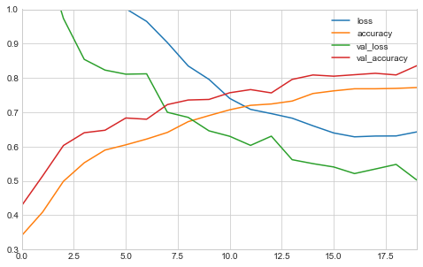
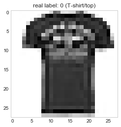

# Chapter 11. Training Deep Neural Networks

Below are a list of the common challenges faced when training a Deep Neural Network (DNN):

* *Vanishing gradients* and *exploding gradients* are when a gradient grow smaller and smaller, or larger and larger, when flowing back through the DNN. This makes training the lower levels difficult.
* More training data is required.
* Each iteration takes longer.
* With more parameters to train, overfitting becomes an even bigger problem.

The following sections will address (more or less) in order.


```python
import numpy as np
import pandas as pd
import matplotlib.pyplot as plt
import tensorflow as tf
from tensorflow import keras
from IPython.core.interactiveshell import InteractiveShell

np.random.seed(0)

plt.style.use('seaborn-whitegrid')
```


```python
%matplotlib inline
```


```python
%load_ext ipycache
```

    /opt/anaconda3/envs/daysOfCode-env/lib/python3.7/site-packages/IPython/config.py:13: ShimWarning: The `IPython.config` package has been deprecated since IPython 4.0. You should import from traitlets.config instead.
      "You should import from traitlets.config instead.", ShimWarning)
    /opt/anaconda3/envs/daysOfCode-env/lib/python3.7/site-packages/ipycache.py:17: UserWarning: IPython.utils.traitlets has moved to a top-level traitlets package.
      from IPython.utils.traitlets import Unicode


## The vanishing/exploding gradients problems

A *vanishing gradient* is when the gradients get smaller and smaller as the training algorithm progresses to to the lower layers.
This results in the parameter weights in the lower layers unchanged from initialization.
An *exploding gradient* is the opposite and the parameter weights get larger and larger and the training diverges.
This is primary a problem in Recurrent NN, discussed in a later chapter.

In 2010, Glorot and Bengio proposed that this was caused by the random initialization procedure commonly used: samples from a normal distribution.
This caused the variance in the initial weight parameters to be greater than that of the input, thus obfuscating the important information.
They proposed an initialization strategy, *Glorot initialization*, such that the variance of the input to the layer is the same as the variance of the output of the layer.
There are other variants of the process that have proven to work better with various activation functions; Table 11-1 on pg. 334 shows the best initialization methods for the activation function of the neuron, and it is replecated below.

| Initialization method | Activation function           | $\sigma^2$           |
|:----------------------|:------------------------------|:---------------------|
| Glorot                | None, tanh, logistic, softmax | $1/fan_{\text{avg}}$ |
| He                    | ReLU and variants             | $2/fan_{\text{in}}$  |
| LeCun                 | SELU                          | $1/fan_{\text{in}}$  |

By default, Keras uses the Glorot initialization with a uniform distribution.
The initialization can also be changed to He initialization by setting the `kernel_initializer` argument to `he_uniform` or `he_normal`:


```python
keras.layers.Dense(10, activation='relu', kernel_initializer='he_normal')
```


    <tensorflow.python.keras.layers.core.Dense at 0x644f50550>


Also, the details of an initializer can be specified by using the `VarianceScaling` class.
The following example uses He initialization with a uniform distribution based on $fan_{\text{avg}}$.


```python
he_avg_init = keras.initializers.VarianceScaling(scale=2.0, 
                                                 mode='fan_avg', 
                                                 distribution='uniform')
keras.layers.Dense(10, activation='sigmoid', kernel_initializer=he_avg_init)
```


    <tensorflow.python.keras.layers.core.Dense at 0x6450ecc90>


### Nonsaturating activation functions

In the same paper, Glorot and Bengio indicated that the activation function of choice, the logistic, was also a problem.
Thus they proposed the *Rectified Linear Unit* (ReLU) for faster and nonsaturating training.
The ReLU wasn't perfect, mainly because, during training, some neurons can "die," meaning that they only output 0 (called a *dying ReLU*).
Therefore, variants emerged such as the *leaky ReLU* (LeakyReLU), *Randomized leaky ReLU* (RRELU), and the *parametric leaky ReLU* (PReLU).
The LeakyReLU includes another hyperparameter $\alpha$ that lets the ReLU have a slightly positive slope when inputs are negative: $\text{LeakyReLU}_\alpha (z) = \max(\alpha z, z)$ (shown below).
The RReLU is the same as the LeakyReLU, but $\alpha$ is picked randomly within a range during training and fixed to an average during testing.
The PReLU is where $\alpha$ is turning into an additional parameter to be learned (this can lead to further overfitting, though).


```python
def leakyReLU(x, alpha=0.01):
    return [i if i>=0 else i*alpha for i in x]

x = np.arange(-4, 5, 1, dtype=np.float64)

plt.plot(x, np.repeat(0, len(x)), 'k-')
plt.plot([0, 0], [-1, 5], 'k-')
plt.plot(x, leakyReLU(x, 0.1), 'b-')
plt.axis([-4, 4, -0.5, 4])
plt.xlabel('$z$', fontsize=12)
plt.ylabel('ouput', fontsize=12)
plt.title('LeakyReLU', fontsize=14)
plt.show()
```


Another useful activation function is the *exponential linear unit* (ELU) that is a linear funciton when the input is greater than 0 and an exponential when it is less than 0:

$$
\begin{aligned}
\text{ELU}_\alpha (z) = \begin{cases}
\alpha (\exp(z) - 1) &\text{ if } z < 0 \\
z                    &\text{ if } z \ge 0
\end{cases}
\end{aligned}
$$

In addition, there is the *scaled ELU* (SELU) that will produce a network that *self-normalizes*, each layer will naturally preserve the output with a mean of 0 and standard deviation of 1.
This is only guaranteed under the following circumstances:

* The ANN must be a stack of dense, sequentially connected layers.
* The input must be standardized to mean 0 and standard deviation 1.
* The layer weights must be initialized with LeCun normal initialization (`kernel_initializer='lecun_normal'`).

Obviously the first bullet is quite a limitation, though researchers have indicated that the SELU can be used in some cases where the layers aren't dense, such as a convolutional neuron network (Chapter 14).

To use a LeakyReLU in keras, it gets added as a separate layer after the layer you want it to apply to.


```python
# An example ANN with a LeakyReLU layer.
model = keras.models.Sequential([
    keras.layers.InputLayer(input_shape=5),
    keras.layers.Dense(10, kernel_initializer='he_normal'),
    keras.layers.LeakyReLU(alpha=0.2),
    keras.layers.Dense(1)
])
```

Below is an example of using the SELU activation function.


```python
keras.layers.Dense(10, activation='selu', kernel_initializer='lecun_normal')
```


    <tensorflow.python.keras.layers.core.Dense at 0x6450fea50>


The author proposes the following order of preference for the activation functions covered above:

> SELU > ELU > LeakyReLU (and its variants) > ReLU > tanh > logistic

though he does provide practical reasons why you would choose one over another.

### Batch normalization

*Batch Normalization* (BN) is another safeguard against the vanishing and exploding gradients problems.
BN zero-centers and normalizes each input, then scales and shifts the result using two new parameter vectors per layer: one for scaling and the other for shifting.
The goal is to learn the optimal scale and mean for the inputs to each layer.
To get final values for the model, a running average is maintained of each layer's mean and standard deviation.

In practice, BN has shown great success in reducing the problem of vanishing and exploding gradients, even when using saturating activation functions.

Though there are performance issues during training because there are now additional layers and parameters to learn, training is often slower because fewer rounds of training are required.
Further, once the model is trained, the new layers from BN can be incorporated into the previous layer.
This is does by updating the previous layer's weights and biases to output the correct scale and offset learned by the BN layer.

Here is an example of using BN with Keras for an image classifier.
It is added just before or after each hidden layer's activation function and as the first layer in the model (after flattening the image, though).


```python
model_1 = keras.models.Sequential([
    keras.layers.Flatten(input_shape = [28, 28]),
    keras.layers.BatchNormalization(),
    keras.layers.Dense(300, activation='elu', kernel_initializer='he_normal'),
    keras.layers.BatchNormalization(),
    keras.layers.Dense(100, activation='elu', kernel_initializer='he_normal'),
    keras.layers.BatchNormalization(),
    keras.layers.Dense(10, activation='softmax'),
])

model_1.summary()
```

    Model: "sequential_1"
    _________________________________________________________________
    Layer (type)                 Output Shape              Param #   
    =================================================================
    flatten (Flatten)            (None, 784)               0         
    _________________________________________________________________
    batch_normalization (BatchNo (None, 784)               3136      
    _________________________________________________________________
    dense_5 (Dense)              (None, 300)               235500    
    _________________________________________________________________
    batch_normalization_1 (Batch (None, 300)               1200      
    _________________________________________________________________
    dense_6 (Dense)              (None, 100)               30100     
    _________________________________________________________________
    batch_normalization_2 (Batch (None, 100)               400       
    _________________________________________________________________
    dense_7 (Dense)              (None, 10)                1010      
    =================================================================
    Total params: 271,346
    Trainable params: 268,978
    Non-trainable params: 2,368
    _________________________________________________________________


There is some disagreement over whether the BN layer should be added before or after the activation functions.
Below is an example of creating a model with the BN layer *before* the activation function.
The activation functions must be separated from the hidden layers and added separately after the BN layers.


```python
model_2 = keras.models.Sequential([
    keras.layers.Flatten(input_shape=[28, 28]),
    keras.layers.BatchNormalization(),
    keras.layers.Dense(300, kernel_initializer='he_normal', use_bias=False),
    keras.layers.BatchNormalization(),
    keras.layers.Activation('elu'),
    keras.layers.Dense(100, kernel_initializer='he_normal', use_bias=False),
    keras.layers.BatchNormalization(),
    keras.layers.Activation('elu'),
    keras.layers.Dense(10, activation='softmax')
])

model_2.summary()
```

    Model: "sequential_2"
    _________________________________________________________________
    Layer (type)                 Output Shape              Param #   
    =================================================================
    flatten_1 (Flatten)          (None, 784)               0         
    _________________________________________________________________
    batch_normalization_3 (Batch (None, 784)               3136      
    _________________________________________________________________
    dense_8 (Dense)              (None, 300)               235200    
    _________________________________________________________________
    batch_normalization_4 (Batch (None, 300)               1200      
    _________________________________________________________________
    activation (Activation)      (None, 300)               0         
    _________________________________________________________________
    dense_9 (Dense)              (None, 100)               30000     
    _________________________________________________________________
    batch_normalization_5 (Batch (None, 100)               400       
    _________________________________________________________________
    activation_1 (Activation)    (None, 100)               0         
    _________________________________________________________________
    dense_10 (Dense)             (None, 10)                1010      
    =================================================================
    Total params: 270,946
    Trainable params: 268,578
    Non-trainable params: 2,368
    _________________________________________________________________


The "non-trainable" parameters the running averages for the means and standard deviations of each BN layer because they are not trained by the back-propagation.
Below are the parameters for the first BN layer.


```python
[(var.name, var.trainable) for var in model_1.layers[1].variables]
```


    [('batch_normalization/gamma:0', True),
     ('batch_normalization/beta:0', True),
     ('batch_normalization/moving_mean:0', False),
     ('batch_normalization/moving_variance:0', False)]


Generally, the default hyperparamters for BN are good enough.
The two that may be worth changing are `momentum` and `axis`.
The momentum determines how much the newly computed batch means and standard deviations ($\textbf{v}$) should contribute to the running parameter averages weights ($\hat{\textbf{v}}$):

$\hat{\textbf{v}} \leftarrow \hat{\textbf{v}} \times \text{momentum} + \textbf{v} \times (1 - \text{momentum})$

The axis argument determines on which axis or axes the normalization occurs.
The default is the last axis, which for flat input data is good, but is not likely applicable for input data matrices with greater than two dimensions.

### Gradient clipping

The maximum and minimum gradient can be set to prevent exploding gradients.
Two parameters in `keras.optimizers.SGD()` can be set to do this.
The first, `clipvalue`, sets the minimum and maximum values and then just reduces any gradient over/under the values to the maximum/minimum value.
Thus, if `clipvalue=1.0` then the maximum and minimum gradients are [-1.0, 1.0] and a gradient of [0.7, 1.1] is clipped to [0.7, 1.0].
The main problem with setting the `clipvalue` is that is changes the *direction* of the gradient.
This is resolved by setting `clipnorm` which scales the gradient such that all the individual values fit within the limit, thus not changing the direction, just the magnitude of the gradient.
For example if `clipnorm=1.0` then the vector [0.9, 100.0] becomes [0.00899964, 0.9999595] instead of [0.9, 1.0] with `clipvalue=1.0`.

### Using pretrained layers

The author advises that, "It is generally not a good idea to train a very large DNN from scratch," (HOML, pp. 345).
Instead, a pretrained DNN can be downloaded and most of the layers reused.
This is called *transfer learning*.
The upsides are that is will speed up training considerably and requires less training data.

In general, it is best to begin by retraining the upper layers while "freezing" the lower layers because they are more likely to have learned generalizable patterns.
The more similar the new task is to the one for the original model, the more layers can be reused.
Here is a process that will be generally advisable for *transfer learning*:

1. Freeze all of the reused layers, train, and validate. This would only be training the output layer that is custom for the problem at hand.
2. Unfreeze the top one or two layers, train, and validate. This lets back propagation train the last one or two layers in the network, leaving most of them untouched. 
3. If you have a lot of training data, you can unfreeze more layers. It is advisable to reduce the learning rate, though.
4. Finally, try experimenting with adding additional layers or replacing the last few layers of the original model.

### Transfer learning with Keras

Below is an example of training `model_B` on top of `model_A`.
First, `model_A` is created, trained, and saved to file.


```python
from sklearn.model_selection import train_test_split
import pathlib

# Pepare data.
fashion_mnist = keras.datasets.fashion_mnist
(X_train_full, y_train_full), (X_test, y_test) = fashion_mnist.load_data()

class_names = ["T-shirt/top", "Trouser", "Pullover", "Dress", "Coat", "Sandal", 
               "Shirt", "Sneaker", "Bag", "Ankle boot"]

# Split into training and validation data.
X_train, X_valid, y_train, y_valid = train_test_split(X_train_full,
                                                      y_train_full,
                                                      test_size=0.2,
                                                      random_state=0)

# Construct model A
model_A = keras.models.Sequential([
    keras.layers.Flatten(input_shape = X_train.shape[1:]),
    keras.layers.Dense(300, activation='elu', kernel_initializer='he_normal'),
    keras.layers.Dense(200, activation='elu', kernel_initializer='he_normal'),
    keras.layers.Dense(100, activation='elu', kernel_initializer='he_normal'),
    keras.layers.Dense(50, activation='elu', kernel_initializer='he_normal'),
    keras.layers.Dense(50, activation='elu', kernel_initializer='he_normal'),
    keras.layers.Dense(50, activation='elu', kernel_initializer='he_normal'),
    keras.layers.Dense(10, activation='softmax'),
])

# Compile model A
model_A.compile(
    loss='sparse_categorical_crossentropy',
    optimizer=keras.optimizers.SGD(learning_rate=1e-4),
    metrics=['accuracy']
)

# Train model A (only a few epochs)
history_A = model_A.fit(
    X_train, y_train,
    epochs=3,
    validation_split=0.2,
    verbose=1
)

# Save model to file.
model_A_path = pathlib.Path("assets/ch06/ch11/model_A.h5")
model_A.save(model_A_path.as_posix())
```

    Train on 38400 samples, validate on 9600 samples
    Epoch 1/3
    38400/38400 [==============================] - 11s 290us/sample - loss: 3.1552 - accuracy: 0.6259 - val_loss: 1.2860 - val_accuracy: 0.6743
    Epoch 2/3
    38400/38400 [==============================] - 12s 309us/sample - loss: 1.0561 - accuracy: 0.7038 - val_loss: 0.9858 - val_accuracy: 0.7094
    Epoch 3/3
    38400/38400 [==============================] - 11s 298us/sample - loss: 0.8433 - accuracy: 0.7348 - val_loss: 0.8872 - val_accuracy: 0.7329


Now the transfer learning can begin.
First, model A is read in from file.
Then `model_B_on_A` consists of all but the last layer of model A and a new layer is added for model B.
The goal of model B is to classify the fashion image as shirt (positive) or sandal (negative). 


```python
# Get training data for just Shirts and Sandals.
train_idx = [(y==0 or y==5) for y in y_train]
X_train_B = X_train[train_idx, :, :]
y_train_B = y_train[train_idx]
y_train_B = (np.array(y_train_B) == 5)

model_A = keras.models.load_model(model_A_path.as_posix())
model_B_on_A = keras.models.Sequential(model_A.layers[:-1])
model_B_on_A.add(keras.layers.Dense(1, activation='sigmoid'))
```

However, the training of `model_B_on_A` will change the layers in `model_A`.
If this is not wanted, then model A must be cloned and the weights copied.
An example of this is shown below.


```python
# Clone the model.
model_A_clone = keras.models.clone_model(model_A)

# Copy the weights (not does by `clone_model()` method.)
model_A_clone.set_weights(model_A.get_weights())
```

Now we can train `model_B_on_A`.
However, we want to freeze the layers from model A for the first few epochs.
It is important to remember to recompile the model after layers are (un)frozen.


```python
# Freeze original layers for first training rounds.
for layer in model_B_on_A.layers[:-1]:
    layer.trainable = False

# Recompile the model with only the top layer to be trained.
model_B_on_A.compile(loss='binary_crossentropy',
                     optimizer=keras.optimizers.SGD(learning_rate=1e-3),
                     metrics=['accuracy'])

# Train the top layer.
history = model_B_on_A.fit(X_train_B, y_train_B, epochs=4, validation_split=0.2)
```

    Train on 7676 samples, validate on 1920 samples
    Epoch 1/4
    7676/7676 [==============================] - 3s 345us/sample - loss: 0.1703 - accuracy: 0.9586 - val_loss: 0.0930 - val_accuracy: 0.9781
    Epoch 2/4
    7676/7676 [==============================] - 2s 200us/sample - loss: 0.0939 - accuracy: 0.9795 - val_loss: 0.0646 - val_accuracy: 0.9812
    Epoch 3/4
    7676/7676 [==============================] - 2s 204us/sample - loss: 0.0795 - accuracy: 0.9822 - val_loss: 0.0575 - val_accuracy: 0.9823
    Epoch 4/4
    7676/7676 [==============================] - 2s 203us/sample - loss: 0.0729 - accuracy: 0.9827 - val_loss: 0.0607 - val_accuracy: 0.9859


Then the lower layers can be unfrozen, the model recompiled, and additional rounds of training run.
Note that the learning rate is reduced by an order of magnitude.


```python
for layer in model_B_on_A.layers:
    layer.trainable = True

model_B_on_A.compile(loss='binary_crossentropy',
                     optimizer=keras.optimizers.SGD(learning_rate=1e-4),
                     metrics=['accuracy'])

history = model_B_on_A.fit(X_train_B, y_train_B, epochs=4, validation_split=0.2)
```

    Train on 7676 samples, validate on 1920 samples
    Epoch 1/4
    7676/7676 [==============================] - 3s 443us/sample - loss: 0.0583 - accuracy: 0.9876 - val_loss: 0.0315 - val_accuracy: 0.9911
    Epoch 2/4
    7676/7676 [==============================] - 2s 271us/sample - loss: 0.0376 - accuracy: 0.9914 - val_loss: 0.0247 - val_accuracy: 0.9927
    Epoch 3/4
    7676/7676 [==============================] - 2s 276us/sample - loss: 0.0282 - accuracy: 0.9935 - val_loss: 0.0252 - val_accuracy: 0.9922
    Epoch 4/4
    7676/7676 [==============================] - 2s 273us/sample - loss: 0.0228 - accuracy: 0.9950 - val_loss: 0.0193 - val_accuracy: 0.9937


```python
test_idx = [(y==0 or y==5) for y in y_test]
X_test_B = X_test[test_idx, :, :]
y_test_B = (np.array(y_test[test_idx]) == 5)

test_loss, test_accuracy = model_B_on_A.evaluate(X_test_B, y_test_B, verbose=0)

print(f'    test loss: {np.round(test_loss, 3)}')
print(f'test accuracy: {np.round(test_accuracy * 100, 3)}%')
```

        test loss: 0.039
    test accuracy: 99.25%


**In general, transfer learning is only useful for *very* deep networks, specifically convolutional neural networks (CNN, Chapter 14).**
This is likely because shallow networks do not learn generalizable patterns in the lower layers while CNNs do.

### Unsupervised pretraining

If there is little labeled data and no previously trained model you can use with transfer learning, unlabeled data can be used for *unsupervised pretraining*.
This is where an unsupervised model, often an autoencoder or generative adversarial network (GAN; Chapter 17) are trained on the unlabeled data and then the layers of the model are used as the lower layers for a DNN.

### Pretraining on auxiliary data

Another alternative for when there is little labeled data is to train a DNN on a related task where there is plenty of data, and then use the trained lower layers for another DNN for your desired task.

## Fast optimizers

Another way to reduce the amount of time required for training is to use a better optimizer than SGD.
Below are some of the most common options.

### Momentum optimization

If a ball is rolling down a hill with a constant slope, it will speed up over time even though the gradient has not changed.
This is the intuition behind *momentum optimization*.
At each iteration, the local gradient is subtracted from the *momentum vector* $\textbf{m}$ and updates the weights by adding the momentum vector.
This way, the gradient acts  more as acceleration than as the speed.
Below are the equations for calculating the momentum vector and then the parameter weights where $\beta$ is the momentum, a parameter to limit the momentum vector, and $\eta$ is  the learning rate, and $J(\theta)$ is the cost function for the current value of the networks parameters $\theta$.

$
\textbf{m} \leftarrow \beta \textbf{m} -  \eta \nabla_{\theta} J(\theta) \\
\theta \leftarrow \theta + \textbf{m}
$

To use the momentum optimization in keras, set the `momentum` parameter in the the `SGD` optimizer.


```python
keras.optimizers.SGD(learning_rate=1e-3, momentum=0.9)
```


    <tensorflow.python.keras.optimizer_v2.gradient_descent.SGD at 0x1a56f3ef90>


### Nesterov accelerated gradient

The *Nesterov accelerated gradient* (NAG) is a slight enhancement of momentum optimization.
It measures the gradient not at the current location in the parameter space, but slightly ahead at $\theta + \beta \textbf{m}$:

$
\textbf{m} \leftarrow \beta \textbf{m} -  \eta \nabla_{\theta} J(\theta + \beta \textbf{m}) \\
\theta \leftarrow \theta + \textbf{m}
$

It generally helps by slightly adjusting the current direction of the momentum vector towards the minima.
It is trivial to implement in keras, and because it is usually faster than momentum optimization, it is recommended to apply:


```python
keras.optimizers.SGD(learning_rate=1e-3, momentum=0.9, nesterov=True)
```


    <tensorflow.python.keras.optimizer_v2.gradient_descent.SGD at 0x1a57b8b310>


### AdaGrad

AdaGrad uses an *adaptive learning rate* strategy to scale (decay) the learning rate faster for steeper dimensions.
It is very simillar to SGD, but divides the loss for each parameter by the square of the gradient (with an additional smoothing value $\epsilon$):

$
\textbf{s} \leftarrow \textbf{s} + \nabla_\theta J(\theta) \otimes \nabla_\theta J(\theta)  \\
\theta \leftarrow \theta - \eta \nabla_\theta J(\theta) \oslash \sqrt{\textbf{s} + \epsilon}
$

**AdaGrad scales the learning rate too quickly for training DNNs - do NOT use it.**


```python
keras.optimizers.Adagrad(learning_rate=1e-3, epsilon=1e-7)
```


    <tensorflow.python.keras.optimizer_v2.adagrad.Adagrad at 0x1a57d4bb90>


(The default behaviour of many optimizers is to use `keras.backend.epsilon()` of `epsilon`.
It is effectively a global variable that can be set using `keras.backend.set_epsilon()`.
If the default value for `epsilon` is `None`, then it is likely using this value.)

### RMSProp

This is simillar to AdaGrad, but fixes the issue of decaying the gradient too quickly by accumulating only the more recent gradients, where $\beta$ is  the decay rate (the memory):

$
\textbf{s} \leftarrow \beta \textbf{s} + (1 - \beta) \nabla_\theta J(\theta) \otimes \nabla_\theta J(\theta)  \\
\theta \leftarrow \theta - \eta \nabla_\theta J(\theta) \oslash \sqrt{\textbf{s} + \epsilon}
$

$\beta$ is another hyperparameter to tune, though the default value of 0.9 is usually sufficient.


```python
keras.optimizers.RMSprop(learning_rate=1e-3, rho=0.9)
```


    <tensorflow.python.keras.optimizer_v2.rmsprop.RMSprop at 0x1a57ebf5d0>


### Adam and  Nadam  Optimization

The *adaptive moment estimation* (Adam) optimizer uses a combination of momentum optimization and RMSProp (the simillarities are quite obvious in the algorithm on pp. 356 of *HOML*.
There are three hyperparameters to set, though the defaults (used below) are usually sufficient.


```python
keras.optimizers.Adam(learning_rate=1e-3, 
                      beta_1=0.9, 
                      beta_2=0.999, 
                      epsilon=1e-7)
```


    <tensorflow.python.keras.optimizer_v2.adam.Adam at 0x1a57ebfd10>


There are two optimizers derived from Adam that the author touched upon.
*AdaMax* is a reworking of the Adam algorithm to make it a bit more stable.
Still, Adam tends to perform better.
*Nadam* is Adam with the Nesterov trick.
It usually converges faster and is generally recommended to try it out.


```python
# AdaMax optimizer (default arguments)
keras.optimizers.Adamax(learning_rate=0.001,
                        beta_1=0.9,
                        beta_2=0.999,
                        epsilon=1e-07)

# Nadam optimizer (default arguments)
keras.optimizers.Nadam(learning_rate=0.001,
                       beta_1=0.9,
                       beta_2=0.999,
                       epsilon=1e-07)
```


    <tensorflow.python.keras.optimizer_v2.nadam.Nadam at 0x1a57d36250>


### Learning Rate Scheduling

A dynamic learning rate, one that changes during the training, is usually better than a static learning rate.
Here are some of the more popular *learning schedules*.

* **Power scheduling**: The learning rate is a function of the iteration number $t$: $\eta(t) = \eta_0 / (1 + t/s)^c$ where $s$, $c$, and $\eta_0$ are all hyperparameters to tune. This equation drops the learning rate quickly at first, but then the changes are smaller.
* **Exponential scheduling**: Set the learning rate to $\eta(t) = \eta_0 0.1^{t/s}$. This equation reduces the learning rate by a factor of 10 every $s$ steps.
* **Piecewise constant scheduling**: Assign specific learning rates to each range of training iterations.
* **Performance scheduling**: Measure the validation error every $N$ steps and reduce the learning rate by a factor of  $\gamma$ when the error stops dropping.
* **Icycle scheduling**: This is a more complicated schedule that raises the learning rate linearly during the first half of training, and then reduces it linearly in the second half. It does the opposite for the momentum.

Implementing these in keras is pretty easy.
First, power  scheduling can be accomplished using the `decay` argument in the `SGD` optimizer class. (The $c$ hyperparameter is automatically set to 1.)


```python
keras.optimizers.SGD(learning_rate=1e-2, momentum=0.9, decay=1e-4)
```


    <tensorflow.python.keras.optimizer_v2.gradient_descent.SGD at 0x644b63d90>


Implementing exponential scheduling is fairly straightforward, too.
First, a function that takes the iteration number and returns the learning rate must be defined.
Then, a `LearningRateScheduler` callback is made an provided the function.
The callback is then passed to the `fit()` method.

Here, the function `exponential_decay()` takes the initial learning rate and $s$ hyperparameter value and returns another function that implements the exponential decay scheduler for a given epoch.


```python
def exponential_decay(lr0, s):
    """Return a LR scheduling function with the desired hyperparameters."""
    return lambda epoch: lr0 * 0.1**(epoch / s)

# Learning rate scheduling function with initial learning rate and s.
exponential_decay_fn = exponential_decay(lr0=0.01, s=20)

# A learning rate scheduler callback to implement the exponential scheduler.
lr_scheduler = keras.callbacks.LearningRateScheduler(exponential_decay_fn)

# Pass `lr_scheduler` to the `fit()` method for training.
```

If needed, the schedule function can take the current learning rate as a second argument.

The *performance scheduler* can be implemented using the `ReduceLROnPlateau` callback.
It multiplies the current learning rate by a desired factor after a certain number of epochs without improvement.


```python
keras.callbacks.ReduceLROnPlateau(factor=0.5, patience=5)
```


    <tensorflow.python.keras.callbacks.ReduceLROnPlateau at 0x1a57d57e10>


TensorFlow's implementation of Keras offers the ability to define a learning rate schedule using an object in `keras.optimizers.schedules` and then pass it to an optimizer.
**This approach updates the learing rate at each step rather than at each epoch.**
Below is an example of exponential decay where the number of steps is the total number of training steps in 20 epochs and a batch size of 32.


```python
# Training hyperparameters.
n_epochs = 20
batch_size = 32

# Learning rate scheduler.
s = n_epochs * len(X_train) // batch_size
learning_rate = keras.optimizers.schedules.ExponentialDecay(0.01, s, 0.1)

# SGD using the exponential LR scheduler.
optimizer =  keras.optimizers.SGD(learning_rate)
```

## Avoiding overfitting through regularization

We have already covered two powerful techniques that act like regularization: early stopping and Batch Normalization.

### $\ell_1$ and $\ell_2$ regularization

Both $\ell_1$ and $\ell_2$ can easily be used to constrain a layer's weights. 
$\ell_1$ forces more weights to 0 and thus creates more sparse networks.
Here is an example of a dense layer that applies $\ell_2$ regularization to its connection weights with a regularization factor of 0.01 (how strong of a penalty to use):


```python
keras.layers.Dense(100,
                   activation='elu',
                   kernel_initializer='he_normal',
                   kernel_regularizer=keras.regularizers.l2(0.01))
```


    <tensorflow.python.keras.layers.core.Dense at 0x1a5793de10>


However, defining this for each layer of a network would become repetitive.
One way around this would be to implement a for-loop.
Alternatively, Python's `functools.partial()`, a function that can create a thin wrapper for any callable, can be used to create a proto-layer with desireable defaults.


```python
from functools import partial

# A wrapper around a Dense layer with L2-regularization.
RegularizedDense = partial(
    keras.layers.Dense,
    activation='elu',
    kernel_initializer='he_normal',
    kernel_regularizer=keras.regularizers.l2(0.01)
)

# A sequential model.
model = keras.models.Sequential([
    keras.layers.Flatten(input_shape=[28, 28]),
    RegularizedDense(300),
    RegularizedDense(100),
    RegularizedDense(10, 
                     activation='softmax', 
                     kernel_initializer='glorot_uniform'),
])
```

### Dropout

*Dropout* is the process of removing some neurons randomly during training and it has  proven to  be a very powerful regularization technique.
At each training step, each neuron - except for output neurons - has a probability $p$ of being ignored - all of its inputs and outputs are set to 0.
Thus, because each neuron can be either present or absent, there are effectively $2^N$ neural networks being trained and averaged together.
The intuition as to why this works is that the neurons cannot rely on just one or two of its neighbors, but must diversify, thus regularizing its input weights.
Note that dropout is only present during training and not testing or production use of the ANN.
Thus there is a step to compensate each input (or output) weight for the increased number of neurons.

In Keras, adding dropout to an ANN is done with a `keras.layers.Dropout()` layer.
Note that the input nodes can dropout, but not the output nodes.


```python
dropout_rate = 0.2

model = keras.models.Sequential([
    keras.layers.Flatten(input_shape=[28, 28]),
    keras.layers.Dropout(rate=dropout_rate),
    keras.layers.Dense(300, activation='elu', kernel_initializer='he_normal'),
    keras.layers.Dropout(rate=dropout_rate),
    keras.layers.Dense(100, activation='elu', kernel_initializer='he_normal'),
    keras.layers.Dropout(rate=dropout_rate),
    keras.layers.Dense(10, activation='softmax')
])
model.summary()
```

    Model: "sequential_6"
    _________________________________________________________________
    Layer (type)                 Output Shape              Param #   
    =================================================================
    flatten_4 (Flatten)          (None, 784)               0         
    _________________________________________________________________
    dropout (Dropout)            (None, 784)               0         
    _________________________________________________________________
    dense_23 (Dense)             (None, 300)               235500    
    _________________________________________________________________
    dropout_1 (Dropout)          (None, 300)               0         
    _________________________________________________________________
    dense_24 (Dense)             (None, 100)               30100     
    _________________________________________________________________
    dropout_2 (Dropout)          (None, 100)               0         
    _________________________________________________________________
    dense_25 (Dense)             (None, 10)                1010      
    =================================================================
    Total params: 266,610
    Trainable params: 266,610
    Non-trainable params: 0
    _________________________________________________________________


If the model is overfitting, then try increasing the dropout rate.
The opposite is recommended for underfitting the training data.
It can also help to increase the dropout rate for larger layers.
Finally, many state-of-the-art networks only use dropout on the final hidden layer - this may be worth trying if the model is underfitting the training data severely.

### Monte Carlo (MC) Dropout

The dropout implemented during training can be used to increase the accuracy and confidence predictions for a neural network during testing and production.
It effectively uses the dropout as Monte Carlo simulation, and gets multiple predictions on each instance, combining them all into a more robust and insightful prediction.

Below is an example of using this process on the Fashion MNIST data.
First, the model created above is trained.


```python
# Compile using SGD with faster options.
# optimizer = keras.optimizers.SGD(learning_rate=1e-2, nesterov=True)
optimizer = keras.optimizers.Adam(learning_rate=1e-3)
model.compile(
    loss='sparse_categorical_crossentropy',
    optimizer=optimizer,
    metrics=['accuracy']
)

# Fit on Fashion MNIST training data.
history = model.fit(X_train,
                    y_train,
                    validation_split=0.2,
                    callbacks=[keras.callbacks.EarlyStopping(patience=5)],
                    epochs=20)
```

    Train on 38400 samples, validate on 9600 samples
    Epoch 1/20
    38400/38400 [==============================] - 15s 391us/sample - loss: 4.5875 - accuracy: 0.3413 - val_loss: 1.3344 - val_accuracy: 0.4289
    Epoch 2/20
    38400/38400 [==============================] - 14s 370us/sample - loss: 1.5698 - accuracy: 0.4093 - val_loss: 1.1722 - val_accuracy: 0.5146
    Epoch 3/20
    38400/38400 [==============================] - 14s 374us/sample - loss: 1.3145 - accuracy: 0.4990 - val_loss: 0.9734 - val_accuracy: 0.6032
    Epoch 4/20
    38400/38400 [==============================] - 14s 371us/sample - loss: 1.1557 - accuracy: 0.5529 - val_loss: 0.8541 - val_accuracy: 0.6404
    Epoch 5/20
    38400/38400 [==============================] - 15s 380us/sample - loss: 1.0513 - accuracy: 0.5899 - val_loss: 0.8229 - val_accuracy: 0.6477
    Epoch 6/20
    38400/38400 [==============================] - 14s 369us/sample - loss: 1.0017 - accuracy: 0.6051 - val_loss: 0.8110 - val_accuracy: 0.6833
    Epoch 7/20
    38400/38400 [==============================] - 17s 439us/sample - loss: 0.9648 - accuracy: 0.6220 - val_loss: 0.8120 - val_accuracy: 0.6797
    Epoch 8/20
    38400/38400 [==============================] - 15s 383us/sample - loss: 0.9030 - accuracy: 0.6413 - val_loss: 0.6999 - val_accuracy: 0.7224
    Epoch 9/20
    38400/38400 [==============================] - 15s 386us/sample - loss: 0.8349 - accuracy: 0.6727 - val_loss: 0.6851 - val_accuracy: 0.7357
    Epoch 10/20
    38400/38400 [==============================] - 15s 387us/sample - loss: 0.7958 - accuracy: 0.6904 - val_loss: 0.6459 - val_accuracy: 0.7374
    Epoch 11/20
    38400/38400 [==============================] - 15s 398us/sample - loss: 0.7403 - accuracy: 0.7073 - val_loss: 0.6300 - val_accuracy: 0.7569
    Epoch 12/20
    38400/38400 [==============================] - 15s 390us/sample - loss: 0.7084 - accuracy: 0.7202 - val_loss: 0.6036 - val_accuracy: 0.7660
    Epoch 13/20
    38400/38400 [==============================] - 15s 393us/sample - loss: 0.6961 - accuracy: 0.7242 - val_loss: 0.6304 - val_accuracy: 0.7565
    Epoch 14/20
    38400/38400 [==============================] - 15s 392us/sample - loss: 0.6828 - accuracy: 0.7327 - val_loss: 0.5619 - val_accuracy: 0.7957
    Epoch 15/20
    38400/38400 [==============================] - 15s 402us/sample - loss: 0.6606 - accuracy: 0.7546 - val_loss: 0.5504 - val_accuracy: 0.8086
    Epoch 16/20
    38400/38400 [==============================] - 15s 399us/sample - loss: 0.6397 - accuracy: 0.7624 - val_loss: 0.5407 - val_accuracy: 0.8051
    Epoch 17/20
    38400/38400 [==============================] - 15s 397us/sample - loss: 0.6285 - accuracy: 0.7684 - val_loss: 0.5215 - val_accuracy: 0.8094
    Epoch 18/20
    38400/38400 [==============================] - 15s 392us/sample - loss: 0.6307 - accuracy: 0.7685 - val_loss: 0.5347 - val_accuracy: 0.8135
    Epoch 19/20
    38400/38400 [==============================] - 15s 396us/sample - loss: 0.6310 - accuracy: 0.7696 - val_loss: 0.5482 - val_accuracy: 0.8087
    Epoch 20/20
    38400/38400 [==============================] - 15s 393us/sample - loss: 0.6429 - accuracy: 0.7720 - val_loss: 0.5024 - val_accuracy: 0.8357


```python
pd.DataFrame(history.history).plot(figsize=(8, 5))
plt.axis([0, 19, 0.3, 1])
plt.show()
```





MC Dropout calls for making many predictions on the same test data and then averaging across each prediction.
Below, we make 100 predictions and then average along the first axis (`axis=0`).


```python
y_probas = np.stack([model(X_valid.astype(np.float32), training=True) for sample in range(100)])
y_probas.shape
```


    (100, 12000, 10)


```python
y_proba = y_probas.mean(axis=0)
y_proba.shape
```


    (12000, 10)


Below, we show the image of the first training data followed by the prediction probabilities made by the trained model and the prediction probabilities estimated using MC Dropout.


```python
i = 0
plt.imshow(X_valid[i, :, :])
plt.grid(False)
plt.title(f'real label: {y_valid[i]} ({class_names[y_valid[i]]})')
plt.show()
```





```python
# Prediction prbobabilities from the model.
np.round(model.predict_proba(X_valid[i:i+1, :, :]), 2)
```


    array([[1., 0., 0., 0., 0., 0., 0., 0., 0., 0.]], dtype=float32)


```python
# Prediction probabilities using MC Dropout.
np.round(y_proba[i], 2)
```


    array([0.98, 0.  , 0.  , 0.01, 0.  , 0.  , 0.01, 0.  , 0.  , 0.  ],
          dtype=float32)


As shown above, the model indicates certainty of its choice, while the MC Dropout shows that it isn't 100% confident.
While the difference in this example isn't great, testing instances 2 and 3 show that there can be a significant reduction in the confidence of the model.


```python
print(list(np.round(model.predict_proba(X_valid[1:2, :, :]), 2).ravel()))
print(list(np.round(y_proba[1], 2)))
```

    [0.04, 0.0, 0.61, 0.03, 0.16, 0.01, 0.14, 0.01, 0.01, 0.0]
    [0.05, 0.0, 0.56, 0.03, 0.15, 0.01, 0.18, 0.01, 0.02, 0.0]


```python
print(list(np.round(model.predict_proba(X_valid[2:3, :, :]), 2).ravel()))
print(list(np.round(y_proba[2], 2)))
print(f'real label: {y_valid[2]}')
```

    [0.67, 0.0, 0.01, 0.0, 0.0, 0.0, 0.31, 0.0, 0.0, 0.0]
    [0.64, 0.0, 0.03, 0.02, 0.01, 0.0, 0.29, 0.0, 0.01, 0.0]
    real label: 6


A useful trick to to take the standard deviation across all of the prediction probabilities.
This can provide a better model for the prediction certainty.


```python
# Calculate the standard deviation of prediction values for each instance.
y_std = y_probas.std(axis=0)

# Show the prediction probs and the stadnard deviations for a test instance.
print('predictions:', list(np.round(y_proba[1], 2)))
print('  std. dev.:', list(np.round(y_std[1], 2)))
```

    predictions: [0.05, 0.0, 0.56, 0.03, 0.15, 0.01, 0.18, 0.01, 0.02, 0.0]
      std. dev.: [0.03, 0.0, 0.11, 0.01, 0.03, 0.0, 0.07, 0.0, 0.02, 0.0]


In practice, it is not generally advisable to get the model predictions by passing `training=True` because other layers may react to the parameter (e.g. Batch Normalization).
Thus it is preferable to subclass `Dropout` and override the `call()` method.


```python
class MCDropout(keras.layers.Dropout):
    """A Monte Carlo Dropout layer."""
    def call(self, inputs):
        return super().call(inputs, training=True)
```

### Max-Norm Regularization


```python

```
