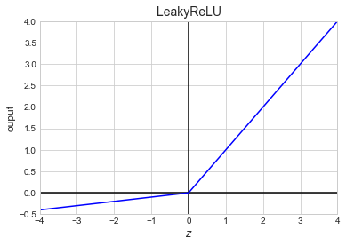

# Chapter 11. Training Deep Neural Networks

Below are a list of the common challenges faced when training a Deep Neural Network (DNN):

* *Vanishing gradients* and *exploding gradients* are when a gradient grow smaller and smaller, or larger and larger, when flowing back through the DNN. This makes training the lower levels difficult.
* More training data is required.
* Each iteration takes longer.
* With more parameters to train, overfitting becomes an even bigger problem.

The following sections will address (more or less) in order.


```python
import numpy as np
import pandas as pd
import matplotlib.pyplot as plt
import tensorflow as tf
from tensorflow import keras
from IPython.core.interactiveshell import InteractiveShell

np.random.seed(0)

plt.style.use('seaborn-whitegrid')
```


```python
%matplotlib inline
```


```python
%load_ext ipycache
```

    /opt/anaconda3/envs/daysOfCode-env/lib/python3.7/site-packages/IPython/config.py:13: ShimWarning: The `IPython.config` package has been deprecated since IPython 4.0. You should import from traitlets.config instead.
      "You should import from traitlets.config instead.", ShimWarning)
    /opt/anaconda3/envs/daysOfCode-env/lib/python3.7/site-packages/ipycache.py:17: UserWarning: IPython.utils.traitlets has moved to a top-level traitlets package.
      from IPython.utils.traitlets import Unicode


## The vanishing/exploding gradients problems

A *vanishing gradient* is when the gradients get smaller and smaller as the training algorithm progresses to to the lower layers.
This results in the parameter weights in the lower layers unchanged from initialization.
An *exploding gradient* is the opposite and the parameter weights get larger and larger and the training diverges.
This is primary a problem in Recurrent NN, discussed in a later chapter.

In 2010, Glorot and Bengio proposed that this was caused by the random initialization procedure commonly used: samples from a normal distribution.
This caused the variance in the initial weight parameters to be greater than that of the input, thus obfuscating the important information.
They proposed an initialization strategy, *Glorot initialization*, such that the variance of the input to the layer is the same as the variance of the output of the layer.
There are other variants of the process that have proven to work better with various activation functions; Table 11-1 on pg. 334 shows the best initialization methods for the activation function of the neuron, and it is replecated below.

| Initialization method | Activation function           | $\sigma^2$           |
|:----------------------|:------------------------------|:---------------------|
| Glorot                | None, tanh, logistic, softmax | $1/fan_{\text{avg}}$ |
| He                    | ReLU and variants             | $2/fan_{\text{in}}$  |
| LeCun                 | SELU                          | $1/fan_{\text{in}}$  |

By default, Keras uses the Glorot initialization with a uniform distribution.
The initialization can also be changed to He initialization by setting the `kernel_initializer` argument to `he_uniform` or `he_normal`:


```python
keras.layers.Dense(10, activation='relu', kernel_initializer='he_normal')
```


    <tensorflow.python.keras.layers.core.Dense at 0x64087f590>


Also, the details of an initializer can be specified by using the `VarianceScaling` class.
The following example uses He initialization with a uniform distribution based on $fan_{\text{avg}}$.


```python
he_avg_init = keras.initializers.VarianceScaling(scale=2.0, 
                                                 mode='fan_avg', 
                                                 distribution='uniform')
keras.layers.Dense(10, activation='sigmoid', kernel_initializer=he_avg_init)
```


    <tensorflow.python.keras.layers.core.Dense at 0x640892fd0>


### Nonsaturating activation functions

In the same paper, Glorot and Bengio indicated that the activation function of choice, the logistic, was also a problem.
Thus they proposed the *Rectified Linear Unit* (ReLU) for faster and nonsaturating training.
The ReLU wasn't perfect, mainly because, during training, some neurons can "die," meaning that they only output 0 (called a *dying ReLU*).
Therefore, variants emerged such as the *leaky ReLU* (LeakyReLU), *Randomized leaky ReLU* (RRELU), and the *parametric leaky ReLU* (PReLU).
The LeakyReLU includes another hyperparameter $\alpha$ that lets the ReLU have a slightly positive slope when inputs are negative: $\text{LeakyReLU}_\alpha (z) = \max(\alpha z, z)$ (shown below).
The RReLU is the same as the LeakyReLU, but $\alpha$ is picked randomly within a range during training and fixed to an average during testing.
The PReLU is where $\alpha$ is turning into an additional parameter to be learned (this can lead to further overfitting, though).


```python
def leakyReLU(x, alpha=0.01):
    return [i if i>=0 else i*alpha for i in x]

x = np.arange(-4, 5, 1, dtype=np.float64)

plt.plot(x, np.repeat(0, len(x)), 'k-')
plt.plot([0, 0], [-1, 5], 'k-')
plt.plot(x, leakyReLU(x, 0.1), 'b-')
plt.axis([-4, 4, -0.5, 4])
plt.xlabel('$z$', fontsize=12)
plt.ylabel('ouput', fontsize=12)
plt.title('LeakyReLU', fontsize=14)
plt.show()
```





Another useful activation function is the *exponential linear unit* (ELU) that is a linear funciton when the input is greater than 0 and an exponential when it is less than 0:

$$
\begin{aligned}
\text{ELU}_\alpha (z) = \begin{cases}
\alpha (\exp(z) - 1) &\text{ if } z < 0 \\
z                    &\text{ if } z \ge 0
\end{cases}
\end{aligned}
$$

In addition, there is the *scaled ELU* (SELU) that will produce a network that *self-normalizes*, each layer will naturally preserve the output with a mean of 0 and standard deviation of 1.
This is only guaranteed under the following circumstances:

* The ANN must be a stack of dense, sequentially connected layers.
* The input must be standardized to mean 0 and standard deviation 1.
* The layer weights must be initialized with LeCun normal initialization (`kernel_initializer='lecun_normal'`).

Obviously the first bullet is quite a limitation, though researchers have indicated that the SELU can be used in some cases where the layers aren't dense, such as a convolutional neuron network (Chapter 14).

To use a LeakyReLU in keras, it gets added as a separate layer after the layer you want it to apply to.


```python
# An example ANN with a LeakyReLU layer.
model = keras.models.Sequential([
    keras.layers.InputLayer(input_shape=5),
    keras.layers.Dense(10, kernel_initializer='he_normal'),
    keras.layers.LeakyReLU(alpha=0.2),
    keras.layers.Dense(1)
])
```

Below is an example of using the SELU activation function.


```python
keras.layers.Dense(10, activation='selu', kernel_initializer='lecun_normal')
```


    <tensorflow.python.keras.layers.core.Dense at 0x6408c2810>


The author proposes the following order of preference for the activation functions covered above:

> SELU > ELU > LeakyReLU (and its variants) > ReLU > tanh > logistic

though he does provide practical reasons why you would choose one over another.

### Batch normalization

*Batch Normalization* (BN) is another safeguard against the vanishing and exploding gradients problems.
BN zero-centers and normalizes each input, then scales and shifts the result using two new parameter vectors per layer: one for scaling and the other for shifting.
The goal is to learn the optimal scale and mean for the inputs to each layer.
To get final values for the model, a running average is maintained of each layer's mean and standard deviation.

In practice, BN has shown great success in reducing the problem of vanishing and exploding gradients, even when using saturating activation functions.

Though there are performance issues during training because there are now additional layers and parameters to learn, training is often slower because fewer rounds of training are required.
Further, once the model is trained, the new layers from BN can be incorporated into the previous layer.
This is does by updating the previous layer's weights and biases to output the correct scale and offset learned by the BN layer.

Here is an example of using BN with Keras for an image classifier.
It is added just before or after each hidden layer's activation function and as the first layer in the model (after flattening the image, though).


```python
model_1 = keras.models.Sequential([
    keras.layers.Flatten(input_shape = [28, 28]),
    keras.layers.BatchNormalization(),
    keras.layers.Dense(300, activation='elu', kernel_initializer='he_normal'),
    keras.layers.BatchNormalization(),
    keras.layers.Dense(100, activation='elu', kernel_initializer='he_normal'),
    keras.layers.BatchNormalization(),
    keras.layers.Dense(10, activation='softmax'),
])

model_1.summary()
```

    Model: "sequential_1"
    _________________________________________________________________
    Layer (type)                 Output Shape              Param #   
    =================================================================
    flatten (Flatten)            (None, 784)               0         
    _________________________________________________________________
    batch_normalization (BatchNo (None, 784)               3136      
    _________________________________________________________________
    dense_5 (Dense)              (None, 300)               235500    
    _________________________________________________________________
    batch_normalization_1 (Batch (None, 300)               1200      
    _________________________________________________________________
    dense_6 (Dense)              (None, 100)               30100     
    _________________________________________________________________
    batch_normalization_2 (Batch (None, 100)               400       
    _________________________________________________________________
    dense_7 (Dense)              (None, 10)                1010      
    =================================================================
    Total params: 271,346
    Trainable params: 268,978
    Non-trainable params: 2,368
    _________________________________________________________________


There is some disagreement over whether the BN layer should be added before or after the activation functions.
Below is an example of creating a model with the BN layer *before* the activation function.
The activation functions must be separated from the hidden layers and added separately after the BN layers.


```python
model_2 = keras.models.Sequential([
    keras.layers.Flatten(input_shape=[28, 28]),
    keras.layers.BatchNormalization(),
    keras.layers.Dense(300, kernel_initializer='he_normal', use_bias=False),
    keras.layers.BatchNormalization(),
    keras.layers.Activation('elu'),
    keras.layers.Dense(100, kernel_initializer='he_normal', use_bias=False),
    keras.layers.BatchNormalization(),
    keras.layers.Activation('elu'),
    keras.layers.Dense(10, activation='softmax')
])

model_2.summary()
```

    Model: "sequential_2"
    _________________________________________________________________
    Layer (type)                 Output Shape              Param #   
    =================================================================
    flatten_1 (Flatten)          (None, 784)               0         
    _________________________________________________________________
    batch_normalization_3 (Batch (None, 784)               3136      
    _________________________________________________________________
    dense_8 (Dense)              (None, 300)               235200    
    _________________________________________________________________
    batch_normalization_4 (Batch (None, 300)               1200      
    _________________________________________________________________
    activation (Activation)      (None, 300)               0         
    _________________________________________________________________
    dense_9 (Dense)              (None, 100)               30000     
    _________________________________________________________________
    batch_normalization_5 (Batch (None, 100)               400       
    _________________________________________________________________
    activation_1 (Activation)    (None, 100)               0         
    _________________________________________________________________
    dense_10 (Dense)             (None, 10)                1010      
    =================================================================
    Total params: 270,946
    Trainable params: 268,578
    Non-trainable params: 2,368
    _________________________________________________________________


The "non-trainable" parameters the running averages for the means and standard deviations of each BN layer because they are not trained by the back-propagation.
Below are the parameters for the first BN layer.


```python
[(var.name, var.trainable) for var in model_1.layers[1].variables]
```


    [('batch_normalization/gamma:0', True),
     ('batch_normalization/beta:0', True),
     ('batch_normalization/moving_mean:0', False),
     ('batch_normalization/moving_variance:0', False)]


Generally, the default hyperparamters for BN are good enough.
The two that may be worth changing are `momentum` and `axis`.
The momentum determines how much the newly computed batch means and standard deviations ($\textbf{v}$) should contribute to the running parameter averages weights ($\hat{\textbf{v}}$):

$\hat{\textbf{v}} \leftarrow \hat{\textbf{v}} \times \text{momentum} + \textbf{v} \times (1 - \text{momentum})$

The axis argument determines on which axis or axes the normalization occurs.
The default is the last axis, which for flat input data is good, but is not likely applicable for input data matrices with greater than two dimensions.

### Gradient clipping

The maximum and minimum gradient can be set to prevent exploding gradients.
Two parameters in `keras.optimizers.SGD()` can be set to do this.
The first, `clipvalue`, sets the minimum and maximum values and then just reduces any gradient over/under the values to the maximum/minimum value.
Thus, if `clipvalue=1.0` then the maximum and minimum gradients are [-1.0, 1.0] and a gradient of [0.7, 1.1] is clipped to [0.7, 1.0].
The main problem with setting the `clipvalue` is that is changes the *direction* of the gradient.
This is resolved by setting `clipnorm` which scales the gradient such that all the individual values fit within the limit, thus not changing the direction, just the magnitude of the gradient.
For example if `clipnorm=1.0` then the vector [0.9, 100.0] becomes [0.00899964, 0.9999595] instead of [0.9, 1.0] with `clipvalue=1.0`.

### Using pretrained layers

The author advises that, "It is generally not a good idea to train a very large DNN from scratch," (HOML, pp. 345).
Instead, a pretrained DNN can be downloaded and most of the layers reused.
This is called *transfer learning*.
The upsides are that is will speed up training considerably and requires less training data.

In general, it is best to begin by retraining the upper layers while "freezing" the lower layers because they are more likely to have learned generalizable patterns.
The more similar the new task is to the one for the original model, the more layers can be reused.
Here is a process that will be generally advisable for *transfer learning*:

1. Freeze all of the reused layers, train, and validate. This would only be training the output layer that is custom for the problem at hand.
2. Unfreeze the top one or two layers, train, and validate. This lets back propagation train the last one or two layers in the network, leaving most of them untouched. 
3. If you have a lot of training data, you can unfreeze more layers. It is advisable to reduce the learning rate, though.
4. Finally, try experimenting with adding additional layers or replacing the last few layers of the original model.

### Transfer learning with Keras

Below is an example of training `model_B` on top of `model_A`.
First, `model_A` is created, trained, and saved to file.


```python
from sklearn.model_selection import train_test_split
import pathlib

# Pepare data.
fashion_mnist = keras.datasets.fashion_mnist
(X_train_full, y_train_full), (X_test, y_test) = fashion_mnist.load_data()

class_names = ["T-shirt/top", "Trouser", "Pullover", "Dress", "Coat", "Sandal", 
               "Shirt", "Sneaker", "Bag", "Ankle boot"]

# Split into training and validation data.
X_train, X_valid, y_train, y_valid = train_test_split(X_train_full,
                                                      y_train_full,
                                                      test_size=0.2,
                                                      random_state=0)

# Construct model A
model_A = keras.models.Sequential([
    keras.layers.Flatten(input_shape = X_train.shape[1:]),
    keras.layers.Dense(300, activation='elu', kernel_initializer='he_normal'),
    keras.layers.Dense(200, activation='elu', kernel_initializer='he_normal'),
    keras.layers.Dense(100, activation='elu', kernel_initializer='he_normal'),
    keras.layers.Dense(50, activation='elu', kernel_initializer='he_normal'),
    keras.layers.Dense(50, activation='elu', kernel_initializer='he_normal'),
    keras.layers.Dense(50, activation='elu', kernel_initializer='he_normal'),
    keras.layers.Dense(10, activation='softmax'),
])

# Compile model A
model_A.compile(
    loss='sparse_categorical_crossentropy',
    optimizer=keras.optimizers.SGD(learning_rate=1e-4),
    metrics=['accuracy']
)

# Train model A (only a few epochs)
history_A = model_A.fit(
    X_train, y_train,
    epochs=3,
    validation_split=0.2,
    verbose=1
)

# Save model to file.
model_A_path = pathlib.Path("assets/ch06/ch11/model_A.h5")
model_A.save(model_A_path.as_posix())
```

    Train on 38400 samples, validate on 9600 samples
    Epoch 1/3
    38400/38400 [==============================] - 11s 274us/sample - loss: 3.0827 - accuracy: 0.6362 - val_loss: 1.3387 - val_accuracy: 0.7029
    Epoch 2/3
    38400/38400 [==============================] - 11s 276us/sample - loss: 1.0870 - accuracy: 0.7237 - val_loss: 1.0211 - val_accuracy: 0.7318
    Epoch 3/3
    38400/38400 [==============================] - 9s 247us/sample - loss: 0.8561 - accuracy: 0.7509 - val_loss: 0.9036 - val_accuracy: 0.7479


Now the transfer learning can begin.
First, model A is read in from file.
Then `model_B_on_A` consists of all but the last layer of model A and a new layer is added for model B.
The goal of model B is to classify the fashion image as shirt (positive) or sandal (negative). 


```python
# Get training data for just Shirts and Sandals.
train_idx = [(y==0 or y==5) for y in y_train]
X_train_B = X_train[train_idx, :, :]
y_train_B = y_train[train_idx]
y_train_B = (np.array(y_train_B) == 5)

model_A = keras.models.load_model(model_A_path.as_posix())
model_B_on_A = keras.models.Sequential(model_A.layers[:-1])
model_B_on_A.add(keras.layers.Dense(1, activation='sigmoid'))
```

However, the training of `model_B_on_A` will change the layers in `model_A`.
If this is not wanted, then model A must be cloned and the weights copied.
An example of this is shown below.


```python
# Clone the model.
model_A_clone = keras.models.clone_model(model_A)

# Copy the weights (not does by `clone_model()` method.)
model_A_clone.set_weights(model_A.get_weights())
```

Now we can train `model_B_on_A`.
However, we want to freeze the layers from model A for the first few epochs.
It is important to remember to recompile the model after layers are (un)frozen.


```python
# Freeze original layers for first training rounds.
for layer in model_B_on_A.layers[:-1]:
    layer.trainable = False

# Recompile the model with only the top layer to be trained.
model_B_on_A.compile(loss='binary_crossentropy',
                     optimizer=keras.optimizers.SGD(learning_rate=1e-3),
                     metrics=['accuracy'])

# Train the top layer.
history = model_B_on_A.fit(X_train_B, y_train_B, epochs=4, validation_split=0.2)
```

    Train on 7676 samples, validate on 1920 samples
    Epoch 1/4
    7676/7676 [==============================] - 3s 415us/sample - loss: 0.2337 - accuracy: 0.9807 - val_loss: 0.0821 - val_accuracy: 0.9849
    Epoch 2/4
    7676/7676 [==============================] - 2s 220us/sample - loss: 0.0544 - accuracy: 0.9887 - val_loss: 0.0773 - val_accuracy: 0.9854
    Epoch 3/4
    7676/7676 [==============================] - 2s 198us/sample - loss: 0.0510 - accuracy: 0.9898 - val_loss: 0.0660 - val_accuracy: 0.9875
    Epoch 4/4
    7676/7676 [==============================] - 2s 199us/sample - loss: 0.0487 - accuracy: 0.9898 - val_loss: 0.0626 - val_accuracy: 0.9870


Then the lower layers can be unfrozen, the model recompiled, and additional rounds of training run.
Note that the learning rate is reduced by an order of magnitude.


```python
for layer in model_B_on_A.layers:
    layer.trainable = True

model_B_on_A.compile(loss='binary_crossentropy',
                     optimizer=keras.optimizers.SGD(learning_rate=1e-4),
                     metrics=['accuracy'])

history = model_B_on_A.fit(X_train_B, y_train_B, epochs=4, validation_split=0.2)
```

    Train on 7676 samples, validate on 1920 samples
    Epoch 1/4
    7676/7676 [==============================] - 3s 426us/sample - loss: 0.0434 - accuracy: 0.9914 - val_loss: 0.0548 - val_accuracy: 0.9880
    Epoch 2/4
    7676/7676 [==============================] - 2s 266us/sample - loss: 0.0346 - accuracy: 0.9932 - val_loss: 0.0462 - val_accuracy: 0.9901
    Epoch 3/4
    7676/7676 [==============================] - 2s 273us/sample - loss: 0.0279 - accuracy: 0.9941 - val_loss: 0.0417 - val_accuracy: 0.9906
    Epoch 4/4
    7676/7676 [==============================] - 2s 265us/sample - loss: 0.0235 - accuracy: 0.9954 - val_loss: 0.0382 - val_accuracy: 0.9906


```python
test_idx = [(y==0 or y==5) for y in y_test]
X_test_B = X_test[test_idx, :, :]
y_test_B = (np.array(y_test[test_idx]) == 5)

test_loss, test_accuracy = model_B_on_A.evaluate(X_test_B, y_test_B, verbose=0)

print(f'    test loss: {np.round(test_loss, 3)}')
print(f'test accuracy: {np.round(test_accuracy * 100, 3)}%')
```

        test loss: 0.023
    test accuracy: 99.45%


**In general, transfer learning is only useful for *very* deep networks, specifically convolutional neural networks (CNN, Chapter 14).**
This is likely because shallow networks do not learn generalizable patterns in the lower layers while CNNs do.

### Unsupervised pretraining


```python

```
