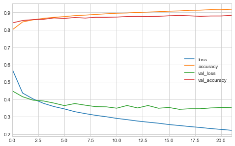

# Chapter 11. Training Deep Neural Networks

Below are a list of the common challenges faced when training a Deep Neural Network (DNN):

* *Vanishing gradients* and *exploding gradients* are when a gradient grow smaller and smaller, or larger and larger, when flowing back through the DNN. This makes training the lower levels difficult.
* More training data is required.
* Each iteration takes longer.
* With more parameters to train, overfitting becomes an even bigger problem.

The following sections will address (more or less) in order.


```python
import numpy as np
import pandas as pd
import matplotlib.pyplot as plt
import tensorflow as tf
from tensorflow import keras
from IPython.core.interactiveshell import InteractiveShell

np.random.seed(0)

plt.style.use('seaborn-whitegrid')
```


```python
%matplotlib inline
```


```python
%load_ext ipycache
```

    /opt/anaconda3/envs/daysOfCode-env/lib/python3.7/site-packages/IPython/config.py:13: ShimWarning: The `IPython.config` package has been deprecated since IPython 4.0. You should import from traitlets.config instead.
      "You should import from traitlets.config instead.", ShimWarning)
    /opt/anaconda3/envs/daysOfCode-env/lib/python3.7/site-packages/ipycache.py:17: UserWarning: IPython.utils.traitlets has moved to a top-level traitlets package.
      from IPython.utils.traitlets import Unicode


## The vanishing/exploding gradients problems

A *vanishing gradient* is when the gradients get smaller and smaller as the training algorithm progresses to to the lower layers.
This results in the parameter weights in the lower layers unchanged from initialization.
An *exploding gradient* is the opposite and the parameter weights get larger and larger and the training diverges.
This is primary a problem in Recurrent NN, discussed in a later chapter.

In 2010, Glorot and Bengio proposed that this was caused by the random initialization procedure commonly used: samples from a normal distribution.
This caused the variance in the initial weight parameters to be greater than that of the input, thus obfuscating the important information.
They proposed an initialization strategy, *Glorot initialization*, such that the variance of the input to the layer is the same as the variance of the output of the layer.
There are other variants of the process that have proven to work better with various activation functions; Table 11-1 on pg. 334 shows the best initialization methods for the activation function of the neuron, and it is replecated below.

| Initialization method | Activation function           | $\sigma^2$           |
|:----------------------|:------------------------------|:---------------------|
| Glorot                | None, tanh, logistic, softmax | $1/fan_{\text{avg}}$ |
| He                    | ReLU and variants             | $2/fan_{\text{in}}$  |
| LeCun                 | SELU                          | $1/fan_{\text{in}}$  |

By default, Keras uses the Glorot initialization with a uniform distribution.
The initialization can also be changed to He initialization by setting the `kernel_initializer` argument to `he_uniform` or `he_normal`:


```python
keras.layers.Dense(10, activation='relu', kernel_initializer='he_normal')
```


    <tensorflow.python.keras.layers.core.Dense at 0x64456a7d0>


Also, the details of an initializer can be specified by using the `VarianceScaling` class.
The following example uses He initialization with a uniform distribution based on $fan_{\text{avg}}$.


```python
he_avg_init = keras.initializers.VarianceScaling(scale=2.0, 
                                                 mode='fan_avg', 
                                                 distribution='uniform')
keras.layers.Dense(10, activation='sigmoid', kernel_initializer=he_avg_init)
```


    <tensorflow.python.keras.layers.core.Dense at 0x6445d9890>


### Nonsaturating activation functions

In the same paper, Glorot and Bengio indicated that the activation function of choice, the logistic, was also a problem.
Thus they proposed the *Rectified Linear Unit* (ReLU) for faster and nonsaturating training.
The ReLU wasn't perfect, mainly because, during training, some neurons can "die," meaning that they only output 0 (called a *dying ReLU*).
Therefore, variants emerged such as the *leaky ReLU* (LeakyReLU), *Randomized leaky ReLU* (RRELU), and the *parametric leaky ReLU* (PReLU).
The LeakyReLU includes another hyperparameter $\alpha$ that lets the ReLU have a slightly positive slope when inputs are negative: $\text{LeakyReLU}_\alpha (z) = \max(\alpha z, z)$ (shown below).
The RReLU is the same as the LeakyReLU, but $\alpha$ is picked randomly within a range during training and fixed to an average during testing.
The PReLU is where $\alpha$ is turning into an additional parameter to be learned (this can lead to further overfitting, though).


```python
def leakyReLU(x, alpha=0.01):
    return [i if i>=0 else i*alpha for i in x]

x = np.arange(-4, 5, 1, dtype=np.float64)

plt.plot(x, np.repeat(0, len(x)), 'k-')
plt.plot([0, 0], [-1, 5], 'k-')
plt.plot(x, leakyReLU(x, 0.1), 'b-')
plt.axis([-4, 4, -0.5, 4])
plt.xlabel('$z$', fontsize=12)
plt.ylabel('ouput', fontsize=12)
plt.title('LeakyReLU', fontsize=14)
plt.show()
```


Another useful activation function is the *exponential linear unit* (ELU) that is a linear funciton when the input is greater than 0 and an exponential when it is less than 0:

$$
\begin{aligned}
\text{ELU}_\alpha (z) = \begin{cases}
\alpha (\exp(z) - 1) &\text{ if } z < 0 \\
z                    &\text{ if } z \ge 0
\end{cases}
\end{aligned}
$$

In addition, there is the *scaled ELU* (SELU) that will produce a network that *self-normalizes*, each layer will naturally preserve the output with a mean of 0 and standard deviation of 1.
This is only guaranteed under the following circumstances:

* The ANN must be a stack of dense, sequentially connected layers.
* The input must be standardized to mean 0 and standard deviation 1.
* The layer weights must be initialized with LeCun normal initialization (`kernel_initializer='lecun_normal'`).

Obviously the first bullet is quite a limitation, though researchers have indicated that the SELU can be used in some cases where the layers aren't dense, such as a convolutional neuron network (Chapter 14).

To use a LeakyReLU in keras, it gets added as a separate layer after the layer you want it to apply to.


```python
# An example ANN with a LeakyReLU layer.
model = keras.models.Sequential([
    keras.layers.InputLayer(input_shape=5),
    keras.layers.Dense(10, kernel_initializer='he_normal'),
    keras.layers.LeakyReLU(alpha=0.2),
    keras.layers.Dense(1)
])
```

Below is an example of using the SELU activation function.


```python
keras.layers.Dense(10, activation='selu', kernel_initializer='lecun_normal')
```


    <tensorflow.python.keras.layers.core.Dense at 0x64e12f950>


The author proposes the following order of preference for the activation functions covered above:

> SELU > ELU > LeakyReLU (and its variants) > ReLU > tanh > logistic

though he does provide practical reasons why you would choose one over another.

### Batch normalization

*Batch Normalization* (BN) is another safeguard against the vanishing and exploding gradients problems.
BN zero-centers and normalizes each input, then scales and shifts the result using two new parameter vectors per layer: one for scaling and the other for shifting.
The goal is to learn the optimal scale and mean for the inputs to each layer.
To get final values for the model, a running average is maintained of each layer's mean and standard deviation.

In practice, BN has shown great success in reducing the problem of vanishing and exploding gradients, even when using saturating activation functions.

Though there are performance issues during training because there are now additional layers and parameters to learn, training is often slower because fewer rounds of training are required.
Further, once the model is trained, the new layers from BN can be incorporated into the previous layer.
This is does by updating the previous layer's weights and biases to output the correct scale and offset learned by the BN layer.

Here is an example of using BN with Keras for an image classifier.
It is added just before or after each hidden layer's activation function and as the first layer in the model (after flattening the image, though).


```python
from sklearn.model_selection import train_test_split

fashion_mnist = keras.datasets.fashion_mnist
(X_train_full, y_train_full), (X_test, y_test) = fashion_mnist.load_data()

class_names = ["T-shirt/top", "Trouser", "Pullover", "Dress", "Coat", "Sandal", 
               "Shirt", "Sneaker", "Bag", "Ankle boot"]

X_train, X_valid, y_train, y_valid = train_test_split(X_train_full,
                                                      y_train_full,
                                                      test_size=5000,
                                                      random_state=0)

fig = plt.figure(figsize=(12, 6))
for i in range(40):
    plt.subplot(4, 10, i+1)
    plt.imshow(X_train[i, :, :])
    plt.title(class_names[y_train[i]])
    plt.axis('off')

plt.show()
```


```python
model = keras.models.Sequential([
    keras.layers.Flatten(input_shape = X_train.shape[1:]),
    keras.layers.BatchNormalization(),
    keras.layers.Dense(300, activation='elu', kernel_initializer='he_normal'),
    keras.layers.BatchNormalization(),
    keras.layers.Dense(100, activation='elu', kernel_initializer='he_normal'),
    keras.layers.BatchNormalization(),
    keras.layers.Dense(10, activation='softmax'),
])

model.summary()
```

    Model: "sequential_11"
    _________________________________________________________________
    Layer (type)                 Output Shape              Param #   
    =================================================================
    flatten_9 (Flatten)          (None, 784)               0         
    _________________________________________________________________
    batch_normalization_33 (Batc (None, 784)               3136      
    _________________________________________________________________
    dense_40 (Dense)             (None, 300)               235500    
    _________________________________________________________________
    batch_normalization_34 (Batc (None, 300)               1200      
    _________________________________________________________________
    dense_41 (Dense)             (None, 100)               30100     
    _________________________________________________________________
    batch_normalization_35 (Batc (None, 100)               400       
    _________________________________________________________________
    dense_42 (Dense)             (None, 10)                1010      
    =================================================================
    Total params: 271,346
    Trainable params: 268,978
    Non-trainable params: 2,368
    _________________________________________________________________


```python
model.compile(
    loss='sparse_categorical_crossentropy',
    optimizer='sgd',
    metrics=['accuracy']
)
```


```python
from pathlib import Path
root_logdir = Path('tf_logs_ch11')
tf_logdir = root_logdir.joinpath('fashionMNIST_BNexample').as_posix()

!rm -rf $tf_logdir

# Callback for Tensorboard.
tensorboard_cb = keras.callbacks.TensorBoard(tf_logdir)

history = model.fit(
    X_train, y_train,
    epochs=200,
    validation_split=0.2,
    callbacks=[keras.callbacks.EarlyStopping(patience=5), tensorboard_cb]
)
```

    libc++abi.dylib: terminating with uncaught exception of type std::runtime_error: Couldn't close file
    Train on 44000 samples, validate on 11000 samples
    Epoch 1/200
    44000/44000 [==============================] - 20s 453us/sample - loss: 0.5747 - accuracy: 0.7993 - val_loss: 0.4489 - val_accuracy: 0.8395
    Epoch 2/200
    44000/44000 [==============================] - 16s 369us/sample - loss: 0.4361 - accuracy: 0.8455 - val_loss: 0.4148 - val_accuracy: 0.8537
    Epoch 3/200
    44000/44000 [==============================] - 16s 363us/sample - loss: 0.4023 - accuracy: 0.8576 - val_loss: 0.3951 - val_accuracy: 0.8590
    Epoch 4/200
    44000/44000 [==============================] - 16s 360us/sample - loss: 0.3767 - accuracy: 0.8661 - val_loss: 0.3903 - val_accuracy: 0.8607
    Epoch 5/200
    44000/44000 [==============================] - 16s 368us/sample - loss: 0.3583 - accuracy: 0.8720 - val_loss: 0.3782 - val_accuracy: 0.8686
    Epoch 6/200
    44000/44000 [==============================] - 16s 359us/sample - loss: 0.3446 - accuracy: 0.8763 - val_loss: 0.3637 - val_accuracy: 0.8658
    Epoch 7/200
    44000/44000 [==============================] - 16s 367us/sample - loss: 0.3287 - accuracy: 0.8819 - val_loss: 0.3755 - val_accuracy: 0.8711
    Epoch 8/200
    44000/44000 [==============================] - 16s 355us/sample - loss: 0.3176 - accuracy: 0.8849 - val_loss: 0.3661 - val_accuracy: 0.8678
    Epoch 9/200
    44000/44000 [==============================] - 15s 351us/sample - loss: 0.3076 - accuracy: 0.8888 - val_loss: 0.3575 - val_accuracy: 0.8724
    Epoch 10/200
    44000/44000 [==============================] - 19s 432us/sample - loss: 0.2997 - accuracy: 0.8924 - val_loss: 0.3567 - val_accuracy: 0.8724
    Epoch 11/200
    44000/44000 [==============================] - 26s 596us/sample - loss: 0.2902 - accuracy: 0.8956 - val_loss: 0.3488 - val_accuracy: 0.8735
    Epoch 12/200
    44000/44000 [==============================] - 28s 645us/sample - loss: 0.2828 - accuracy: 0.8970 - val_loss: 0.3643 - val_accuracy: 0.8766
    Epoch 13/200
    44000/44000 [==============================] - 17s 393us/sample - loss: 0.2748 - accuracy: 0.9003 - val_loss: 0.3501 - val_accuracy: 0.8774
    Epoch 14/200
    44000/44000 [==============================] - 17s 381us/sample - loss: 0.2684 - accuracy: 0.9022 - val_loss: 0.3642 - val_accuracy: 0.8765
    Epoch 15/200
    44000/44000 [==============================] - 17s 382us/sample - loss: 0.2623 - accuracy: 0.9045 - val_loss: 0.3486 - val_accuracy: 0.8779
    Epoch 16/200
    44000/44000 [==============================] - 18s 402us/sample - loss: 0.2546 - accuracy: 0.9073 - val_loss: 0.3530 - val_accuracy: 0.8809
    Epoch 17/200
    44000/44000 [==============================] - 18s 410us/sample - loss: 0.2490 - accuracy: 0.9089 - val_loss: 0.3423 - val_accuracy: 0.8832
    Epoch 18/200
    44000/44000 [==============================] - 16s 373us/sample - loss: 0.2430 - accuracy: 0.9125 - val_loss: 0.3456 - val_accuracy: 0.8807
    Epoch 19/200
    44000/44000 [==============================] - 16s 357us/sample - loss: 0.2377 - accuracy: 0.9134 - val_loss: 0.3457 - val_accuracy: 0.8778
    Epoch 20/200
    44000/44000 [==============================] - 16s 362us/sample - loss: 0.2314 - accuracy: 0.9162 - val_loss: 0.3503 - val_accuracy: 0.8798
    Epoch 21/200
    44000/44000 [==============================] - 15s 348us/sample - loss: 0.2265 - accuracy: 0.9157 - val_loss: 0.3524 - val_accuracy: 0.8799
    Epoch 22/200
    44000/44000 [==============================] - 16s 358us/sample - loss: 0.2215 - accuracy: 0.9187 - val_loss: 0.3515 - val_accuracy: 0.8837


```python
%reload_ext tensorboard
%tensorboard --logdir=./tf_logs_ch11 --port=6006
```


    Reusing TensorBoard on port 6006 (pid 77939), started 0:16:59 ago. (Use '!kill 77939' to kill it.)


<iframe id="tensorboard-frame-49c8be49dfb3fbd7" width="100%" height="800" frameborder="0">
</iframe>
<script>
  (function() {
    const frame = document.getElementById("tensorboard-frame-49c8be49dfb3fbd7");
    const url = new URL("/", window.location);
    url.port = 6006;
    frame.src = url;
  })();
</script>


```python
model_loss, model_accuracy = model.evaluate(X_test, y_test, verbose=0)
print(f'loss: {model_loss}\n accuracy: {model_accuracy}')
```

    loss: 0.37072580535411837
     accuracy: 0.8797000050544739


```python
pd.DataFrame(history.history).plot(figsize=(8, 5))
plt.show()
```





There is some disagreement over whether the BN layer should be added before or after the activation functions.
Below is an example of creating a model with the BN layer *before* the activation function.
The activation functions must be separated from the hidden layers and added separately after the BN layers.


```python
# Add example of BN before activation layer.
```


```python

```


```python

```
