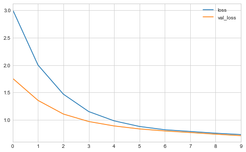
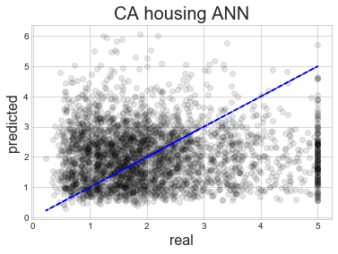

# Loading and Preprocessing Data with TensorFlow

The *Data API* availabe from TensorFlow makes handling large data sets that don't fit into RAM much easier. In general, a dataset object is created and told where to find files. It then manages the rest of the implementation details including multithreading, queueing, batching, and prefetching.


```python
import numpy as np
import pandas as pd 
import matplotlib as mpl
import matplotlib.pyplot as plt
import seaborn as sns
import tensorflow as tf 
from tensorflow import keras
from pathlib import Path

%matplotlib inline
np.random.seed(0)
plt.style.use('seaborn-whitegrid')
assets_dir = Path('assets', 'ch13')
```

## The Data API

The Data API is centered around the concept of a *dataset*, a sequence of data items.
For simplicity, the first example below shows a dataset held in memory created using `from_tensor_slices()`.
It is an iterable.


```python
X = tf.range(10)
dataset = tf.data.Dataset.from_tensor_slices(X)
dataset
```


    <TensorSliceDataset shapes: (), types: tf.int32>


```python
for t in dataset:
    print(t)
```

    tf.Tensor(0, shape=(), dtype=int32)
    tf.Tensor(1, shape=(), dtype=int32)
    tf.Tensor(2, shape=(), dtype=int32)
    tf.Tensor(3, shape=(), dtype=int32)
    tf.Tensor(4, shape=(), dtype=int32)
    tf.Tensor(5, shape=(), dtype=int32)
    tf.Tensor(6, shape=(), dtype=int32)
    tf.Tensor(7, shape=(), dtype=int32)
    tf.Tensor(8, shape=(), dtype=int32)
    tf.Tensor(9, shape=(), dtype=int32)


### Chaining transformations

The dataset object has many transformation methods that return new datasets, making it easy to chain the methods.


```python
dataset = dataset.repeat(3).batch(7)
for t in dataset:
    print(t)
```

    tf.Tensor([0 1 2 3 4 5 6], shape=(7,), dtype=int32)
    tf.Tensor([7 8 9 0 1 2 3], shape=(7,), dtype=int32)
    tf.Tensor([4 5 6 7 8 9 0], shape=(7,), dtype=int32)
    tf.Tensor([1 2 3 4 5 6 7], shape=(7,), dtype=int32)
    tf.Tensor([8 9], shape=(2,), dtype=int32)


Alternatively, `map()` can be used to apply custom transformations.


```python
dataset = dataset.map(lambda x: x * 2)
```

The `apply()` method applies a function to the dataset as a whole, not each item individually.
The following example removes the batches created above.


```python
dataset = dataset.apply(tf.data.experimental.unbatch())
```

The `filter()` method makes it each to apply a filter to each data point.


```python
dataset = dataset.filter(lambda x: x < 10)
```

The `take()` method can be used to look at just a few data points.


```python
for t in dataset.take(3):
    print(t)
```

    tf.Tensor(0, shape=(), dtype=int32)
    tf.Tensor(2, shape=(), dtype=int32)
    tf.Tensor(4, shape=(), dtype=int32)


### Shuffling the data

The shuffling method uses a buffer in memory to prepare data points before they are used and then randomly pulls one to be used when requested.
The size of the buffer must be declared so that all of the RAM is not consumed, but it also a bottleneck on how well the data will be shuffled.


```python
dataset = tf.data.Dataset.range(10).repeat(3)
dataset = dataset.shuffle(buffer_size=5, seed=0).batch(7)
for t in dataset:
    print(t)
```

    tf.Tensor([2 1 5 0 7 6 0], shape=(7,), dtype=int64)
    tf.Tensor([4 3 9 8 2 3 4], shape=(7,), dtype=int64)
    tf.Tensor([8 6 0 7 2 3 9], shape=(7,), dtype=int64)
    tf.Tensor([5 1 4 1 5 9 6], shape=(7,), dtype=int64)
    tf.Tensor([7 8], shape=(2,), dtype=int64)


One solution to the limits of `shuffle()` is to pre-shuffle the data.
For example, the `shuf` command in Linux shuffles the lines of a file.
Still, we will want to shuffle the file on each epoch.
To shuffle the data further, it is common the split the data into multiple files and then read in data from them randomly simultaneously, interleaving their records.
This method, paired with `shuffle()`, is usually a great way to shuffle the data and is easily accomplished with the Data API.

For this example, I split the housing data into 10 files.


```python
from sklearn.datasets import fetch_california_housing

cal_housing = fetch_california_housing()
df = pd.DataFrame(cal_housing.data)
df.columns = cal_housing.feature_names
df['MedianHousingValue'] = cal_housing.target
df = df.sample(frac=1)
df
```


<div>
<style scoped>
    .dataframe tbody tr th:only-of-type {
        vertical-align: middle;
    }

    .dataframe tbody tr th {
        vertical-align: top;
    }

    .dataframe thead th {
        text-align: right;
    }
</style>
<table border="1" class="dataframe">
  <thead>
    <tr style="text-align: right;">
      <th></th>
      <th>MedInc</th>
      <th>HouseAge</th>
      <th>AveRooms</th>
      <th>AveBedrms</th>
      <th>Population</th>
      <th>AveOccup</th>
      <th>Latitude</th>
      <th>Longitude</th>
      <th>MedianHousingValue</th>
    </tr>
  </thead>
  <tbody>
    <tr>
      <th>14740</th>
      <td>4.1518</td>
      <td>22.0</td>
      <td>5.663073</td>
      <td>1.075472</td>
      <td>1551.0</td>
      <td>4.180593</td>
      <td>32.58</td>
      <td>-117.05</td>
      <td>1.369</td>
    </tr>
    <tr>
      <th>10101</th>
      <td>5.7796</td>
      <td>32.0</td>
      <td>6.107226</td>
      <td>0.927739</td>
      <td>1296.0</td>
      <td>3.020979</td>
      <td>33.92</td>
      <td>-117.97</td>
      <td>2.413</td>
    </tr>
    <tr>
      <th>20566</th>
      <td>4.3487</td>
      <td>29.0</td>
      <td>5.930712</td>
      <td>1.026217</td>
      <td>1554.0</td>
      <td>2.910112</td>
      <td>38.65</td>
      <td>-121.84</td>
      <td>2.007</td>
    </tr>
    <tr>
      <th>2670</th>
      <td>2.4511</td>
      <td>37.0</td>
      <td>4.992958</td>
      <td>1.316901</td>
      <td>390.0</td>
      <td>2.746479</td>
      <td>33.20</td>
      <td>-115.60</td>
      <td>0.725</td>
    </tr>
    <tr>
      <th>15709</th>
      <td>5.0049</td>
      <td>25.0</td>
      <td>4.319261</td>
      <td>1.039578</td>
      <td>649.0</td>
      <td>1.712401</td>
      <td>37.79</td>
      <td>-122.43</td>
      <td>4.600</td>
    </tr>
    <tr>
      <th>...</th>
      <td>...</td>
      <td>...</td>
      <td>...</td>
      <td>...</td>
      <td>...</td>
      <td>...</td>
      <td>...</td>
      <td>...</td>
      <td>...</td>
    </tr>
    <tr>
      <th>13123</th>
      <td>4.4125</td>
      <td>20.0</td>
      <td>6.000000</td>
      <td>1.045662</td>
      <td>712.0</td>
      <td>3.251142</td>
      <td>38.27</td>
      <td>-121.26</td>
      <td>1.446</td>
    </tr>
    <tr>
      <th>19648</th>
      <td>2.9135</td>
      <td>27.0</td>
      <td>5.349282</td>
      <td>0.933014</td>
      <td>647.0</td>
      <td>3.095694</td>
      <td>37.48</td>
      <td>-120.89</td>
      <td>1.594</td>
    </tr>
    <tr>
      <th>9845</th>
      <td>3.1977</td>
      <td>31.0</td>
      <td>3.641221</td>
      <td>0.941476</td>
      <td>704.0</td>
      <td>1.791349</td>
      <td>36.58</td>
      <td>-121.90</td>
      <td>2.893</td>
    </tr>
    <tr>
      <th>10799</th>
      <td>5.6315</td>
      <td>34.0</td>
      <td>4.540598</td>
      <td>1.064103</td>
      <td>1052.0</td>
      <td>2.247863</td>
      <td>33.62</td>
      <td>-117.93</td>
      <td>4.846</td>
    </tr>
    <tr>
      <th>2732</th>
      <td>1.3882</td>
      <td>15.0</td>
      <td>3.929530</td>
      <td>1.100671</td>
      <td>1024.0</td>
      <td>3.436242</td>
      <td>32.80</td>
      <td>-115.56</td>
      <td>0.694</td>
    </tr>
  </tbody>
</table>
<p>20640 rows × 9 columns</p>
</div>


```python
cal_housing_files = []
for i, split_df in enumerate(np.split(df, 10)):
    file_path = assets_dir.joinpath('ca_housing_' + str(i) + '.csv')
    cal_housing_files.append(file_path)
    split_df.to_csv(file_path, index=False)
```


```python
cal_housing_files
```


    [PosixPath('assets/ch13/ca_housing_0.csv'),
     PosixPath('assets/ch13/ca_housing_1.csv'),
     PosixPath('assets/ch13/ca_housing_2.csv'),
     PosixPath('assets/ch13/ca_housing_3.csv'),
     PosixPath('assets/ch13/ca_housing_4.csv'),
     PosixPath('assets/ch13/ca_housing_5.csv'),
     PosixPath('assets/ch13/ca_housing_6.csv'),
     PosixPath('assets/ch13/ca_housing_7.csv'),
     PosixPath('assets/ch13/ca_housing_8.csv'),
     PosixPath('assets/ch13/ca_housing_9.csv')]


Now we can create a dataset object and point to all three of the files.
Alternatively, we could pass a pattern such as `'assets/ch13/ca_housing_*.csv'`.


```python
cal_housing_strs = [x.as_posix() for x in cal_housing_files]
filepath_dataset = tf.data.Dataset.list_files(cal_housing_strs, seed=0)
```

Then the `interleave()` function can pull randomly from the files.
Make sure to skip the first row since it contains the headers.


```python
dataset = filepath_dataset.interleave(
    lambda fp: tf.data.TextLineDataset(fp).skip(1)
)
```


```python
for line in dataset.take(5):
    print(line.numpy())
```

    b'4.2386,6.0,7.723076923076923,1.1692307692307693,228.0,3.5076923076923077,33.83,-117.55,5.00001'
    b'4.1518,22.0,5.663072776280323,1.0754716981132075,1551.0,4.180592991913747,32.58,-117.05,1.369'
    b'3.125,16.0,5.380070546737214,1.0582010582010581,3407.0,3.004409171075838,36.8,-119.83,0.808'
    b'3.2875,52.0,5.990936555891238,1.039274924471299,887.0,2.6797583081570995,34.07,-118.15,2.344'
    b'4.3898,52.0,5.32662192393736,1.1006711409395973,1485.0,3.3221476510067114,37.73,-122.44,2.7'


Note that the data are still byte strings that need to be processed further, still.

### Preprocessing the data

We can write a function to preprocess this input data.
This implementation assumes we have precomputed the mean and standard deviation for each column.

The first step is to define defaults and use those to help decode the byte string using `tf.io.decode_csv()`.
Then `x` and `y` are made as as stacks of the list of 1D tensors, one per column, returned from the previous step.
Finally,  the z-scaled data points and the target values are returned.


```python
n_inputs = 8
X_mean = df.mean().tolist()[:n_inputs]
X_std = df.std().tolist()[:n_inputs]

def preprocess(line):
    defs = [0.0] * n_inputs + [tf.constant([], dtype=tf.float32)]
    fields = tf.io.decode_csv(line, record_defaults=defs)
    x = tf.stack(fields[:-1])
    y = tf.stack(fields[-1:])
    return (x - X_mean) / X_std, y
```


```python
preprocess(b'8.3252,41.0,6.984126984126984,1.0238095238095237,322.0,2.5555555555555554,37.88,-122.23,4.526')
```


    (<tf.Tensor: id=101078, shape=(8,), dtype=float32, numpy=
     array([ 2.344709  ,  0.98211884,  0.6285442 , -0.15375382, -0.97440493,
            -0.04959533,  1.0525227 , -1.3278059 ], dtype=float32)>,
     <tf.Tensor: id=101074, shape=(1,), dtype=float32, numpy=array([4.526], dtype=float32)>)


Finally, we can create one function to wrap all of these steps into one.


```python
def csv_reader_dataset(filepaths, repeat=1, n_readers=5,
                       n_read_threads=None, shuffle_buffer_size=10000,
                       n_parse_threads=5, batch_size=32):
    dataset = tf.data.Dataset.list_files(filepaths)
    dataset = dataset.interleave(
        lambda fp: tf.data.TextLineDataset(fp).skip(1),
        cycle_length=n_readers, num_parallel_calls=n_read_threads
    )
    dataset = dataset.map(preprocess, num_parallel_calls=n_parse_threads)
    dataset = dataset.shuffle(shuffle_buffer_size).repeat(repeat)
    return dataset.batch(batch_size).prefetch(1)
```

### Prefetching

The `prefecth(1)` included at the end of `csv_reader_dataset()` ensures that the next batch is ready to be used when the current training step is completed.

### Using the dataset with tf.keras

The dataset we have built can be used directly by Keras.


```python
train_set = csv_reader_dataset(cal_housing_strs[:5])
valid_set = csv_reader_dataset(cal_housing_strs[5:8])
test_set = csv_reader_dataset(cal_housing_strs[8:])
```


```python
model = keras.models.Sequential([
    keras.layers.InputLayer(n_inputs),
    keras.layers.Dense(20, activation='relu', kernel_initializer='he_normal',
                       kernel_regularizer=keras.regularizers.l2(0.01)),
    keras.layers.Dense(10, activation='relu', kernel_initializer='he_normal',
                       kernel_regularizer=keras.regularizers.l2(0.01)),
    keras.layers.Dense(5, activation='relu', kernel_initializer='he_normal',
                       kernel_regularizer=keras.regularizers.l2(0.01)),
    keras.layers.Dense(1),
])

model.compile(optimizer=keras.optimizers.Nadam(),
              loss='mse')

history = model.fit(train_set, epochs=10, validation_data=valid_set)
```

    Epoch 1/10
    323/323 [==============================] - 7s 23ms/step - loss: 2.4419 - val_loss: 0.0000e+00
    Epoch 2/10
    323/323 [==============================] - 4s 11ms/step - loss: 1.1816 - val_loss: 1.0340
    Epoch 3/10
    323/323 [==============================] - 4s 11ms/step - loss: 0.9702 - val_loss: 0.9089
    Epoch 4/10
    323/323 [==============================] - 4s 11ms/step - loss: 0.8802 - val_loss: 0.8341
    Epoch 5/10
    323/323 [==============================] - 4s 11ms/step - loss: 0.8120 - val_loss: 0.7744
    Epoch 6/10
    323/323 [==============================] - 4s 11ms/step - loss: 0.7618 - val_loss: 0.7272
    Epoch 7/10
    323/323 [==============================] - 4s 11ms/step - loss: 0.7147 - val_loss: 0.6944
    Epoch 8/10
    323/323 [==============================] - 4s 12ms/step - loss: 0.6787 - val_loss: 0.6709
    Epoch 9/10
    323/323 [==============================] - 3s 10ms/step - loss: 0.6578 - val_loss: 0.6426
    Epoch 10/10
    323/323 [==============================] - 3s 10ms/step - loss: 0.6289 - val_loss: 0.6239


```python
pd.DataFrame(history.history).plot(figsize=(8, 5))
plt.show()
```





```python
model.evaluate(test_set)
```

    129/129 [==============================] - 2s 12ms/step - loss: 0.5953


    0.595285428817882


```python
new_data = test_set.take(100)
y_new = []
for __, y in new_data:
    y_new.append(y.numpy())

y_new = np.concatenate(y_new).flatten()

y_pred = model.predict(new_data.map(lambda X, y: X)).flatten()

fig, ax = plt.subplots()
ax.scatter(y_new, y_pred, color='k', alpha=0.1)
ax.plot(y_new, y_new, 'k--', color='blue')
ax.set_title('CA housing ANN', fontsize=20)
ax.set_xlabel('real', fontsize=16)
ax.set_ylabel('predicted', fontsize=16)
plt.show()
```





```python
np.corrcoef(y_new, y_pred)[0, 1]
```


    0.022175215966235853


```python
idx = y_new < 5
np.corrcoef(y_new[idx], y_pred[idx])[0, 1]
```


    0.01641203714119741


```python

```
