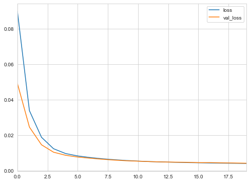
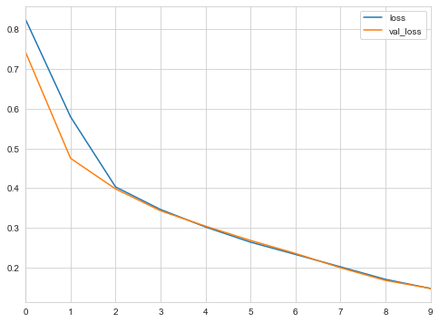

# Processing Sequences Using RNNs and CNNs

Recurrent neural networks can work on sequences of arbitrary length, making them very useful for time series data or text processing.


```python
import numpy as np
import pandas as pd 
import matplotlib as mpl
import matplotlib.pyplot as plt
import seaborn as sns
import tensorflow as tf 
import tensorflow.keras as keras

%matplotlib inline
np.random.seed(0)
sns.set_style('whitegrid')
```

## Recurrent neurons and layers

A recurrent neuron looks just like a normal feedforward neuron except it also has connections pointing backwards.
At each *time step t* (or *frame*), a recurrent neuron receives the inputs $\textbf{x}_{(t)}$ as well as its own output from a previous time step, $\textbf{y}_{(t-1)}$.
Thus, each neuron has two sets of weights, $\textbf{w}_x$ and $\textbf{w}_y$.
These inputs and weights get multiplied together and passed to an activation function just like for a feedforward network.
The following function is for a layer of recurrent neurons at a time frame $t$ where $\phi$ is the activation function and $b$ is the bias.

$$
\textbf{y}_{(t)} = \phi(\textbf{W}_x^T \textbf{x}_{(t)} + \textbf{W}_y^T \textbf{y}_{(t-1)} + b)
$$

Generally, the initial value of $\textbf{y}$ at $t=0$ is set to 0.
It is common to see a recurrent neuron displayed across the time axis - this is called *unrolling the network through time*.

### Memory cells

A recurrent neuron has a form of memory because its output is a function of the data at the current and previous time step.
A part of a neural network that preserves some state acrosss time steps is called a *memory cell* (or just a *cell*).

### Input and output sequences

There are various types of RNNs based on their input and output types:

* *sequence-to-sequences*: An RNN that takes a sequence of inputs and produces a sequence of outputs.
* *sequence-to-vector*: A network that takes a sequence and only the final output is used.
* *vector-to-sequence*: The same input vector is passed in repetitively and an output sequence is collected.
* *encoder-decoder*: A sequence-to-vector network (encoder) followed by a vector-to-sequence network (decoder).

## Training RNNs

The trick to training an RNN is to unroll the network through time and use regular backpropagation.
This is called *backpropagation through time* (BPTT).
Thankfully, this hassle is handled by TF Keras.

## Forecasting a time series

A time series can be *univariate* or *multivariate* with a single or multiple feature at each time step, respectively.
Time series analyses are often either forecasting, predicting future values, or imputing, filling in missing data.

For simplicity, we will use a mock time series data set generated by the `generate_time_series()` function.
It returns data of the shape $[batch\ size,\ time\ steps,\ dimensionality]$.
The *dimensionality* refers to if the data is univariate or multivariate.


```python
def generate_time_series(batch_size, n_steps):
    freq1, freq2, offsets1, offsets2 = np.random.rand(4, batch_size, 1)
    time = np.linspace(0, 1, n_steps)
    series = 0.5 * np.sin((time-offsets1) * (freq1 * 10 + 10))   # wave 1
    series += 0.2 * np.sin((time-offsets2) * (freq2 * 20 + 20))  # wave 2
    series += 0.1 * (np.random.rand(batch_size, n_steps) - 0.5)  # noise
    return series[..., np.newaxis].astype(np.float32)
```


```python
np.random.seed(0)
x = generate_time_series(3, 100)

fig = plt.figure(figsize=(8, 5))
plt.plot(x[0, :], 'g-')
plt.plot(x[1, :], 'b-')
plt.plot(x[2, :], 'r-')
plt.xlabel('time', fontsize=14)
plt.ylabel('value', fontsize=14)
plt.title('Mock time series', fontsize=18)
plt.show()
```


Now we can create some mock data and split it into training, validation, and test sets.
This mock data will have 10,000 times series, each 50 steps long.


```python
n_steps = 50
series = generate_time_series(10000, n_steps + 1)
X_train, y_train = series[:7000, :n_steps], series[:7000, -1]
X_valid, y_valid = series[7000:9000, :n_steps], series[7000:9000, -1]
X_test, y_test = series[9000:, :n_steps], series[9000:, -1]
```

### Baseline metrics

A baseline metric will help us recognize if our model is actually worth creating.
It provides some indication of how hard the data is to predict.

A simple metric called *naive forecasting* is to simply predict the previous value.
In this case, is has a MSE of 0.021.


```python
naive_pred = X_valid[:, -1]
np.mean(keras.losses.mean_squared_error(y_valid, naive_pred))
```


    0.021185566


Another approach is to use a very simple neural network.
Here we can use a single dense neuron; the output is thus a linear combination of the inputs.
This model can make predictions on the validation data with a MSE of 0.003.


```python
model = keras.models.Sequential([
    keras.layers.Flatten(input_shape=[50, 1]),
    keras.layers.Dense(1)
])

model.compile(
    optimizer=keras.optimizers.Nadam(),
    loss=keras.losses.MeanSquaredError()
)

history = model.fit(
    X_train, y_train,
    epochs=100,
    validation_data=(X_valid, y_valid),
    verbose=0,
    callbacks=[keras.callbacks.EarlyStopping(patience=5)]
)
```


```python
pd.DataFrame(history.history).plot(figsize=(8, 6))
plt.show()
```





```python
y_pred = model.predict(X_valid)
np.mean(keras.losses.mean_squared_error(y_valid, y_pred))
```


    0.00327249


### Implementing a simple RNN

The simplest RNN we can create is just a single neuron.
Thus, there are a total of 3 parameters: a weight for the input, a weight for the previous output, and a bias term.
This is far less than the 51 parameters for the linear model above (1 parameter per input feature and a bias term).
Thus, it is not surprising to see that this simple model cannot outperform a higher-dimensional linear model.

Note that the input shape is `[None, 1]`.
This is because the RNN can take any length of input (number of time steps).


```python
simple_rnn = keras.models.Sequential([
    keras.layers.SimpleRNN(1, input_shape=[None, 1])
])

simple_rnn.compile(
    optimizer=keras.optimizers.Nadam(),
    loss=keras.losses.MeanSquaredError()
)

history = simple_rnn.fit(
    X_train, y_train,
    epochs=100,
    validation_data=(X_valid, y_valid),
    verbose=0,
    callbacks=[keras.callbacks.EarlyStopping(patience=5)]
)
```


```python
pd.DataFrame(history.history).plot(figsize=(8, 6))
plt.show()
```





```python
y_pred = simple_rnn.predict(X_valid)
np.mean(keras.losses.mean_squared_error(y_valid, y_pred))
```


    0.011389356


### Deep RNNs
