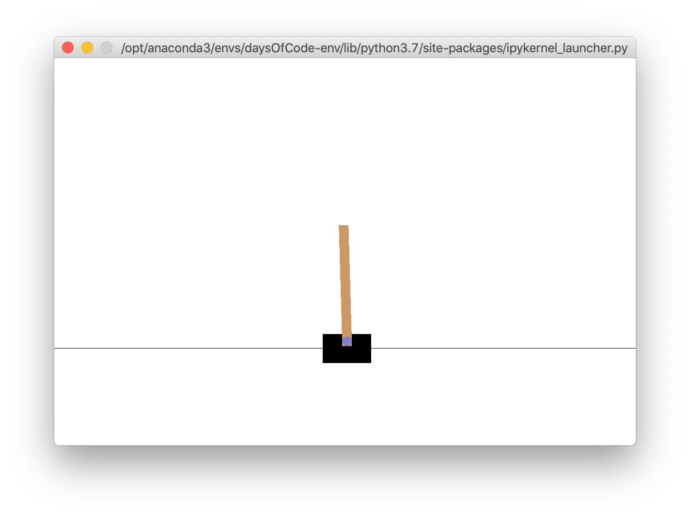
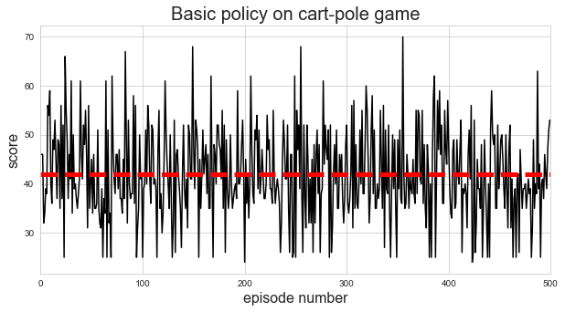

# Chapter 18. Reinforcement Learning


```python
import numpy as np
import pandas as pd 
import matplotlib as mpl
import matplotlib.pyplot as plt
import seaborn as sns
import tensorflow as tf 
import tensorflow.keras as keras
import gym

%matplotlib inline
np.random.seed(0)
sns.set_style('whitegrid')
```

## Learning to optimize rewards

To set the stage: in reinforcement learning, a software *agent* makes *observations* and takes *actions* within an *environment*, and in return it receives *rewards*.
Its objective is to learn to act in a way that will maximize its expected rewards over time.

### Policy search

The algorithm a software agent uses to determine its action is called its *policy*.
It can be any algorithm, including a neural network, and needs not be deterministic.
The parameters of the policy that can be learned or tweaked are the *policy parameters*.
The *policy search* is the method (e.g. brute force) used to identify good values in the *policy space* for the policy parameters.

*Genetic algorithms* are a popular method for exploring the policy space.
This algorithm involves creating 100 policies and trying them all.
The 80 worst policies are "killed" while the rest "reproduce" 4 offspring each, introducing some random variation in each offspring.
This method continues until a sufficiently good model is created.

Alternatively, an optimization technique can be used to tweak the parameters and follow the gradient of the results.
This is called *policy search* and will be discussed more thoroughly later in the chapter.

## Introduction to OpenAI Gym

[OpenAI Gym](https://gym.openai.com) is a toolkit providing a variety of simulated environments including board games, Atari games, 2D and 2D physical simulations, and more for training RL algorithms.

Here is a breif example of the ["cart-pole" problem](https://gym.openai.com/envs/CartPole-v1/).
An environment is made with `gym.make()` and initialized using `env.reset()`, which also returns the first data point.
This returns a 1D vector with 4 values: the cart's horizontal position, velocity, the angle of the pole, and its angular velocity.


```python
env = gym.make("CartPole-v1")
obs = env.reset()
obs
```

    /opt/anaconda3/envs/daysOfCode-env/lib/python3.7/site-packages/gym/logger.py:30: UserWarning: WARN: Box bound precision lowered by casting to float32
      warnings.warn(colorize('%s: %s'%('WARN', msg % args), 'yellow'))


    array([ 0.01277255, -0.04996796,  0.01255002, -0.0463979 ])


The environment can be rendered using its `render()` method.


```python
env.render()

# close the window
env.close()
```



We can ask the environment what the possible actions are, too.
For this problem, there are two options: 0 = left, 1 = right.


```python
env.action_space
```


    Discrete(2)


Since the pole is slightly learning to the left, we will move the cart to the left using the `step()` method of the environment.
This method returns four values:

* `obs`: The new observation to act on.
* `reward`: In this game, the reward is always 1 because the point is to keep the pole up for as long as possible.
* `done`: This value will be true when the episode is over; for this game that means the pole tilts too much, the cart goes off screen, or there have been 200 steps, where fulfilling the last condition means the algorithm has won. An environment must be reset when the episode has finished.
* `info`: An environment-specific dictionary to provide extra information.

Finally, it is good practice to call the `close()` method on an environment to free the resources it is taking.


```python
action = 0
obs, reward, done, info = env.step(action)
obs
```


    array([ 0.01177319, -0.2452676 ,  0.01162206,  0.2502181 ])


```python
reward
```


    1.0


```python
done
```


    False


```python
info
```


    {}


```python
env.close()
```

The following code would generate a demonstration video of the cart-pole problem.

```python
import gym
env = gym.make('CartPole-v0')
env.reset()
for _ in range(1000):
    env.render()
    env.step(env.action_space.sample()) # take a random action
env.close()
```

As an example, we will hardcode a simple policy: accelerate left when the pole is leaning left and accelerate right when the pole is leaning right.


```python
def basic_policy(obs):
    angle = obs[2]
    return 0 if angle < 0 else 1
```


```python
totals = []
for episode in range(500):
    episode_rewards = 0
    obs = env.reset()
    for step in range(200):
        action = basic_policy(obs)
        obs, reward, done, info = env.step(action)
        episode_rewards += reward
        if done:
            break
    totals.append(episode_rewards)
```


```python
avg_score = np.mean(totals)

fig = plt.figure(figsize=(10, 5))
plt.plot(totals, 'k-')
plt.plot([0, len(totals)], [avg_score, avg_score], 'r--', linewidth=5)
plt.title("Basic policy on cart-pole game", fontsize=20)
plt.xlabel('episode number', fontsize=16)
plt.ylabel('score', fontsize=16)
plt.xlim(0, len(totals))
plt.show()
```





```python
np.mean(totals), np.median(totals), np.std(totals), np.min(totals), np.max(totals)
```


    (42.396, 41.0, 9.267102243959544, 24.0, 72.0)


## Neural network policies

We will make a single nerual network to play the cart-pole problem.
It will take the four observations as input and output a single probability for left vs. right.
We will then take this probability as the weight for sampling left or right.


```python
n_inputs = 4

model = keras.models.Sequential([
    keras.layers.Dense(5, activation='elu', input_shape=[n_inputs]),
    keras.layers.Dense(1, activation='sigmoid')
])
```

One difficulty with training this model is telling it out each action affected the game, especially since the action won't necessarily have an immediate impact.
Thus, it is common to evaluate an action's *return*, a weighted sum of all the rewards that follow.
The *discount factor* $\gamma$ is multiplied to the rewards following an action, leading to exponential decay of the effect of future rewards on the action's return.
Further, to help the good actions stand out (called the *action advantage*), we can run the simulation multiple times and normalize the rewards.

## Policy gradients

Here is one variant of a PG algorithm from *REINFORCE algorithms* used to optimize the parameters of a policy (the neural network, in this case):

1. Let the NN play the game several times, computing the gradients that would make the chosen action even more likely (would "reinforce" action) for each round.
2. Compute each action's advantage (as described above).
3. Weight the computed gradients by the advantage to reinforce the good actions and reduce the likelihood of the bad actions.
4. Compute the mean of the resulting gradient vectors and use it to perform a gradient descent step.

We can now implement this algorithm to train the neural network to balance the pole.

First, we make a function to play one step of the cart-pole problem.
Here is how the function works:

1. In the `GradientTape` block, the model is provided a single observation and outputs the probability of moving the car left.
2. The actual decision to go left is made from a random distribution by sampling a uniform distribution and seeing if the output probability was smaller.
3. Then, the action to take is decided as `1 - action` so that the value will be 0 if the model wants to go left, and 1 if the model wants to go right.
4. The loss is calculated as the difference between the output probability of going left and the actual action, taking the chosen action as correct (for now).
5. The tape is used to calculate the gradient of the loss with regard to the model's trainable variables.
6. Finally, the selected action is played in the environment, and the output and the gradient are returned.


```python
def play_one_step(env, obs, model, loss_fn):
    with tf.GradientTape() as tape:
        left_proba = model(obs[np.newaxis])
        action = (tf.random.uniform([1, 1]) > left_proba)
        y_target = tf.constant([[1.0]]) - tf.cast(action, tf.float32)
        loss = tf.reduce_mean(loss_fn(y_target, left_proba))
    grads = tape.gradient(loss, model.trainable_variables)
    obs, reward, done, info = env.step(int(action[0, 0].numpy()))
    return obs, reward, done, grads
```

The next function will use the `play_one_step()` function to play multiple episodes, returning the rewards and gradients for each episode and step.
It returns a list of reward lists: one reward list per episode containing one reward per step.
It returns a list of gradient lists: one gradient list per episode, each containing one tuple of gradients per step, the tuples containing one gradient tensor per trainable variable.


```python
def play_multiple_episodes(env, n_episodes, n_max_steps, model, loss_fn):
    all_rewards = []
    all_grads = []
    for episode in range(n_episodes):
        current_rewards = []
        current_grads = []
        obs = env.reset()
        for step in range(n_max_steps):
            obs, reward, done, grads = play_one_step(env, obs, model, loss_fn)
            current_rewards.append(reward)
            current_grads.append(grads)
            if done:
                break
        all_rewards.append(current_rewards)
        all_grads.append(current_grads)
    return all_rewards, all_grads
```

The algorithm will use the `play_multiple_episodes()` function to play the game several time, then discount and normalize the rewards to be used for the reinforcement weights.

We can create a `discount_rewards()` function to compute the sum of future discount rewards at each step.


```python
def discount_rewards(rewards, discount_factor):
    discounted = np.array(rewards)
    for step in range(len(rewards) - 2, -1, -1):
        discounted[step] += discounted[step + 1] * discount_factor
    return discounted
```

We can also create a function to normalize the discounted rewards across many episodes.


```python
def discount_and_normalize_rewards(all_rewards, discount_factor):
    all_discounted_rewards = [discount_rewards(rewards, discount_factor)
                              for rewards in all_rewards]
    flat_rewards = np.concatenate(all_discounted_rewards)
    reward_mean = flat_rewards.mean()
    reward_std = flat_rewards.std()

    normalized_rewards = [(discounted_rewards - reward_mean) / reward_std
                          for discounted_rewards in all_discounted_rewards]
    return normalized_rewards
```

Here is a quick test to make sure it works.


```python
discount_rewards([10, 0, -50], discount_factor=0.8)
```


    array([-22, -40, -50])


```python
discount_and_normalize_rewards(
    [[10, 0, -50], [10, 20]],
    discount_factor=0.8
)
```


    [array([-0.28435071, -0.86597718, -1.18910299]),
     array([1.26665318, 1.0727777 ])]


Finally, we can define some hyperparameters for the model.


```python
n_iterations = 3 # 150
n_episodes_per_update = 10
n_max_steps = 200
discount_factor = 0.95
```

And we need an optimizer and loss function.


```python
optimizer = keras.optimizers.Adam(learning_rate=0.01)
loss_fn = keras.losses.binary_crossentropy
```

Finally, we can create the environment.


```python
env = gym.make("CartPole-v1")
```

    /opt/anaconda3/envs/daysOfCode-env/lib/python3.7/site-packages/gym/logger.py:30: UserWarning: WARN: Box bound precision lowered by casting to float32
      warnings.warn(colorize('%s: %s'%('WARN', msg % args), 'yellow'))


Now we can build the training loop.
Here is how it works:

1. 


```python
for iteration in range(n_iterations):
    print(f"iteration {iteration}")
    all_rewards, all_grads = play_multiple_episodes(env,
                                                    n_episodes_per_update,
                                                    n_max_steps,
                                                    model,
                                                    loss_fn)
    all_final_rewards = discount_and_normalize_rewards(all_rewards,
                                                       discount_factor)

    all_mean_grads = []
    for var_idx in range(len(model.trainable_variables)):
        mean_grads = tf.reduce_mean(
            [final_reward * all_grads[episode_idx][step][var_idx]
             for episode_idx, final_rewards in enumerate(all_final_rewards)
             for step, final_reward in enumerate(final_rewards)],
            axis=0
        )
        all_mean_grads.append(mean_grads)
    optimizer.apply_gradients(zip(all_mean_grads, model.trainable_variables))
```

    iteration 0
    iteration 1
    iteration 2


```python
obs = env.reset()
for _ in range(1000):
    env.render()
    
    left_proba = model(obs[np.newaxis])
    action = (tf.random.uniform([1, 1]) > left_proba)
    obs, reward, done, info = env.step(int(action[0, 0].numpy()))
    
env.close()
```

    /opt/anaconda3/envs/daysOfCode-env/lib/python3.7/site-packages/gym/logger.py:30: UserWarning: WARN: You are calling 'step()' even though this environment has already returned done = True. You should always call 'reset()' once you receive 'done = True' -- any further steps are undefined behavior.
      warnings.warn(colorize('%s: %s'%('WARN', msg % args), 'yellow'))


I trained the model on 200 iteration on the HMS computing cluster.
The results of that model are shown below.


```python
o2model = tf.keras.models.load_model(
    "assets/ch18/o2-trained-models/trained-cart-pole.tfmodel"
)
```


```python
obs = env.reset()
for _ in range(1000):
    env.render()
    
    left_proba = o2model(obs[np.newaxis])
    action = (tf.random.uniform([1, 1]) > left_proba)
    obs, reward, done, info = env.step(int(action[0, 0].numpy()))
    
env.close()
```

    /opt/anaconda3/envs/daysOfCode-env/lib/python3.7/site-packages/gym/logger.py:30: UserWarning: WARN: You are calling 'step()' even though this environment has already returned done = True. You should always call 'reset()' once you receive 'done = True' -- any further steps are undefined behavior.
      warnings.warn(colorize('%s: %s'%('WARN', msg % args), 'yellow'))


```python

```
