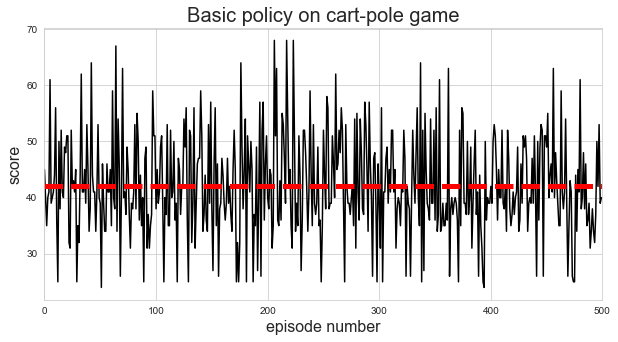
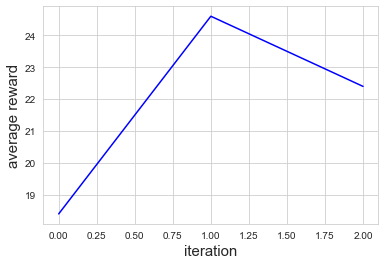
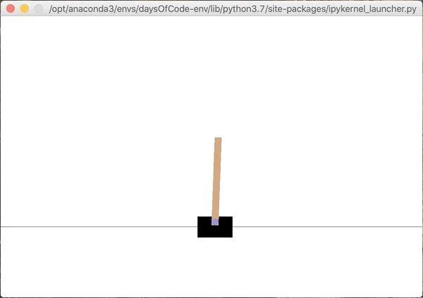
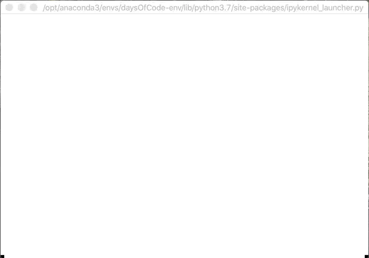
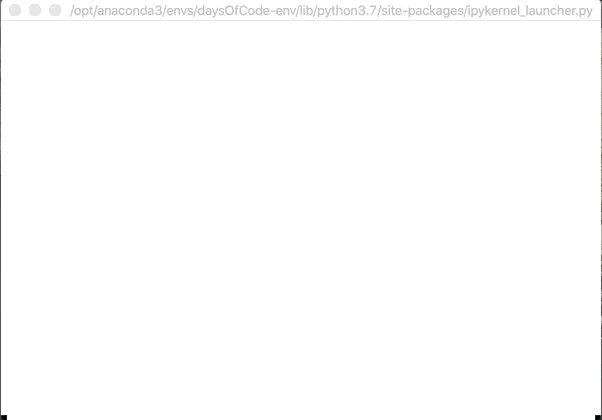
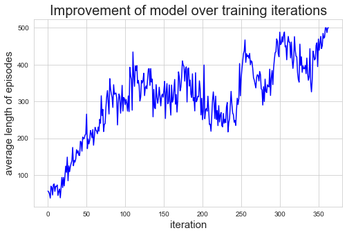
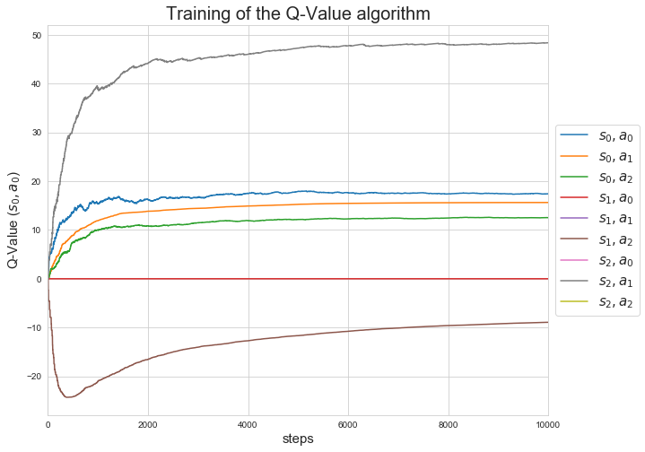
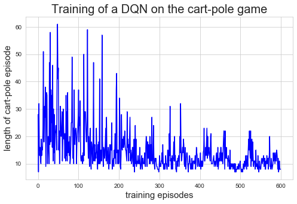

# Chapter 18. Reinforcement Learning


```python
import numpy as np
import pandas as pd
import matplotlib as mpl
import matplotlib.pyplot as plt
import seaborn as sns
import tensorflow as tf 
import tensorflow.keras as keras
import gym

%matplotlib inline
np.random.seed(0)
sns.set_style('whitegrid')
```

## Learning to optimize rewards

To set the stage: in reinforcement learning, a software *agent* makes *observations* and takes *actions* within an *environment*, and in return it receives *rewards*.
Its objective is to learn to act in a way that will maximize its expected rewards over time.

### Policy search

The algorithm a software agent uses to determine its action is called its *policy*.
It can be any algorithm, including a neural network, and needs not be deterministic.
The parameters of the policy that can be learned or tweaked are the *policy parameters*.
The *policy search* is the method (e.g. brute force) used to identify good values in the *policy space* for the policy parameters.

*Genetic algorithms* are a popular method for exploring the policy space.
This algorithm involves creating 100 policies and trying them all.
The 80 worst policies are "killed" while the rest "reproduce" 4 offspring each, introducing some random variation in each offspring.
This method continues until a sufficiently good model is created.

Alternatively, an optimization technique can be used to tweak the parameters and follow the gradient of the results.
This is called *policy search* and will be discussed more thoroughly later in the chapter.

## Introduction to OpenAI Gym

[OpenAI Gym](https://gym.openai.com) is a toolkit providing a variety of simulated environments including board games, Atari games, 2D and 2D physical simulations, and more for training RL algorithms.

Here is a breif example of the ["cart-pole" problem](https://gym.openai.com/envs/CartPole-v1/).
An environment is made with `gym.make()` and initialized using `env.reset()`, which also returns the first data point.
This returns a 1D vector with 4 values: the cart's horizontal position, velocity, the angle of the pole, and its angular velocity.


```python
env = gym.make("CartPole-v1")
obs = env.reset()
obs
```

    /opt/anaconda3/envs/daysOfCode-env/lib/python3.7/site-packages/gym/logger.py:30: UserWarning: WARN: Box bound precision lowered by casting to float32
      warnings.warn(colorize('%s: %s'%('WARN', msg % args), 'yellow'))


    array([-0.04093676,  0.03407977, -0.00101475, -0.00837826])


The environment can be rendered using its `render()` method.


```python
env.render()

# close the window
env.close()
```


We can ask the environment what the possible actions are, too.
For this problem, there are two options: 0 = left, 1 = right.


```python
env.action_space
```


    Discrete(2)


Since the pole is slightly learning to the left, we will move the cart to the left using the `step()` method of the environment.
This method returns four values:

* `obs`: The new observation to act on.
* `reward`: In this game, the reward is always 1 because the point is to keep the pole up for as long as possible.
* `done`: This value will be true when the episode is over; for this game that means the pole tilts too much, the cart goes off screen, or there have been 200 steps, where fulfilling the last condition means the algorithm has won. An environment must be reset when the episode has finished.
* `info`: An environment-specific dictionary to provide extra information.

Finally, it is good practice to call the `close()` method on an environment to free the resources it is taking.


```python
action = 0
obs, reward, done, info = env.step(action)
obs
```


    array([-0.04025516, -0.16102762, -0.00118231,  0.28398433])


```python
reward
```


    1.0


```python
done
```


    False


```python
info
```


    {}


```python
env.close()
```

The following code would generate a demonstration video of the cart-pole problem.

```python
import gym
env = gym.make('CartPole-v0')
env.reset()
for _ in range(1000):
    env.render()
    env.step(env.action_space.sample()) # take a random action
env.close()
```

As an example, we will hardcode a simple policy: accelerate left when the pole is leaning left and accelerate right when the pole is leaning right.


```python
def basic_policy(obs):
    angle = obs[2]
    return 0 if angle < 0 else 1
```


```python
totals = []
for episode in range(500):
    episode_rewards = 0
    obs = env.reset()
    for step in range(200):
        action = basic_policy(obs)
        obs, reward, done, info = env.step(action)
        episode_rewards += reward
        if done:
            break
    totals.append(episode_rewards)
```


```python
avg_score = np.mean(totals)

fig = plt.figure(figsize=(10, 5))
plt.plot(totals, 'k-')
plt.plot([0, len(totals)], [avg_score, avg_score], 'r--', linewidth=5)
plt.title("Basic policy on cart-pole game", fontsize=20)
plt.xlabel('episode number', fontsize=16)
plt.ylabel('score', fontsize=16)
plt.xlim(0, len(totals))
plt.show()
```





```python
np.mean(totals), np.median(totals), np.std(totals), np.min(totals), np.max(totals)
```


    (41.582, 40.0, 8.545131713437774, 24.0, 66.0)


## Neural network policies

We will make a single nerual network to play the cart-pole problem.
It will take the four observations as input and output a single probability for left vs. right.
We will then take this probability as the weight for sampling left or right.


```python
n_inputs = 4

model = keras.models.Sequential([
    keras.layers.Dense(5, activation='elu', input_shape=[n_inputs]),
    keras.layers.Dense(1, activation='sigmoid')
])
```

One difficulty with training this model is telling it out each action affected the game, especially since the action won't necessarily have an immediate impact.
Thus, it is common to evaluate an action's *return*, a weighted sum of all the rewards that follow.
The *discount factor* $\gamma$ is multiplied to the rewards following an action, leading to exponential decay of the effect of future rewards on the action's return.
Further, to help the good actions stand out (called the *action advantage*), we can run the simulation multiple times and normalize the rewards.

## Policy gradients

Here is one variant of a PG algorithm from *REINFORCE algorithms* used to optimize the parameters of a policy (the neural network, in this case):

1. Let the NN play the game several times, computing the gradients that would make the chosen action even more likely (would "reinforce" action) for each round.
2. Compute each action's advantage (as described above).
3. Weight the computed gradients by the advantage to reinforce the good actions and reduce the likelihood of the bad actions.
4. Compute the mean of the resulting gradient vectors and use it to perform a gradient descent step.

We can now implement this algorithm to train the neural network to balance the pole.

First, we make a function to play one step of the cart-pole problem.
Here is how the function works:

1. In the `GradientTape` block, the model is provided a single observation and outputs the probability of moving the car left.
2. The actual decision to go left is made from a random distribution by sampling a uniform distribution and seeing if the output probability was smaller.
3. Then, the action to take is decided as `1 - action` so that the value will be 0 if the model wants to go left, and 1 if the model wants to go right.
4. The loss is calculated as the difference between the output probability of going left and the actual action, taking the chosen action as correct (for now).
5. The tape is used to calculate the gradient of the loss with regard to the model's trainable variables.
6. Finally, the selected action is played in the environment, and the output and the gradient are returned.


```python
def play_one_step(env, obs, model, loss_fn):
    with tf.GradientTape() as tape:
        left_proba = model(obs[np.newaxis])
        action = (tf.random.uniform([1, 1]) > left_proba)
        y_target = tf.constant([[1.0]]) - tf.cast(action, tf.float32)
        loss = tf.reduce_mean(loss_fn(y_target, left_proba))
    grads = tape.gradient(loss, model.trainable_variables)
    obs, reward, done, info = env.step(int(action[0, 0].numpy()))
    return obs, reward, done, grads
```

The next function will use the `play_one_step()` function to play multiple episodes, returning the rewards and gradients for each episode and step.
It returns a list of reward lists: one reward list per episode containing one reward per step.
It returns a list of gradient lists: one gradient list per episode, each containing one tuple of gradients per step, the tuples containing one gradient tensor per trainable variable.

At the end of this section, the author recommended using prior knowledge to help the model.
Thus, I used the angle of the pole to reduce the reward as the angle increases in either direction.


```python
def adjust_reward(reward, obs, max_subtraction=0.7):
    return reward - tf.minimum(tf.abs(obs[2]), max_subtraction)
```


```python
def play_multiple_episodes(env, n_episodes, n_max_steps, model, loss_fn):
    all_rewards = []
    all_grads = []
    for episode in range(n_episodes):
        current_rewards = []
        current_grads = []
        obs = env.reset()
        for step in range(n_max_steps):
            obs, reward, done, grads = play_one_step(env, obs, model, loss_fn)
            reward = adjust_reward(reward, obs)
            current_rewards.append(reward)
            current_grads.append(grads)
            if done:
                break
        all_rewards.append(current_rewards)
        all_grads.append(current_grads)
    return all_rewards, all_grads
```

The algorithm will use the `play_multiple_episodes()` function to play the game several time, then discount and normalize the rewards to be used for the reinforcement weights.

We can create a `discount_rewards()` function to compute the sum of future discount rewards at each step.


```python
def discount_rewards(rewards, discount_factor):
    discounted = np.array(rewards)
    for step in range(len(rewards) - 2, -1, -1):
        discounted[step] += discounted[step + 1] * discount_factor
    return discounted
```

We can also create a function to normalize the discounted rewards across many episodes.


```python
def discount_and_normalize_rewards(all_rewards, discount_factor):
    all_discounted_rewards = [discount_rewards(rewards, discount_factor)
                              for rewards in all_rewards]
    flat_rewards = np.concatenate(all_discounted_rewards)
    reward_mean = flat_rewards.mean()
    reward_std = flat_rewards.std()

    normalized_rewards = [(discounted_rewards - reward_mean) / reward_std
                          for discounted_rewards in all_discounted_rewards]
    return normalized_rewards
```

Here is a quick test to make sure it works.


```python
discount_rewards([10, 0, -50], discount_factor=0.8)
```


    array([-22, -40, -50])


```python
discount_and_normalize_rewards(
    [[10, 0, -50], [10, 20]],
    discount_factor=0.8
)
```


    [array([-0.28435071, -0.86597718, -1.18910299]),
     array([1.26665318, 1.0727777 ])]


Finally, we can define some hyperparameters for the model.


```python
n_iterations = 3 # 150
n_episodes_per_update = 10
n_max_steps = 200
discount_factor = 0.95
```

And we need an optimizer and loss function.


```python
optimizer = keras.optimizers.Adam(learning_rate=0.01)
loss_fn = keras.losses.binary_crossentropy
```

Finally, we can create the environment.


```python
env = gym.make("CartPole-v1")
```

Now we can build the training loop.
Here is how it works:

1. For each training iteration, the loop calls `play_multiple_episodes()` to play the game 10 times and return all of the rewards and gradients for each episode and step.
2. The `discount_and_normalize_rewards()` compute each actions normalized advantage.
3. For each trainable variable, the weighted mean of the gradients over all episodes and steps was calculated and weighted by `final_reward`.
4. Finally, the mean gradients were applied using the optimizer.


```python
avg_episode_lengths = []

for iteration in range(n_iterations):
    print(f"iteration {iteration}")
    all_rewards, all_grads = play_multiple_episodes(env,
                                                    n_episodes_per_update,
                                                    n_max_steps,
                                                    model,
                                                    loss_fn)
    all_final_rewards = discount_and_normalize_rewards(all_rewards,
                                                       discount_factor)

    all_mean_grads = []
    for var_idx in range(len(model.trainable_variables)):
        mean_grads = tf.reduce_mean(
            [final_reward * all_grads[episode_idx][step][var_idx]
             for episode_idx, final_rewards in enumerate(all_final_rewards)
             for step, final_reward in enumerate(final_rewards)],
            axis=0
        )
        all_mean_grads.append(mean_grads)
    optimizer.apply_gradients(zip(all_mean_grads, model.trainable_variables))
    
    avg_episode_lengths.append(np.mean([len(x) for x in all_rewards]))
```

    iteration 0
    WARNING:tensorflow:Layer dense is casting an input tensor from dtype float64 to the layer's dtype of float32, which is new behavior in TensorFlow 2.  The layer has dtype float32 because it's dtype defaults to floatx.
    
    If you intended to run this layer in float32, you can safely ignore this warning. If in doubt, this warning is likely only an issue if you are porting a TensorFlow 1.X model to TensorFlow 2.
    
    To change all layers to have dtype float64 by default, call `tf.keras.backend.set_floatx('float64')`. To change just this layer, pass dtype='float64' to the layer constructor. If you are the author of this layer, you can disable autocasting by passing autocast=False to the base Layer constructor.
    
    iteration 1
    iteration 2


```python
plt.plot(avg_episode_lengths, 'b-')
plt.xlabel('iteration', fontsize=15)
plt.ylabel('average reward', fontsize=15)
plt.show()
```





```python
if False:
    obs = env.reset()
    for _ in range(300):
        env.render()

        left_proba = model(obs[np.newaxis])
        action = (tf.random.uniform([1, 1]) > left_proba)
        obs, reward, done, info = env.step(int(action[0, 0].numpy()))
        
    env.close()
```

I trained the model on 200 iteration on the HMS computing cluster.
The results of that model are shown below.


```python
o2model = tf.keras.models.load_model(
    'assets/ch18/o2-trained-models/trained-cart-pole.tfmodel'
)
```


```python
if False:
    obs = env.reset()
    while True:
        env.render()

        left_proba = o2model(obs[np.newaxis])
        action = (tf.random.uniform([1, 1]) > left_proba)
        obs, reward, done, info = env.step(int(action[0, 0].numpy()))

        if done:
            break

    env.close()
env.close()
```

The first video below is the model trained only using the normal reward returned by the gym.



I then implemented an adjustment for the reward based on the angle of the pole.
This worked much better!



If I implement an early stopping mechanism to stop training if the model is performing very well for a few iterations, it become much better, still.
It usually finishes the game still holding the pole up-right, meaning it won!



Below is the curve of the length of the episodes during the training of the model.
In previous versions, this was how I realized early stopping would be effective.
There are strange periods of poor performance followed by quick advancements.


```python
o2_rewards = pd.read_csv(
    'assets/ch18/o2-trained-models/average_episode_lengths.csv'
)

fig = plt.figure(figsize=(8, 5))
plt.plot(o2_rewards.avg_episode_lengths, 'b-')
plt.xlabel('iteration', fontsize=15)
plt.ylabel('average length of episodes', fontsize=15)
plt.title('Improvement of model over training iterations', fontsize=20)
plt.show()
```





Unfortunately, the approach we used here does not scale well to larger and more complex tasks.
It is highly *sample inefficient* meaning that it requires more time to start making meaningful improvement.
This is primarily due to the fact that it must run multiple episodes to estimate the advantage of each action.

To help alleviate these issues we will learn about other optimization algorithms.
This time where the agent learns to estimate the expected return for each state or action in a state, then use that knowledge to make decisions.
To understand these algorithms, we must first understand *Markov decision processes*.

## Markov decision processes

A *Markov chain* is a process with a fixed number of states and randomly evolves from one to another at each step.
The probability for it to evolve from a state $s$ to $s'$ is fixed and depends only on the pair, not the past states (this is why we say it has no memory).
A *Markov decision process* (MDP) is similar, except that at each step, an agent can choose one of several possible actions, and the actions have transition probabilities to other steps.
In addition, some transitions return a reward (positive or negative).
The agent's goal is to find a policy that maximizes the reward over time.

The *optimal state value* of any state $s$, $V^*(s)$, is the sum of all discounted future rewards the agent can expect on average when it reaches a state $s$, assuming it acts optimally.
The *Bellman Optimality Equation* can calculate this value.

$V^*(s) = \max_a \sum_s T(s, a, s') [R(s, a, s') + \gamma \cdot V^*(s')] \quad$ for all $s$

where:

* $T(s, a, s')$ is the transition probability from state $s$ to $s'$ given the agent chose action $a$
* $R(s, a, s')$ is the reward that the agent receives when it goes from state $s$ to $s'$ given the agent chose action $a$
* $\gamma$ is the discount factor

The *Value Iteration algorithm* can be used to estimate the optimal state value for every possible state (initializing the values at 0).

$V_{k+1}(s) \leftarrow \max_{a} \sum_{s'} T(s, a, s') [R(s, a, s') + \gamma \cdot V_k(s')] \quad$ for all $s$

where $V_k(s)$ is the estimate value of state $s$ at the $k^{th}$ iteration of the algorithm.
This recursive algorithm produces the optimal state values to help evaluate a policy, but it does not provide the optimal policy for an agent.
instead, the optimal *state-action values*, generally called *Quality Values* (Q-Values), can be estimated.
The Q-Value of a state-action pair $(s, a)$, $Q^*(s, a)$ is the sum of discounted future rewards the agent can expect on average after it reaches state $s$ and chooses action $a$, but before it sees the outcome of the action.
The *Q-Value Iteration* algorithm can be used to estimate the Q-Values.

$Q_{k+1}(s,a) \leftarrow \sum_{s'} T(s,a,s') [R(s,a,s') + \gamma \cdot \max_{a'} Q_k(s'a')] \quad$ for all $(s',a)$

Once the optimal Q-Values have been found, defining the optimal policy, denoted $\pi^*(s)$, is trival: when the agent is in state $s$, it should choose the action with the highest Q-Value

$
\DeclareMathOperator*{\argmax}{argmax}
\pi^*(s) = \argmax_a Q^*(s, a)
$

(The author demonstrates how to implement this algorithm in Python based on an example in the book.)

## Temporal Difference (TD) Learning

When training a model, however, the states, transition probabilities, and rewards are not known.
Therefore, the model must explore the environment to learn about the possible states.
The *Temporal Difference Learning* (TD Learning) algorithm, is similar to the Value Iteration algorithm, but beginning under the assumption that the model only knows the possible states and actions, but nothing more.
Thus, the agent uses an *exploration policy* (e.g. randomly making decisions) to explore the MDP.
As it learns, it updates the estimates of the state values based on the transitions and rewards that are actually observed.

$
V_{k+1}(s) \leftarrow (1-\alpha)V_{k}(s) + \alpha (r + \gamma \cdot V_k(s')) \\
V_{k+1}(s) \leftarrow V_{k}(s) + \alpha \cdot \delta_k(s, r, s') \\
\quad \text{where} \quad \delta_k(s,r,s') = r + \gamma \cdot V_k(s') - V_k(s)
$

where:

* $\alpha$ is the learning rate
* $r + \gamma \cdot V_k(s')$ is called the *TD target*
* $delta_k(s,r,s')$ is called the *TD error*

For each state $s$, the algorithm keeps a running average of the immediate rewards the agent gets upon choosing an action plus the rewards it expects to get later.

## Q-Learning

The Q-Learning algorithm is an adaptation of the Q-Value Iteration algorithm to the situation where the MDP system values are unknown.
Q-Learns watches an agent play (e.g. randomly) and gradually improves its estimates of the unknown system parameters.
Once the estimates are good enough, the optimal policy is the choose the action with the highest Q-Value (i.e. a greedy policy).

$
Q(s, a) \xleftarrow[\alpha]{} r + \gamma \cdot \max_{a'} Q(s', a')
$

where $a \xleftarrow[\alpha]{} b \,$ means $\, a_{k+1} \leftarrow (1-\alpha) \cdot a_k + \alpha \cdot b_k$.

For each state-action pair $(s,a)$, the algorithms records a running average of the rewards $r$ the agent receives upon leaving state $s$ with action $a$, plus the sum of discounted expected future rewards.
The maximum Q-Value of the next state is taken as this value because it is assumed the agent will act optimally from then on.

Now we can implement the Q-Learning algorithm for the example system used in the book.
First, I must encode the system in a series of lists of lists.


```python
# Code the transition probabilities as: [s, a, s']
transition_probabilities = [
    [[0.7, 0.3, 0.0], [1.0, 0.0, 0.0], [0.8, 0.2, 0.0]],
    [[0.0, 1.0, 0.0], None, [0.0, 0.0, 1.0]],
    [None, [0.8, 0.1, 0.1], None]
]

# Code the rewards as: [s, a, s']
rewards = [
    [[10, 0, 0], [0, 0, 0], [0, 0, 0]],
    [[0, 0, 0], [0, 0, 0], [0, 0, -50]],
    [[0, 0, 0], [40, 0, 0], [0, 0, 0]]
]

# Code the possible actions an agent can take in each state:
possible_actions = [
    [0, 1, 2],
    [0, 2],
    [1]
]
```

We can now create an agent to "explore" the environment.
To do this, we must create a `step()` function so the agent can execute one action and get the resulting state and reward.


```python
def step(state, action):
    probas = transition_probabilities[state][action]
    next_state = np.random.choice([0, 1, 2], p=probas)
    reward = rewards[state][action][next_state]
    return next_state, reward
```

Since the system is small, we can use a random policy for exploration.


```python
def exploration_policy(state):
    return np.random.choice(possible_actions[state])
```

The Q-Values are initialized to negative infinity for impossible actions and as 0 for possible actions.


```python
Q_values = np.full((3, 3), -np.inf)
for state, actions in enumerate(possible_actions):
    Q_values[state, actions] = 0.0
    
Q_values
```


    array([[  0.,   0.,   0.],
           [  0., -inf,   0.],
           [-inf,   0., -inf]])


Finally, we can run the Q-Learning algorithm, using a decaying learning rate.


```python
alpha0 = 0.05   # Initial learning rate.
decay = 0.005  # Learning rate decay.
gamma = 0.90    # Discount factor.

# Initial state.
state = 0

Q_values_history = []

for iteration in range(10000):
    # Use the exploration policy to take a step.
    action = exploration_policy(state)
    next_state, reward = step(state, action)
    
    # Get the next expected Q-Value.
    next_value = np.max(Q_values[next_state])
    
    # Adjust the alpha depending on the iteration.
    alpha = alpha0 / (1 + iteration * decay)
    
    # Update the expected Q-Values.
    new_q_value = (1 - alpha) * Q_values[state, action]
    new_q_value = new_q_value + (alpha * (reward + gamma * next_value))
    Q_values[state, action] = new_q_value 
    state = next_state
    
    Q_values_history.append(Q_values.copy())
    
Q_values
```


    array([[17.42396333, 15.63029327, 12.53790579],
           [ 0.        ,        -inf, -8.92572028],
           [       -inf, 48.37290605,        -inf]])


As the algorithm ran, I copied each state of the Q-Values list so I could plot the learning processes.
This plot is shown below.


```python
fig = plt.figure(figsize=(10, 8))


for state in range(3):
    for action in range(3):
        x = [qv[state][action] for qv in Q_values_history]
        plt.plot(x, label=f'$s_{state}, a_{action}$')

plt.legend(loc='center left', bbox_to_anchor=(1, 0.5), fontsize=15)
plt.title('Training of the Q-Value algorithm', fontsize=20)
plt.xlabel('steps', fontsize=15)
plt.ylabel('Q-Value ($s_0, a_0$)', fontsize=15)
plt.xlim((0, 10000))
plt.show()
```





### Exploration policies

Of course, we can do better than a random search to explore the unknown MDP.
A better algorithm is the *$\epsilon$-greedy policy*: at each step, the agent acts randomly with a probability $\epsilon$ or greedily by choosing the option with the highest Q-Value at a probability $1-\epsilon$.
It is common to also adjust $\epsilon$ from 1.0 down to 0.05 as training progresses.

An alternative method is to encourage the agent to try actions it hasn't tried before.
This can be implemented by adding a bonus to the Q-Value estimates as shown in the following equation:

$Q(s, a) \xleftarrow[\alpha]{} r + \gamma \cdot \max_{a'} f(Q(s', a', N(s', a'))$

where:

* $N(s', a')$ counts the number of times the action $a'$ has been chosen in state $s'$
* $f(Q, N)$ is an *exploration function* such as $f(Q, N) = Q + \kappa / (1 + N)$ where $\kappa$ is a hyperparamter controlling the influence of the count.

### Approximate Q-Learning and Deep Q-Learning

Q-Learning, however, does not scale well to larger systems because the search space grows exponentially with the number of states.

Instead, the Q-Values can be approximated by finding a function $Q_\theta(s,a)$ to approximate the Q-Value for any state-action pair $(s,a)$.
This is called *Approximate Q-Learning*, and for years it was accomplished by manually specifying the features to use.
However, in 2013, DeepMind demonstrated that a DNN, called a *Deep Q-Network* (DQN), could be taught to estimate the Q-Values through *Deep Q-Learning*.

The training of a DQN is similar to the methods we have seen before.
The Q-Value should be close to the reward observed after playing an action plus the discounted value of playing optimally from then on.
Thus, to estimate the sum of future discounted rewards, the DQN can be executed on the next state $s'$ and for all possible actions $a'$.
The highest value from this selection is then added to the rewards for the action to estimate the Q-Value.

$Q_\text{target}(s,a) = r + \gamma \cdot max_{a'} Q_\theta (s', a')$

This target Q-Value can be compared to the estimated Q-Value using MSE for the loss in a standard gradient descent algorithm.

## Implementing Deep Q-Learning

We first need a DQN that takes a state-action pair and outputs an approximate Q-Value.
In practice, though, it is more efficient to create a NN that takes a state and returns an approximate Q-Value for every possible action.


```python
env = gym.make("CartPole-v0")
input_shape = env.observation_space.shape
n_outputs = env.action_space.n
```

    /opt/anaconda3/envs/daysOfCode-env/lib/python3.7/site-packages/gym/logger.py:30: UserWarning: WARN: Box bound precision lowered by casting to float32
      warnings.warn(colorize('%s: %s'%('WARN', msg % args), 'yellow'))


```python
dqn_model = keras.models.Sequential([
    keras.layers.Dense(32, activation='elu', input_shape=input_shape),
    keras.layers.Dense(32, activation='elu'),
    keras.layers.Dense(n_outputs)
])
```

The larget predicted Q-Value from the DQN will be used to select the next action.
However, for the exploration of the system, we will employ the $\epsilon$-greedy policy.


```python
def epsilon_greedy_policy(mdl, state, epsilon=0):
    if np.random.rand() < epsilon:
        return np.random.randint(2)
    else:
        Q_values = mdl.predict(state[np.newaxis])
        return np.argmax(Q_values[0])
```

Instead of training the QDN on the latest experiences, all of the experiences will be stored in a *replay buffer* and small training batches will be randomly selected from it at each training iteration.
This helps reduce the correlations between the experiences in a training batch.
For this, we will use a deque list (a linked list).


```python
from collections import deque

replay_buffer = deque(maxlen=2000)
```

Each experience will be composed of five elements: a state, the action the agent took, the resulting reward, the next state reached, and a boolean indicating whether the episode ended at that point (`done`).

We must make a function that randomly samples a batch of experiences from the replay buffer.
It should return five NumPy arrays corresponding to the five experience elements


```python
def sample_experiences(replay_buffer, batch_size):
    indices = np.random.randint(len(replay_buffer), size=batch_size)
    batch = [replay_buffer[index] for index in indices]
    states, actions, rewards, next_states, dones = [
        np.array([experience[field_index] for experience in batch])
        for field_index in range(5)
    ]
    return states, actions, rewards, next_states, dones
```

Now we can create a function that plays a single step of the $\epsilon$-greedy policy and stores the resulting experience in the replay buffer.


```python
def play_one_step(env, mdl, replay_buffer, state, epsilon):
    action = epsilon_greedy_policy(mdl, state, epsilon)
    next_state, reward, done, info = env.step(action)
    replay_buffer.append((state, action, reward, next_state, done))
    return next_state, reward, done, info
```

We can create another function that samples a batch of experiences from the replay buffer and trains the DQN using a single gradient descent step.


```python
batch_size = 50
discount_factor = 0.95
optimizer = keras.optimizers.Adam(learning_rate=0.001)
loss_fn = keras.losses.mean_squared_error
```


```python
def training_step(model, replay_buffer, optimizer, loss_fxn, batch_size, gamma):
    experiences = sample_experiences(replay_buffer, batch_size)
    states, actions, rewards, next_states, dones = experiences
    next_Q_values = model.predict(next_states)
    max_next_Q_values = np.max(next_Q_values, axis = 1)
    target_Q_values = rewards + (1 - dones) * gamma * max_next_Q_values
    mask = tf.one_hot(actions, n_outputs)
    
    with tf.GradientTape() as tape:
        all_Q_values = model(states)
        Q_values = tf.reduce_sum(all_Q_values * mask, axis=1, keepdims=True)
        loss = tf.reduce_mean(loss_fxn(target_Q_values, Q_values))

    grads = tape.gradient(loss, model.trainable_variables)
    optimizer.apply_gradients(zip(grads, model.trainable_variables))
```

Finally, we can write the training loop.


```python
rewards_history = []

env.seed(42)
np.random.seed(42)
tf.random.set_seed(42)

for episode in range(500):
    obs = env.reset()
    for step in range(200):
        epsilon = max(1 - episode / 500, 0.01)
        obs, reward, done, info = play_one_step(env, dqn_model, replay_buffer,
                                                obs, epsilon)
        if done:
            break
    rewards_history.append(step)
    if episode > 50:
        training_step(dqn_model, replay_buffer, optimizer, loss_fn,
                      batch_size, discount_factor)
```

    WARNING:tensorflow:Layer dense_29 is casting an input tensor from dtype float64 to the layer's dtype of float32, which is new behavior in TensorFlow 2.  The layer has dtype float32 because it's dtype defaults to floatx.
    
    If you intended to run this layer in float32, you can safely ignore this warning. If in doubt, this warning is likely only an issue if you are porting a TensorFlow 1.X model to TensorFlow 2.
    
    To change all layers to have dtype float64 by default, call `tf.keras.backend.set_floatx('float64')`. To change just this layer, pass dtype='float64' to the layer constructor. If you are the author of this layer, you can disable autocasting by passing autocast=False to the base Layer constructor.
    


```python
plt.plot(rewards_history, 'b-')
plt.show()
```





TODO: implement an early stopping process
