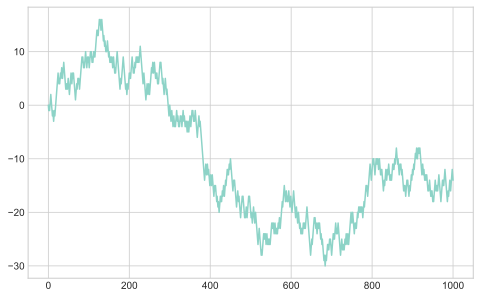
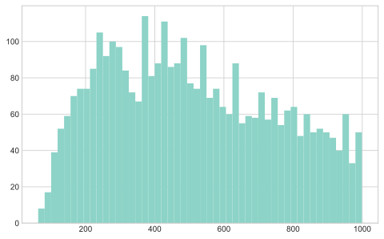
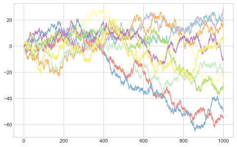

# Chapter 4. NumPy Basics: Arrays and Vectorized Computation

NumPy stands for "Numerical Python" and it provides a solid foundation for numeric computation in Python.
Here are some of the main features covered in this book:

- fast vectorized array operations
- common array algorithms such as sorting and set operations
- efficient descriptive statistics
- expressing conditional logic using arrays (instead of looping)
- group-wise data manipulation

NumPy is designed for efficiency on large arrays of data; the author continues to describe some of the ways it is able to accomplish this.
Here is a simple demonstration of thie preformance NumPy.


```python
import numpy as np

np.random.seed(0)

my_array = np.arange(1000000)
my_list = list(range(1000000))
```


```python
%time for _ in range(10): my_array = my_array * 2
```

    CPU times: user 18.5 ms, sys: 12.9 ms, total: 31.4 ms
    Wall time: 32.7 ms


```python
%time for _ in range(10): my_list = [x * 2 for x in my_list]
```

    CPU times: user 1.35 s, sys: 529 ms, total: 1.88 s
    Wall time: 2.95 s


## 4.1 The NumPy ndarray: a multidimensional array object

`ndarray` stands for N-dimensional array.
It is a fast flexible data structure with which we can conduct vectorized computations.
Here is a simple example.


```python
data = np.random.randn(2, 3)
data
```


    array([[ 1.76405235,  0.40015721,  0.97873798],
           [ 2.2408932 ,  1.86755799, -0.97727788]])


```python
data * 10
```


    array([[17.64052346,  4.00157208,  9.78737984],
           [22.40893199, 18.6755799 , -9.7727788 ]])


```python
data + data
```


    array([[ 3.52810469,  0.80031442,  1.95747597],
           [ 4.4817864 ,  3.73511598, -1.95455576]])


### Creating ndarrays


```python
data1 = [6, 7.5, 8, 0, 1]
arr1 = np.array(data1)
arr1
```


    array([6. , 7.5, 8. , 0. , 1. ])


```python
data2 = [[1, 2, 3, 4], [5, 6, 7, 8]]
arr2 = np.array(data2)
arr2
```


    array([[1, 2, 3, 4],
           [5, 6, 7, 8]])


```python
arr2.ndim
```


    2


```python
arr2.shape
```


    (2, 4)


NumPy tries to infer a good data type for the array based on data it is given.


```python
arr1.dtype
```


    dtype('float64')


```python
arr2.dtype
```


    dtype('int64')


Arrays can also be made using `zeros`, `ones`, and `empty` and passing in a tuple for the shape.


```python
np.zeros(10)
```


    array([0., 0., 0., 0., 0., 0., 0., 0., 0., 0.])


```python
numeric_strings = np.array(['1.25', '-9.6', '42'], dtype=np.string_)
numeric_strings.astype(float)
```


    array([ 1.25, -9.6 , 42.  ])


### Arithmetic is NumPy arrays

NumPy arrays can be operated on as vectors.


```python
arr = np.array([[1., 2., 3.], [4., 5., 6.]])
arr
```


    array([[1., 2., 3.],
           [4., 5., 6.]])


```python
arr * arr
```


    array([[ 1.,  4.,  9.],
           [16., 25., 36.]])


```python
arr  - arr
```


    array([[0., 0., 0.],
           [0., 0., 0.]])


```python
1/ arr
```


    array([[1.        , 0.5       , 0.33333333],
           [0.25      , 0.2       , 0.16666667]])


```python
arr ** 0.5
```


    array([[1.        , 1.41421356, 1.73205081],
           [2.        , 2.23606798, 2.44948974]])


```python
arr2 = np.array([[0., 4., 1.], [7., 2., 12.]])
arr2
```


    array([[ 0.,  4.,  1.],
           [ 7.,  2., 12.]])


```python
arr2 > arr
```


    array([[False,  True, False],
           [ True, False,  True]])


### Indexing and slicing

1-D arrays act similarly to Python lists.


```python
arr = np.arange(10)
arr[5]
```


    5


```python
arr[5:8]
```


    array([5, 6, 7])


```python
arr[5:8] = 12
arr
```


    array([ 0,  1,  2,  3,  4, 12, 12, 12,  8,  9])


A major distinciton between Python's lists and NumPy's arrays is that slices of an array are *views* on the original array.
Therefore, data is not copied, and any modifications will be reflected in the source array.


```python
arr_slice = arr[5:8]
arr_slice
```


    array([12, 12, 12])


```python
arr_slice[1] = 12345
arr
```


    array([    0,     1,     2,     3,     4,    12, 12345,    12,     8,
               9])


To get a copy of a ndarry, it must be explicitly copied.


```python
arr[5:8].copy()
```


    array([   12, 12345,    12])


Indexing multi-deminsional arrays requires the use of multidimensional indices.
Individual elements must be accessed recursively.


```python
arr2d = np.array([[1, 2, 3], [4, 5, 6], [7, 8, 9]])
arr2d[2]
```


    array([7, 8, 9])


```python
arr2d[0][2]
```


    3


```python
arr2d[0, 2]
```


    3


```python
arr3d = np.array([[[1, 2, 3], [4, 5, 6]], [[7, 8, 9], [10, 11, 12]]])
arr3d
```


    array([[[ 1,  2,  3],
            [ 4,  5,  6]],
    
           [[ 7,  8,  9],
            [10, 11, 12]]])


```python
arr3d[0]
```


    array([[1, 2, 3],
           [4, 5, 6]])


```python
old_values = arr3d[0].copy()
arr3d[0] = 42
arr3d
```


    array([[[42, 42, 42],
            [42, 42, 42]],
    
           [[ 7,  8,  9],
            [10, 11, 12]]])


```python
arr3d[0] = old_values
arr3d
```


    array([[[ 1,  2,  3],
            [ 4,  5,  6]],
    
           [[ 7,  8,  9],
            [10, 11, 12]]])


```python
arr3d[1, 0]
```


    array([7, 8, 9])


```python
arr3d[1][0]
```


    array([7, 8, 9])


We can still "slice" sections from a ndarry just like we would with a list.


```python
arr2d[:2, 1:]
```


    array([[2, 3],
           [5, 6]])


```python
arr2d[:, :1]
```


    array([[1],
           [4],
           [7]])


```python
arr2d[:2, 1:] = 0
arr2d
```


    array([[1, 0, 0],
           [4, 0, 0],
           [7, 8, 9]])


### Boolean indexing


```python
names = np.array(['Bob', 'Joe', 'Will', 'Bob', 'Will', 'Joe', 'Joe'])
data = np.random.randn(7, 4)
names
```


    array(['Bob', 'Joe', 'Will', 'Bob', 'Will', 'Joe', 'Joe'], dtype='<U4')


```python
data
```


    array([[ 0.95008842, -0.15135721, -0.10321885,  0.4105985 ],
           [ 0.14404357,  1.45427351,  0.76103773,  0.12167502],
           [ 0.44386323,  0.33367433,  1.49407907, -0.20515826],
           [ 0.3130677 , -0.85409574, -2.55298982,  0.6536186 ],
           [ 0.8644362 , -0.74216502,  2.26975462, -1.45436567],
           [ 0.04575852, -0.18718385,  1.53277921,  1.46935877],
           [ 0.15494743,  0.37816252, -0.88778575, -1.98079647]])


```python
names == 'Bob'
```


    array([ True, False, False,  True, False, False, False])


```python
data[names == 'Bob']
```


    array([[ 0.95008842, -0.15135721, -0.10321885,  0.4105985 ],
           [ 0.3130677 , -0.85409574, -2.55298982,  0.6536186 ]])


```python
data[names != 'Bob']
```


    array([[ 0.14404357,  1.45427351,  0.76103773,  0.12167502],
           [ 0.44386323,  0.33367433,  1.49407907, -0.20515826],
           [ 0.8644362 , -0.74216502,  2.26975462, -1.45436567],
           [ 0.04575852, -0.18718385,  1.53277921,  1.46935877],
           [ 0.15494743,  0.37816252, -0.88778575, -1.98079647]])


```python
cond = names == 'Bob'
data[cond]
```


    array([[ 0.95008842, -0.15135721, -0.10321885,  0.4105985 ],
           [ 0.3130677 , -0.85409574, -2.55298982,  0.6536186 ]])


```python
data[~cond]
```


    array([[ 0.14404357,  1.45427351,  0.76103773,  0.12167502],
           [ 0.44386323,  0.33367433,  1.49407907, -0.20515826],
           [ 0.8644362 , -0.74216502,  2.26975462, -1.45436567],
           [ 0.04575852, -0.18718385,  1.53277921,  1.46935877],
           [ 0.15494743,  0.37816252, -0.88778575, -1.98079647]])


```python
mask = (names == 'Bob') | (names == 'Will')
mask
```


    array([ True, False,  True,  True,  True, False, False])


```python
data[mask]
```


    array([[ 0.95008842, -0.15135721, -0.10321885,  0.4105985 ],
           [ 0.44386323,  0.33367433,  1.49407907, -0.20515826],
           [ 0.3130677 , -0.85409574, -2.55298982,  0.6536186 ],
           [ 0.8644362 , -0.74216502,  2.26975462, -1.45436567]])


### Fancy indexing

*Fancy indexing* (an actual term used for NumPy) is indexing using integer arrays.


```python
arr = np.empty((8, 4))
for i in range(8):
    arr[i] = i
arr
```


    array([[0., 0., 0., 0.],
           [1., 1., 1., 1.],
           [2., 2., 2., 2.],
           [3., 3., 3., 3.],
           [4., 4., 4., 4.],
           [5., 5., 5., 5.],
           [6., 6., 6., 6.],
           [7., 7., 7., 7.]])


To select out a subset or rows in a specific order, pass a list or ndarry of the indices.


```python
arr[[4, 3, 0, 6]]
```


    array([[4., 4., 4., 4.],
           [3., 3., 3., 3.],
           [0., 0., 0., 0.],
           [6., 6., 6., 6.]])


Using negative values indexes from the end.


```python
arr[[-3, -5, -7]]
```


    array([[5., 5., 5., 5.],
           [3., 3., 3., 3.],
           [1., 1., 1., 1.]])


Passing multiple indexing lists pulls the values corresponding to each tuple of the indices.


```python
arr = np.arange(32).reshape((8, 4))
arr
```


    array([[ 0,  1,  2,  3],
           [ 4,  5,  6,  7],
           [ 8,  9, 10, 11],
           [12, 13, 14, 15],
           [16, 17, 18, 19],
           [20, 21, 22, 23],
           [24, 25, 26, 27],
           [28, 29, 30, 31]])


```python
arr[[1, 5, 7, 2], [0, 3, 1, 2]]
```


    array([ 4, 23, 29, 10])


```python
arr[[1, 5, 7, 2]][:, [0, 3, 1, 2]]
```


    array([[ 4,  7,  5,  6],
           [20, 23, 21, 22],
           [28, 31, 29, 30],
           [ 8, 11,  9, 10]])


### Transposing arrays and swapping axes

Transposing also just returns a *view* - *it does not change the underlying data.*
Arrays have a `transpose` method and a special `T` attribute.


```python
arr = np.arange(15).reshape((3, 5))
arr
```


    array([[ 0,  1,  2,  3,  4],
           [ 5,  6,  7,  8,  9],
           [10, 11, 12, 13, 14]])


```python
arr.T
```


    array([[ 0,  5, 10],
           [ 1,  6, 11],
           [ 2,  7, 12],
           [ 3,  8, 13],
           [ 4,  9, 14]])


For higher-dimensional arrays, `transpose` takes a tuple of the axis numbers to permute.


```python
arr = np.arange(16).reshape((2, 2, 4))
arr
```


    array([[[ 0,  1,  2,  3],
            [ 4,  5,  6,  7]],
    
           [[ 8,  9, 10, 11],
            [12, 13, 14, 15]]])


```python
arr.transpose((1, 0, 2))
```


    array([[[ 0,  1,  2,  3],
            [ 8,  9, 10, 11]],
    
           [[ 4,  5,  6,  7],
            [12, 13, 14, 15]]])


The `T` method is a special case of the `swapaxes` method.


```python
arr.swapaxes(1, 2)
```


    array([[[ 0,  4],
            [ 1,  5],
            [ 2,  6],
            [ 3,  7]],
    
           [[ 8, 12],
            [ 9, 13],
            [10, 14],
            [11, 15]]])


## 4.2 Universal functions: fast element-wise array functions

A universal function, *ufunc*, performs element-wise operations on data in ndarrys.
They are vectorized.


```python
arr = np.arange(10)
arr
```


    array([0, 1, 2, 3, 4, 5, 6, 7, 8, 9])


```python
np.sqrt(arr)
```


    array([0.        , 1.        , 1.41421356, 1.73205081, 2.        ,
           2.23606798, 2.44948974, 2.64575131, 2.82842712, 3.        ])


```python
np.exp(arr)
```


    array([1.00000000e+00, 2.71828183e+00, 7.38905610e+00, 2.00855369e+01,
           5.45981500e+01, 1.48413159e+02, 4.03428793e+02, 1.09663316e+03,
           2.98095799e+03, 8.10308393e+03])


Other functions can take two arrays and operate on them value-wise.


```python
x = np.random.randn(8)
y = np.random.randn(8)
np.maximum(x, y)
```


    array([-0.34791215,  1.9507754 ,  1.23029068,  1.20237985, -0.38732682,
            0.77749036, -1.04855297, -0.21274028])


Many *ufuncs* also take an optional `out` argument so they can operate in place.


```python
arr = np.random.randn(7) * 5
arr
```


    array([-4.47733281,  1.93451249, -2.55402569, -5.90316092, -0.14091114,
            2.14165935,  0.33258611])


```python
np.sqrt(arr)
```

    /opt/anaconda3/envs/daysOfCode-env/lib/python3.7/site-packages/ipykernel_launcher.py:1: RuntimeWarning: invalid value encountered in sqrt
      """Entry point for launching an IPython kernel.


    array([       nan, 1.39086753,        nan,        nan,        nan,
           1.46344093, 0.57670279])


```python
arr
```


    array([-4.47733281,  1.93451249, -2.55402569, -5.90316092, -0.14091114,
            2.14165935,  0.33258611])


```python
np.sqrt(arr, arr)
```

    /opt/anaconda3/envs/daysOfCode-env/lib/python3.7/site-packages/ipykernel_launcher.py:1: RuntimeWarning: invalid value encountered in sqrt
      """Entry point for launching an IPython kernel.


    array([       nan, 1.39086753,        nan,        nan,        nan,
           1.46344093, 0.57670279])


```python
arr
```


    array([       nan, 1.39086753,        nan,        nan,        nan,
           1.46344093, 0.57670279])


## 4.3 Array-oriented programming with arrays

Vectorized array operations are usually multiple orders of magnitude faster than their equivalent loop.


```python
points = np.arange(-5, 5, 0.01)
points
```


    array([-5.0000000e+00, -4.9900000e+00, -4.9800000e+00, -4.9700000e+00,
           -4.9600000e+00, -4.9500000e+00, -4.9400000e+00, -4.9300000e+00,
           -4.9200000e+00, -4.9100000e+00, -4.9000000e+00, -4.8900000e+00,
           -4.8800000e+00, -4.8700000e+00, -4.8600000e+00, -4.8500000e+00,
           -4.8400000e+00, -4.8300000e+00, -4.8200000e+00, -4.8100000e+00,
           -4.8000000e+00, -4.7900000e+00, -4.7800000e+00, -4.7700000e+00,
           -4.7600000e+00, -4.7500000e+00, -4.7400000e+00, -4.7300000e+00,
           -4.7200000e+00, -4.7100000e+00, -4.7000000e+00, -4.6900000e+00,
           -4.6800000e+00, -4.6700000e+00, -4.6600000e+00, -4.6500000e+00,
           -4.6400000e+00, -4.6300000e+00, -4.6200000e+00, -4.6100000e+00,
           -4.6000000e+00, -4.5900000e+00, -4.5800000e+00, -4.5700000e+00,
           -4.5600000e+00, -4.5500000e+00, -4.5400000e+00, -4.5300000e+00,
           -4.5200000e+00, -4.5100000e+00, -4.5000000e+00, -4.4900000e+00,
           -4.4800000e+00, -4.4700000e+00, -4.4600000e+00, -4.4500000e+00,
           -4.4400000e+00, -4.4300000e+00, -4.4200000e+00, -4.4100000e+00,
           -4.4000000e+00, -4.3900000e+00, -4.3800000e+00, -4.3700000e+00,
           -4.3600000e+00, -4.3500000e+00, -4.3400000e+00, -4.3300000e+00,
           -4.3200000e+00, -4.3100000e+00, -4.3000000e+00, -4.2900000e+00,
           -4.2800000e+00, -4.2700000e+00, -4.2600000e+00, -4.2500000e+00,
           -4.2400000e+00, -4.2300000e+00, -4.2200000e+00, -4.2100000e+00,
           -4.2000000e+00, -4.1900000e+00, -4.1800000e+00, -4.1700000e+00,
           -4.1600000e+00, -4.1500000e+00, -4.1400000e+00, -4.1300000e+00,
           -4.1200000e+00, -4.1100000e+00, -4.1000000e+00, -4.0900000e+00,
           -4.0800000e+00, -4.0700000e+00, -4.0600000e+00, -4.0500000e+00,
           -4.0400000e+00, -4.0300000e+00, -4.0200000e+00, -4.0100000e+00,
           -4.0000000e+00, -3.9900000e+00, -3.9800000e+00, -3.9700000e+00,
           -3.9600000e+00, -3.9500000e+00, -3.9400000e+00, -3.9300000e+00,
           -3.9200000e+00, -3.9100000e+00, -3.9000000e+00, -3.8900000e+00,
           -3.8800000e+00, -3.8700000e+00, -3.8600000e+00, -3.8500000e+00,
           -3.8400000e+00, -3.8300000e+00, -3.8200000e+00, -3.8100000e+00,
           -3.8000000e+00, -3.7900000e+00, -3.7800000e+00, -3.7700000e+00,
           -3.7600000e+00, -3.7500000e+00, -3.7400000e+00, -3.7300000e+00,
           -3.7200000e+00, -3.7100000e+00, -3.7000000e+00, -3.6900000e+00,
           -3.6800000e+00, -3.6700000e+00, -3.6600000e+00, -3.6500000e+00,
           -3.6400000e+00, -3.6300000e+00, -3.6200000e+00, -3.6100000e+00,
           -3.6000000e+00, -3.5900000e+00, -3.5800000e+00, -3.5700000e+00,
           -3.5600000e+00, -3.5500000e+00, -3.5400000e+00, -3.5300000e+00,
           -3.5200000e+00, -3.5100000e+00, -3.5000000e+00, -3.4900000e+00,
           -3.4800000e+00, -3.4700000e+00, -3.4600000e+00, -3.4500000e+00,
           -3.4400000e+00, -3.4300000e+00, -3.4200000e+00, -3.4100000e+00,
           -3.4000000e+00, -3.3900000e+00, -3.3800000e+00, -3.3700000e+00,
           -3.3600000e+00, -3.3500000e+00, -3.3400000e+00, -3.3300000e+00,
           -3.3200000e+00, -3.3100000e+00, -3.3000000e+00, -3.2900000e+00,
           -3.2800000e+00, -3.2700000e+00, -3.2600000e+00, -3.2500000e+00,
           -3.2400000e+00, -3.2300000e+00, -3.2200000e+00, -3.2100000e+00,
           -3.2000000e+00, -3.1900000e+00, -3.1800000e+00, -3.1700000e+00,
           -3.1600000e+00, -3.1500000e+00, -3.1400000e+00, -3.1300000e+00,
           -3.1200000e+00, -3.1100000e+00, -3.1000000e+00, -3.0900000e+00,
           -3.0800000e+00, -3.0700000e+00, -3.0600000e+00, -3.0500000e+00,
           -3.0400000e+00, -3.0300000e+00, -3.0200000e+00, -3.0100000e+00,
           -3.0000000e+00, -2.9900000e+00, -2.9800000e+00, -2.9700000e+00,
           -2.9600000e+00, -2.9500000e+00, -2.9400000e+00, -2.9300000e+00,
           -2.9200000e+00, -2.9100000e+00, -2.9000000e+00, -2.8900000e+00,
           -2.8800000e+00, -2.8700000e+00, -2.8600000e+00, -2.8500000e+00,
           -2.8400000e+00, -2.8300000e+00, -2.8200000e+00, -2.8100000e+00,
           -2.8000000e+00, -2.7900000e+00, -2.7800000e+00, -2.7700000e+00,
           -2.7600000e+00, -2.7500000e+00, -2.7400000e+00, -2.7300000e+00,
           -2.7200000e+00, -2.7100000e+00, -2.7000000e+00, -2.6900000e+00,
           -2.6800000e+00, -2.6700000e+00, -2.6600000e+00, -2.6500000e+00,
           -2.6400000e+00, -2.6300000e+00, -2.6200000e+00, -2.6100000e+00,
           -2.6000000e+00, -2.5900000e+00, -2.5800000e+00, -2.5700000e+00,
           -2.5600000e+00, -2.5500000e+00, -2.5400000e+00, -2.5300000e+00,
           -2.5200000e+00, -2.5100000e+00, -2.5000000e+00, -2.4900000e+00,
           -2.4800000e+00, -2.4700000e+00, -2.4600000e+00, -2.4500000e+00,
           -2.4400000e+00, -2.4300000e+00, -2.4200000e+00, -2.4100000e+00,
           -2.4000000e+00, -2.3900000e+00, -2.3800000e+00, -2.3700000e+00,
           -2.3600000e+00, -2.3500000e+00, -2.3400000e+00, -2.3300000e+00,
           -2.3200000e+00, -2.3100000e+00, -2.3000000e+00, -2.2900000e+00,
           -2.2800000e+00, -2.2700000e+00, -2.2600000e+00, -2.2500000e+00,
           -2.2400000e+00, -2.2300000e+00, -2.2200000e+00, -2.2100000e+00,
           -2.2000000e+00, -2.1900000e+00, -2.1800000e+00, -2.1700000e+00,
           -2.1600000e+00, -2.1500000e+00, -2.1400000e+00, -2.1300000e+00,
           -2.1200000e+00, -2.1100000e+00, -2.1000000e+00, -2.0900000e+00,
           -2.0800000e+00, -2.0700000e+00, -2.0600000e+00, -2.0500000e+00,
           -2.0400000e+00, -2.0300000e+00, -2.0200000e+00, -2.0100000e+00,
           -2.0000000e+00, -1.9900000e+00, -1.9800000e+00, -1.9700000e+00,
           -1.9600000e+00, -1.9500000e+00, -1.9400000e+00, -1.9300000e+00,
           -1.9200000e+00, -1.9100000e+00, -1.9000000e+00, -1.8900000e+00,
           -1.8800000e+00, -1.8700000e+00, -1.8600000e+00, -1.8500000e+00,
           -1.8400000e+00, -1.8300000e+00, -1.8200000e+00, -1.8100000e+00,
           -1.8000000e+00, -1.7900000e+00, -1.7800000e+00, -1.7700000e+00,
           -1.7600000e+00, -1.7500000e+00, -1.7400000e+00, -1.7300000e+00,
           -1.7200000e+00, -1.7100000e+00, -1.7000000e+00, -1.6900000e+00,
           -1.6800000e+00, -1.6700000e+00, -1.6600000e+00, -1.6500000e+00,
           -1.6400000e+00, -1.6300000e+00, -1.6200000e+00, -1.6100000e+00,
           -1.6000000e+00, -1.5900000e+00, -1.5800000e+00, -1.5700000e+00,
           -1.5600000e+00, -1.5500000e+00, -1.5400000e+00, -1.5300000e+00,
           -1.5200000e+00, -1.5100000e+00, -1.5000000e+00, -1.4900000e+00,
           -1.4800000e+00, -1.4700000e+00, -1.4600000e+00, -1.4500000e+00,
           -1.4400000e+00, -1.4300000e+00, -1.4200000e+00, -1.4100000e+00,
           -1.4000000e+00, -1.3900000e+00, -1.3800000e+00, -1.3700000e+00,
           -1.3600000e+00, -1.3500000e+00, -1.3400000e+00, -1.3300000e+00,
           -1.3200000e+00, -1.3100000e+00, -1.3000000e+00, -1.2900000e+00,
           -1.2800000e+00, -1.2700000e+00, -1.2600000e+00, -1.2500000e+00,
           -1.2400000e+00, -1.2300000e+00, -1.2200000e+00, -1.2100000e+00,
           -1.2000000e+00, -1.1900000e+00, -1.1800000e+00, -1.1700000e+00,
           -1.1600000e+00, -1.1500000e+00, -1.1400000e+00, -1.1300000e+00,
           -1.1200000e+00, -1.1100000e+00, -1.1000000e+00, -1.0900000e+00,
           -1.0800000e+00, -1.0700000e+00, -1.0600000e+00, -1.0500000e+00,
           -1.0400000e+00, -1.0300000e+00, -1.0200000e+00, -1.0100000e+00,
           -1.0000000e+00, -9.9000000e-01, -9.8000000e-01, -9.7000000e-01,
           -9.6000000e-01, -9.5000000e-01, -9.4000000e-01, -9.3000000e-01,
           -9.2000000e-01, -9.1000000e-01, -9.0000000e-01, -8.9000000e-01,
           -8.8000000e-01, -8.7000000e-01, -8.6000000e-01, -8.5000000e-01,
           -8.4000000e-01, -8.3000000e-01, -8.2000000e-01, -8.1000000e-01,
           -8.0000000e-01, -7.9000000e-01, -7.8000000e-01, -7.7000000e-01,
           -7.6000000e-01, -7.5000000e-01, -7.4000000e-01, -7.3000000e-01,
           -7.2000000e-01, -7.1000000e-01, -7.0000000e-01, -6.9000000e-01,
           -6.8000000e-01, -6.7000000e-01, -6.6000000e-01, -6.5000000e-01,
           -6.4000000e-01, -6.3000000e-01, -6.2000000e-01, -6.1000000e-01,
           -6.0000000e-01, -5.9000000e-01, -5.8000000e-01, -5.7000000e-01,
           -5.6000000e-01, -5.5000000e-01, -5.4000000e-01, -5.3000000e-01,
           -5.2000000e-01, -5.1000000e-01, -5.0000000e-01, -4.9000000e-01,
           -4.8000000e-01, -4.7000000e-01, -4.6000000e-01, -4.5000000e-01,
           -4.4000000e-01, -4.3000000e-01, -4.2000000e-01, -4.1000000e-01,
           -4.0000000e-01, -3.9000000e-01, -3.8000000e-01, -3.7000000e-01,
           -3.6000000e-01, -3.5000000e-01, -3.4000000e-01, -3.3000000e-01,
           -3.2000000e-01, -3.1000000e-01, -3.0000000e-01, -2.9000000e-01,
           -2.8000000e-01, -2.7000000e-01, -2.6000000e-01, -2.5000000e-01,
           -2.4000000e-01, -2.3000000e-01, -2.2000000e-01, -2.1000000e-01,
           -2.0000000e-01, -1.9000000e-01, -1.8000000e-01, -1.7000000e-01,
           -1.6000000e-01, -1.5000000e-01, -1.4000000e-01, -1.3000000e-01,
           -1.2000000e-01, -1.1000000e-01, -1.0000000e-01, -9.0000000e-02,
           -8.0000000e-02, -7.0000000e-02, -6.0000000e-02, -5.0000000e-02,
           -4.0000000e-02, -3.0000000e-02, -2.0000000e-02, -1.0000000e-02,
           -1.0658141e-13,  1.0000000e-02,  2.0000000e-02,  3.0000000e-02,
            4.0000000e-02,  5.0000000e-02,  6.0000000e-02,  7.0000000e-02,
            8.0000000e-02,  9.0000000e-02,  1.0000000e-01,  1.1000000e-01,
            1.2000000e-01,  1.3000000e-01,  1.4000000e-01,  1.5000000e-01,
            1.6000000e-01,  1.7000000e-01,  1.8000000e-01,  1.9000000e-01,
            2.0000000e-01,  2.1000000e-01,  2.2000000e-01,  2.3000000e-01,
            2.4000000e-01,  2.5000000e-01,  2.6000000e-01,  2.7000000e-01,
            2.8000000e-01,  2.9000000e-01,  3.0000000e-01,  3.1000000e-01,
            3.2000000e-01,  3.3000000e-01,  3.4000000e-01,  3.5000000e-01,
            3.6000000e-01,  3.7000000e-01,  3.8000000e-01,  3.9000000e-01,
            4.0000000e-01,  4.1000000e-01,  4.2000000e-01,  4.3000000e-01,
            4.4000000e-01,  4.5000000e-01,  4.6000000e-01,  4.7000000e-01,
            4.8000000e-01,  4.9000000e-01,  5.0000000e-01,  5.1000000e-01,
            5.2000000e-01,  5.3000000e-01,  5.4000000e-01,  5.5000000e-01,
            5.6000000e-01,  5.7000000e-01,  5.8000000e-01,  5.9000000e-01,
            6.0000000e-01,  6.1000000e-01,  6.2000000e-01,  6.3000000e-01,
            6.4000000e-01,  6.5000000e-01,  6.6000000e-01,  6.7000000e-01,
            6.8000000e-01,  6.9000000e-01,  7.0000000e-01,  7.1000000e-01,
            7.2000000e-01,  7.3000000e-01,  7.4000000e-01,  7.5000000e-01,
            7.6000000e-01,  7.7000000e-01,  7.8000000e-01,  7.9000000e-01,
            8.0000000e-01,  8.1000000e-01,  8.2000000e-01,  8.3000000e-01,
            8.4000000e-01,  8.5000000e-01,  8.6000000e-01,  8.7000000e-01,
            8.8000000e-01,  8.9000000e-01,  9.0000000e-01,  9.1000000e-01,
            9.2000000e-01,  9.3000000e-01,  9.4000000e-01,  9.5000000e-01,
            9.6000000e-01,  9.7000000e-01,  9.8000000e-01,  9.9000000e-01,
            1.0000000e+00,  1.0100000e+00,  1.0200000e+00,  1.0300000e+00,
            1.0400000e+00,  1.0500000e+00,  1.0600000e+00,  1.0700000e+00,
            1.0800000e+00,  1.0900000e+00,  1.1000000e+00,  1.1100000e+00,
            1.1200000e+00,  1.1300000e+00,  1.1400000e+00,  1.1500000e+00,
            1.1600000e+00,  1.1700000e+00,  1.1800000e+00,  1.1900000e+00,
            1.2000000e+00,  1.2100000e+00,  1.2200000e+00,  1.2300000e+00,
            1.2400000e+00,  1.2500000e+00,  1.2600000e+00,  1.2700000e+00,
            1.2800000e+00,  1.2900000e+00,  1.3000000e+00,  1.3100000e+00,
            1.3200000e+00,  1.3300000e+00,  1.3400000e+00,  1.3500000e+00,
            1.3600000e+00,  1.3700000e+00,  1.3800000e+00,  1.3900000e+00,
            1.4000000e+00,  1.4100000e+00,  1.4200000e+00,  1.4300000e+00,
            1.4400000e+00,  1.4500000e+00,  1.4600000e+00,  1.4700000e+00,
            1.4800000e+00,  1.4900000e+00,  1.5000000e+00,  1.5100000e+00,
            1.5200000e+00,  1.5300000e+00,  1.5400000e+00,  1.5500000e+00,
            1.5600000e+00,  1.5700000e+00,  1.5800000e+00,  1.5900000e+00,
            1.6000000e+00,  1.6100000e+00,  1.6200000e+00,  1.6300000e+00,
            1.6400000e+00,  1.6500000e+00,  1.6600000e+00,  1.6700000e+00,
            1.6800000e+00,  1.6900000e+00,  1.7000000e+00,  1.7100000e+00,
            1.7200000e+00,  1.7300000e+00,  1.7400000e+00,  1.7500000e+00,
            1.7600000e+00,  1.7700000e+00,  1.7800000e+00,  1.7900000e+00,
            1.8000000e+00,  1.8100000e+00,  1.8200000e+00,  1.8300000e+00,
            1.8400000e+00,  1.8500000e+00,  1.8600000e+00,  1.8700000e+00,
            1.8800000e+00,  1.8900000e+00,  1.9000000e+00,  1.9100000e+00,
            1.9200000e+00,  1.9300000e+00,  1.9400000e+00,  1.9500000e+00,
            1.9600000e+00,  1.9700000e+00,  1.9800000e+00,  1.9900000e+00,
            2.0000000e+00,  2.0100000e+00,  2.0200000e+00,  2.0300000e+00,
            2.0400000e+00,  2.0500000e+00,  2.0600000e+00,  2.0700000e+00,
            2.0800000e+00,  2.0900000e+00,  2.1000000e+00,  2.1100000e+00,
            2.1200000e+00,  2.1300000e+00,  2.1400000e+00,  2.1500000e+00,
            2.1600000e+00,  2.1700000e+00,  2.1800000e+00,  2.1900000e+00,
            2.2000000e+00,  2.2100000e+00,  2.2200000e+00,  2.2300000e+00,
            2.2400000e+00,  2.2500000e+00,  2.2600000e+00,  2.2700000e+00,
            2.2800000e+00,  2.2900000e+00,  2.3000000e+00,  2.3100000e+00,
            2.3200000e+00,  2.3300000e+00,  2.3400000e+00,  2.3500000e+00,
            2.3600000e+00,  2.3700000e+00,  2.3800000e+00,  2.3900000e+00,
            2.4000000e+00,  2.4100000e+00,  2.4200000e+00,  2.4300000e+00,
            2.4400000e+00,  2.4500000e+00,  2.4600000e+00,  2.4700000e+00,
            2.4800000e+00,  2.4900000e+00,  2.5000000e+00,  2.5100000e+00,
            2.5200000e+00,  2.5300000e+00,  2.5400000e+00,  2.5500000e+00,
            2.5600000e+00,  2.5700000e+00,  2.5800000e+00,  2.5900000e+00,
            2.6000000e+00,  2.6100000e+00,  2.6200000e+00,  2.6300000e+00,
            2.6400000e+00,  2.6500000e+00,  2.6600000e+00,  2.6700000e+00,
            2.6800000e+00,  2.6900000e+00,  2.7000000e+00,  2.7100000e+00,
            2.7200000e+00,  2.7300000e+00,  2.7400000e+00,  2.7500000e+00,
            2.7600000e+00,  2.7700000e+00,  2.7800000e+00,  2.7900000e+00,
            2.8000000e+00,  2.8100000e+00,  2.8200000e+00,  2.8300000e+00,
            2.8400000e+00,  2.8500000e+00,  2.8600000e+00,  2.8700000e+00,
            2.8800000e+00,  2.8900000e+00,  2.9000000e+00,  2.9100000e+00,
            2.9200000e+00,  2.9300000e+00,  2.9400000e+00,  2.9500000e+00,
            2.9600000e+00,  2.9700000e+00,  2.9800000e+00,  2.9900000e+00,
            3.0000000e+00,  3.0100000e+00,  3.0200000e+00,  3.0300000e+00,
            3.0400000e+00,  3.0500000e+00,  3.0600000e+00,  3.0700000e+00,
            3.0800000e+00,  3.0900000e+00,  3.1000000e+00,  3.1100000e+00,
            3.1200000e+00,  3.1300000e+00,  3.1400000e+00,  3.1500000e+00,
            3.1600000e+00,  3.1700000e+00,  3.1800000e+00,  3.1900000e+00,
            3.2000000e+00,  3.2100000e+00,  3.2200000e+00,  3.2300000e+00,
            3.2400000e+00,  3.2500000e+00,  3.2600000e+00,  3.2700000e+00,
            3.2800000e+00,  3.2900000e+00,  3.3000000e+00,  3.3100000e+00,
            3.3200000e+00,  3.3300000e+00,  3.3400000e+00,  3.3500000e+00,
            3.3600000e+00,  3.3700000e+00,  3.3800000e+00,  3.3900000e+00,
            3.4000000e+00,  3.4100000e+00,  3.4200000e+00,  3.4300000e+00,
            3.4400000e+00,  3.4500000e+00,  3.4600000e+00,  3.4700000e+00,
            3.4800000e+00,  3.4900000e+00,  3.5000000e+00,  3.5100000e+00,
            3.5200000e+00,  3.5300000e+00,  3.5400000e+00,  3.5500000e+00,
            3.5600000e+00,  3.5700000e+00,  3.5800000e+00,  3.5900000e+00,
            3.6000000e+00,  3.6100000e+00,  3.6200000e+00,  3.6300000e+00,
            3.6400000e+00,  3.6500000e+00,  3.6600000e+00,  3.6700000e+00,
            3.6800000e+00,  3.6900000e+00,  3.7000000e+00,  3.7100000e+00,
            3.7200000e+00,  3.7300000e+00,  3.7400000e+00,  3.7500000e+00,
            3.7600000e+00,  3.7700000e+00,  3.7800000e+00,  3.7900000e+00,
            3.8000000e+00,  3.8100000e+00,  3.8200000e+00,  3.8300000e+00,
            3.8400000e+00,  3.8500000e+00,  3.8600000e+00,  3.8700000e+00,
            3.8800000e+00,  3.8900000e+00,  3.9000000e+00,  3.9100000e+00,
            3.9200000e+00,  3.9300000e+00,  3.9400000e+00,  3.9500000e+00,
            3.9600000e+00,  3.9700000e+00,  3.9800000e+00,  3.9900000e+00,
            4.0000000e+00,  4.0100000e+00,  4.0200000e+00,  4.0300000e+00,
            4.0400000e+00,  4.0500000e+00,  4.0600000e+00,  4.0700000e+00,
            4.0800000e+00,  4.0900000e+00,  4.1000000e+00,  4.1100000e+00,
            4.1200000e+00,  4.1300000e+00,  4.1400000e+00,  4.1500000e+00,
            4.1600000e+00,  4.1700000e+00,  4.1800000e+00,  4.1900000e+00,
            4.2000000e+00,  4.2100000e+00,  4.2200000e+00,  4.2300000e+00,
            4.2400000e+00,  4.2500000e+00,  4.2600000e+00,  4.2700000e+00,
            4.2800000e+00,  4.2900000e+00,  4.3000000e+00,  4.3100000e+00,
            4.3200000e+00,  4.3300000e+00,  4.3400000e+00,  4.3500000e+00,
            4.3600000e+00,  4.3700000e+00,  4.3800000e+00,  4.3900000e+00,
            4.4000000e+00,  4.4100000e+00,  4.4200000e+00,  4.4300000e+00,
            4.4400000e+00,  4.4500000e+00,  4.4600000e+00,  4.4700000e+00,
            4.4800000e+00,  4.4900000e+00,  4.5000000e+00,  4.5100000e+00,
            4.5200000e+00,  4.5300000e+00,  4.5400000e+00,  4.5500000e+00,
            4.5600000e+00,  4.5700000e+00,  4.5800000e+00,  4.5900000e+00,
            4.6000000e+00,  4.6100000e+00,  4.6200000e+00,  4.6300000e+00,
            4.6400000e+00,  4.6500000e+00,  4.6600000e+00,  4.6700000e+00,
            4.6800000e+00,  4.6900000e+00,  4.7000000e+00,  4.7100000e+00,
            4.7200000e+00,  4.7300000e+00,  4.7400000e+00,  4.7500000e+00,
            4.7600000e+00,  4.7700000e+00,  4.7800000e+00,  4.7900000e+00,
            4.8000000e+00,  4.8100000e+00,  4.8200000e+00,  4.8300000e+00,
            4.8400000e+00,  4.8500000e+00,  4.8600000e+00,  4.8700000e+00,
            4.8800000e+00,  4.8900000e+00,  4.9000000e+00,  4.9100000e+00,
            4.9200000e+00,  4.9300000e+00,  4.9400000e+00,  4.9500000e+00,
            4.9600000e+00,  4.9700000e+00,  4.9800000e+00,  4.9900000e+00])


```python
xs, ys = np.meshgrid(points, points)
xs
```


    array([[-5.  , -4.99, -4.98, ...,  4.97,  4.98,  4.99],
           [-5.  , -4.99, -4.98, ...,  4.97,  4.98,  4.99],
           [-5.  , -4.99, -4.98, ...,  4.97,  4.98,  4.99],
           ...,
           [-5.  , -4.99, -4.98, ...,  4.97,  4.98,  4.99],
           [-5.  , -4.99, -4.98, ...,  4.97,  4.98,  4.99],
           [-5.  , -4.99, -4.98, ...,  4.97,  4.98,  4.99]])


```python
ys
```


    array([[-5.  , -5.  , -5.  , ..., -5.  , -5.  , -5.  ],
           [-4.99, -4.99, -4.99, ..., -4.99, -4.99, -4.99],
           [-4.98, -4.98, -4.98, ..., -4.98, -4.98, -4.98],
           ...,
           [ 4.97,  4.97,  4.97, ...,  4.97,  4.97,  4.97],
           [ 4.98,  4.98,  4.98, ...,  4.98,  4.98,  4.98],
           [ 4.99,  4.99,  4.99, ...,  4.99,  4.99,  4.99]])


```python
z = np.sqrt(xs ** 2 + ys ** 2)
```

### Expressing conditional logic as array operations

The `numpy.where` function is a vectorized version of the ternary expression `x if condition else y`.


```python
xarr = np.array([1.1, 1.2, 1.3, 1.4, 1.5])
yarr = np.array([2.1, 2.2, 2.3, 2.4, 2.5])
cond = np.array([True, False, True, True, False])

# Using a list comprehension.
result = [(x if c else y) for x, y, c, in zip(xarr, yarr, cond)]
result
```


    [1.1, 2.2, 1.3, 1.4, 2.5]


```python
# Using NumPy
result = np.where(cond, xarr, yarr)
result
```


    array([1.1, 2.2, 1.3, 1.4, 2.5])


One or both of the second and third arguments can be scalars.


```python
arr = np.random.randn(4, 4)
np.where(arr > 0, 2, -2)
```


    array([[ 2, -2, -2, -2],
           [-2, -2, -2,  2],
           [-2, -2,  2, -2],
           [ 2,  2,  2,  2]])


```python
np.where(arr > 0, 2, arr)
```


    array([[ 2.        , -0.63432209, -0.36274117, -0.67246045],
           [-0.35955316, -0.81314628, -1.7262826 ,  2.        ],
           [-0.40178094, -1.63019835,  2.        , -0.90729836],
           [ 2.        ,  2.        ,  2.        ,  2.        ]])


### Methemtical and statistical methods

We can apply reductions, aggregating functions such as `sum` or `mean`, to an array using either the method or a top-level NumPy function.


```python
arr = np.random.randn(5, 4)
arr.mean()
```


    0.04185027188719551


```python
np.mean(arr)
```


    0.04185027188719551


```python
arr.sum()
```


    0.8370054377439102


Some functions also take an optional `axis` argument for computing the statistic over a specific dimension.


```python
arr.mean(axis=1)
```


    array([-0.59702285, -0.49984667,  0.32962436,  0.45599782,  0.52049871])


```python
arr.sum(axis=0)
```


    array([ 2.0374919 ,  1.33205417, -1.1223682 , -1.41017244])


### Methods for boolean arrays


```python
np.random.randn(100)

# Number of positive values
(arr > 0).sum()
```


    10


```python
bools = np.array([False, False, True, False])
bools.any()
```


    True


```python
bools.all()
```


    False


```python
(~bools).any()
```


    True


### Sorting

Like a Python list, NumPy arrays sort in-place.
The dimension to sort can be declared using the optional `axis` argument.


```python
arr = np.random.randn(6)
arr
```


    array([-1.1680935 ,  0.52327666, -0.17154633,  0.77179055,  0.82350415,
            2.16323595])


```python
arr.sort()
arr
```


    array([-1.1680935 , -0.17154633,  0.52327666,  0.77179055,  0.82350415,
            2.16323595])


```python
arr = np.random.randn(5, 3)
arr
```


    array([[ 1.33652795, -0.36918184, -0.23937918],
           [ 1.0996596 ,  0.65526373,  0.64013153],
           [-1.61695604, -0.02432612, -0.73803091],
           [ 0.2799246 , -0.09815039,  0.91017891],
           [ 0.31721822,  0.78632796, -0.4664191 ]])


```python
arr.sort(1)
arr
```


    array([[-0.36918184, -0.23937918,  1.33652795],
           [ 0.64013153,  0.65526373,  1.0996596 ],
           [-1.61695604, -0.73803091, -0.02432612],
           [-0.09815039,  0.2799246 ,  0.91017891],
           [-0.4664191 ,  0.31721822,  0.78632796]])


### Unique and other set logic


```python
names = np.array(['Bob', 'Joe', 'Will', 'Bob', 'Will', 'Joe', 'Joe'])
np.unique(names)
```


    array(['Bob', 'Joe', 'Will'], dtype='<U4')


```python
ints = np.array([3, 3, 3, 2, 2, 1, 1, 4, 4])
np.unique(ints)
```


    array([1, 2, 3, 4])


## 4.4 File input and output with arrays

NumPy can write arrays to disk in either binary or text format.
We will only cover the former.


```python
arr = np.arange(10)
np.save('assets/some_array', arr)
```


```python
np.load('assets/some_array.npy')
```


    array([0, 1, 2, 3, 4, 5, 6, 7, 8, 9])


```python
np.savez('assets/arrays_archive.npz', a=arr, b=arr)
```


```python
arch = np.load('assets/arrays_archive.npz')
arch['b']
```


    array([0, 1, 2, 3, 4, 5, 6, 7, 8, 9])


```python
np.savez_compressed('assets/arrays_compressed.npz', a=arr, b=arr)
```

## 4.5 Linear algebra


```python
x = np.array([[1., 2., 3.], [4., 5., 6.]])
y = np.array([[6., 23.], [-1, 7], [8, 9]])
```


```python
x.dot(y)
```


    array([[ 28.,  64.],
           [ 67., 181.]])


```python
np.dot(x, y)
```


    array([[ 28.,  64.],
           [ 67., 181.]])


NumPy's `linalg` module has many standard linear algebra operations such as decompositions and determinations.


```python
from numpy.linalg import inv, qr
X = np.random.randn(5, 5)
mat = X.T.dot(X)
inv(mat)
```


    array([[  17.04405735,  -54.45763876,   96.10869952,   37.57206594,
              -8.32485987],
           [ -54.45763876,  177.60344322, -312.60351532, -122.46468382,
              27.47920793],
           [  96.10869952, -312.60351532,  551.2274206 ,  216.00301973,
             -48.26575945],
           [  37.57206594, -122.46468382,  216.00301973,   84.87957655,
             -18.90734214],
           [  -8.32485987,   27.47920793,  -48.26575945,  -18.90734214,
               4.44936612]])


```python
mat.dot(inv(mat))
```


    array([[ 1.00000000e+00,  5.99847495e-15, -4.86787461e-15,
             1.71508344e-14,  3.18770817e-16],
           [ 4.66707836e-15,  1.00000000e+00, -2.91914299e-13,
            -1.87042623e-14,  7.70433189e-15],
           [ 1.28877611e-14,  2.22999726e-15,  1.00000000e+00,
            -4.11813065e-15, -7.77689567e-15],
           [ 1.39208229e-14, -9.50883390e-14,  1.86331264e-13,
             1.00000000e+00, -9.11970243e-15],
           [ 1.44253745e-14, -4.20526975e-14,  7.71142724e-14,
             2.98249139e-14,  1.00000000e+00]])


```python
q, r = qr(mat)
```


```python
q
```


    array([[-0.82702695, -0.07346619, -0.45613887, -0.28799464, -0.14009124],
           [ 0.04155393, -0.79716604,  0.13848852, -0.36025912,  0.46242174],
           [ 0.32309286, -0.4299554 , -0.18755134, -0.12599222, -0.81221907],
           [-0.32401936,  0.06826086,  0.84575127, -0.27170221, -0.31817388],
           [ 0.32391689,  0.41183471, -0.14929015, -0.83521035,  0.0748742 ]])


```python
r
```


    array([[-5.63607316,  0.6949692 ,  3.34219478, -4.20058555,  3.64071085],
           [ 0.        , -4.63556489, -2.88610832,  1.51883987,  3.8680793 ],
           [ 0.        ,  0.        , -1.60275483,  3.89996132, -0.84721418],
           [ 0.        ,  0.        ,  0.        , -0.84274731, -3.76892385],
           [ 0.        ,  0.        ,  0.        ,  0.        ,  0.01682806]])


## 4.6 Pseudorandom number generation

The `rnadom` module from NumPy has many fast operations for creating random values.
Others not shown here include `permutation`, `shuffle`, `binomial`, `beta`, `gamma`, and `uniform`.


```python
samples = np.random.normal(size=(4,4))
samples
```


    array([[ 0.67690804, -0.63743703, -0.39727181, -0.13288058],
           [-0.29779088, -0.30901297, -1.67600381,  1.15233156],
           [ 1.07961859, -0.81336426, -1.46642433,  0.52106488],
           [-0.57578797,  0.14195316, -0.31932842,  0.69153875]])


## 4.7 Example: random walks

First, here is a pure Python implementation of a single random walk with 1,000 steps.


```python
import random
position = 0
walk = [position]
steps = 1000
for i in range(steps):
    step = 1 if random.randint(0, 1) else -1
    position += step
    walk.append(position)
```


```python
%matplotlib inline
```


```python
import matplotlib.pyplot as plt

plt.style.use('seaborn-whitegrid')
plt.rc('figure', figsize=(8, 5), facecolor='white')

plt.plot(walk)
```


    [<matplotlib.lines.Line2D at 0x114b71350>]





We can simulate a random walk with NumPy by taking the steps as an array of coin flips and taking the cumulative sum.


```python
nsteps = 1000
draws = np.random.randint(0, 2, size=nsteps)
steps = np.where(draws > 0, 1, -1)
walk = steps.cumsum()
```


```python
plt.plot(walk)
```


    [<matplotlib.lines.Line2D at 0x118369610>]


With NumPy, it become trivial to scale this to many thousands of random walks.


```python
nwalks = 5000
nsteps = 1000
draws = np.random.randint(0, 2, size=(nwalks, nsteps))
steps = np.where(draws > 0, 1, -1)
walks = steps.cumsum(1)
walks
```


    array([[ -1,  -2,  -3, ...,  18,  19,  18],
           [  1,   0,   1, ...,  24,  25,  24],
           [  1,   0,   1, ...,  16,  15,  14],
           ...,
           [ -1,  -2,  -1, ..., -12, -13, -12],
           [  1,   0,   1, ..., -42, -41, -40],
           [ -1,   0,   1, ...,  10,   9,  10]])


```python
# Maximum and minimum displacement
walks.max()
```


    135


```python
walks.min()
```


    -120


Now we can find the minimum crossing time to 30 or -30.
We have to index the walks because not all will have made it to 30 or -30.


```python
hit30 = (np.abs(walks) >= 30).any(1)
hit30.sum()
```


    3409


```python
crossing_times = (np.abs(walks[hit30]) >= 30).argmax(1)
crossing_times
```


    array([323, 737, 595, ..., 621, 559, 403])


```python
crossing_times.mean()
```


    508.0577882076855


```python
plt.hist(crossing_times, bins=50)
```


    (array([  8.,  17.,  39.,  52.,  59.,  70.,  74.,  74.,  85., 105.,  92.,
            100.,  97.,  84.,  72.,  67., 114.,  81.,  88., 111.,  86.,  88.,
            102.,  77.,  74.,  98.,  69.,  74.,  64.,  60.,  88.,  55.,  59.,
             58.,  72.,  57.,  69.,  54.,  62.,  64.,  48.,  60.,  50.,  52.,
             50.,  47.,  40.,  60.,  33.,  50.]),
     array([ 63.  ,  81.72, 100.44, 119.16, 137.88, 156.6 , 175.32, 194.04,
            212.76, 231.48, 250.2 , 268.92, 287.64, 306.36, 325.08, 343.8 ,
            362.52, 381.24, 399.96, 418.68, 437.4 , 456.12, 474.84, 493.56,
            512.28, 531.  , 549.72, 568.44, 587.16, 605.88, 624.6 , 643.32,
            662.04, 680.76, 699.48, 718.2 , 736.92, 755.64, 774.36, 793.08,
            811.8 , 830.52, 849.24, 867.96, 886.68, 905.4 , 924.12, 942.84,
            961.56, 980.28, 999.  ]),
     <a list of 50 Patch objects>)





```python
def PlotRandomWalks(num_to_plot, avg_over_n_walks=1):
    for i in range(num_to_plot):
        plt.plot(walks[np.random.randint(0, nwalks, size=avg_over_n_walks), :].mean(0))
```


```python
PlotRandomWalks(10, 1)
```





```python
PlotRandomWalks(10, 10)
```


```python
PlotRandomWalks(10, 100)
```


```python
PlotRandomWalks(10, 1000)
```


```python
PlotRandomWalks(10, 5000)
```


