# Chapter 9. Plotting and Visualization

## 9.1 A brief matplotlib API primer


```python
%matplotlib inline
```


```python
import matplotlib.pyplot as plt
import numpy as np
import pandas as pd
import seaborn as sns

np.random.seed(0)

plt.style.use('seaborn-whitegrid')
plt.rc('figure', figsize=(8, 5), facecolor='white')
```


```python
data  = np.arange(10)
data
```


    array([0, 1, 2, 3, 4, 5, 6, 7, 8, 9])


```python
plt.plot(data)
```


    [<matplotlib.lines.Line2D at 0x1a385c7610>]


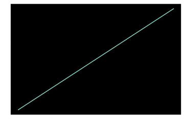


### Figures and subplots

Plots reside in a `Figure` object.
One or more subplots must be added.
Below, a 2x2 grid is created and the first subplot is set to `ax1`, the second to `ax2`, etc.


```python
fig = plt.figure()
ax1 = fig.add_subplot(2, 2, 1)
ax2 = fig.add_subplot(2, 2, 2)
ax3 = fig.add_subplot(2, 2, 3)
```


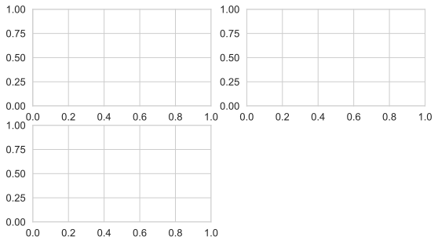


When a plotting command is issued, such as `plt.plot([1.5, 3.5, -2, 1.6])`, the last figure and subplot used is drawn to.


```python
fig = plt.figure()
ax1 = fig.add_subplot(2, 2, 1)

ax2 = fig.add_subplot(2, 2, 2)
plt.plot([1.5, 3.5, -2, 1.6])

ax3 = fig.add_subplot(2, 2, 3)
plt.plot(np.random.randn(50).cumsum(), 'k--')
```


    [<matplotlib.lines.Line2D at 0x1a389bf610>]


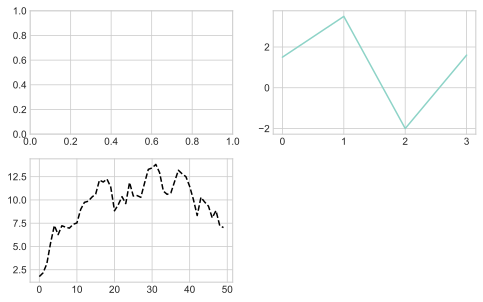


Alternatively, the objects returned by `fig.add_subplot()` can be added to directly.


```python
fig = plt.figure()
ax1 = fig.add_subplot(2, 2, 1)
ax1.hist(np.random.randn(100), bins=20, color='k', alpha=0.3)

ax2 = fig.add_subplot(2, 2, 2)
plt.plot([1.5, 3.5, -2, 1.6])

ax3 = fig.add_subplot(2, 2, 3)
plt.plot(np.random.randn(50).cumsum(), 'k--')
```


    [<matplotlib.lines.Line2D at 0x1a38bb8f90>]


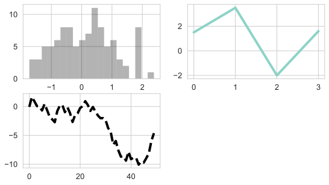


The author mentions that there are options in `fig.subplot` to declare that some subplots should have the same axes.
An example is shown in the next section.
The trick is to work on the `axes` array that is returned by `plt.subplots()`.


```python
fig, axes = plt.subplots(2, 3)
axes
```


    array([[<matplotlib.axes._subplots.AxesSubplot object at 0x1a38a17d10>,
            <matplotlib.axes._subplots.AxesSubplot object at 0x1a38cff790>,
            <matplotlib.axes._subplots.AxesSubplot object at 0x1a38d30450>],
           [<matplotlib.axes._subplots.AxesSubplot object at 0x1a38d6e7d0>,
            <matplotlib.axes._subplots.AxesSubplot object at 0x1a38da4490>,
            <matplotlib.axes._subplots.AxesSubplot object at 0x1a38de1810>]],
          dtype=object)


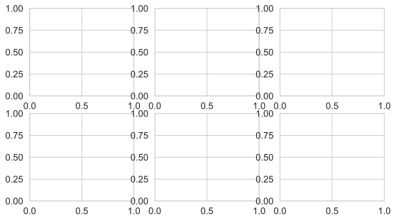


### Adjusting the spacing around subplots

All of the spacing is specified relative to the height and width of the plot.


```python
fig, axes = plt.subplots(2, 2, sharex=True, sharey=True)
for i in range(2):
    for j in range(2):
        axes[i, j].hist(np.random.randn(500), bins=50, color='k', alpha=0.5)
plt.subplots_adjust(wspace=0, hspace=0)
```


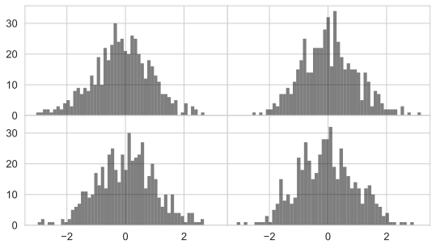


### Colors, markers, and line styles

The color and linestyle can be specified together or separately:

```python
ax.plot(x, y, 'g--')
ax.plot(x, y, linestyle='--', color='g')
```

Any color can be specified by its hex code.

Markers can also be used to highlight the data points.


```python
plt.plot(np.random.randn(30).cumsum(), 'ko--')
```


    [<matplotlib.lines.Line2D at 0x1a39358c90>]


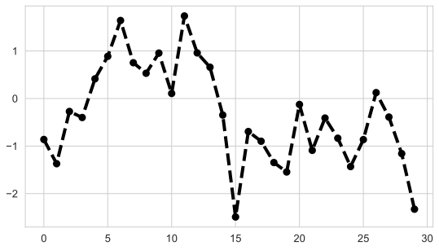


Which is equivalent to the more verbose statement below.


```python
plt.plot(np.random.randn(30).cumsum(), color='k', linestyle='dashed', marker='o')
```


    [<matplotlib.lines.Line2D at 0x135df4e90>]


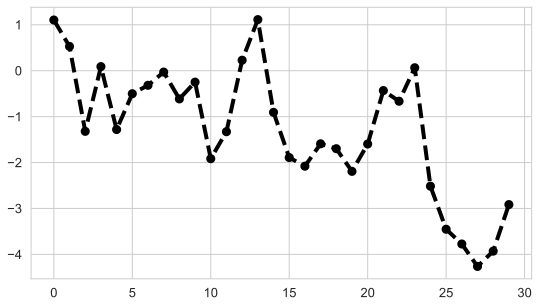


The type of interpolation between points on a line plot can be specified; the default is `'linear'`.


```python
data = np.random.randn(30).cumsum()
plt.plot(data, 'm--', label='Default')
plt.plot(data, 'b-', drawstyle='steps-post', label='steps-post')
plt.legend(loc='best')
```


    <matplotlib.legend.Legend at 0x135e5d390>


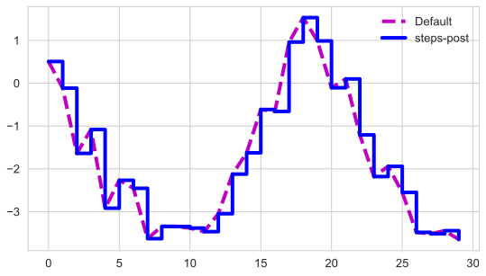


Ticks, labels, and legends

The general interactive API used for *pyplot* uses methods like `xlim()`, `xticks()`, and `xticklabels()` in two ways:

1. called with no paramters, the current values are returned,
2. called with paramteres, the values are set.

All such methods act on the active or most recently created `AxesSubplot` object.
These two methods actaully refer to two different methods on the subplot object, such as `ax.get_xlim()` and `ax.set_xlim()` - it is often recommended to explicitly use these.


```python
fig = plt.figure()
ax = fig.add_subplot(1, 1, 1)
ax.plot(np.random.randn(1000).cumsum())
ticks = ax.set_xticks([0, 250, 500, 750, 1000])
labels = ax.set_xticklabels(['one', 'two', 'three', 'four', 'five'],
                            rotation=30,
                            fontsize='small')
ax.set_title('My fiirst matplotlib plot title')
ax.set_xlabel('Stages')
```


    Text(0.5, 0, 'Stages')


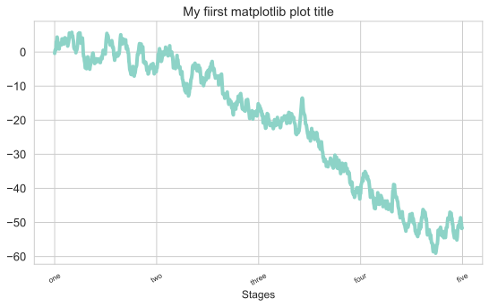


The easiest way of creating a legend is to pass a `label` argument to each plot.


```python
def make_random_data(n=1000):
    return np.random.randn(n).cumsum()

fig = plt.figure()
ax = fig.add_subplot(1, 1, 1)

ax.plot(make_random_data(), 'orange', label='one')
ax.plot(make_random_data(), 'magenta', label='two')
ax.plot(make_random_data(), 'purple', label='three')
ax.legend(loc='best')
```


    <matplotlib.legend.Legend at 0x1a395c9990>


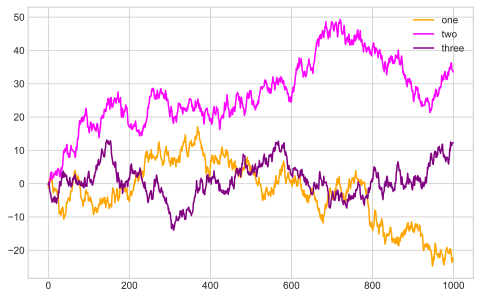


### Annotations and drawing on a subplot

Annotations can inclde text, arrows, or other shapes.
Some of the more common functions for such annotations include `text()`, `arrow()`, and `annotate()`.

For an example, the author plots the S&P 500 closing prices since 2007 and adds some annotations for important dates of the 2008 financial crisis.


```python
from datetime import datetime

data = pd.read_csv('assets/examples/spx.csv', index_col=0, parse_dates=True)
spx = data['SPX']
spx.head()
```


    1990-02-01    328.79
    1990-02-02    330.92
    1990-02-05    331.85
    1990-02-06    329.66
    1990-02-07    333.75
    Name: SPX, dtype: float64


```python
crisis_data = [
    (datetime(2007, 10, 11), 'Peak of bull market'),
    (datetime(2008, 3, 12), 'Bear Stearns Fails'),
    (datetime(2008, 9, 15), 'Lehman Bankruptcy')
]
crisis_data
```


    [(datetime.datetime(2007, 10, 11, 0, 0), 'Peak of bull market'),
     (datetime.datetime(2008, 3, 12, 0, 0), 'Bear Stearns Fails'),
     (datetime.datetime(2008, 9, 15, 0, 0), 'Lehman Bankruptcy')]


```python
fig = plt.figure()
ax = fig.add_subplot(1, 1, 1)

spx.plot(ax=ax, style='k-')

arrow_styling = {
    'facecolor': 'black', 
    'headwidth': 4, 
    'width': 2, 
    'headlength': 4
}

for date, label in crisis_data:
    ax.annotate(label, xy=(date, spx.asof(date) + 50),
                xytext=(date, spx.asof(date) + 200),
                arrowprops=arrow_styling,
                horizontalalignment='left', verticalalignment='top')

ax.set_xlim(['1/1/2007', '1/1/2011'])
ax.set_ylim([600, 1800])

ax.set_title('Important dates in the 2008-2009 financial crisis')
```


    Text(0.5, 1.0, 'Important dates in the 2008-2009 financial crisis')


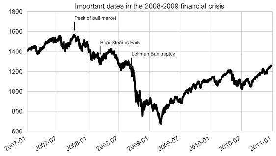


### Saving plots to file

Use the `plt.savefig('filepath.svg')` method.


```python
fig = plt.figure()
ax = fig.add_subplot(1, 1, 1)

spx.plot(ax=ax, style='k-')

arrow_styling = {
    'facecolor': 'black', 
    'headwidth': 4, 
    'width': 2, 
    'headlength': 4
}

for date, label in crisis_data:
    ax.annotate(label, xy=(date, spx.asof(date) + 50),
                xytext=(date, spx.asof(date) + 200),
                arrowprops=arrow_styling,
                horizontalalignment='left', verticalalignment='top')

ax.set_xlim(['1/1/2007', '1/1/2011'])
ax.set_ylim([600, 1800])

ax.set_title('Important dates in the 2008-2009 financial crisis')

plt.savefig('assets/output/financial_crisis_annotated_plot.svg', facecolor='white')
```


### matplotlib configuration

Most default behavior can be customized via an extensive set of global parameters.
The default plot size can be set like so.

The first argument is the component to be customized, followed by a sequence of keyward arguments indicating the new parameter values.

```python
font_options = {
    'family': 'monospace',
    'weight': 'bold',
    'size': 'small'
}
plt.rc('font', **font_options)
```

## 9.2 Plotting with pandas and seaborn

Seaborn is a statistical graphics library aimed at simplifying many common visualization types.

### Line plots

Both Series and DataFrame have `plot` attributes to create some basic plot types.
By default, `plot()` creates a line plot.


```python
s = pd.Series(np.random.randn(10).cumsum(), index=np.arange(0, 100, 10))
s.plot()
```


    <matplotlib.axes._subplots.AxesSubplot at 0x1a38653290>


Most of the pandas plotting methods accept a matplotlib subplot object through an optional `ax` parameter.
The `plot()` method for DataFrame makes line plot out of each column.


```python
df = pd.DataFrame(np.random.randn(10, 4).cumsum(0),
                  columns=['A', 'B', 'C', 'D'],
                  index=np.arange(0, 100, 10))
df.plot()
```


    <matplotlib.axes._subplots.AxesSubplot at 0x1a39b22050>


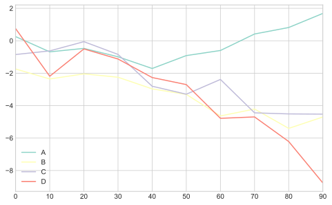


### Bar plots

The `plot.bar()` and `plot.barh()` make vertical and horizontal bar plots.


```python
fig, axes = plt.subplots(2, 1)
data = pd.Series(np.random.rand(16), index=list('abcdefghijklmnop'))
data.plot.bar(ax=axes[0], color='k', alpha=0.7)
data.plot.barh(ax=axes[1], color='k', alpha=0.7)
```


    <matplotlib.axes._subplots.AxesSubplot at 0x1a39d13350>


A DataFrame bar plot groups the values of rows together.


```python
df = pd.DataFrame(np.random.rand(6, 4),
                  index=['one', 'two', 'three', 'four', 'five', 'six'],
                  columns=pd.Index(['A', 'B', 'C', 'D'], name='Genus'))
df
```


<div>
<style scoped>
    .dataframe tbody tr th:only-of-type {
        vertical-align: middle;
    }

    .dataframe tbody tr th {
        vertical-align: top;
    }

    .dataframe thead th {
        text-align: right;
    }
</style>
<table border="1" class="dataframe">
  <thead>
    <tr style="text-align: right;">
      <th>Genus</th>
      <th>A</th>
      <th>B</th>
      <th>C</th>
      <th>D</th>
    </tr>
  </thead>
  <tbody>
    <tr>
      <th>one</th>
      <td>0.424886</td>
      <td>0.224244</td>
      <td>0.762922</td>
      <td>0.744435</td>
    </tr>
    <tr>
      <th>two</th>
      <td>0.647056</td>
      <td>0.455640</td>
      <td>0.464806</td>
      <td>0.298444</td>
    </tr>
    <tr>
      <th>three</th>
      <td>0.265725</td>
      <td>0.848971</td>
      <td>0.859374</td>
      <td>0.015345</td>
    </tr>
    <tr>
      <th>four</th>
      <td>0.719606</td>
      <td>0.329922</td>
      <td>0.919347</td>
      <td>0.242120</td>
    </tr>
    <tr>
      <th>five</th>
      <td>0.335403</td>
      <td>0.747336</td>
      <td>0.074099</td>
      <td>0.708039</td>
    </tr>
    <tr>
      <th>six</th>
      <td>0.674679</td>
      <td>0.304022</td>
      <td>0.712769</td>
      <td>0.902925</td>
    </tr>
  </tbody>
</table>
</div>


```python
df.plot.bar()
plt.legend(loc='best')
```


    <matplotlib.legend.Legend at 0x1a39db68d0>


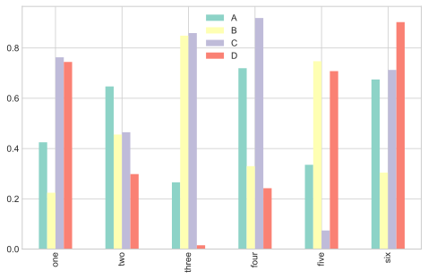


```python
df.plot.barh(stacked=True, alpha=0.7)
plt.legend(loc='best')
```


    <matplotlib.legend.Legend at 0x1a3a239050>


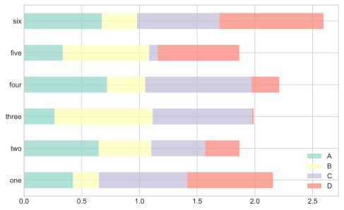


The author uses the tipping data as an example of plotting.


```python
tips = pd.read_csv('assets/examples/tips.csv')
tips.head()
```


<div>
<style scoped>
    .dataframe tbody tr th:only-of-type {
        vertical-align: middle;
    }

    .dataframe tbody tr th {
        vertical-align: top;
    }

    .dataframe thead th {
        text-align: right;
    }
</style>
<table border="1" class="dataframe">
  <thead>
    <tr style="text-align: right;">
      <th></th>
      <th>total_bill</th>
      <th>tip</th>
      <th>smoker</th>
      <th>day</th>
      <th>time</th>
      <th>size</th>
    </tr>
  </thead>
  <tbody>
    <tr>
      <th>0</th>
      <td>16.99</td>
      <td>1.01</td>
      <td>No</td>
      <td>Sun</td>
      <td>Dinner</td>
      <td>2</td>
    </tr>
    <tr>
      <th>1</th>
      <td>10.34</td>
      <td>1.66</td>
      <td>No</td>
      <td>Sun</td>
      <td>Dinner</td>
      <td>3</td>
    </tr>
    <tr>
      <th>2</th>
      <td>21.01</td>
      <td>3.50</td>
      <td>No</td>
      <td>Sun</td>
      <td>Dinner</td>
      <td>3</td>
    </tr>
    <tr>
      <th>3</th>
      <td>23.68</td>
      <td>3.31</td>
      <td>No</td>
      <td>Sun</td>
      <td>Dinner</td>
      <td>2</td>
    </tr>
    <tr>
      <th>4</th>
      <td>24.59</td>
      <td>3.61</td>
      <td>No</td>
      <td>Sun</td>
      <td>Dinner</td>
      <td>4</td>
    </tr>
  </tbody>
</table>
</div>


```python
# Number of group-size per day.
party_counts = pd.crosstab(tips['day'], tips['size'])
party_counts
```


<div>
<style scoped>
    .dataframe tbody tr th:only-of-type {
        vertical-align: middle;
    }

    .dataframe tbody tr th {
        vertical-align: top;
    }

    .dataframe thead th {
        text-align: right;
    }
</style>
<table border="1" class="dataframe">
  <thead>
    <tr style="text-align: right;">
      <th>size</th>
      <th>1</th>
      <th>2</th>
      <th>3</th>
      <th>4</th>
      <th>5</th>
      <th>6</th>
    </tr>
    <tr>
      <th>day</th>
      <th></th>
      <th></th>
      <th></th>
      <th></th>
      <th></th>
      <th></th>
    </tr>
  </thead>
  <tbody>
    <tr>
      <th>Fri</th>
      <td>1</td>
      <td>16</td>
      <td>1</td>
      <td>1</td>
      <td>0</td>
      <td>0</td>
    </tr>
    <tr>
      <th>Sat</th>
      <td>2</td>
      <td>53</td>
      <td>18</td>
      <td>13</td>
      <td>1</td>
      <td>0</td>
    </tr>
    <tr>
      <th>Sun</th>
      <td>0</td>
      <td>39</td>
      <td>15</td>
      <td>18</td>
      <td>3</td>
      <td>1</td>
    </tr>
    <tr>
      <th>Thur</th>
      <td>1</td>
      <td>48</td>
      <td>4</td>
      <td>5</td>
      <td>1</td>
      <td>3</td>
    </tr>
  </tbody>
</table>
</div>


```python
# Normalize to sum to 1.
party_pcts = party_counts.div(party_counts.sum(1), axis=0)
party_pcts
```


<div>
<style scoped>
    .dataframe tbody tr th:only-of-type {
        vertical-align: middle;
    }

    .dataframe tbody tr th {
        vertical-align: top;
    }

    .dataframe thead th {
        text-align: right;
    }
</style>
<table border="1" class="dataframe">
  <thead>
    <tr style="text-align: right;">
      <th>size</th>
      <th>1</th>
      <th>2</th>
      <th>3</th>
      <th>4</th>
      <th>5</th>
      <th>6</th>
    </tr>
    <tr>
      <th>day</th>
      <th></th>
      <th></th>
      <th></th>
      <th></th>
      <th></th>
      <th></th>
    </tr>
  </thead>
  <tbody>
    <tr>
      <th>Fri</th>
      <td>0.052632</td>
      <td>0.842105</td>
      <td>0.052632</td>
      <td>0.052632</td>
      <td>0.000000</td>
      <td>0.000000</td>
    </tr>
    <tr>
      <th>Sat</th>
      <td>0.022989</td>
      <td>0.609195</td>
      <td>0.206897</td>
      <td>0.149425</td>
      <td>0.011494</td>
      <td>0.000000</td>
    </tr>
    <tr>
      <th>Sun</th>
      <td>0.000000</td>
      <td>0.513158</td>
      <td>0.197368</td>
      <td>0.236842</td>
      <td>0.039474</td>
      <td>0.013158</td>
    </tr>
    <tr>
      <th>Thur</th>
      <td>0.016129</td>
      <td>0.774194</td>
      <td>0.064516</td>
      <td>0.080645</td>
      <td>0.016129</td>
      <td>0.048387</td>
    </tr>
  </tbody>
</table>
</div>


```python
party_pcts.plot.bar()
```


    <matplotlib.axes._subplots.AxesSubplot at 0x1a3a45e990>


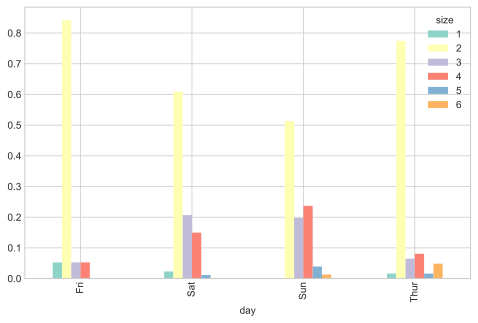


The seaborn library can be useful for making comparisons.
The following is an example looking at the average percent of the bill used for the tip per day of the week.


```python
tips['tip_pct'] = tips['tip'] / (tips['total_bill'] - tips['tip'])
tips.head()
```


<div>
<style scoped>
    .dataframe tbody tr th:only-of-type {
        vertical-align: middle;
    }

    .dataframe tbody tr th {
        vertical-align: top;
    }

    .dataframe thead th {
        text-align: right;
    }
</style>
<table border="1" class="dataframe">
  <thead>
    <tr style="text-align: right;">
      <th></th>
      <th>total_bill</th>
      <th>tip</th>
      <th>smoker</th>
      <th>day</th>
      <th>time</th>
      <th>size</th>
      <th>tip_pct</th>
    </tr>
  </thead>
  <tbody>
    <tr>
      <th>0</th>
      <td>16.99</td>
      <td>1.01</td>
      <td>No</td>
      <td>Sun</td>
      <td>Dinner</td>
      <td>2</td>
      <td>0.063204</td>
    </tr>
    <tr>
      <th>1</th>
      <td>10.34</td>
      <td>1.66</td>
      <td>No</td>
      <td>Sun</td>
      <td>Dinner</td>
      <td>3</td>
      <td>0.191244</td>
    </tr>
    <tr>
      <th>2</th>
      <td>21.01</td>
      <td>3.50</td>
      <td>No</td>
      <td>Sun</td>
      <td>Dinner</td>
      <td>3</td>
      <td>0.199886</td>
    </tr>
    <tr>
      <th>3</th>
      <td>23.68</td>
      <td>3.31</td>
      <td>No</td>
      <td>Sun</td>
      <td>Dinner</td>
      <td>2</td>
      <td>0.162494</td>
    </tr>
    <tr>
      <th>4</th>
      <td>24.59</td>
      <td>3.61</td>
      <td>No</td>
      <td>Sun</td>
      <td>Dinner</td>
      <td>4</td>
      <td>0.172069</td>
    </tr>
  </tbody>
</table>
</div>


```python
sns.barplot(x='tip_pct', y='day', data=tips, orient='h')
```


    <matplotlib.axes._subplots.AxesSubplot at 0x1354dbc10>


```python
sns.barplot(x='tip_pct', y='day', hue='time', data=tips, orient='h')
```


    <matplotlib.axes._subplots.AxesSubplot at 0x1353b34d0>


### Histograms and density plots


```python
tips['tip_pct'].plot.hist(bins=50)
```


    <matplotlib.axes._subplots.AxesSubplot at 0x123d10390>


```python
tips['tip_pct'].plot.density()
```


    <matplotlib.axes._subplots.AxesSubplot at 0x1a3a7ddc10>


```python
comp1 = np.random.normal(0, 1, size=200)
comp2 = np.random.normal(10, 2, size=200)
values = pd.Series(np.concatenate([comp1, comp2]))
sns.distplot(values, bins=100, color='k')
```


    <matplotlib.axes._subplots.AxesSubplot at 0x1a3c033050>


### Scatter or point plots


```python
macro = pd.read_csv('assets/examples/macrodata.csv')
data = macro[['cpi', 'm1', 'tbilrate', 'unemp']]
data.head()
```


<div>
<style scoped>
    .dataframe tbody tr th:only-of-type {
        vertical-align: middle;
    }

    .dataframe tbody tr th {
        vertical-align: top;
    }

    .dataframe thead th {
        text-align: right;
    }
</style>
<table border="1" class="dataframe">
  <thead>
    <tr style="text-align: right;">
      <th></th>
      <th>cpi</th>
      <th>m1</th>
      <th>tbilrate</th>
      <th>unemp</th>
    </tr>
  </thead>
  <tbody>
    <tr>
      <th>0</th>
      <td>28.98</td>
      <td>139.7</td>
      <td>2.82</td>
      <td>5.8</td>
    </tr>
    <tr>
      <th>1</th>
      <td>29.15</td>
      <td>141.7</td>
      <td>3.08</td>
      <td>5.1</td>
    </tr>
    <tr>
      <th>2</th>
      <td>29.35</td>
      <td>140.5</td>
      <td>3.82</td>
      <td>5.3</td>
    </tr>
    <tr>
      <th>3</th>
      <td>29.37</td>
      <td>140.0</td>
      <td>4.33</td>
      <td>5.6</td>
    </tr>
    <tr>
      <th>4</th>
      <td>29.54</td>
      <td>139.6</td>
      <td>3.50</td>
      <td>5.2</td>
    </tr>
  </tbody>
</table>
</div>


```python
trans_data = np.log(data).diff().dropna()
trans_data.head()
```


<div>
<style scoped>
    .dataframe tbody tr th:only-of-type {
        vertical-align: middle;
    }

    .dataframe tbody tr th {
        vertical-align: top;
    }

    .dataframe thead th {
        text-align: right;
    }
</style>
<table border="1" class="dataframe">
  <thead>
    <tr style="text-align: right;">
      <th></th>
      <th>cpi</th>
      <th>m1</th>
      <th>tbilrate</th>
      <th>unemp</th>
    </tr>
  </thead>
  <tbody>
    <tr>
      <th>1</th>
      <td>0.005849</td>
      <td>0.014215</td>
      <td>0.088193</td>
      <td>-0.128617</td>
    </tr>
    <tr>
      <th>2</th>
      <td>0.006838</td>
      <td>-0.008505</td>
      <td>0.215321</td>
      <td>0.038466</td>
    </tr>
    <tr>
      <th>3</th>
      <td>0.000681</td>
      <td>-0.003565</td>
      <td>0.125317</td>
      <td>0.055060</td>
    </tr>
    <tr>
      <th>4</th>
      <td>0.005772</td>
      <td>-0.002861</td>
      <td>-0.212805</td>
      <td>-0.074108</td>
    </tr>
    <tr>
      <th>5</th>
      <td>0.000338</td>
      <td>0.004289</td>
      <td>-0.266946</td>
      <td>0.000000</td>
    </tr>
  </tbody>
</table>
</div>


```python
sns.regplot('m1', 'unemp', data=trans_data)
plt.title(f'Changes in log m1 versus log unemp')
```


    Text(0.5, 1.0, 'Changes in log m1 versus log unemp')


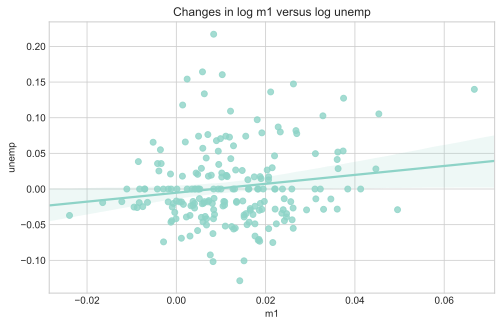


```python
sns.pairplot(trans_data, diag_kind='kde', plot_kws={'alpha': 0.2})
```


    <seaborn.axisgrid.PairGrid at 0x1a3d8d91d0>


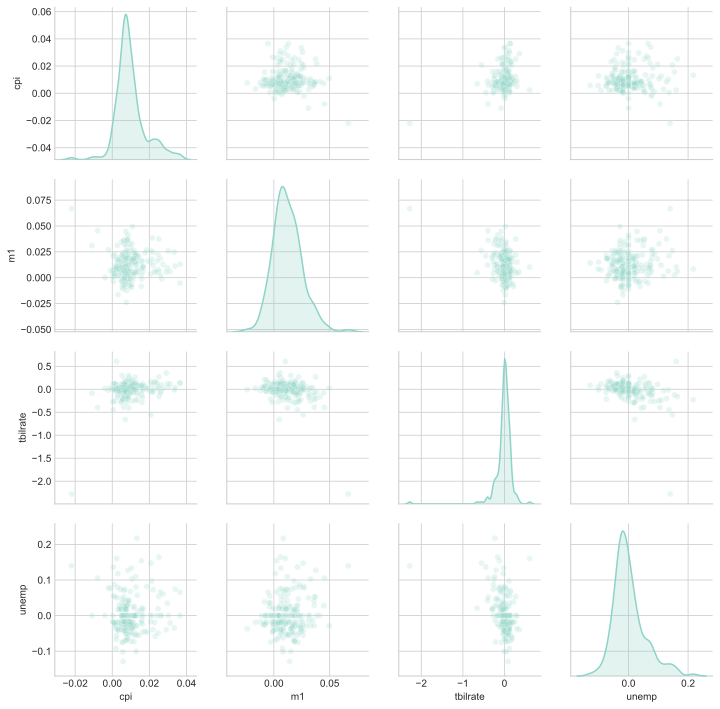


### Facet grids and categorical data

The seaborn library has `factorplot()` for faceting plots.


```python
sns.catplot(x='day', y='tip_pct',
            row='time', col='smoker',
            kind='bar',
            data=tips[tips.tip_pct < 1])
```


    <seaborn.axisgrid.FacetGrid at 0x1a3e2b0f10>


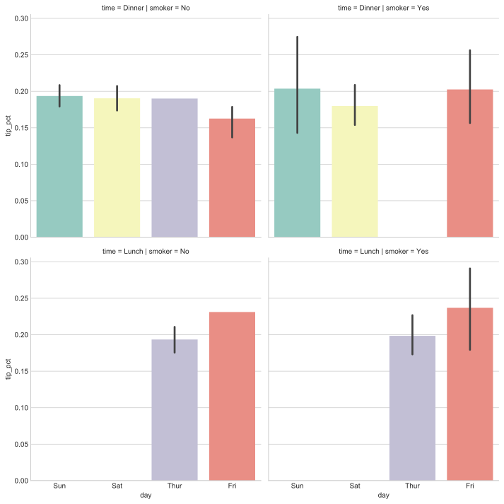


```python
sns.catplot(x='tip_pct', y='day',
            kind='box',
            data=tips[tips.tip_pct < 0.5])
```


    <seaborn.axisgrid.FacetGrid at 0x1a3d8b8250>


```python

```
