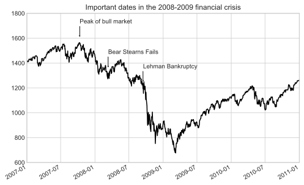
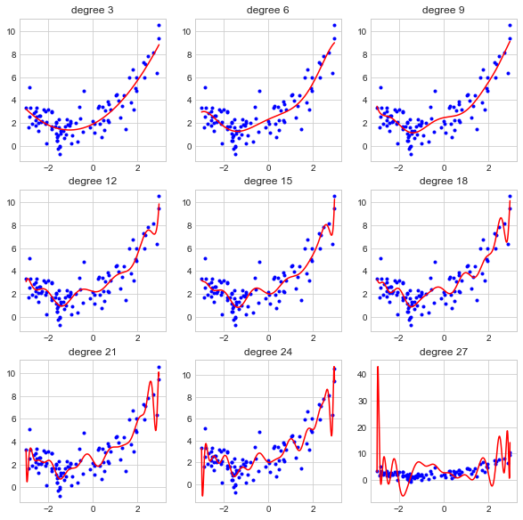
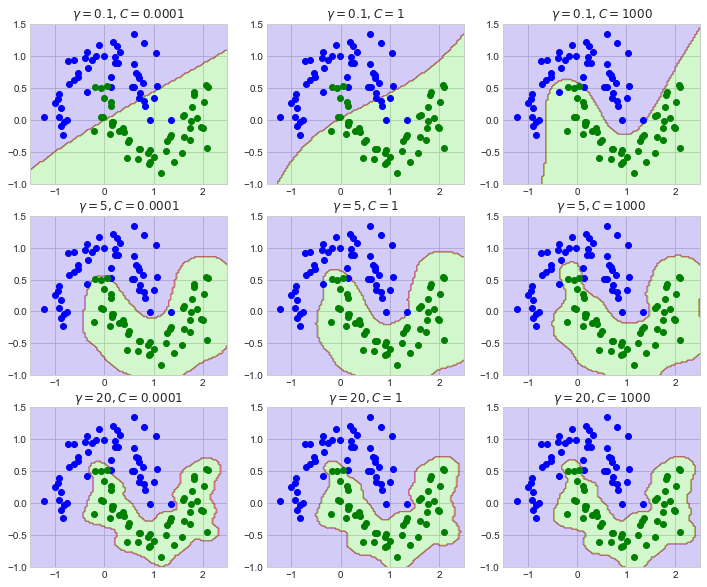
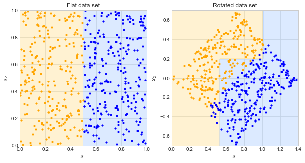
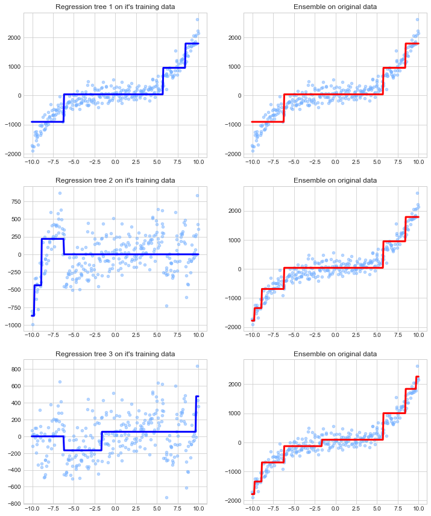
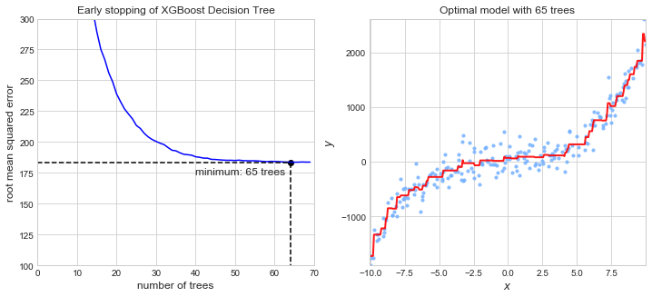
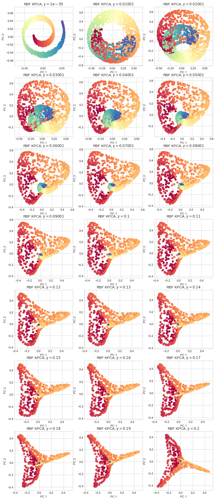

# Interesting Visualizations during 100 Days of Python

Below is a collection of cool and interesting visualizations I created during my 100 Days of Python.

## Python for Data Analysis

### Annotated stock market through 2008 financial crisis

## Hands-On Machine Learning with Scikit-Learn, Keras, & TensorFlow

### House property evaluation in California

### Effects of learning rate on gradient descent

### The paths of gradient descent, mini-batch gradient descent, and stochastic gradient descent

### Overfitting a polynomial model by increasing the degree

### Effect of SVM hyperparameters

### Decision tree classifying moons data

### Suseptibility of decision trees to rotated data

### Evolution of a gradient boost ensemble

### Early stopping with XGBoost random forest

### Effects of the $\gamma$ hyperparameter of RBF Kernel PCA

